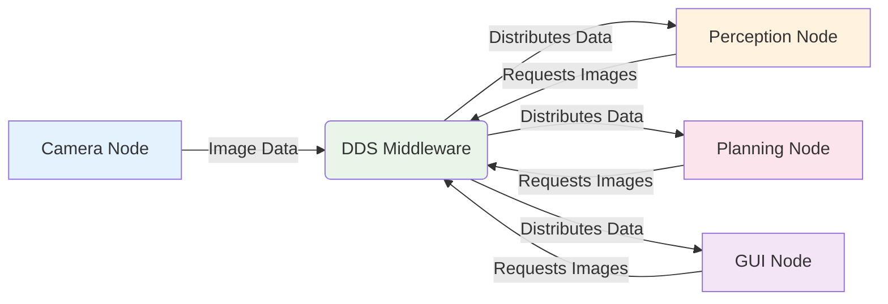

# ROS 2 Architecture & DDS Overview

## Introduction

In the previous chapter, we introduced ROS 2 as the "nervous system" of robots. Now, let's dive deeper into the underlying architecture that makes this possible. The key innovation in ROS 2 is its use of Data Distribution Service (DDS) as the middleware layer, which provides significant advantages over the custom transport layer used in ROS 1.

## What is DDS?

Data Distribution Service (DDS) is a middleware protocol and API standard for real-time, scalable, and reliable data exchange between applications. It's based on the publish-subscribe pattern and is designed for distributed systems that require high performance, reliability, and scalability.

### Core Concepts of DDS

- **Data-Centricity**: DDS focuses on the data itself rather than the applications producing or consuming it
- **Publish-Subscribe**: Publishers send data without knowing who will receive it; subscribers receive data without knowing who sent it
- **Discovery**: Automatic discovery of publishers and subscribers
- **Quality of Service (QoS)**: Configurable policies for reliability, durability, latency, etc.

## ROS 2 Architecture Components

The ROS 2 architecture consists of several layers:

```mermaid
graph TD
    A[User Applications] --> B[ROS 2 Client Libraries]
    B --> C[ROS Middleware (RMW)]
    C --> D[DDS Implementation]
    D --> E[Transport Layer]

    style A fill:#e1f5fe
    style B fill:#f3e5f5
    style C fill:#e8f5e8
    style D fill:#fff3e0
    style E fill:#fce4ec
```

### 1. User Applications Layer
This is where your robot applications run - nodes that implement specific robot behaviors, perception algorithms, control systems, etc.

### 2. Client Libraries (rclcpp, rclpy)
The ROS Client Libraries provide the ROS 2 API in different programming languages:
- `rclcpp` for C++
- `rclpy` for Python
- Other language bindings available

### 3. ROS Middleware Interface (RMW)
The ROS Middleware Interface acts as an abstraction layer between ROS 2 and DDS implementations. This allows ROS 2 to work with different DDS vendors (OpenDDS, Fast DDS, Cyclone DDS, etc.).

### 4. DDS Implementation
The actual DDS vendor implementation that handles the communication. ROS 2 can work with multiple DDS implementations.

### 5. Transport Layer
The underlying network transport (TCP, UDP, shared memory, etc.).

## Quality of Service (QoS) Profiles

One of the most powerful features of ROS 2 is its QoS system, which allows you to specify how data should be handled:

### Reliability Policy
- `RELIABLE`: All messages will be delivered (with retries)
- `BEST_EFFORT`: Messages may be dropped, but lower latency

### Durability Policy
- `TRANSIENT_LOCAL`: Late-joining subscribers receive previous messages
- `VOLATILE`: Only new messages are sent to subscribers

### History Policy
- `KEEP_LAST`: Keep only the most recent messages
- `KEEP_ALL`: Keep all messages (limited by memory)

### Example QoS Configuration

```python
import rclpy
from rclpy.qos import QoSProfile, ReliabilityPolicy, DurabilityPolicy

# Create a QoS profile for sensor data (real-time, best effort)
sensor_qos = QoSProfile(
    depth=10,
    reliability=ReliabilityPolicy.BEST_EFFORT,
    durability=DurabilityPolicy.VOLATILE
)

# Create a QoS profile for critical commands (reliable)
command_qos = QoSProfile(
    depth=5,
    reliability=ReliabilityPolicy.RELIABLE,
    durability=DurabilityPolicy.VOLATILE
)
```

## DDS vs. ROS 1 Transport

| Feature | ROS 1 | ROS 2 (DDS) |
|---------|-------|-------------|
| Communication | Custom TCPROS/UDPROS | Standard DDS |
| Real-time Support | Limited | Excellent |
| Security | Add-on (rosauth) | Built-in |
| Multi-robot Systems | Complex setup | Native support |
| Cross-platform | Good | Excellent |
| Quality of Service | Fixed | Configurable |

## Practical Example: DDS in Action

Let's look at how DDS enables robust communication in a humanoid robot:



In this example, the camera node publishes image data once, and DDS automatically distributes it to all interested subscribers (perception, planning, and GUI nodes). Each subscriber can have different QoS requirements.

## Benefits for Humanoid Robotics

### 1. **Real-time Performance**
Humanoid robots require precise timing for control and coordination. DDS's real-time capabilities ensure that sensor data and control commands are delivered with predictable timing.

### 2. **Reliability with Flexibility**
Different aspects of a humanoid robot have different reliability requirements:
- Joint position commands: Require reliable delivery
- Camera images: Can tolerate some loss for better latency
- Diagnostic data: Can use best-effort delivery

### 3. **Scalability**
Humanoid robots have many sensors and actuators. DDS handles the complexity of connecting them all efficiently.

### 4. **Security**
Built-in security features are crucial for humanoid robots that may operate in sensitive environments.

### 5. **Multi-robot Coordination**
DDS enables easy coordination between multiple robots, important for humanoid robot teams.

## DDS Implementations in ROS 2

ROS 2 supports multiple DDS implementations:

- **Fast DDS (eProsima)**: Default in recent ROS 2 versions, excellent performance
- **Cyclone DDS (Eclipse)**: Lightweight, good for resource-constrained systems
- **OpenDDS (Object Computing)**: Mature implementation with extensive features
- **RTI Connext DDS**: Commercial implementation with enterprise features

## Hands-on Example: Examining DDS Configuration

Let's look at how to configure DDS in a ROS 2 system:

```bash
# Check available DDS implementations
ros2 doctor --report

# View current DDS configuration
echo $RMW_IMPLEMENTATION

# Set DDS implementation for a session
export RMW_IMPLEMENTATION=rmw_fastrtps_cpp
```

## Common DDS Parameters

### Domain ID
```python
# Setting domain ID to isolate robot systems
import os
os.environ['ROS_DOMAIN_ID'] = '42'  # Default is 0
```

### Participant Limits
```xml
<!-- In a DDS configuration file -->
<dds>
    <participant>
        <rtps>
            <builtin>
                <participant_type>SERVER</participant_type>
            </builtin>
        </rtps>
    </participant>
</dds>
```

## Performance Considerations

### Network Configuration
For humanoid robots with many sensors, consider:
- Using shared memory for same-machine communication
- Configuring appropriate QoS for different data types
- Monitoring network utilization

### Memory Management
DDS maintains data samples, so configure:
- History depth appropriately
- Use transient-local durability only when necessary
- Monitor memory usage in long-running systems

## Troubleshooting Common Issues

### Discovery Problems
```bash
# Check if nodes can discover each other
ros2 node list

# Check for domain ID conflicts
printenv | grep ROS_DOMAIN_ID

# Check network interfaces
ip addr show
```

### Performance Issues
```bash
# Monitor node performance
ros2 run top top

# Check for message delays
ros2 topic hz /your_topic_name
```

## Summary

DDS provides the robust, configurable communication backbone that makes ROS 2 suitable for complex robotic systems like humanoid robots. Its quality of service features allow you to tune communication characteristics for different robot subsystems, while its distributed architecture supports complex multi-robot systems.

Understanding DDS is crucial for optimizing ROS 2 performance in humanoid robotics applications, where precise timing and reliable communication are essential for safe operation.

## Exercises

1. Research and compare the performance characteristics of different DDS implementations (Fast DDS, Cyclone DDS, etc.) for robotics applications.

2. Design QoS profiles for the following humanoid robot topics:
   - Joint position commands (critical for safety)
   - Camera images (real-time perception)
   - Battery status (diagnostic information)
   - Robot configuration parameters (setup information)

3. Explain why DDS's data-centric approach is beneficial for humanoid robotics compared to traditional client-server architectures.

## Next Steps

In the next chapter, we'll explore ROS 2 nodes in detail and learn how to create them using both Python and C++. We'll implement our first nodes and see how they interact through the DDS communication layer we've just learned about.

Continue to Chapter 3: [ROS 2 Nodes: Execution, Lifecycle, and Composition](./nodes.md) to start building actual ROS 2 nodes.