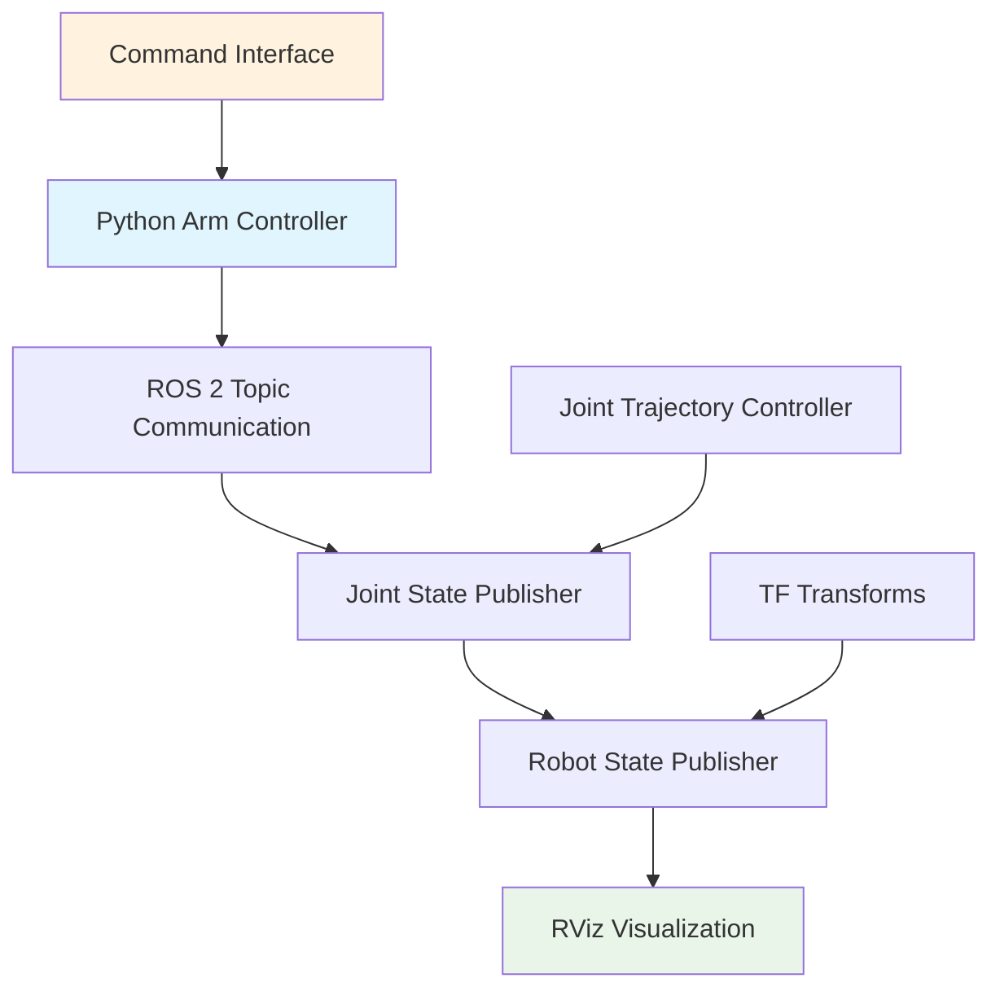

# Mini Project: Controlling a Humanoid Arm via Python + ROS 2

## Introduction

In the previous chapters, we've learned about all the fundamental concepts of ROS 2:
- Nodes and their lifecycle
- Topics for asynchronous communication
- Services and actions for synchronous and long-running tasks
- Parameters for configuration
- Launch files for system management
- URDF for robot modeling
- RViz for visualization

Now it's time to put everything together in a practical project! In this chapter, we'll build a complete system to control a humanoid arm using Python and ROS 2. This project will integrate all the concepts we've learned and demonstrate how they work together in a real robotic application.

## Project Overview

Our mini project will involve:
1. Creating a humanoid arm model in URDF
2. Developing a Python controller that interfaces with ROS 2
3. Implementing a control system that accepts commands and moves the arm
4. Adding visualization and monitoring capabilities
5. Creating a complete launch system to bring up the entire application

The goal is to create a system where we can send commands to move the humanoid arm to specific positions, and see the results in RViz.

## System Architecture

Our system will consist of several interconnected components:



### Components Breakdown

1. **Python Arm Controller**: The main application that processes commands and sends joint positions
2. **Command Interface**: Methods to send commands to the controller
3. **Joint Trajectory Controller**: Handles the actual servoing of joints
4. **Joint State Publisher**: Publishes current joint states
5. **Robot State Publisher**: Publishes transforms for visualization
6. **RViz**: Visualization tool to see the arm movement

## Step 1: Creating the Humanoid Arm URDF

First, let's create a URDF for our humanoid arm:

```xml
<!-- urdf/humanoid_arm.urdf.xacro -->
<?xml version="1.0"?>
<robot xmlns:xacro="http://www.ros.org/wiki/xacro" name="humanoid_arm">

  <!-- Constants -->
  <xacro:property name="pi" value="3.1415926535897931"/>
  <xacro:property name="arm_length" value="0.3"/>
  <xacro:property name="arm_radius" value="0.05"/>
  <xacro:property name="upper_arm_length" value="0.25"/>
  <xacro:property name="lower_arm_length" value="0.25"/>

  <!-- Materials -->
  <material name="blue">
    <color rgba="0.0 0.0 1.0 1.0"/>
  </material>
  <material name="green">
    <color rgba="0.0 1.0 0.0 1.0"/>
  </material>
  <material name="red">
    <color rgba="1.0 0.0 0.0 1.0"/>
  </material>
  <material name="white">
    <color rgba="1.0 1.0 1.0 1.0"/>
  </material>

  <!-- Base link (shoulder) -->
  <link name="base_link">
    <visual>
      <geometry>
        <cylinder length="0.1" radius="0.08"/>
      </geometry>
      <material name="white"/>
      <origin xyz="0 0 0.05" rpy="0 0 0"/>
    </visual>
    <collision>
      <geometry>
        <cylinder length="0.1" radius="0.08"/>
      </geometry>
      <origin xyz="0 0 0.05" rpy="0 0 0"/>
    </collision>
    <inertial>
      <mass value="2.0"/>
      <inertia ixx="0.01" ixy="0.0" ixz="0.0" iyy="0.01" iyz="0.0" izz="0.01"/>
    </inertial>
  </link>

  <!-- Shoulder joint -->
  <joint name="shoulder_pan_joint" type="revolute">
    <parent link="base_link"/>
    <child link="shoulder_link"/>
    <origin xyz="0 0 0.1" rpy="0 0 0"/>
    <axis xyz="0 0 1"/>
    <limit lower="${-pi/2}" upper="${pi/2}" effort="100" velocity="2"/>
    <dynamics damping="0.1" friction="0.01"/>
  </joint>

  <!-- Shoulder link -->
  <link name="shoulder_link">
    <visual>
      <geometry>
        <sphere radius="0.06"/>
      </geometry>
      <material name="blue"/>
      <origin xyz="0 0 0" rpy="0 0 0"/>
    </visual>
    <collision>
      <geometry>
        <sphere radius="0.06"/>
      </geometry>
      <origin xyz="0 0 0" rpy="0 0 0"/>
    </collision>
    <inertial>
      <mass value="1.0"/>
      <inertia ixx="0.001" ixy="0.0" ixz="0.0" iyy="0.001" iyz="0.0" izz="0.001"/>
    </inertial>
  </link>

  <!-- Shoulder lift joint -->
  <joint name="shoulder_lift_joint" type="revolute">
    <parent link="shoulder_link"/>
    <child link="upper_arm_link"/>
    <origin xyz="0 0 0" rpy="0 0 0"/>
    <axis xyz="0 1 0"/>
    <limit lower="${-pi/2}" upper="${pi/2}" effort="100" velocity="2"/>
    <dynamics damping="0.1" friction="0.01"/>
  </joint>

  <!-- Upper arm link -->
  <link name="upper_arm_link">
    <visual>
      <geometry>
        <cylinder length="${upper_arm_length}" radius="${arm_radius}"/>
      </geometry>
      <material name="green"/>
      <origin xyz="0 0 ${upper_arm_length/2}" rpy="0 0 0"/>
    </visual>
    <collision>
      <geometry>
        <cylinder length="${upper_arm_length}" radius="${arm_radius}"/>
      </geometry>
      <origin xyz="0 0 ${upper_arm_length/2}" rpy="0 0 0"/>
    </collision>
    <inertial>
      <mass value="1.5"/>
      <inertia ixx="0.02" ixy="0.0" ixz="0.0" iyy="0.02" iyz="0.0" izz="0.001"/>
    </inertial>
  </link>

  <!-- Elbow joint -->
  <joint name="elbow_joint" type="revolute">
    <parent link="upper_arm_link"/>
    <child link="lower_arm_link"/>
    <origin xyz="0 0 ${upper_arm_length}" rpy="0 0 0"/>
    <axis xyz="0 1 0"/>
    <limit lower="${-pi/2}" upper="${pi/2}" effort="80" velocity="2"/>
    <dynamics damping="0.1" friction="0.01"/>
  </joint>

  <!-- Lower arm link -->
  <link name="lower_arm_link">
    <visual>
      <geometry>
        <cylinder length="${lower_arm_length}" radius="${arm_radius}"/>
      </geometry>
      <material name="red"/>
      <origin xyz="0 0 ${lower_arm_length/2}" rpy="0 0 0"/>
    </visual>
    <collision>
      <geometry>
        <cylinder length="${lower_arm_length}" radius="${arm_radius}"/>
      </geometry>
      <origin xyz="0 0 ${lower_arm_length/2}" rpy="0 0 0"/>
    </collision>
    <inertial>
      <mass value="1.0"/>
      <inertia ixx="0.01" ixy="0.0" ixz="0.0" iyy="0.01" iyz="0.0" izz="0.001"/>
    </inertial>
  </link>

  <!-- Wrist joint -->
  <joint name="wrist_joint" type="revolute">
    <parent link="lower_arm_link"/>
    <child link="hand_link"/>
    <origin xyz="0 0 ${lower_arm_length}" rpy="0 0 0"/>
    <axis xyz="1 0 0"/>
    <limit lower="${-pi/4}" upper="${pi/4}" effort="50" velocity="2"/>
    <dynamics damping="0.1" friction="0.01"/>
  </joint>

  <!-- Hand link -->
  <link name="hand_link">
    <visual>
      <geometry>
        <box size="0.08 0.08 0.08"/>
      </geometry>
      <material name="blue"/>
      <origin xyz="0 0 0" rpy="0 0 0"/>
    </visual>
    <collision>
      <geometry>
        <box size="0.08 0.08 0.08"/>
      </geometry>
      <origin xyz="0 0 0" rpy="0 0 0"/>
    </collision>
    <inertial>
      <mass value="0.5"/>
      <inertia ixx="0.001" ixy="0.0" ixz="0.0" iyy="0.001" iyz="0.0" izz="0.001"/>
    </inertial>
  </link>

  <!-- Transmission for joint control -->
  <transmission name="shoulder_pan_trans">
    <type>transmission_interface/SimpleTransmission</type>
    <joint name="shoulder_pan_joint">
      <hardwareInterface>hardware_interface/EffortJointInterface</hardwareInterface>
    </joint>
    <actuator name="shoulder_pan_motor">
      <mechanicalReduction>1</mechanicalReduction>
    </actuator>
  </transmission>

  <transmission name="shoulder_lift_trans">
    <type>transmission_interface/SimpleTransmission</type>
    <joint name="shoulder_lift_joint">
      <hardwareInterface>hardware_interface/EffortJointInterface</hardwareInterface>
    </joint>
    <actuator name="shoulder_lift_motor">
      <mechanicalReduction>1</mechanicalReduction>
    </actuator>
  </transmission>

  <transmission name="elbow_trans">
    <type>transmission_interface/SimpleTransmission</type>
    <joint name="elbow_joint">
      <hardwareInterface>hardware_interface/EffortJointInterface</hardwareInterface>
    </joint>
    <actuator name="elbow_motor">
      <mechanicalReduction>1</mechanicalReduction>
    </actuator>
  </transmission>

  <transmission name="wrist_trans">
    <type>transmission_interface/SimpleTransmission</type>
    <joint name="wrist_joint">
      <hardwareInterface>hardware_interface/EffortJointInterface</hardwareInterface>
    </joint>
    <actuator name="wrist_motor">
      <mechanicalReduction>1</mechanicalReduction>
    </actuator>
  </transmission>

</robot>
```

## Step 2: Creating the Python Arm Controller

Now let's create the main Python controller that will manage the arm:

```python
# humanoid_arm_controller.py
import rclpy
from rclpy.node import Node
from sensor_msgs.msg import JointState
from trajectory_msgs.msg import JointTrajectory, JointTrajectoryPoint
from control_msgs.msg import JointTrajectoryControllerState
from std_msgs.msg import Header
from builtin_interfaces.msg import Duration
import math
import time
from collections import OrderedDict

class HumanoidArmController(Node):
    def __init__(self):
        super().__init__('humanoid_arm_controller')

        # Define arm joint names
        self.joint_names = [
            'shoulder_pan_joint',
            'shoulder_lift_joint',
            'elbow_joint',
            'wrist_joint'
        ]

        # Initialize current joint positions
        self.current_positions = OrderedDict()
        for joint_name in self.joint_names:
            self.current_positions[joint_name] = 0.0

        # Initialize target positions (same initially)
        self.target_positions = OrderedDict(self.current_positions)

        # Publishers
        self.joint_state_pub = self.create_publisher(JointState, 'joint_states', 10)
        self.trajectory_pub = self.create_publisher(JointTrajectory, 'arm_trajectory', 10)

        # Subscribers
        self.trajectory_sub = self.create_subscription(
            JointTrajectory,
            'arm_trajectory',
            self.trajectory_callback,
            10
        )

        # Timer for control loop (100 Hz)
        self.control_timer = self.create_timer(0.01, self.control_loop)

        # Timer for state publishing (50 Hz)
        self.state_timer = self.create_timer(0.02, self.publish_joint_states)

        # Movement parameters
        self.move_speed = 1.0  # radians per second
        self.tolerance = 0.01  # tolerance for reaching target

        self.get_logger().info(f'Humanoid Arm Controller initialized with joints: {self.joint_names}')

    def trajectory_callback(self, msg):
        """Handle incoming trajectory messages"""
        self.get_logger().info(f'Received trajectory with {len(msg.points)} points')

        # Process the trajectory message
        if len(msg.points) > 0:
            # Get the first point as the target
            target_point = msg.points[0]

            # Update target positions
            for i, joint_name in enumerate(target_point.positions):
                if i < len(msg.joint_names):
                    joint_name = msg.joint_names[i]
                    if joint_name in self.target_positions:
                        self.target_positions[joint_name] = joint_name
                    else:
                        self.get_logger().warn(f'Unknown joint: {joint_name}')

            # If there are multiple points, we could implement trajectory following
            if len(msg.points) > 1:
                self.get_logger().info('Multiple points in trajectory - implementing trajectory following')

    def control_loop(self):
        """Main control loop for smooth movement"""
        # Update current positions towards targets
        current_time = self.get_clock().now()

        for joint_name in self.joint_names:
            current_pos = self.current_positions[joint_name]
            target_pos = self.target_positions[joint_name]

            # Calculate distance to target
            distance = target_pos - current_pos

            # Calculate max movement for this timestep
            max_move = self.move_speed * 0.01  # move_speed * dt

            # Move towards target, but not exceeding max movement
            if abs(distance) > self.tolerance:
                if abs(distance) <= max_move:
                    # Close enough, snap to target
                    self.current_positions[joint_name] = target_pos
                else:
                    # Move towards target
                    direction = 1 if distance > 0 else -1
                    self.current_positions[joint_name] += direction * max_move

        # Check if we've reached the target
        all_reached = all(
            abs(self.current_positions[joint] - self.target_positions[joint]) <= self.tolerance
            for joint in self.joint_names
        )

        if all_reached:
            self.get_logger().debug('Reached target position')

    def publish_joint_states(self):
        """Publish current joint states"""
        msg = JointState()
        msg.header.stamp = self.get_clock().now().to_msg()
        msg.header.frame_id = 'base_link'

        msg.name = list(self.current_positions.keys())
        msg.position = list(self.current_positions.values())

        # Calculate velocities (approximate)
        velocities = []
        for i, joint_name in enumerate(msg.name):
            if hasattr(self, 'prev_positions') and joint_name in self.prev_positions:
                vel = (self.current_positions[joint_name] - self.prev_positions[joint_name]) / 0.02
                velocities.append(vel)
            else:
                velocities.append(0.0)

        msg.velocity = velocities

        # Efforts (set to zero for now)
        msg.effort = [0.0] * len(msg.name)

        self.joint_state_pub.publish(msg)

        # Store previous positions for next velocity calculation
        self.prev_positions = OrderedDict(self.current_positions)

    def move_to_position(self, positions_dict):
        """Move arm to specified joint positions"""
        for joint_name, position in positions_dict.items():
            if joint_name in self.target_positions:
                self.target_positions[joint_name] = position
                self.get_logger().info(f'Setting {joint_name} target to {position:.3f}')
            else:
                self.get_logger().warn(f'Invalid joint name: {joint_name}')

    def move_to_predefined_pose(self, pose_name):
        """Move to predefined poses"""
        poses = {
            'home': {
                'shoulder_pan_joint': 0.0,
                'shoulder_lift_joint': 0.0,
                'elbow_joint': 0.0,
                'wrist_joint': 0.0
            },
            'ready': {
                'shoulder_pan_joint': 0.0,
                'shoulder_lift_joint': 0.5,
                'elbow_joint': 0.5,
                'wrist_joint': 0.0
            },
            'wave': {
                'shoulder_pan_joint': 0.3,
                'shoulder_lift_joint': 0.8,
                'elbow_joint': -0.5,
                'wrist_joint': 0.2
            }
        }

        if pose_name in poses:
            self.move_to_position(poses[pose_name])
            self.get_logger().info(f'Moving to {pose_name} pose')
        else:
            self.get_logger().warn(f'Unknown pose: {pose_name}')

    def send_trajectory_command(self, positions, duration=2.0):
        """Send a trajectory command"""
        traj_msg = JointTrajectory()
        traj_msg.joint_names = self.joint_names

        # Create trajectory point
        point = JointTrajectoryPoint()
        point.positions = positions
        point.velocities = [0.0] * len(positions)  # Start with zero velocity
        point.accelerations = [0.0] * len(positions)  # Start with zero acceleration

        # Set duration
        duration_msg = Duration()
        duration_msg.sec = int(duration)
        duration_msg.nanosec = int((duration - int(duration)) * 1e9)
        point.time_from_start = duration_msg

        traj_msg.points = [point]

        self.trajectory_pub.publish(traj_msg)
        self.get_logger().info(f'Sent trajectory command: {positions}')


def main(args=None):
    rclpy.init(args=args)

    arm_controller = HumanoidArmController()

    # Example: Move to different poses
    def demo_movement():
        arm_controller.get_logger().info('Starting demo movement...')

        # Move to ready position
        arm_controller.move_to_predefined_pose('ready')
        time.sleep(3)

        # Move to wave position
        arm_controller.move_to_predefined_pose('wave')
        time.sleep(3)

        # Move to home position
        arm_controller.move_to_predefined_pose('home')
        time.sleep(2)

    # Start demo in a separate thread
    import threading
    demo_thread = threading.Thread(target=demo_movement, daemon=True)
    demo_thread.start()

    try:
        rclpy.spin(arm_controller)
    except KeyboardInterrupt:
        arm_controller.get_logger().info('Shutting down arm controller...')
    finally:
        arm_controller.destroy_node()
        rclpy.shutdown()


if __name__ == '__main__':
    main()
```

## Step 3: Creating a Command Interface Node

Let's create a separate node to send commands to our arm controller:

```python
# arm_commander.py
import rclpy
from rclpy.node import Node
from trajectory_msgs.msg import JointTrajectory, JointTrajectoryPoint
from builtin_interfaces.msg import Duration
from std_msgs.msg import String
import sys
import select
import tty
import termios

class ArmCommander(Node):
    def __init__(self):
        super().__init__('arm_commander')

        # Publisher for trajectory commands
        self.trajectory_pub = self.create_publisher(JointTrajectory, 'arm_trajectory', 10)

        # Publisher for status messages
        self.status_pub = self.create_publisher(String, 'arm_status', 10)

        # Timer for command interface
        self.command_timer = self.create_timer(0.1, self.check_keyboard_input)

        # Store joint names
        self.joint_names = [
            'shoulder_pan_joint',
            'shoulder_lift_joint',
            'elbow_joint',
            'wrist_joint'
        ]

        # Store terminal settings
        self.settings = termios.tcgetattr(sys.stdin)

        self.get_logger().info('Arm Commander initialized')
        self.print_instructions()

    def print_instructions(self):
        """Print control instructions"""
        print("\n=== Humanoid Arm Commander ===")
        print("Commands:")
        print("  h - Move to home position")
        print("  r - Move to ready position")
        print("  w - Move to wave position")
        print("  1 - Move to custom position 1")
        print("  2 - Move to custom position 2")
        print("  q - Quit")
        print("\nPress keys to send commands...")

    def check_keyboard_input(self):
        """Check for keyboard input"""
        if select.select([sys.stdin], [], [], 0) == ([sys.stdin], [], []):
            key = sys.stdin.read(1)

            if key == 'h':
                self.move_to_home()
            elif key == 'r':
                self.move_to_ready()
            elif key == 'w':
                self.move_to_wave()
            elif key == '1':
                self.move_to_custom_1()
            elif key == '2':
                self.move_to_custom_2()
            elif key == 'q':
                self.get_logger().info('Quit command received')
                self.destroy_node()
                rclpy.shutdown()
                return
            else:
                # Print instructions for invalid key
                self.print_instructions()

    def send_trajectory(self, positions, duration=2.0):
        """Send a trajectory command"""
        if len(positions) != len(self.joint_names):
            self.get_logger().error(f'Position count ({len(positions)}) does not match joint count ({len(self.joint_names)})')
            return

        traj_msg = JointTrajectory()
        traj_msg.joint_names = self.joint_names

        # Create trajectory point
        point = JointTrajectoryPoint()
        point.positions = positions
        point.velocities = [0.0] * len(positions)
        point.accelerations = [0.0] * len(positions)

        # Set duration
        duration_msg = Duration()
        duration_msg.sec = int(duration)
        duration_msg.nanosec = int((duration - int(duration)) * 1e9)
        point.time_from_start = duration_msg

        traj_msg.points = [point]

        self.trajectory_pub.publish(traj_msg)
        self.get_logger().info(f'Sent trajectory: {positions}')

        # Publish status
        status_msg = String()
        status_msg.data = f'Moving to position: {positions}'
        self.status_pub.publish(status_msg)

    def move_to_home(self):
        """Move to home position"""
        positions = [0.0, 0.0, 0.0, 0.0]
        self.send_trajectory(positions)
        self.get_logger().info('Moving to home position')

    def move_to_ready(self):
        """Move to ready position"""
        positions = [0.0, 0.5, 0.5, 0.0]
        self.send_trajectory(positions)
        self.get_logger().info('Moving to ready position')

    def move_to_wave(self):
        """Move to wave position"""
        positions = [0.3, 0.8, -0.5, 0.2]
        self.send_trajectory(positions)
        self.get_logger().info('Moving to wave position')

    def move_to_custom_1(self):
        """Move to custom position 1"""
        positions = [0.5, -0.3, 0.7, -0.2]
        self.send_trajectory(positions)
        self.get_logger().info('Moving to custom position 1')

    def move_to_custom_2(self):
        """Move to custom position 2"""
        positions = [-0.4, 0.6, 0.4, 0.3]
        self.send_trajectory(positions)
        self.get_logger().info('Moving to custom position 2')

    def destroy_node(self):
        """Restore terminal settings when destroying node"""
        termios.tcsetattr(sys.stdin, termios.TCSADRAIN, self.settings)
        super().destroy_node()


def main(args=None):
    # Set up terminal for raw input
    settings = termios.tcgetattr(sys.stdin)
    tty.cbreak(sys.stdin.fileno())

    try:
        rclpy.init(args=args)
        commander = ArmCommander()

        try:
            rclpy.spin(commander)
        except KeyboardInterrupt:
            pass
        finally:
            commander.destroy_node()
            rclpy.shutdown()
    finally:
        # Restore terminal settings
        termios.tcsetattr(sys.stdin, termios.TCSADRAIN, settings)


if __name__ == '__main__':
    main()
```

## Step 4: Creating a Service-Based Command Interface

Let's also create a service-based interface for programmatic control:

```python
# arm_service_interface.py
import rclpy
from rclpy.node import Node
from std_srvs.srv import Trigger, SetBool
from control_msgs.srv import JointTrajectoryControllerState
from trajectory_msgs.msg import JointTrajectory, JointTrajectoryPoint
from builtin_interfaces.msg import Duration
from humanoid_msgs.srv import MoveArmToPose  # Custom service

class ArmServiceInterface(Node):
    def __init__(self):
        super().__init__('arm_service_interface')

        # Publisher for trajectory commands
        self.trajectory_pub = self.create_publisher(JointTrajectory, 'arm_trajectory', 10)

        # Service to move to predefined poses
        self.move_pose_service = self.create_service(
            MoveArmToPose,
            'move_arm_to_pose',
            self.move_arm_to_pose_callback
        )

        # Service to move to specific joint positions
        self.move_joints_service = self.create_service(
            MoveArmToPose,
            'move_arm_to_joints',
            self.move_arm_to_joints_callback
        )

        # Service to stop the arm
        self.stop_service = self.create_service(
            Trigger,
            'stop_arm',
            self.stop_arm_callback
        )

        self.joint_names = [
            'shoulder_pan_joint',
            'shoulder_lift_joint',
            'elbow_joint',
            'wrist_joint'
        ]

        self.predefined_poses = {
            'home': [0.0, 0.0, 0.0, 0.0],
            'ready': [0.0, 0.5, 0.5, 0.0],
            'wave': [0.3, 0.8, -0.5, 0.2],
            'carry': [-0.2, 0.3, 0.6, 0.1]
        }

        self.get_logger().info('Arm Service Interface initialized')

    def move_arm_to_pose_callback(self, request, response):
        """Move arm to predefined pose"""
        pose_name = request.pose_name  # Assuming our custom service has this field

        if pose_name in self.predefined_poses:
            positions = self.predefined_poses[pose_name]
            self.send_trajectory(positions)

            response.success = True
            response.message = f'Moved to {pose_name} pose successfully'
            self.get_logger().info(f'Moved to {pose_name} pose')
        else:
            response.success = False
            response.message = f'Unknown pose: {pose_name}'
            self.get_logger().warn(f'Attempted to move to unknown pose: {pose_name}')

        return response

    def move_arm_to_joints_callback(self, request, response):
        """Move arm to specific joint positions"""
        try:
            # Assuming request contains joint_positions array
            positions = request.joint_positions  # Adjust based on your service definition

            if len(positions) != len(self.joint_names):
                response.success = False
                response.message = f'Incorrect number of joint positions. Expected {len(self.joint_names)}, got {len(positions)}'
                return response

            self.send_trajectory(positions)

            response.success = True
            response.message = f'Moved to joint positions: {positions}'
            self.get_logger().info(f'Moved to joint positions: {positions}')
        except Exception as e:
            response.success = False
            response.message = f'Error moving to joint positions: {str(e)}'
            self.get_logger().error(f'Error in move_arm_to_joints: {e}')

        return response

    def stop_arm_callback(self, request, response):
        """Stop the arm movement"""
        # Send current position as target to stop movement
        # In a real implementation, you might send zero velocities
        # For now, we'll just send the current positions (though we don't know them)
        # So we'll just send zeros as a stopping position
        stop_positions = [0.0, 0.0, 0.0, 0.0]
        self.send_trajectory(stop_positions, duration=0.1)

        response.success = True
        response.message = 'Arm stopped'
        self.get_logger().info('Arm movement stopped')

        return response

    def send_trajectory(self, positions, duration=2.0):
        """Send a trajectory command"""
        traj_msg = JointTrajectory()
        traj_msg.joint_names = self.joint_names

        point = JointTrajectoryPoint()
        point.positions = positions
        point.velocities = [0.0] * len(positions)
        point.accelerations = [0.0] * len(positions)

        duration_msg = Duration()
        duration_msg.sec = int(duration)
        duration_msg.nanosec = int((duration - int(duration)) * 1e9)
        point.time_from_start = duration_msg

        traj_msg.points = [point]

        self.trajectory_pub.publish(traj_msg)


def main(args=None):
    rclpy.init(args=args)
    service_interface = ArmServiceInterface()

    try:
        rclpy.spin(service_interface)
    except KeyboardInterrupt:
        service_interface.get_logger().info('Shutting down service interface...')
    finally:
        service_interface.destroy_node()
        rclpy.shutdown()


if __name__ == '__main__':
    main()
```

## Step 5: Creating Launch Files

Let's create launch files to bring up our entire system:

```python
# launch/arm_control_system.launch.py
from launch import LaunchDescription
from launch_ros.actions import Node
from launch.actions import DeclareLaunchArgument, RegisterEventHandler
from launch.event_handlers import OnProcessStart
from launch.substitutions import LaunchConfiguration, PathJoinSubstitution
from launch_ros.substitutions import FindPackageShare
from launch.conditions import IfCondition

def generate_launch_description():
    # Declare launch arguments
    declare_model_path = DeclareLaunchArgument(
        'model',
        default_value=PathJoinSubstitution([
            FindPackageShare('humanoid_arm_description'),
            'urdf',
            'humanoid_arm.urdf.xacro'
        ]),
        description='Path to robot URDF file'
    )

    declare_rviz_config = DeclareLaunchArgument(
        'rviz_config',
        default_value=PathJoinSubstitution([
            FindPackageShare('humanoid_arm_description'),
            'rviz',
            'arm_visualization.rviz'
        ]),
        description='Path to RViz configuration file'
    )

    declare_use_sim_time = DeclareLaunchArgument(
        'use_sim_time',
        default_value='false',
        description='Use simulation time'
    )

    declare_enable_rviz = DeclareLaunchArgument(
        'enable_rviz',
        default_value='true',
        description='Enable RViz visualization'
    )

    # Robot State Publisher
    robot_state_publisher = Node(
        package='robot_state_publisher',
        executable='robot_state_publisher',
        name='robot_state_publisher',
        parameters=[
            {'use_sim_time': LaunchConfiguration('use_sim_time')},
            {'robot_description': Command(['xacro ', LaunchConfiguration('model')])}
        ],
        output='screen'
    )

    # Joint State Publisher (for GUI control)
    joint_state_publisher_gui = Node(
        package='joint_state_publisher_gui',
        executable='joint_state_publisher_gui',
        name='joint_state_publisher_gui',
        condition=IfCondition(LaunchConfiguration('enable_rviz')),
        output='screen'
    )

    # Our arm controller
    arm_controller = Node(
        package='humanoid_arm_control',
        executable='humanoid_arm_controller',
        name='arm_controller',
        parameters=[
            {'use_sim_time': LaunchConfiguration('use_sim_time')}
        ],
        output='screen'
    )

    # Arm commander (keyboard interface)
    arm_commander = Node(
        package='humanoid_arm_control',
        executable='arm_commander',
        name='arm_commander',
        output='screen'
    )

    # Arm service interface
    arm_service_interface = Node(
        package='humanoid_arm_control',
        executable='arm_service_interface',
        name='arm_service_interface',
        output='screen'
    )

    # RViz
    rviz = Node(
        package='rviz2',
        executable='rviz2',
        name='rviz2',
        arguments=['-d', LaunchConfiguration('rviz_config')],
        condition=IfCondition(LaunchConfiguration('enable_rviz')),
        parameters=[
            {'use_sim_time': LaunchConfiguration('use_sim_time')}
        ],
        output='screen'
    )

    return LaunchDescription([
        declare_model_path,
        declare_rviz_config,
        declare_use_sim_time,
        declare_enable_rviz,
        robot_state_publisher,
        joint_state_publisher_gui,
        arm_controller,
        arm_commander,
        arm_service_interface,
        rviz
    ])
```

## Step 6: Creating a Complete Demo Script

Let's create a demo script that showcases all the functionality:

```python
# demo_arm_control.py
#!/usr/bin/env python3
import rclpy
from rclpy.node import Node
from trajectory_msgs.msg import JointTrajectory, JointTrajectoryPoint
from builtin_interfaces.msg import Duration
from std_msgs.msg import String
import time
import threading

class ArmDemo(Node):
    def __init__(self):
        super().__init__('arm_demo')

        # Publisher for trajectory commands
        self.trajectory_pub = self.create_publisher(JointTrajectory, 'arm_trajectory', 10)

        # Publisher for status
        self.status_pub = self.create_publisher(String, 'demo_status', 10)

        self.joint_names = [
            'shoulder_pan_joint',
            'shoulder_lift_joint',
            'elbow_joint',
            'wrist_joint'
        ]

        self.get_logger().info('Arm Demo initialized')

    def send_trajectory(self, positions, duration=2.0):
        """Send a trajectory command"""
        if len(positions) != len(self.joint_names):
            self.get_logger().error(f'Position count ({len(positions)}) does not match joint count ({len(self.joint_names)})')
            return

        traj_msg = JointTrajectory()
        traj_msg.joint_names = self.joint_names

        point = JointTrajectoryPoint()
        point.positions = positions
        point.velocities = [0.0] * len(positions)
        point.accelerations = [0.0] * len(positions)

        duration_msg = Duration()
        duration_msg.sec = int(duration)
        duration_msg.nanosec = int((duration - int(duration)) * 1e9)
        point.time_from_start = duration_msg

        traj_msg.points = [point]

        self.trajectory_pub.publish(traj_msg)
        self.get_logger().info(f'Sent trajectory: {positions}')

        # Wait for movement to complete
        time.sleep(duration + 0.5)

    def run_demo_sequence(self):
        """Run a sequence of arm movements"""
        self.get_logger().info('Starting arm demo sequence...')

        # Move to home position
        self.get_logger().info('Moving to home position...')
        self.send_trajectory([0.0, 0.0, 0.0, 0.0])
        time.sleep(1)

        # Move to ready position
        self.get_logger().info('Moving to ready position...')
        self.send_trajectory([0.0, 0.5, 0.5, 0.0])
        time.sleep(1)

        # Move to wave position
        self.get_logger().info('Moving to wave position...')
        self.send_trajectory([0.3, 0.8, -0.5, 0.2])
        time.sleep(1)

        # Move to carry position
        self.get_logger().info('Moving to carry position...')
        self.send_trajectory([-0.2, 0.3, 0.6, 0.1])
        time.sleep(1)

        # Move to custom position
        self.get_logger().info('Moving to custom position...')
        self.send_trajectory([0.5, -0.3, 0.7, -0.2])
        time.sleep(1)

        # Return to home
        self.get_logger().info('Returning to home position...')
        self.send_trajectory([0.0, 0.0, 0.0, 0.0])
        time.sleep(1)

        self.get_logger().info('Demo sequence completed!')

    def draw_shape_trajectory(self):
        """Draw a simple shape with the arm"""
        self.get_logger().info('Drawing a triangle with the arm...')

        # Define positions that form a triangle in joint space
        positions = [
            [0.0, 0.0, 0.0, 0.0],      # Home
            [0.2, 0.5, 0.3, 0.1],      # Point 1
            [-0.2, 0.7, 0.1, -0.1],    # Point 2
            [0.0, 0.0, 0.0, 0.0],      # Back to home
        ]

        for i, pos in enumerate(positions):
            self.get_logger().info(f'Moving to triangle point {i+1}')
            self.send_trajectory(pos, duration=1.5)
            time.sleep(0.5)

def main(args=None):
    rclpy.init(args=args)
    demo = ArmDemo()

    # Run the demo sequence in a separate thread to allow for other operations
    demo_thread = threading.Thread(target=demo.run_demo_sequence, daemon=True)
    demo_thread.start()

    try:
        rclpy.spin(demo)
    except KeyboardInterrupt:
        demo.get_logger().info('Shutting down demo...')
    finally:
        demo.destroy_node()
        rclpy.shutdown()

if __name__ == '__main__':
    main()
```

## Step 7: Creating Configuration Files

Let's create an RViz configuration file for visualizing our arm:

```yaml
# rviz/arm_visualization.rviz
Panels:
  - Class: rviz_common/Displays
    Name: Displays
    Property Tree Widget:
      Expanded:
        - /Global Options1
        - /Status1
        - /RobotModel1
        - /TF1
        - /InteractiveMarkers1
      Splitter Ratio: 0.5
  - Class: rviz_common/Selection
    Name: Selection
  - Class: rviz_common/Tool Properties
    Expanded:
      - /2D Goal Pose1
      - /Publish Point1
    Name: Tool Properties
    Splitter Ratio: 0.5886790156364441
  - Class: rviz_common/Views
    Expanded:
      - /Current View1
    Name: Views
    Splitter Ratio: 0.5
Visualization Manager:
  Class: ""
  Displays:
    - Alpha: 0.5
      Cell Size: 1
      Class: rviz_default_plugins/Grid
      Color: 160; 160; 164
      Enabled: true
      Line Style:
        Line Width: 0.029999999329447746
        Value: Lines
      Name: Grid
      Normal Cell Count: 0
      Offset:
        X: 0
        Y: 0
        Z: 0
      Plane: XY
      Plane Cell Count: 10
      Reference Frame: <Fixed Frame>
      Value: true
    - Alpha: 1
      Class: rviz_default_plugins/RobotModel
      Collision Enabled: false
      Description File: ""
      Description Source: Topic
      Description Topic:
        Depth: 5
        Durability Policy: Volatile
        History Policy: Keep Last
        Reliability Policy: Reliable
        Value: /robot_description
      Enabled: true
      Links:
        All Links Enabled: true
        Expand Joint Details: false
        Expand Link Details: false
        Expand Tree: false
        Link Tree Style: Links in Alphabetic Order
      Name: RobotModel
      TF Prefix: ""
      Update Interval: 0
      Value: true
      Visual Enabled: true
    - Class: rviz_default_plugins/TF
      Enabled: true
      Frame Timeout: 15
      Frames:
        All Enabled: true
      Marker Scale: 1
      Name: TF
      Show Arrows: true
      Show Axes: true
      Show Names: false
      Tree:
        {}
      Update Interval: 0
      Value: true
    - Class: rviz_default_plugins/InteractiveMarkers
      Enable Transparency: true
      Enabled: true
      Interactive Markers Namespace: /humanoid_arm
      Name: InteractiveMarkers
      Show Axes: false
      Show Descriptions: true
      Show Visual Aids: false
      Value: true
  Enabled: true
  Global Options:
    Background Color: 48; 48; 48
    Fixed Frame: base_link
    Frame Rate: 30
  Name: root
  Tools:
    - Class: rviz_default_plugins/Interact
      Hide Inactive Objects: true
    - Class: rviz_default_plugins/MoveCamera
    - Class: rviz_default_plugins/Select
    - Class: rviz_default_plugins/FocusCamera
    - Class: rviz_default_plugins/Measure
      Line color: 128; 128; 0
  Transformation:
    Current:
      Class: rviz_default_plugins/TF
  Value: true
  Views:
    Current:
      Class: rviz_default_plugins/Orbit
      Distance: 1.5
      Enable Stereo Rendering:
        Stereo Eye Separation: 0.05999999865889549
        Stereo Focal Distance: 1
        Swap Stereo Eyes: false
        Value: false
      Focal Point:
        X: 0
        Y: 0
        Z: 0
      Focal Shape Fixed Size: true
      Focal Shape Size: 0.05000000074505806
      Invert Z Axis: false
      Name: Current View
      Near Clip Distance: 0.009999999776482582
      Pitch: 0.5
      Target Frame: <Fixed Frame>
      Value: Orbit (rviz)
      Yaw: 0.5
    Saved: ~
Window Geometry:
  Displays:
    collapsed: false
  Height: 846
  Hide Left Dock: false
  Hide Right Dock: false
  QMainWindow State: 000000ff00000000fd000000040000000000000156000002f4fc0200000008fb0000001200530065006c0065006300740069006f006e00000001e10000009b0000005c00fffffffb0000001e0054006f006f006c002000500072006f007000650072007400690065007302000001ed000001df00000185000000a3fb000000120056006900650077007300200054006f006f02000001df000002110000018500000122fb000000200054006f006f006c002000500072006f0070006500720074006900650073003203000002880000011d000002210000017afb000000100044006900730070006c006100790073010000003d000002f4000000c900fffffffb0000002000730065006c0065006300740069006f006e00200062007500660066006500720200000138000000aa0000023a00000294fb00000014005700690064006500530074006500720065006f02000000e6000000d2000003ee0000030bfb0000000c004b0069006e0065006300740200000186000001060000030c00000261000000010000010f000002f4fc0200000003fb0000001e0054006f006f006c002000500072006f00700065007200740069006500730100000041000000780000000000000000fb0000000a00560069006500770073000000003d000002f4000000a400fffffffb0000001200530065006c0065006300740069006f006e010000025a000000b200000000000000000000000200000490000000a9fc0100000001fb0000000a0054006f006f006c00730100000000ffffffff0000000000000000
  Width: 1200
  X: 72
  Y: 60
```

## Step 8: Running the Complete System

To run the complete system, you would use the following commands:

```bash
# Terminal 1: Build and source the workspace
cd ~/ros2_ws
colcon build --packages-select humanoid_arm_description humanoid_arm_control
source install/setup.bash

# Terminal 2: Launch the complete system
ros2 launch humanoid_arm_control arm_control_system.launch.py

# Terminal 3: Send commands via the commander
ros2 run humanoid_arm_control arm_commander

# Terminal 4: Run the demo
ros2 run humanoid_arm_control demo_arm_control
```

## Testing and Validation

### 1. Basic Functionality Tests

```bash
# Check if all nodes are running
ros2 node list

# Check topics
ros2 topic list

# Echo joint states
ros2 topic echo /joint_states

# Check services
ros2 service list

# Call a service to move to home position
ros2 service call /move_arm_to_pose humanoid_msgs/srv/MoveArmToPose "{pose_name: 'home'}"
```

### 2. Parameter Testing

```bash
# List parameters of the arm controller
ros2 param list /arm_controller

# Get a specific parameter
ros2 param get /arm_controller move_speed

# Set a parameter
ros2 param set /arm_controller move_speed 2.0
```

### 3. Integration Testing

Test that all components work together:

1. Start the complete system
2. Use the keyboard commander to move the arm
3. Verify movement in RViz
4. Check that joint states are published correctly
5. Test service calls

## Troubleshooting Common Issues

### 1. URDF Issues
```bash
# Check URDF validity
check_urdf /path/to/humanoid_arm.urdf

# Visualize kinematic tree
urdf_to_graphiz /path/to/humanoid_arm.urdf
```

### 2. TF Issues
```bash
# Check TF tree
ros2 run tf2_tools view_frames

# Echo transforms
ros2 run tf2_ros tf2_echo base_link hand_link
```

### 3. Joint Limits
Ensure your URDF joint limits are realistic and match your controller's expectations.

## Performance Considerations

### 1. Control Loop Frequency
- Control loop: 100 Hz for smooth motion
- State publishing: 50 Hz sufficient for visualization
- Adjust based on your robot's capabilities

### 2. Message Rates
- High-frequency control requires careful management of message rates
- Use appropriate QoS settings for real-time requirements

### 3. Memory Management
- Pre-allocate message objects when possible
- Reuse arrays and buffers in control loops
- Monitor memory usage in long-running systems

## Extending the Project

This mini project can be extended in many ways:

1. **Add gripper control**: Implement a simple gripper for the hand
2. **Inverse Kinematics**: Add IK solvers for Cartesian control
3. **Collision detection**: Add collision checking
4. **Path planning**: Integrate with MoveIt for complex motions
5. **Sensor integration**: Add camera or touch sensors
6. **Learning capabilities**: Implement learning from demonstration

## Summary

This mini project demonstrates how to integrate all the ROS 2 concepts we've learned:

- **Nodes**: Created multiple interconnected nodes
- **Topics**: Used for continuous state updates and trajectory commands
- **Services**: Provided synchronous interfaces for discrete actions
- **Parameters**: Configured system behavior
- **Launch files**: Orchestrated the complete system startup
- **URDF**: Modeled the robot arm structure
- **RViz**: Visualized the robot in 3D space

The project shows how these components work together to create a functional robotic system. It provides a solid foundation for more complex humanoid robot applications.

## Exercises

1. Modify the arm controller to implement smooth trajectory following instead of simple position control.

2. Add a gripper to the end of the arm and implement control for it.

3. Create a service that calculates and moves the arm to a Cartesian position using inverse kinematics.

4. Implement a learning system that records and replays arm movements.

5. Add collision detection to prevent the arm from moving through obstacles.

## Next Steps

In the next chapter, we'll summarize Module 1 and provide review exercises to reinforce all the concepts we've learned about ROS 2 fundamentals. We'll also prepare for Module 2, where we'll explore digital twin simulation with Gazebo and Unity.

Continue to Chapter 12: [Module Summary + MCQs + Exercises](./summary.md) to review and consolidate your learning.