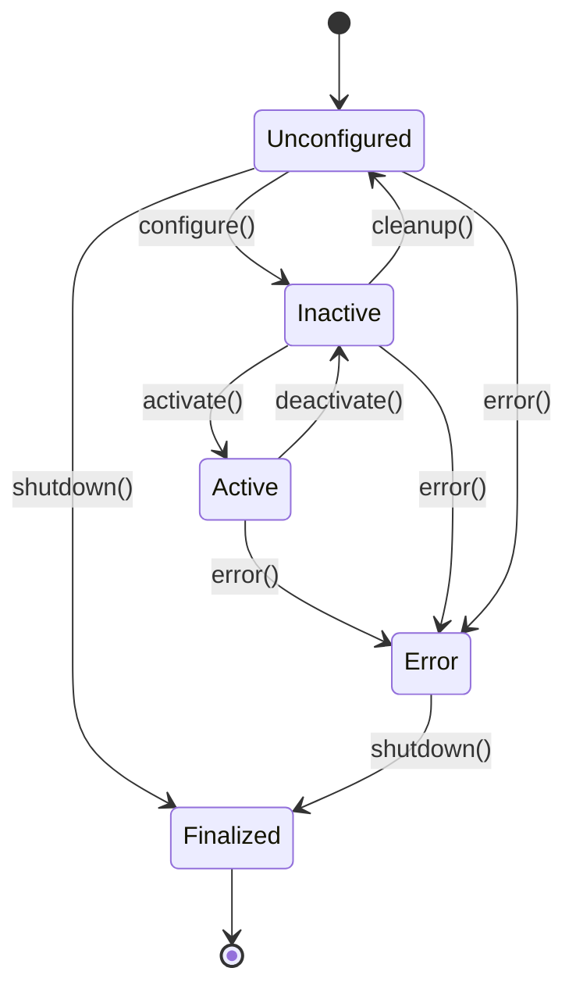

# ROS 2 Nodes: Execution, Lifecycle, and Composition

## Introduction

In the previous chapters, we learned that ROS 2 serves as the nervous system of robots and that DDS provides the communication infrastructure. Now we'll dive into the fundamental computational units of ROS 2: **nodes**.

Nodes are the basic execution units of a ROS 2 system. Each node runs a specific task or function, such as controlling a motor, processing sensor data, or planning robot movements. Understanding nodes is crucial for building any ROS 2 application, especially complex humanoid robots with many interacting components.

## What is a ROS 2 Node?

A ROS 2 node is a process that performs computation. Nodes are the fundamental building blocks of a ROS 2 system. Each node can:

- Publish data to topics
- Subscribe to topics to receive data
- Provide services
- Call services
- Execute actions
- Manage parameters

### Key Characteristics

- **Isolation**: Nodes run in separate processes, providing fault isolation
- **Communication**: Nodes communicate with each other through the ROS graph
- **Identity**: Each node has a unique name within its namespace
- **Modularity**: Complex systems are built by connecting multiple nodes

## Creating Nodes in Python (rclpy)

Let's start by creating our first ROS 2 node using Python and the `rclpy` client library.

### Basic Node Structure

```python
import rclpy
from rclpy.node import Node

class MinimalPublisher(Node):
    def __init__(self):
        super().__init__('minimal_publisher')
        self.publisher_ = self.create_publisher(String, 'topic', 10)
        timer_period = 0.5  # seconds
        self.timer = self.create_timer(timer_period, self.timer_callback)
        self.i = 0

    def timer_callback(self):
        msg = String()
        msg.data = 'Hello World: %d' % self.i
        self.publisher_.publish(msg)
        self.get_logger().info('Publishing: "%s"' % msg.data)
        self.i += 1

def main(args=None):
    rclpy.init(args=args)
    minimal_publisher = MinimalPublisher()
    rclpy.spin(minimal_publisher)
    minimal_publisher.destroy_node()
    rclpy.shutdown()

if __name__ == '__main__':
    main()
```

### Key Components Explained

1. **Node Inheritance**: Our class inherits from `rclpy.node.Node`
2. **Node Name**: `'minimal_publisher'` uniquely identifies the node
3. **Publisher Creation**: `create_publisher()` creates a publisher for a topic
4. **Timer**: `create_timer()` executes callbacks at regular intervals
5. **Message Creation**: Messages must match the type specified when creating the publisher
6. **Spin**: `rclpy.spin()` keeps the node running and processing callbacks

## Creating Nodes in C++ (rclcpp)

For performance-critical applications like humanoid robot control, C++ is often preferred:

```cpp
#include <chrono>
#include <functional>
#include <memory>
#include <string>
#include "rclcpp/rclcpp.hpp"
#include "std_msgs/msg/string.hpp"

using namespace std::chrono_literals;

class MinimalPublisher : public rclcpp::Node
{
public:
    MinimalPublisher()
    : Node("minimal_publisher"), count_(0)
    {
        publisher_ = this->create_publisher<std_msgs::msg::String>("topic", 10);
        timer_ = this->create_wall_timer(
            500ms, std::bind(&MinimalPublisher::timer_callback, this));
    }

private:
    void timer_callback()
    {
        auto message = std_msgs::msg::String();
        message.data = "Hello, world! " + std::to_string(count_++);
        RCLCPP_INFO(this->get_logger(), "Publishing: '%s'", message.data.c_str());
        publisher_->publish(message);
    }
    rclcpp::TimerBase::SharedPtr timer_;
    rclcpp::Publisher<std_msgs::msg::String>::SharedPtr publisher_;
    size_t count_;
};

int main(int argc, char * argv[])
{
    rclcpp::init(argc, argv);
    rclcpp::spin(std::make_shared<MinimalPublisher>());
    rclcpp::shutdown();
    return 0;
}
```

## Node Lifecycle

ROS 2 nodes follow a specific lifecycle that provides better control over robot systems:



### Lifecycle Node Example

```python
import rclpy
from rclpy.lifecycle import LifecycleNode, LifecycleState, TransitionCallbackReturn
from rclpy.lifecycle import Publisher
from rclpy.qos import qos_profile_sensor_data
from std_msgs.msg import String

class LifecyclePublisherNode(LifecycleNode):
    def __init__(self):
        super().__init__('lifecycle_publisher')
        self.pub = None

    def on_configure(self, state: LifecycleState) -> TransitionCallbackReturn:
        self.get_logger().info(f'Configuring node: {self.get_name()}')
        self.pub = self.create_publisher(String, 'lifecycle_chatter', qos_profile_sensor_data)
        return TransitionCallbackReturn.SUCCESS

    def on_activate(self, state: LifecycleState) -> TransitionCallbackReturn:
        self.get_logger().info(f'Activating node: {self.get_name()}')
        return super().on_activate(state)

    def on_deactivate(self, state: LifecycleState) -> TransitionCallbackReturn:
        self.get_logger().info(f'Deactivating node: {self.get_name()}')
        return super().on_deactivate(state)

    def on_cleanup(self, state: LifecycleState) -> TransitionCallbackReturn:
        self.get_logger().info(f'Cleaning up node: {self.get_name()}')
        self.destroy_publisher(self.pub)
        self.pub = None
        return TransitionCallbackReturn.SUCCESS
```

## Node Composition

For better performance and reduced communication overhead, ROS 2 supports node composition - running multiple nodes in the same process:

```python
import rclpy
from rclpy.node import Node
from rclpy.executors import SingleThreadedExecutor, MultiThreadedExecutor
from std_msgs.msg import String

class PublisherNode(Node):
    def __init__(self):
        super().__init__('publisher_node')
        self.publisher = self.create_publisher(String, 'composed_topic', 10)
        self.timer = self.create_timer(0.5, self.publish_message)
        self.counter = 0

    def publish_message(self):
        msg = String()
        msg.data = f'Composed message {self.counter}'
        self.publisher.publish(msg)
        self.counter += 1

class SubscriberNode(Node):
    def __init__(self):
        super().__init__('subscriber_node')
        self.subscription = self.create_subscription(
            String,
            'composed_topic',
            self.listener_callback,
            10
        )

    def listener_callback(self, msg):
        self.get_logger().info(f'I heard: [{msg.data}]')

def main():
    rclpy.init()

    # Create nodes
    pub_node = PublisherNode()
    sub_node = SubscriberNode()

    # Create executor and add nodes
    executor = SingleThreadedExecutor()
    executor.add_node(pub_node)
    executor.add_node(sub_node)

    try:
        executor.spin()
    finally:
        executor.shutdown()
        rclpy.shutdown()
```

## Node Parameters

Nodes can be configured using parameters that can be set at runtime:

```python
import rclpy
from rclpy.node import Node
from rcl_interfaces.msg import ParameterDescriptor

class ParameterNode(Node):
    def __init__(self):
        super().__init__('parameter_node')

        # Declare parameters with default values and descriptions
        self.declare_parameter(
            'robot_name',
            'humanoid_robot',
            ParameterDescriptor(description='Name of the robot')
        )

        self.declare_parameter(
            'max_velocity',
            1.0,
            ParameterDescriptor(description='Maximum joint velocity')
        )

        # Get parameter values
        self.robot_name = self.get_parameter('robot_name').value
        self.max_velocity = self.get_parameter('max_velocity').value

        self.get_logger().info(f'Robot name: {self.robot_name}')
        self.get_logger().info(f'Max velocity: {self.max_velocity}')

def main():
    rclpy.init()
    node = ParameterNode()
    rclpy.spin(node)
    node.destroy_node()
    rclpy.shutdown()
```

## Node Best Practices for Humanoid Robots

### 1. **Real-time Considerations**
For humanoid robots, timing is critical:
- Use appropriate QoS settings for real-time communication
- Consider using real-time capable DDS implementations
- Structure nodes to minimize communication delays

### 2. **Safety and Fault Tolerance**
Humanoid robots operate in human environments, so safety is paramount:
- Implement proper error handling and recovery
- Use lifecycle nodes for better state management
- Design nodes to fail gracefully

### 3. **Modularity and Reusability**
Structure nodes for easy reuse:
- Each node should have a single, well-defined responsibility
- Use parameters for configuration rather than hardcoding values
- Follow ROS 2 naming conventions

### 4. **Performance Optimization**
For humanoid robots with many joints and sensors:
- Consider node composition to reduce inter-process communication
- Use appropriate message types and serialization
- Monitor node performance and resource usage

## Practical Example: Humanoid Joint Controller Node

Let's create a practical example of a node that might be used in a humanoid robot:

```python
import rclpy
from rclpy.node import Node
from sensor_msgs.msg import JointState
from trajectory_msgs.msg import JointTrajectory, JointTrajectoryPoint
from builtin_interfaces.msg import Duration
import math

class HumanoidJointController(Node):
    def __init__(self):
        super().__init__('humanoid_joint_controller')

        # Declare parameters
        self.declare_parameter('robot_name', 'humanoid')
        self.declare_parameter('control_rate', 100)  # Hz

        # Publishers and subscribers
        self.joint_state_pub = self.create_publisher(JointState, 'joint_states', 10)
        self.joint_command_sub = self.create_subscription(
            JointTrajectory, 'joint_trajectory', self.joint_command_callback, 10)

        # Timer for control loop
        control_rate = self.get_parameter('control_rate').value
        self.control_timer = self.create_timer(1.0/control_rate, self.control_loop)

        # Joint state initialization
        self.joint_names = [
            'left_hip_joint', 'left_knee_joint', 'left_ankle_joint',
            'right_hip_joint', 'right_knee_joint', 'right_ankle_joint',
            # Add more joints as needed
        ]
        self.current_positions = [0.0] * len(self.joint_names)
        self.target_positions = [0.0] * len(self.joint_names)

        self.get_logger().info('Humanoid Joint Controller initialized')

    def joint_command_callback(self, msg):
        """Handle incoming joint trajectory commands"""
        if len(msg.joint_names) == 0:
            return

        # Update target positions based on trajectory
        for point in msg.points:
            # In a real implementation, you'd interpolate between points
            for i, joint_name in enumerate(self.joint_names):
                if joint_name in msg.joint_names:
                    idx = msg.joint_names.index(joint_name)
                    if idx < len(point.positions):
                        self.target_positions[i] = point.positions[idx]
            break  # For simplicity, just use the first point

    def control_loop(self):
        """Main control loop"""
        # Simple PD controller for each joint
        kp = 10.0  # Proportional gain
        kd = 1.0   # Derivative gain

        for i in range(len(self.joint_names)):
            error = self.target_positions[i] - self.current_positions[i]
            # In a real system, you'd calculate velocity and apply control law
            self.current_positions[i] += error * 0.01  # Simplified update

        # Publish current joint states
        msg = JointState()
        msg.name = self.joint_names
        msg.position = self.current_positions
        msg.header.stamp = self.get_clock().now().to_msg()
        msg.header.frame_id = 'base_link'

        self.joint_state_pub.publish(msg)

def main():
    rclpy.init()
    controller = HumanoidJointController()
    rclpy.spin(controller)
    controller.destroy_node()
    rclpy.shutdown()

if __name__ == '__main__':
    main()
```

## Launch Files for Node Management

For complex humanoid robots with many nodes, launch files help manage the system:

```python
from launch import LaunchDescription
from launch_ros.actions import Node
from launch.actions import DeclareLaunchArgument
from launch.substitutions import LaunchConfiguration

def generate_launch_description():
    return LaunchDescription([
        # Declare launch arguments
        DeclareLaunchArgument(
            'robot_name',
            default_value='humanoid_robot',
            description='Name of the robot'
        ),

        # Joint controller node
        Node(
            package='humanoid_control',
            executable='joint_controller',
            name='joint_controller',
            parameters=[
                {'robot_name': LaunchConfiguration('robot_name')},
                {'control_rate': 100}
            ],
            output='screen'
        ),

        # Perception node
        Node(
            package='humanoid_perception',
            executable='camera_processor',
            name='camera_processor',
            output='screen'
        ),

        # Planning node
        Node(
            package='humanoid_planning',
            executable='motion_planner',
            name='motion_planner',
            output='screen'
        )
    ])
```

## Debugging Nodes

When developing complex humanoid robot systems, debugging nodes is essential:

```bash
# List all nodes
ros2 node list

# Get information about a specific node
ros2 node info /your_node_name

# Echo topics to see data flow
ros2 topic echo /joint_states

# Check the ROS graph
rqt_graph

# Monitor node performance
ros2 run top top
```

## Summary

Nodes are the fundamental computational units in ROS 2 systems. For humanoid robots, proper node design is crucial for:
- Performance: Using composition where appropriate
- Safety: Implementing proper error handling
- Modularity: Following single-responsibility principles
- Real-time behavior: Using appropriate QoS settings

Understanding node lifecycle, parameters, and composition patterns enables you to build robust and maintainable humanoid robot systems.

## Exercises

1. Create a simple ROS 2 node that publishes the current time every second, and another node that subscribes to it and logs the received timestamps.

2. Design a node structure for a humanoid robot with 20 joints, considering:
   - How to organize joint controllers
   - How to handle sensor data from multiple sources
   - How to manage communication between different robot subsystems

3. Implement a lifecycle node that controls a single joint and demonstrate its state transitions.

## Next Steps

In the next chapter, we'll explore the publish-subscribe communication pattern in detail and learn how to create topics for asynchronous data exchange between nodes. This is fundamental for humanoid robots where sensor data and control commands need to flow efficiently between different subsystems.

Continue to Chapter 4: [Topics: Pub–Sub Messaging + Practical Examples](./topics.md) to master asynchronous communication in ROS 2.