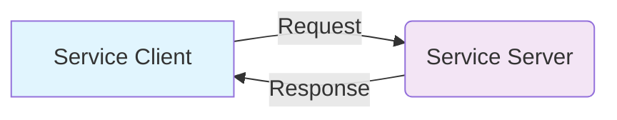
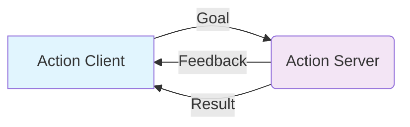

# Services & Actions: Request/Response + Long-running Tasks

## Introduction

In the previous chapters, we explored the publish-subscribe pattern for asynchronous communication between ROS 2 nodes. While topics are excellent for continuous data streams like sensor readings and robot state, many robotic operations require different communication patterns. In this chapter, we'll learn about **services** for synchronous request-response communication and **actions** for long-running tasks with feedback.

For humanoid robots, these patterns are essential for operations like:
- Requesting specific robot behaviors (e.g., "move to position")
- Querying robot status ("what's your current battery level?")
- Executing complex tasks with progress monitoring ("walk to the kitchen")

## Understanding Services

Services implement a synchronous request-response pattern where a client sends a request and waits for a response from a server. This is different from topics where communication is asynchronous.

### Service Architecture



### Key Characteristics
- **Synchronous**: Client waits for response
- **Request-Response**: One request, one response
- **Blocking**: Client is blocked until response received
- **Reliable**: Request and response are guaranteed to be delivered

## Creating Services

### 1. Define the Service Interface

First, create a service definition file (e.g., `SetJointPositions.srv`):

```
# Request
float64[] positions
string[] joint_names
---
# Response
bool success
string message
```

### 2. Create a Service Server

```python
import rclpy
from rclpy.node import Node
from your_package.srv import SetJointPositions  # This would be your custom service
from sensor_msgs.msg import JointState
import time

class JointControllerService(Node):
    def __init__(self):
        super().__init__('joint_controller_service')

        # Create service server
        self.srv = self.create_service(
            SetJointPositions,
            'set_joint_positions',
            self.set_joint_positions_callback
        )

        # Publisher for joint commands
        self.joint_pub = self.create_publisher(JointState, 'joint_commands', 10)

        self.get_logger().info('Joint Controller Service initialized')

    def set_joint_positions_callback(self, request, response):
        """Handle joint position requests"""
        self.get_logger().info(f'Received request to set {len(request.joint_names)} joint positions')

        # Validate request
        if len(request.joint_names) != len(request.positions):
            response.success = False
            response.message = 'Number of joint names and positions must match'
            return response

        # Create and publish joint command
        joint_msg = JointState()
        joint_msg.name = request.joint_names
        joint_msg.position = request.positions
        joint_msg.header.stamp = self.get_clock().now().to_msg()

        self.joint_pub.publish(joint_msg)

        # Simulate time to reach position
        time.sleep(0.1)  # In real implementation, this would be replaced with actual control logic

        response.success = True
        response.message = f'Successfully set {len(request.joint_names)} joint positions'
        self.get_logger().info(f'Service response: {response.message}')

        return response

def main(args=None):
    rclpy.init(args=args)
    service_node = JointControllerService()

    try:
        rclpy.spin(service_node)
    except KeyboardInterrupt:
        pass
    finally:
        service_node.destroy_node()
        rclpy.shutdown()
```

### 3. Create a Service Client

```python
import rclpy
from rclpy.node import Node
from your_package.srv import SetJointPositions  # This would be your custom service
import time

class JointControllerClient(Node):
    def __init__(self):
        super().__init__('joint_controller_client')

        # Create service client
        self.cli = self.create_client(SetJointPositions, 'set_joint_positions')

        # Wait for service to be available
        while not self.cli.wait_for_service(timeout_sec=1.0):
            self.get_logger().info('Service not available, waiting again...')

        self.req = SetJointPositions.Request()

    def send_request(self, joint_names, positions):
        """Send a request to set joint positions"""
        self.req.joint_names = joint_names
        self.req.positions = positions

        self.future = self.cli.call_async(self.req)
        return self.future

def main(args=None):
    rclpy.init(args=args)
    client = JointControllerClient()

    # Example: Set positions for left arm joints
    joint_names = ['left_shoulder_joint', 'left_elbow_joint', 'left_wrist_joint']
    positions = [0.5, -0.3, 0.2]

    future = client.send_request(joint_names, positions)

    try:
        rclpy.spin_until_future_complete(client, future)
        response = future.result()

        if response.success:
            client.get_logger().info(f'Success: {response.message}')
        else:
            client.get_logger().error(f'Failed: {response.message}')
    except KeyboardInterrupt:
        pass
    finally:
        client.destroy_node()
        rclpy.shutdown()
```

## Using Built-in Services

ROS 2 provides several built-in services:

```python
from std_srvs.srv import SetBool, Trigger

class ExampleServiceClient(Node):
    def __init__(self):
        super().__init__('example_service_client')

        # Trigger service (no request parameters, success/failure response)
        self.trigger_client = self.create_client(Trigger, 'trigger_service')

        # SetBool service (request: data, response: success, message)
        self.bool_client = self.create_client(SetBool, 'bool_service')

    def call_trigger_service(self):
        """Call a trigger service"""
        while not self.trigger_client.wait_for_service(timeout_sec=1.0):
            self.get_logger().info('Trigger service not available')

        request = Trigger.Request()
        future = self.trigger_client.call_async(request)

        # Process response
        rclpy.spin_until_future_complete(self, future)
        response = future.result()

        return response.success, response.message

    def call_bool_service(self, value):
        """Call a boolean service"""
        while not self.bool_client.wait_for_service(timeout_sec=1.0):
            self.get_logger().info('Bool service not available')

        request = SetBool.Request()
        request.data = value
        future = self.bool_client.call_async(request)

        # Process response
        rclpy.spin_until_future_complete(self, future)
        response = future.result()

        return response.success, response.message
```

## Understanding Actions

While services are great for simple request-response operations, humanoid robots often need to execute long-running tasks that provide feedback during execution. Actions solve this problem by providing:

- **Goal**: The task to be executed
- **Feedback**: Progress updates during execution
- **Result**: Final outcome of the task

### Action Architecture



## Creating Actions

### 1. Define the Action Interface

Create an action definition file (e.g., `WalkToGoal.action`):

```
# Goal
float64 x
float64 y
float64 theta
---
# Result
bool success
string message
float64 distance_traveled
---
# Feedback
float64 current_x
float64 current_y
float64 current_theta
float64 distance_to_goal
string status
```

### 2. Create an Action Server

```python
import rclpy
from rclpy.action import ActionServer, CancelResponse, GoalResponse
from rclpy.node import Node
from your_package.action import WalkToGoal  # This would be your custom action
from geometry_msgs.msg import Twist
import time
import math

class WalkToGoalActionServer(Node):
    def __init__(self):
        super().__init__('walk_to_goal_action_server')

        # Create action server
        self._action_server = ActionServer(
            self,
            WalkToGoal,
            'walk_to_goal',
            execute_callback=self.execute_callback,
            goal_callback=self.goal_callback,
            cancel_callback=self.cancel_callback
        )

        # Publisher for movement commands
        self.cmd_vel_pub = self.create_publisher(Twist, 'cmd_vel', 10)

        self.get_logger().info('Walk To Goal Action Server initialized')

    def goal_callback(self, goal_request):
        """Accept or reject a goal"""
        self.get_logger().info('Received goal request')
        # Check if goal is valid
        if goal_request.x == 0.0 and goal_request.y == 0.0:
            self.get_logger().info('Rejecting goal: position (0,0) is invalid')
            return GoalResponse.REJECT
        return GoalResponse.ACCEPT

    def cancel_callback(self, goal_handle):
        """Accept or reject a cancel request"""
        self.get_logger().info('Received cancel request')
        return CancelResponse.ACCEPT

    def execute_callback(self, goal_handle):
        """Execute the goal"""
        self.get_logger().info('Executing goal...')

        # Get goal parameters
        target_x = goal_handle.request.x
        target_y = goal_handle.request.y
        target_theta = goal_handle.request.theta

        # Initialize variables
        current_x, current_y, current_theta = 0.0, 0.0, 0.0  # Start at origin
        distance_traveled = 0.0
        feedback_msg = WalkToGoal.Feedback()

        # Simple navigation algorithm
        rate = self.create_rate(10)  # 10 Hz
        while rclpy.ok():
            # Calculate distance to goal
            dx = target_x - current_x
            dy = target_y - current_y
            distance_to_goal = math.sqrt(dx*dx + dy*dy)

            # Check if goal reached (with tolerance)
            if distance_to_goal < 0.1:  # 10 cm tolerance
                self.get_logger().info('Goal reached!')
                break

            # Calculate movement command
            cmd_msg = Twist()
            cmd_msg.linear.x = min(0.5, distance_to_goal)  # Proportional to distance
            cmd_msg.angular.z = math.atan2(dy, dx) - current_theta  # Proportional to angle error

            # Publish command
            self.cmd_vel_pub.publish(cmd_msg)

            # Update current position (simulated)
            dt = 0.1  # 10 Hz update
            current_x += cmd_msg.linear.x * dt * math.cos(current_theta)
            current_y += cmd_msg.linear.x * dt * math.sin(current_theta)
            current_theta += cmd_msg.angular.z * dt

            # Update distance traveled
            distance_traveled += cmd_msg.linear.x * dt

            # Publish feedback
            feedback_msg.current_x = current_x
            feedback_msg.current_y = current_y
            feedback_msg.current_theta = current_theta
            feedback_msg.distance_to_goal = distance_to_goal
            feedback_msg.status = f'Moving: {distance_to_goal:.2f}m to go'

            goal_handle.publish_feedback(feedback_msg)

            # Check for cancellation
            if goal_handle.is_cancel_requested:
                goal_handle.canceled()
                cmd_msg = Twist()  # Stop the robot
                self.cmd_vel_pub.publish(cmd_msg)
                self.get_logger().info('Goal canceled')
                return WalkToGoal.Result()

            rate.sleep()

        # Goal completed
        goal_handle.succeed()
        cmd_msg = Twist()  # Stop the robot
        self.cmd_vel_pub.publish(cmd_msg)

        # Create result
        result = WalkToGoal.Result()
        result.success = True
        result.message = f'Reached goal at ({target_x:.2f}, {target_y:.2f})'
        result.distance_traveled = distance_traveled

        self.get_logger().info(f'Result: {result.message}')
        return result

def main(args=None):
    rclpy.init(args=args)
    action_server = WalkToGoalActionServer()

    try:
        rclpy.spin(action_server)
    except KeyboardInterrupt:
        pass
    finally:
        action_server.destroy_node()
        rclpy.shutdown()
```

### 3. Create an Action Client

```python
import rclpy
from rclpy.action import ActionClient
from rclpy.node import Node
from your_package.action import WalkToGoal  # This would be your custom action
import time

class WalkToGoalActionClient(Node):
    def __init__(self):
        super().__init__('walk_to_goal_action_client')

        # Create action client
        self._action_client = ActionClient(
            self,
            WalkToGoal,
            'walk_to_goal'
        )

    def send_goal(self, x, y, theta):
        """Send a goal to the action server"""
        # Wait for action server
        self.get_logger().info('Waiting for action server...')
        self._action_client.wait_for_server()

        # Create goal message
        goal_msg = WalkToGoal.Goal()
        goal_msg.x = x
        goal_msg.y = y
        goal_msg.theta = theta

        # Send goal
        self.get_logger().info(f'Sending goal: ({x}, {y}, {theta})')
        send_goal_future = self._action_client.send_goal_async(
            goal_msg,
            feedback_callback=self.feedback_callback
        )

        # Set callbacks for when the goal is accepted
        send_goal_future.add_done_callback(self.goal_response_callback)

        return send_goal_future

    def goal_response_callback(self, future):
        """Handle goal response"""
        goal_handle = future.result()
        if not goal_handle.accepted:
            self.get_logger().info('Goal rejected')
            return

        self.get_logger().info('Goal accepted')

        # Get result
        get_result_future = goal_handle.get_result_async()
        get_result_future.add_done_callback(self.get_result_callback)

    def feedback_callback(self, feedback_msg):
        """Handle feedback during goal execution"""
        feedback = feedback_msg.feedback
        self.get_logger().info(
            f'Feedback: {feedback.status}, '
            f'Distance to goal: {feedback.distance_to_goal:.2f}m'
        )

    def get_result_callback(self, future):
        """Handle result when goal is completed"""
        result = future.result().result
        self.get_logger().info(f'Result: {result.message}')
        self.get_logger().info(f'Distance traveled: {result.distance_traveled:.2f}m')

def main(args=None):
    rclpy.init(args=args)
    action_client = WalkToGoalActionClient()

    # Send a goal
    future = action_client.send_goal(1.0, 2.0, 0.0)  # Go to (1, 2) with 0 angle

    try:
        rclpy.spin(action_client)
    except KeyboardInterrupt:
        pass
    finally:
        action_client.destroy_node()
        rclpy.shutdown()
```

## Service vs Action vs Topic Comparison

| Feature | Topic | Service | Action |
|---------|-------|---------|---------|
| **Communication** | Async pub-sub | Sync request-response | Async with feedback |
| **Blocking** | No | Yes | No |
| **Long-running** | No | No | Yes |
| **Feedback** | Continuous | No | Yes |
| **Cancellation** | No | No | Yes |
| **Use Case** | Continuous data | Simple queries | Complex tasks |

## Practical Example: Humanoid Robot Service System

Let's create a comprehensive example showing how services and actions work in a humanoid robot system:

```python
import rclpy
from rclpy.node import Node
from rclpy.action import ActionServer
from rclpy.callback_groups import ReentrantCallbackGroup
from std_srvs.srv import Trigger, SetBool
from your_package.action import WalkToGoal  # Custom action
from sensor_msgs.msg import JointState
from geometry_msgs.msg import Twist
import threading
import time

class HumanoidRobotInterface(Node):
    def __init__(self):
        super().__init__('humanoid_robot_interface')

        # Create callback group for handling multiple services/actions
        callback_group = ReentrantCallbackGroup()

        # Services
        self.emergency_stop_srv = self.create_service(
            Trigger, 'emergency_stop', self.emergency_stop_callback)
        self.calibrate_joints_srv = self.create_service(
            Trigger, 'calibrate_joints', self.calibrate_joints_callback)
        self.get_battery_srv = self.create_service(
            Trigger, 'get_battery_level', self.get_battery_callback)
        self.enable_motors_srv = self.create_service(
            SetBool, 'enable_motors', self.enable_motors_callback)

        # Publishers
        self.cmd_vel_pub = self.create_publisher(Twist, 'cmd_vel', 10)
        self.joint_pub = self.create_publisher(JointState, 'joint_commands', 10)

        # Action servers
        self.walk_action_server = ActionServer(
            self,
            WalkToGoal,
            'walk_to_goal',
            execute_callback=self.walk_to_goal_callback,
            callback_group=callback_group
        )

        # Robot state
        self.motors_enabled = False
        self.battery_level = 85.0  # Percentage
        self.is_calibrated = False

        self.get_logger().info('Humanoid Robot Interface initialized')

    def emergency_stop_callback(self, request, response):
        """Emergency stop service"""
        self.get_logger().warn('EMERGENCY STOP ACTIVATED')

        # Stop all movement
        stop_cmd = Twist()
        self.cmd_vel_pub.publish(stop_cmd)

        # Stop all joints
        joint_msg = JointState()
        joint_msg.name = ['all_joints']  # In real system, stop each joint
        joint_msg.position = [0.0]
        self.joint_pub.publish(joint_msg)

        response.success = True
        response.message = 'Emergency stop executed'
        return response

    def calibrate_joints_callback(self, request, response):
        """Joint calibration service"""
        self.get_logger().info('Starting joint calibration...')

        # Simulate calibration process
        time.sleep(2.0)  # Simulate calibration time

        self.is_calibrated = True
        response.success = True
        response.message = 'Joints calibrated successfully'

        self.get_logger().info('Joint calibration completed')
        return response

    def get_battery_callback(self, request, response):
        """Battery level service"""
        # Simulate battery drain
        self.battery_level -= 0.01  # Small drain

        response.success = True
        response.message = f'Battery level: {self.battery_level:.1f}%'
        return response

    def enable_motors_callback(self, request, response):
        """Enable/disable motors service"""
        self.motors_enabled = request.data

        if self.motors_enabled:
            response.success = True
            response.message = 'Motors enabled'
        else:
            # Stop all movement when disabling
            stop_cmd = Twist()
            self.cmd_vel_pub.publish(stop_cmd)
            response.success = True
            response.message = 'Motors disabled'

        return response

    async def walk_to_goal_callback(self, goal_handle):
        """Walk to goal action"""
        self.get_logger().info('Starting walk to goal action')

        if not self.motors_enabled:
            goal_handle.abort()
            result = WalkToGoal.Result()
            result.success = False
            result.message = 'Motors not enabled'
            return result

        if not self.is_calibrated:
            goal_handle.abort()
            result = WalkToGoal.Result()
            result.success = False
            result.message = 'Robot not calibrated'
            return result

        # Execute walk (simplified)
        target_x = goal_handle.request.x
        target_y = goal_handle.request.y

        current_x, current_y = 0.0, 0.0
        feedback_msg = WalkToGoal.Feedback()

        rate = self.create_rate(10)  # 10 Hz
        while rclpy.ok():
            # Calculate distance to goal
            dx = target_x - current_x
            dy = target_y - current_y
            distance_to_goal = (dx*dx + dy*dy)**0.5

            if distance_to_goal < 0.1:  # Within tolerance
                break

            # Move toward goal
            cmd_msg = Twist()
            cmd_msg.linear.x = min(0.5, distance_to_goal)  # Proportional speed
            cmd_msg.angular.z = math.atan2(dy, dx)  # Turn toward goal
            self.cmd_vel_pub.publish(cmd_msg)

            # Update position (simulated)
            dt = 0.1
            current_x += cmd_msg.linear.x * dt * math.cos(0)  # Simplified
            current_y += cmd_msg.linear.x * dt * math.sin(0)

            # Send feedback
            feedback_msg.current_x = current_x
            feedback_msg.current_y = current_y
            feedback_msg.distance_to_goal = distance_to_goal
            feedback_msg.status = f'Walking: {distance_to_goal:.2f}m to go'
            goal_handle.publish_feedback(feedback_msg)

            # Check for cancellation
            if goal_handle.is_cancel_requested:
                goal_handle.canceled()
                cmd_msg = Twist()
                self.cmd_vel_pub.publish(cmd_msg)
                result = WalkToGoal.Result()
                result.success = False
                result.message = 'Goal canceled'
                return result

            rate.sleep()

        # Goal completed
        goal_handle.succeed()
        cmd_msg = Twist()
        self.cmd_vel_pub.publish(cmd_msg)  # Stop

        result = WalkToGoal.Result()
        result.success = True
        result.message = f'Reached goal at ({target_x:.2f}, {target_y:.2f})'
        result.distance_traveled = math.sqrt(target_x**2 + target_y**2)

        return result

def main(args=None):
    rclpy.init(args=args)
    robot_interface = HumanoidRobotInterface()

    try:
        rclpy.spin(robot_interface)
    except KeyboardInterrupt:
        pass
    finally:
        robot_interface.destroy_node()
        rclpy.shutdown()
```

## Service and Action Tools

ROS 2 provides command-line tools for working with services and actions:

```bash
# List services
ros2 service list

# Show service information
ros2 service info /set_joint_positions

# Call a service
ros2 service call /trigger_service std_srvs/srv/Trigger

# Call a service with arguments
ros2 service call /set_bool_service std_srvs/srv/SetBool '{data: true}'

# List actions
ros2 action list

# Show action information
ros2 action info /walk_to_goal

# Send a goal to an action
ros2 action send_goal /walk_to_goal your_package/action/WalkToGoal '{x: 1.0, y: 2.0, theta: 0.0}'
```

## Best Practices for Humanoid Robots

### 1. Service Design
```python
# Good: Specific, meaningful service names
'/robot/enable_motors'
'/robot/calibrate_sensors'
'/navigation/cancel_goal'

# Avoid: Generic names
'/service1'
'/robot/do_something'
```

### 2. Error Handling
```python
def set_joint_positions_callback(self, request, response):
    try:
        # Validate input
        if len(request.joint_names) != len(request.positions):
            response.success = False
            response.message = 'Joint name/position count mismatch'
            return response

        # Check robot state
        if not self.motors_enabled:
            response.success = False
            response.message = 'Motors not enabled'
            return response

        # Execute command
        # ... actual implementation

        response.success = True
        response.message = 'Command executed successfully'
        return response

    except Exception as e:
        response.success = False
        response.message = f'Error: {str(e)}'
        self.get_logger().error(f'Service error: {e}')
        return response
```

### 3. Action Feedback Frequency
- High-frequency feedback: 10-100 Hz for precise control
- Medium-frequency feedback: 1-10 Hz for navigation
- Low-frequency feedback: 0.1-1 Hz for long tasks

### 4. Resource Management
```python
def __init__(self):
    super().__init__('resource_managed_server')

    # Pre-allocate message objects to reduce memory allocation
    self.feedback_msg = WalkToGoal.Feedback()
    self.result_msg = WalkToGoal.Result()

    # Use appropriate callback groups for thread safety
    self.callback_group = ReentrantCallbackGroup()
```

## Performance Considerations

### 1. Service Latency
- Keep service callbacks fast
- Avoid blocking operations in service handlers
- Use separate threads for long operations if needed

### 2. Action Execution
- Break long tasks into smaller steps
- Provide meaningful feedback at regular intervals
- Implement proper cancellation handling

### 3. Resource Usage
- Monitor CPU and memory usage of service/action nodes
- Use appropriate QoS settings for service communication
- Consider using compression for large data transfers

## Summary

Services and actions provide essential communication patterns for humanoid robots:

- **Services** offer synchronous request-response communication, ideal for queries and simple commands
- **Actions** provide long-running task execution with feedback and cancellation, perfect for complex robot behaviors
- Together with topics, they form a complete communication architecture for complex robotic systems

Understanding when to use each pattern is crucial for building robust humanoid robot systems. Services are great for immediate queries and simple commands, while actions are essential for complex tasks that take time to complete.

## Exercises

1. Create a service that accepts a robot pose (x, y, theta) and returns whether that pose is reachable by the robot.

2. Design an action for a humanoid robot to "pick up an object" that includes:
   - Goal: object location and type
   - Feedback: approach progress, grasp attempt status
   - Result: success/failure and any relevant data

3. Implement a service system for a humanoid robot that includes:
   - Joint position control service
   - Robot state query service
   - Emergency stop service
   - Calibration service

## Next Steps

In the next chapter, we'll explore parameters and configuration management in ROS 2, which is essential for configuring robot systems and sharing configuration data between nodes. Parameters complement the communication patterns we've learned about and are crucial for humanoid robots that need to adapt their behavior based on configuration.

Continue to Chapter 6: [Parameters & Configuration Management](./parameters-launch.md) to learn about managing robot configurations in ROS 2.