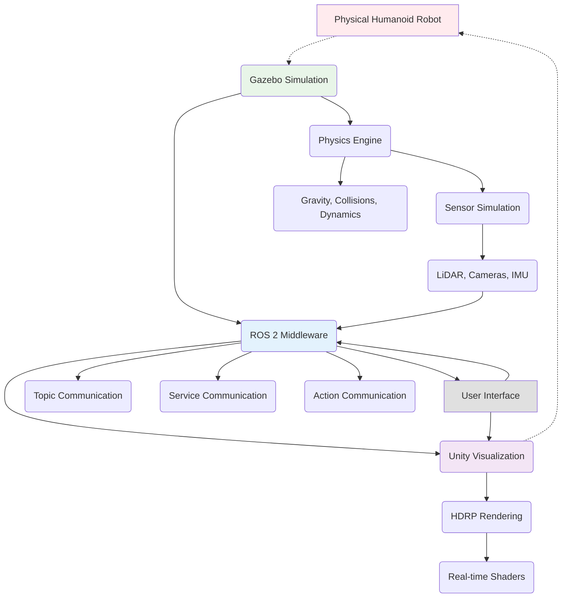

# Mini Project: Full Humanoid Digital Twin (Gazebo + Unity)

## Introduction

In this chapter, we'll integrate everything we've learned about digital twin creation into a comprehensive project. We'll create a complete humanoid digital twin that combines:

- **Gazebo physics simulation** for accurate physical behavior
- **Unity visualization** for high-fidelity rendering
- **ROS 2 communication** for real-time synchronization
- **Sensor simulation** for realistic perception
- **Control integration** for bidirectional communication

This project will demonstrate the full pipeline: **URDF → Gazebo Physics → ROS 2 → Unity Visualization**, creating a complete digital twin that mirrors the behavior of a physical humanoid robot.

## Project Overview

Our digital twin project will include:

1. **Complete humanoid robot model** with proper URDF definition
2. **Physics simulation** in Gazebo with realistic dynamics
3. **High-fidelity visualization** in Unity HDRP
4. **Real-time synchronization** between simulation and visualization
5. **Sensor simulation** including cameras, LiDAR, and IMU
6. **Interactive control interface** for teleoperation
7. **Performance monitoring** and validation tools

The goal is to create a system where changes to the robot in Gazebo (movements, sensor data, etc.) are reflected in real-time in Unity, and vice versa, creating a true digital twin.

## System Architecture



### Key Components

1. **Robot Model**: Complete URDF with all joints and links
2. **Physics Simulation**: Gazebo with realistic parameters
3. **Visualization**: Unity with HDRP for photorealistic rendering
4. **Communication Bridge**: ROS-Unity connection for real-time sync
5. **Sensor System**: Simulated sensors with realistic data
6. **Control Interface**: Bidirectional control between systems

## Phase 1: Complete Humanoid Robot Model

First, let's create a comprehensive URDF for our humanoid robot:

```xml
<!-- urdf/full_humanoid.urdf.xacro -->
<?xml version="1.0"?>
<robot xmlns:xacro="http://www.ros.org/wiki/xacro" name="full_humanoid">

  <!-- Import common macros and constants -->
  <xacro:include filename="$(find humanoid_description)/urdf/macros.xacro"/>

  <!-- Constants -->
  <xacro:property name="pi" value="3.1415926535897931"/>
  <xacro:property name="mass_pelvis" value="10.0"/>
  <xacro:property name="mass_torso" value="15.0"/>
  <xacro:property name="mass_head" value="3.0"/>
  <xacro:property name="mass_upper_leg" value="5.0"/>
  <xacro:property name="mass_lower_leg" value="3.0"/>
  <xacro:property name="mass_foot" value="1.5"/>
  <xacro:property name="mass_upper_arm" value="2.5"/>
  <xacro:property name="mass_lower_arm" value="1.5"/>
  <xacro:property name="mass_hand" value="0.5"/>

  <!-- Materials -->
  <material name="white">
    <color rgba="0.9 0.9 0.9 1.0"/>
  </material>
  <material name="blue">
    <color rgba="0.0 0.0 1.0 1.0"/>
  </material>
  <material name="red">
    <color rgba="1.0 0.0 0.0 1.0"/>
  </material>
  <material name="black">
    <color rgba="0.1 0.1 0.1 1.0"/>
  </material>
  <material name="silver">
    <color rgba="0.75 0.75 0.75 1.0"/>
  </material>

  <!-- Base/Pelvis link -->
  <link name="base_link">
    <visual>
      <geometry>
        <box size="0.2 0.25 0.1"/>
      </geometry>
      <material name="white"/>
    </visual>
    <collision>
      <geometry>
        <box size="0.2 0.25 0.1"/>
      </geometry>
    </collision>
    <inertial>
      <mass value="${mass_pelvis}"/>
      <origin xyz="0 0 0" rpy="0 0 0"/>
      <inertia ixx="0.1" ixy="0.0" ixz="0.0" iyy="0.1" iyz="0.0" izz="0.1"/>
    </inertial>
  </link>

  <!-- Torso -->
  <joint name="torso_joint" type="revolute">
    <parent link="base_link"/>
    <child link="torso_link"/>
    <origin xyz="0 0 0.05" rpy="0 0 0"/>
    <axis xyz="0 0 1"/>
    <limit lower="${-pi/3}" upper="${pi/3}" effort="200" velocity="1"/>
    <dynamics damping="0.5" friction="0.1"/>
  </joint>

  <link name="torso_link">
    <visual>
      <origin xyz="0 0 0.25" rpy="0 0 0"/>
      <geometry>
        <box size="0.18 0.25 0.5"/>
      </geometry>
      <material name="silver"/>
    </visual>
    <collision>
      <origin xyz="0 0 0.25" rpy="0 0 0"/>
      <geometry>
        <box size="0.18 0.25 0.5"/>
      </geometry>
    </collision>
    <inertial>
      <mass value="${mass_torso}"/>
      <origin xyz="0 0 0.25" rpy="0 0 0"/>
      <inertia ixx="0.2" ixy="0.0" ixz="0.0" iyy="0.2" iyz="0.0" izz="0.2"/>
    </inertial>
  </link>

  <!-- Head -->
  <joint name="neck_joint" type="revolute">
    <parent link="torso_link"/>
    <child link="head_link"/>
    <origin xyz="0 0 0.5" rpy="0 0 0"/>
    <axis xyz="0 1 0"/>
    <limit lower="${-pi/4}" upper="${pi/4}" effort="20" velocity="1"/>
    <dynamics damping="0.1" friction="0.01"/>
  </joint>

  <link name="head_link">
    <visual>
      <origin xyz="0 0 0.08" rpy="0 0 0"/>
      <geometry>
        <sphere radius="0.08"/>
      </geometry>
      <material name="white"/>
    </visual>
    <collision>
      <origin xyz="0 0 0.08" rpy="0 0 0"/>
      <geometry>
        <sphere radius="0.08"/>
      </geometry>
    </collision>
    <inertial>
      <mass value="${mass_head}"/>
      <origin xyz="0 0 0.08" rpy="0 0 0"/>
      <inertia ixx="0.01" ixy="0.0" ixz="0.0" iyy="0.01" iyz="0.0" izz="0.01"/>
    </inertial>
  </link>

  <!-- Left Hip -->
  <joint name="left_hip_yaw_joint" type="revolute">
    <parent link="base_link"/>
    <child link="left_hip_yaw_link"/>
    <origin xyz="0 -0.125 0" rpy="0 0 0"/>
    <axis xyz="0 0 1"/>
    <limit lower="${-pi/4}" upper="${pi/4}" effort="200" velocity="1"/>
    <dynamics damping="0.5" friction="0.1"/>
  </joint>

  <link name="left_hip_yaw_link">
    <inertial>
      <mass value="0.1"/>
      <origin xyz="0 0 0" rpy="0 0 0"/>
      <inertia ixx="0.001" ixy="0.0" ixz="0.0" iyy="0.001" iyz="0.0" izz="0.001"/>
    </inertial>
  </link>

  <joint name="left_hip_roll_joint" type="revolute">
    <parent link="left_hip_yaw_link"/>
    <child link="left_hip_roll_link"/>
    <origin xyz="0 0 0" rpy="0 0 0"/>
    <axis xyz="1 0 0"/>
    <limit lower="${-pi/2}" upper="${pi/2}" effort="200" velocity="1"/>
    <dynamics damping="0.5" friction="0.1"/>
  </joint>

  <link name="left_hip_roll_link">
    <inertial>
      <mass value="0.1"/>
      <origin xyz="0 0 0" rpy="0 0 0"/>
      <inertia ixx="0.001" ixy="0.0" ixz="0.0" iyy="0.001" iyz="0.0" izz="0.001"/>
    </inertial>
  </link>

  <joint name="left_hip_pitch_joint" type="revolute">
    <parent link="left_hip_roll_link"/>
    <child link="left_thigh_link"/>
    <origin xyz="0 0 -0.05" rpy="0 0 0"/>
    <axis xyz="0 1 0"/>
    <limit lower="${-pi/2}" upper="${pi/6}" effort="200" velocity="1"/>
    <dynamics damping="0.5" friction="0.1"/>
  </joint>

  <link name="left_thigh_link">
    <visual>
      <origin xyz="0 0 -0.15" rpy="0 0 0"/>
      <geometry>
        <capsule radius="0.06" length="0.2"/>
      </geometry>
      <material name="blue"/>
    </visual>
    <collision>
      <origin xyz="0 0 -0.15" rpy="0 0 0"/>
      <geometry>
        <capsule radius="0.06" length="0.2"/>
      </geometry>
    </collision>
    <inertial>
      <mass value="${mass_upper_leg}"/>
      <origin xyz="0 0 -0.15" rpy="0 0 0"/>
      <inertia ixx="0.05" ixy="0.0" ixz="0.0" iyy="0.05" iyz="0.0" izz="0.01"/>
    </inertial>
  </link>

  <!-- Left Knee -->
  <joint name="left_knee_joint" type="revolute">
    <parent link="left_thigh_link"/>
    <child link="left_shin_link"/>
    <origin xyz="0 0 -0.3" rpy="0 0 0"/>
    <axis xyz="0 1 0"/>
    <limit lower="${-pi*0.8}" upper="0" effort="200" velocity="1"/>
    <dynamics damping="0.5" friction="0.1"/>
  </joint>

  <link name="left_shin_link">
    <visual>
      <origin xyz="0 0 -0.15" rpy="0 0 0"/>
      <geometry>
        <capsule radius="0.05" length="0.2"/>
      </geometry>
      <material name="blue"/>
    </visual>
    <collision>
      <origin xyz="0 0 -0.15" rpy="0 0 0"/>
      <geometry>
        <capsule radius="0.05" length="0.2"/>
      </geometry>
    </collision>
    <inertial>
      <mass value="${mass_lower_leg}"/>
      <origin xyz="0 0 -0.15" rpy="0 0 0"/>
      <inertia ixx="0.03" ixy="0.0" ixz="0.0" iyy="0.03" iyz="0.0" izz="0.01"/>
    </inertial>
  </link>

  <!-- Left Ankle -->
  <joint name="left_ankle_pitch_joint" type="revolute">
    <parent link="left_shin_link"/>
    <child link="left_foot_link"/>
    <origin xyz="0 0 -0.3" rpy="0 0 0"/>
    <axis xyz="0 1 0"/>
    <limit lower="${-pi/4}" upper="${pi/4}" effort="100" velocity="1"/>
    <dynamics damping="0.2" friction="0.05"/>
  </joint>

  <joint name="left_ankle_roll_joint" type="revolute">
    <parent link="left_foot_link"/>
    <child link="left_foot_end"/>
    <origin xyz="0 0 0" rpy="0 0 0"/>
    <axis xyz="1 0 0"/>
    <limit lower="${-pi/6}" upper="${pi/6}" effort="100" velocity="1"/>
    <dynamics damping="0.2" friction="0.05"/>
  </joint>

  <link name="left_foot_link">
    <visual>
      <origin xyz="0.05 0 -0.025" rpy="0 0 0"/>
      <geometry>
        <box size="0.15 0.1 0.05"/>
      </geometry>
      <material name="black"/>
    </visual>
    <collision>
      <origin xyz="0.05 0 -0.025" rpy="0 0 0"/>
      <geometry>
        <box size="0.15 0.1 0.05"/>
      </geometry>
    </collision>
    <inertial>
      <mass value="${mass_foot}"/>
      <origin xyz="0.05 0 -0.025" rpy="0 0 0"/>
      <inertia ixx="0.001" ixy="0.0" ixz="0.0" iyy="0.001" iyz="0.0" izz="0.001"/>
    </inertial>
  </link>

  <link name="left_foot_end">
    <inertial>
      <mass value="0.01"/>
      <origin xyz="0 0 0" rpy="0 0 0"/>
      <inertia ixx="0.0001" ixy="0.0" ixz="0.0" iyy="0.0001" iyz="0.0" izz="0.0001"/>
    </inertial>
  </link>

  <!-- Right Leg (mirrored) -->
  <joint name="right_hip_yaw_joint" type="revolute">
    <parent link="base_link"/>
    <child link="right_hip_yaw_link"/>
    <origin xyz="0 0.125 0" rpy="0 0 0"/>
    <axis xyz="0 0 1"/>
    <limit lower="${-pi/4}" upper="${pi/4}" effort="200" velocity="1"/>
    <dynamics damping="0.5" friction="0.1"/>
  </joint>

  <link name="right_hip_yaw_link">
    <inertial>
      <mass value="0.1"/>
      <origin xyz="0 0 0" rpy="0 0 0"/>
      <inertia ixx="0.001" ixy="0.0" ixz="0.0" iyy="0.001" iyz="0.0" izz="0.001"/>
    </inertial>
  </link>

  <joint name="right_hip_roll_joint" type="revolute">
    <parent link="right_hip_yaw_link"/>
    <child link="right_hip_roll_link"/>
    <origin xyz="0 0 0" rpy="0 0 0"/>
    <axis xyz="1 0 0"/>
    <limit lower="${-pi/2}" upper="${pi/2}" effort="200" velocity="1"/>
    <dynamics damping="0.5" friction="0.1"/>
  </joint>

  <link name="right_hip_roll_link">
    <inertial>
      <mass value="0.1"/>
      <origin xyz="0 0 0" rpy="0 0 0"/>
      <inertia ixx="0.001" ixy="0.0" ixz="0.0" iyy="0.001" iyz="0.0" izz="0.001"/>
    </inertial>
  </link>

  <joint name="right_hip_pitch_joint" type="revolute">
    <parent link="right_hip_roll_link"/>
    <child link="right_thigh_link"/>
    <origin xyz="0 0 -0.05" rpy="0 0 0"/>
    <axis xyz="0 1 0"/>
    <limit lower="${-pi/2}" upper="${pi/6}" effort="200" velocity="1"/>
    <dynamics damping="0.5" friction="0.1"/>
  </joint>

  <link name="right_thigh_link">
    <visual>
      <origin xyz="0 0 -0.15" rpy="0 0 0"/>
      <geometry>
        <capsule radius="0.06" length="0.2"/>
      </geometry>
      <material name="blue"/>
    </visual>
    <collision>
      <origin xyz="0 0 -0.15" rpy="0 0 0"/>
      <geometry>
        <capsule radius="0.06" length="0.2"/>
      </geometry>
    </collision>
    <inertial>
      <mass value="${mass_upper_leg}"/>
      <origin xyz="0 0 -0.15" rpy="0 0 0"/>
      <inertia ixx="0.05" ixy="0.0" ixz="0.0" iyy="0.05" iyz="0.0" izz="0.01"/>
    </inertial>
  </link>

  <joint name="right_knee_joint" type="revolute">
    <parent link="right_thigh_link"/>
    <child link="right_shin_link"/>
    <origin xyz="0 0 -0.3" rpy="0 0 0"/>
    <axis xyz="0 1 0"/>
    <limit lower="${-pi*0.8}" upper="0" effort="200" velocity="1"/>
    <dynamics damping="0.5" friction="0.1"/>
  </joint>

  <link name="right_shin_link">
    <visual>
      <origin xyz="0 0 -0.15" rpy="0 0 0"/>
      <geometry>
        <capsule radius="0.05" length="0.2"/>
      </geometry>
      <material name="blue"/>
    </visual>
    <collision>
      <origin xyz="0 0 -0.15" rpy="0 0 0"/>
      <geometry>
        <capsule radius="0.05" length="0.2"/>
      </geometry>
    </collision>
    <inertial>
      <mass value="${mass_lower_leg}"/>
      <origin xyz="0 0 -0.15" rpy="0 0 0"/>
      <inertia ixx="0.03" ixy="0.0" ixz="0.0" iyy="0.03" iyz="0.0" izz="0.01"/>
    </inertial>
  </link>

  <joint name="right_ankle_pitch_joint" type="revolute">
    <parent link="right_shin_link"/>
    <child link="right_foot_link"/>
    <origin xyz="0 0 -0.3" rpy="0 0 0"/>
    <axis xyz="0 1 0"/>
    <limit lower="${-pi/4}" upper="${pi/4}" effort="100" velocity="1"/>
    <dynamics damping="0.2" friction="0.05"/>
  </joint>

  <joint name="right_ankle_roll_joint" type="revolute">
    <parent link="right_foot_link"/>
    <child link="right_foot_end"/>
    <origin xyz="0 0 0" rpy="0 0 0"/>
    <axis xyz="1 0 0"/>
    <limit lower="${-pi/6}" upper="${pi/6}" effort="100" velocity="1"/>
    <dynamics damping="0.2" friction="0.05"/>
  </joint>

  <link name="right_foot_link">
    <visual>
      <origin xyz="0.05 0 -0.025" rpy="0 0 0"/>
      <geometry>
        <box size="0.15 0.1 0.05"/>
      </geometry>
      <material name="black"/>
    </visual>
    <collision>
      <origin xyz="0.05 0 -0.025" rpy="0 0 0"/>
      <geometry>
        <box size="0.15 0.1 0.05"/>
      </geometry>
    </collision>
    <inertial>
      <mass value="${mass_foot}"/>
      <origin xyz="0.05 0 -0.025" rpy="0 0 0"/>
      <inertia ixx="0.001" ixy="0.0" ixz="0.0" iyy="0.001" iyz="0.0" izz="0.001"/>
    </inertial>
  </link>

  <link name="right_foot_end">
    <inertial>
      <mass value="0.01"/>
      <origin xyz="0 0 0" rpy="0 0 0"/>
      <inertia ixx="0.0001" ixy="0.0" ixz="0.0" iyy="0.0001" iyz="0.0" izz="0.0001"/>
    </inertial>
  </link>

  <!-- Left Shoulder -->
  <joint name="left_shoulder_yaw_joint" type="revolute">
    <parent link="torso_link"/>
    <child link="left_shoulder_yaw_link"/>
    <origin xyz="0 -0.15 0.3" rpy="0 0 0"/>
    <axis xyz="0 0 1"/>
    <limit lower="${-pi/4}" upper="${pi/4}" effort="100" velocity="1"/>
    <dynamics damping="0.2" friction="0.05"/>
  </joint>

  <link name="left_shoulder_yaw_link">
    <inertial>
      <mass value="0.1"/>
      <origin xyz="0 0 0" rpy="0 0 0"/>
      <inertia ixx="0.001" ixy="0.0" ixz="0.0" iyy="0.001" iyz="0.0" izz="0.001"/>
    </inertial>
  </link>

  <joint name="left_shoulder_pitch_joint" type="revolute">
    <parent link="left_shoulder_yaw_link"/>
    <child link="left_shoulder_pitch_link"/>
    <origin xyz="0 0 0" rpy="0 0 0"/>
    <axis xyz="0 1 0"/>
    <limit lower="${-pi/2}" upper="${pi/2}" effort="100" velocity="1"/>
    <dynamics damping="0.2" friction="0.05"/>
  </joint>

  <link name="left_shoulder_pitch_link">
    <inertial>
      <mass value="0.1"/>
      <origin xyz="0 0 0" rpy="0 0 0"/>
      <inertia ixx="0.001" ixy="0.0" ixz="0.0" iyy="0.001" iyz="0.0" izz="0.001"/>
    </inertial>
  </link>

  <joint name="left_shoulder_roll_joint" type="revolute">
    <parent link="left_shoulder_pitch_link"/>
    <child link="left_upper_arm_link"/>
    <origin xyz="0 0 0.05" rpy="0 0 0"/>
    <axis xyz="1 0 0"/>
    <limit lower="${-pi/6}" upper="${pi*0.8}" effort="100" velocity="1"/>
    <dynamics damping="0.2" friction="0.05"/>
  </joint>

  <link name="left_upper_arm_link">
    <visual>
      <origin xyz="0 0 -0.15" rpy="0 0 0"/>
      <geometry>
        <capsule radius="0.05" length="0.2"/>
      </geometry>
      <material name="red"/>
    </visual>
    <collision>
      <origin xyz="0 0 -0.15" rpy="0 0 0"/>
      <geometry>
        <capsule radius="0.05" length="0.2"/>
      </geometry>
    </collision>
    <inertial>
      <mass value="${mass_upper_arm}"/>
      <origin xyz="0 0 -0.15" rpy="0 0 0"/>
      <inertia ixx="0.01" ixy="0.0" ixz="0.0" iyy="0.01" iyz="0.0" izz="0.005"/>
    </inertial>
  </link>

  <!-- Left Elbow -->
  <joint name="left_elbow_joint" type="revolute">
    <parent link="left_upper_arm_link"/>
    <child link="left_forearm_link"/>
    <origin xyz="0 0 -0.3" rpy="0 0 0"/>
    <axis xyz="0 1 0"/>
    <limit lower="${-pi*0.8}" upper="0" effort="80" velocity="1"/>
    <dynamics damping="0.1" friction="0.02"/>
  </joint>

  <link name="left_forearm_link">
    <visual>
      <origin xyz="0 0 -0.1" rpy="0 0 0"/>
      <geometry>
        <capsule radius="0.04" length="0.15"/>
      </geometry>
      <material name="red"/>
    </visual>
    <collision>
      <origin xyz="0 0 -0.1" rpy="0 0 0"/>
      <geometry>
        <capsule radius="0.04" length="0.15"/>
      </geometry>
    </collision>
    <inertial>
      <mass value="${mass_lower_arm}"/>
      <origin xyz="0 0 -0.1" rpy="0 0 0"/>
      <inertia ixx="0.005" ixy="0.0" ixz="0.0" iyy="0.005" iyz="0.0" izz="0.002"/>
    </inertial>
  </link>

  <!-- Left Wrist -->
  <joint name="left_wrist_pitch_joint" type="revolute">
    <parent link="left_forearm_link"/>
    <child link="left_wrist_pitch_link"/>
    <origin xyz="0 0 -0.2" rpy="0 0 0"/>
    <axis xyz="0 1 0"/>
    <limit lower="${-pi/4}" upper="${pi/4}" effort="50" velocity="1"/>
    <dynamics damping="0.05" friction="0.01"/>
  </joint>

  <link name="left_wrist_pitch_link">
    <inertial>
      <mass value="0.1"/>
      <origin xyz="0 0 0" rpy="0 0 0"/>
      <inertia ixx="0.001" ixy="0.0" ixz="0.0" iyy="0.001" iyz="0.0" izz="0.001"/>
    </inertial>
  </link>

  <joint name="left_wrist_yaw_joint" type="revolute">
    <parent link="left_wrist_pitch_link"/>
    <child link="left_hand_link"/>
    <origin xyz="0 0 0" rpy="0 0 0"/>
    <axis xyz="0 0 1"/>
    <limit lower="${-pi/4}" upper="${pi/4}" effort="30" velocity="1"/>
    <dynamics damping="0.05" friction="0.01"/>
  </joint>

  <link name="left_hand_link">
    <visual>
      <origin xyz="0 0 -0.05" rpy="0 0 0"/>
      <geometry>
        <box size="0.08 0.08 0.1"/>
      </geometry>
      <material name="white"/>
    </visual>
    <collision>
      <origin xyz="0 0 -0.05" rpy="0 0 0"/>
      <geometry>
        <box size="0.08 0.08 0.1"/>
      </geometry>
    </collision>
    <inertial>
      <mass value="${mass_hand}"/>
      <origin xyz="0 0 -0.05" rpy="0 0 0"/>
      <inertia ixx="0.001" ixy="0.0" ixz="0.0" iyy="0.001" iyz="0.0" izz="0.001"/>
    </inertial>
  </link>

  <!-- Right Arm (mirrored) -->
  <joint name="right_shoulder_yaw_joint" type="revolute">
    <parent link="torso_link"/>
    <child link="right_shoulder_yaw_link"/>
    <origin xyz="0 0.15 0.3" rpy="0 0 0"/>
    <axis xyz="0 0 1"/>
    <limit lower="${-pi/4}" upper="${pi/4}" effort="100" velocity="1"/>
    <dynamics damping="0.2" friction="0.05"/>
  </joint>

  <link name="right_shoulder_yaw_link">
    <inertial>
      <mass value="0.1"/>
      <origin xyz="0 0 0" rpy="0 0 0"/>
      <inertia ixx="0.001" ixy="0.0" ixz="0.0" iyy="0.001" iyz="0.0" izz="0.001"/>
    </inertial>
  </link>

  <joint name="right_shoulder_pitch_joint" type="revolute">
    <parent link="right_shoulder_yaw_link"/>
    <child link="right_shoulder_pitch_link"/>
    <origin xyz="0 0 0" rpy="0 0 0"/>
    <axis xyz="0 1 0"/>
    <limit lower="${-pi/2}" upper="${pi/2}" effort="100" velocity="1"/>
    <dynamics damping="0.2" friction="0.05"/>
  </joint>

  <link name="right_shoulder_pitch_link">
    <inertial>
      <mass value="0.1"/>
      <origin xyz="0 0 0" rpy="0 0 0"/>
      <inertia ixx="0.001" ixy="0.0" ixz="0.0" iyy="0.001" iyz="0.0" izz="0.001"/>
    </inertial>
  </link>

  <joint name="right_shoulder_roll_joint" type="revolute">
    <parent link="right_shoulder_pitch_link"/>
    <child link="right_upper_arm_link"/>
    <origin xyz="0 0 0.05" rpy="0 0 0"/>
    <axis xyz="1 0 0"/>
    <limit lower="${-pi*0.8}" upper="${pi/6}" effort="100" velocity="1"/>
    <dynamics damping="0.2" friction="0.05"/>
  </joint>

  <link name="right_upper_arm_link">
    <visual>
      <origin xyz="0 0 -0.15" rpy="0 0 0"/>
      <geometry>
        <capsule radius="0.05" length="0.2"/>
      </geometry>
      <material name="red"/>
    </visual>
    <collision>
      <origin xyz="0 0 -0.15" rpy="0 0 0"/>
      <geometry>
        <capsule radius="0.05" length="0.2"/>
      </geometry>
    </collision>
    <inertial>
      <mass value="${mass_upper_arm}"/>
      <origin xyz="0 0 -0.15" rpy="0 0 0"/>
      <inertia ixx="0.01" ixy="0.0" ixz="0.0" iyy="0.01" iyz="0.0" izz="0.005"/>
    </inertial>
  </link>

  <joint name="right_elbow_joint" type="revolute">
    <parent link="right_upper_arm_link"/>
    <child link="right_forearm_link"/>
    <origin xyz="0 0 -0.3" rpy="0 0 0"/>
    <axis xyz="0 1 0"/>
    <limit lower="${-pi*0.8}" upper="0" effort="80" velocity="1"/>
    <dynamics damping="0.1" friction="0.02"/>
  </joint>

  <link name="right_forearm_link">
    <visual>
      <origin xyz="0 0 -0.1" rpy="0 0 0"/>
      <geometry>
        <capsule radius="0.04" length="0.15"/>
      </geometry>
      <material name="red"/>
    </visual>
    <collision>
      <origin xyz="0 0 -0.1" rpy="0 0 0"/>
      <geometry>
        <capsule radius="0.04" length="0.15"/>
      </geometry>
    </collision>
    <inertial>
      <mass value="${mass_lower_arm}"/>
      <origin xyz="0 0 -0.1" rpy="0 0 0"/>
      <inertia ixx="0.005" ixy="0.0" ixz="0.0" iyy="0.005" iyz="0.0" izz="0.002"/>
    </inertial>
  </link>

  <joint name="right_wrist_pitch_joint" type="revolute">
    <parent link="right_forearm_link"/>
    <child link="right_wrist_pitch_link"/>
    <origin xyz="0 0 -0.2" rpy="0 0 0"/>
    <axis xyz="0 1 0"/>
    <limit lower="${-pi/4}" upper="${pi/4}" effort="50" velocity="1"/>
    <dynamics damping="0.05" friction="0.01"/>
  </joint>

  <link name="right_wrist_pitch_link">
    <inertial>
      <mass value="0.1"/>
      <origin xyz="0 0 0" rpy="0 0 0"/>
      <inertia ixx="0.001" ixy="0.0" ixz="0.0" iyy="0.001" iyz="0.0" izz="0.001"/>
    </inertial>
  </link>

  <joint name="right_wrist_yaw_joint" type="revolute">
    <parent link="right_wrist_pitch_link"/>
    <child link="right_hand_link"/>
    <origin xyz="0 0 0" rpy="0 0 0"/>
    <axis xyz="0 0 1"/>
    <limit lower="${-pi/4}" upper="${pi/4}" effort="30" velocity="1"/>
    <dynamics damping="0.05" friction="0.01"/>
  </joint>

  <link name="right_hand_link">
    <visual>
      <origin xyz="0 0 -0.05" rpy="0 0 0"/>
      <geometry>
        <box size="0.08 0.08 0.1"/>
      </geometry>
      <material name="white"/>
    </visual>
    <collision>
      <origin xyz="0 0 -0.05" rpy="0 0 0"/>
      <geometry>
        <box size="0.08 0.08 0.1"/>
      </geometry>
    </collision>
    <inertial>
      <mass value="${mass_hand}"/>
      <origin xyz="0 0 -0.05" rpy="0 0 0"/>
      <inertia ixx="0.001" ixy="0.0" ixz="0.0" iyy="0.001" iyz="0.0" izz="0.001"/>
    </inertial>
  </link>

  <!-- Sensors -->
  <!-- IMU in head -->
  <gazebo reference="head_link">
    <sensor name="imu_sensor" type="imu">
      <always_on>true</always_on>
      <update_rate>100</update_rate>
      <imu>
        <angular_velocity>
          <x>
            <noise type="gaussian">
              <mean>0.0</mean>
              <stddev>2e-4</stddev>
            </noise>
          </x>
          <y>
            <noise type="gaussian">
              <mean>0.0</mean>
              <stddev>2e-4</stddev>
            </noise>
          </y>
          <z>
            <noise type="gaussian">
              <mean>0.0</mean>
              <stddev>2e-4</stddev>
            </noise>
          </z>
        </angular_velocity>
        <linear_acceleration>
          <x>
            <noise type="gaussian">
              <mean>0.0</mean>
              <stddev>1.7e-2</stddev>
            </noise>
          </x>
          <y>
            <noise type="gaussian">
              <mean>0.0</mean>
              <stddev>1.7e-2</stddev>
            </noise>
          </y>
          <z>
            <noise type="gaussian">
              <mean>0.0</mean>
              <stddev>1.7e-2</stddev>
            </noise>
          </z>
        </linear_acceleration>
      </imu>
    </sensor>
  </gazebo>

  <!-- Camera in head -->
  <gazebo reference="head_link">
    <sensor name="camera" type="camera">
      <always_on>true</always_on>
      <update_rate>30</update_rate>
      <camera name="head_camera">
        <horizontal_fov>1.047</horizontal_fov>
        <image>
          <width>640</width>
          <height>480</height>
          <format>R8G8B8</format>
        </image>
        <clip>
          <near>0.1</near>
          <far>30</far>
        </clip>
      </camera>
    </sensor>
  </gazebo>

  <!-- LiDAR on torso -->
  <gazebo reference="torso_link">
    <sensor name="lidar" type="ray">
      <always_on>true</always_on>
      <update_rate>10</update_rate>
      <ray>
        <scan>
          <horizontal>
            <samples>720</samples>
            <resolution>1</resolution>
            <min_angle>-3.14159</min_angle>
            <max_angle>3.14159</max_angle>
          </horizontal>
        </scan>
        <range>
          <min>0.1</min>
          <max>30.0</max>
          <resolution>0.01</resolution>
        </range>
      </ray>
    </sensor>
  </gazebo>

  <!-- Transmissions for ROS control -->
  <xacro:macro name="transmission_block" params="joint_name">
    <transmission name="trans_${joint_name}">
      <type>transmission_interface/SimpleTransmission</type>
      <joint name="${joint_name}">
        <hardwareInterface>hardware_interface/EffortJointInterface</hardwareInterface>
      </joint>
      <actuator name="motor_${joint_name}">
        <mechanicalReduction>1</mechanicalReduction>
      </actuator>
    </transmission>
  </xacro:macro>

  <!-- Add transmissions for all joints -->
  <xacro:transmission_block joint_name="torso_joint"/>
  <xacro:transmission_block joint_name="neck_joint"/>
  <xacro:transmission_block joint_name="left_hip_yaw_joint"/>
  <xacro:transmission_block joint_name="left_hip_roll_joint"/>
  <xacro:transmission_block joint_name="left_hip_pitch_joint"/>
  <xacro:transmission_block joint_name="left_knee_joint"/>
  <xacro:transmission_block joint_name="left_ankle_pitch_joint"/>
  <xacro:transmission_block joint_name="left_ankle_roll_joint"/>
  <xacro:transmission_block joint_name="right_hip_yaw_joint"/>
  <xacro:transmission_block joint_name="right_hip_roll_joint"/>
  <xacro:transmission_block joint_name="right_hip_pitch_joint"/>
  <xacro:transmission_block joint_name="right_knee_joint"/>
  <xacro:transmission_block joint_name="right_ankle_pitch_joint"/>
  <xacro:transmission_block joint_name="right_ankle_roll_joint"/>
  <xacro:transmission_block joint_name="left_shoulder_yaw_joint"/>
  <xacro:transmission_block joint_name="left_shoulder_pitch_joint"/>
  <xacro:transmission_block joint_name="left_shoulder_roll_joint"/>
  <xacro:transmission_block joint_name="left_elbow_joint"/>
  <xacro:transmission_block joint_name="left_wrist_pitch_joint"/>
  <xacro:transmission_block joint_name="left_wrist_yaw_joint"/>
  <xacro:transmission_block joint_name="right_shoulder_yaw_joint"/>
  <xacro:transmission_block joint_name="right_shoulder_pitch_joint"/>
  <xacro:transmission_block joint_name="right_shoulder_roll_joint"/>
  <xacro:transmission_block joint_name="right_elbow_joint"/>
  <xacro:transmission_block joint_name="right_wrist_pitch_joint"/>
  <xacro:transmission_block joint_name="right_wrist_yaw_joint"/>

</robot>
```

## Phase 2: Gazebo Physics Configuration

Now let's create a Gazebo world for our humanoid robot:

```xml
<!-- worlds/humanoid_digital_twin.world -->
<?xml version="1.0" ?>
<sdf version="1.7">
  <world name="humanoid_digital_twin">
    <!-- Physics engine -->
    <physics type="ode">
      <max_step_size>0.001</max_step_size>
      <real_time_factor>1</real_time_factor>
      <real_time_update_rate>1000</real_time_update_rate>
      <gravity>0 0 -9.8</gravity>
      <ode>
        <solver>
          <type>quick</type>
          <iters>100</iters>
          <sor>1.3</sor>
        </solver>
        <constraints>
          <cfm>0</cfm>
          <erp>0.2</erp>
          <contact_max_correcting_vel>100</contact_max_correcting_vel>
          <contact_surface_layer>0.001</contact_surface_layer>
        </constraints>
      </ode>
    </physics>

    <!-- Environment lighting -->
    <light name="sun" type="directional">
      <cast_shadows>true</cast_shadows>
      <pose>0 0 10 0 0 0</pose>
      <diffuse>0.8 0.8 0.8 1</diffuse>
      <specular>0.2 0.2 0.2 1</specular>
      <attenuation>
        <range>1000</range>
        <constant>0.9</constant>
        <linear>0.1</linear>
        <quadratic>0.01</quadratic>
      </attenuation>
      <direction>-0.3 -0.3 -0.9</direction>
    </light>

    <!-- Ground plane -->
    <include>
      <uri>model://ground_plane</uri>
    </include>

    <!-- Environment objects -->
    <model name="table">
      <pose>2 0 0 0 0 0</pose>
      <static>true</static>
      <link name="table_base">
        <collision name="collision">
          <geometry>
            <box>
              <size>1.2 0.8 0.75</size>
            </box>
          </geometry>
        </collision>
        <visual name="visual">
          <geometry>
            <box>
              <size>1.2 0.8 0.75</size>
            </box>
          </geometry>
          <material>
            <ambient>0.6 0.4 0.2 1</ambient>
            <diffuse>0.6 0.4 0.2 1</diffuse>
            <specular>0.2 0.2 0.2 1</specular>
          </material>
        </visual>
        <inertial>
          <mass>50</mass>
          <inertia ixx="10" ixy="0" ixz="0" iyy="10" iyz="0" izz="10"/>
        </inertial>
      </link>
    </model>

    <!-- Obstacles for navigation testing -->
    <model name="obstacle_1">
      <pose>-1 1 0 0 0 0</pose>
      <static>true</static>
      <link name="obstacle_link">
        <collision name="collision">
          <geometry>
            <box>
              <size>0.5 0.5 1.0</size>
            </box>
          </geometry>
        </collision>
        <visual name="visual">
          <geometry>
            <box>
              <size>0.5 0.5 1.0</size>
            </box>
          </geometry>
          <material>
            <ambient>0.5 0.5 0.5 1</ambient>
            <diffuse>0.5 0.5 0.5 1</diffuse>
            <specular>0.1 0.1 0.1 1</specular>
          </material>
        </visual>
        <inertial>
          <mass>10</mass>
          <inertia ixx="1" ixy="0" ixz="0" iyy="1" iyz="0" izz="1"/>
        </inertial>
      </link>
    </model>

    <model name="obstacle_2">
      <pose>1 -1 0 0 0 0</pose>
      <static>true</static>
      <link name="obstacle_link">
        <collision name="collision">
          <geometry>
            <cylinder>
              <radius>0.3</radius>
              <length>1.5</length>
            </cylinder>
          </geometry>
        </collision>
        <visual name="visual">
          <geometry>
            <cylinder>
              <radius>0.3</radius>
              <length>1.5</length>
            </cylinder>
          </geometry>
          <material>
            <ambient>0.8 0.6 0.2 1</ambient>
            <diffuse>0.8 0.6 0.2 1</diffuse>
            <specular>0.1 0.1 0.1 1</specular>
          </material>
        </visual>
        <inertial>
          <mass>15</mass>
          <inertia ixx="1" ixy="0" ixz="0" iyy="1" iyz="0" izz="1"/>
        </inertial>
      </link>
    </model>

    <!-- Include our humanoid robot -->
    <include>
      <uri>model://full_humanoid</uri>
      <pose>0 0 1 0 0 0</pose>
    </include>

  </world>
</sdf>
```

## Phase 3: Unity Integration Components

Let's create the Unity components for our digital twin:

```csharp
// Unity/Assets/Scripts/DigitalTwinManager.cs
using UnityEngine;
using Unity.Robotics.ROSTCPConnector;
using Unity.Robotics.ROSTCPConnector.MessageGeneration;
using System.Collections.Generic;

public class DigitalTwinManager : MonoBehaviour
{
    [Header("ROS Connection")]
    public string rosIpAddress = "127.0.0.1";
    public int rosPort = 9090;
    public float rosUpdateFrequency = 60f;  // Hz

    [Header("Robot Configuration")]
    public string robotNamespace = "/humanoid";
    public Transform robotRoot;
    public List<JointController> jointControllers = new List<JointController>();

    [Header("Synchronization")]
    public float syncThreshold = 0.01f;  // Radians
    public bool enableInterpolation = true;
    public float interpolationTime = 0.1f;  // Seconds

    [Header("Performance")]
    public bool enablePerformanceLogging = true;
    public float performanceLogInterval = 5.0f;  // Seconds

    private ROSConnection ros;
    private float lastUpdateTime = 0f;
    private float lastPerformanceLogTime = 0f;
    private int messageCount = 0;
    private float avgLatency = 0f;

    // Joint position caches
    private Dictionary<string, float> targetJointPositions = new Dictionary<string, float>();
    private Dictionary<string, float> currentJointPositions = new Dictionary<string, float>();
    private Dictionary<string, float> previousJointPositions = new Dictionary<string, float>();

    void Start()
    {
        InitializeROSConnection();
        InitializeRobotModel();
        SubscribeToTopics();
    }

    void InitializeROSConnection()
    {
        ros = ROSConnection.GetOrCreateInstance();
        ros.Initialize(rosIpAddress, rosPort);
        Debug.Log($"ROS connection initialized to {rosIpAddress}:{rosPort}");
    }

    void InitializeRobotModel()
    {
        if (robotRoot == null)
        {
            robotRoot = transform;  // Use this transform as root if not specified
        }

        // Find all joint controllers in the robot hierarchy
        JointController[] controllers = robotRoot.GetComponentsInChildren<JointController>();
        jointControllers.AddRange(controllers);

        // Initialize position caches
        foreach (JointController controller in jointControllers)
        {
            string jointName = controller.jointName;
            float initialPosition = controller.GetCurrentPosition();

            targetJointPositions[jointName] = initialPosition;
            currentJointPositions[jointName] = initialPosition;
            previousJointPositions[jointName] = initialPosition;
        }

        Debug.Log($"Initialized digital twin with {jointControllers.Count} joints");
    }

    void SubscribeToTopics()
    {
        // Subscribe to joint states from Gazebo simulation
        ros.Subscribe<sensor_msgs.JointStateMsg>(
            $"{robotNamespace}/joint_states",
            OnJointStateReceived
        );

        // Subscribe to robot pose
        ros.Subscribe<nav_msgs.OdometryMsg>(
            $"{robotNamespace}/odom",
            OnOdometryReceived
        );

        // Subscribe to IMU data
        ros.Subscribe<sensor_msgs.ImuMsg>(
            $"{robotNamespace}/imu/data",
            OnImuReceived
        );

        Debug.Log("Subscribed to ROS topics for digital twin synchronization");
    }

    void Update()
    {
        // Handle ROS updates at specified frequency
        if (Time.time - lastUpdateTime >= (1f / rosUpdateFrequency))
        {
            ProcessSynchronization();
            lastUpdateTime = Time.time;
        }

        // Handle interpolation if enabled
        if (enableInterpolation)
        {
            ProcessInterpolation();
        }

        // Log performance metrics
        if (enablePerformanceLogging && Time.time - lastPerformanceLogTime >= performanceLogInterval)
        {
            LogPerformanceMetrics();
            lastPerformanceLogTime = Time.time;
        }
    }

    void OnJointStateReceived(sensor_msgs.JointStateMsg jointState)
    {
        messageCount++;  // For performance tracking

        // Update target positions from ROS joint states
        for (int i = 0; i < jointState.name.Count && i < jointState.position.Count; i++)
        {
            string jointName = jointState.name[i];
            double position = jointState.position[i];

            if (targetJointPositions.ContainsKey(jointName))
            {
                // Store previous position for interpolation
                if (currentJointPositions.ContainsKey(jointName))
                {
                    previousJointPositions[jointName] = currentJointPositions[jointName];
                }

                targetJointPositions[jointName] = (float)position;
            }
        }
    }

    void OnOdometryReceived(nav_msgs.OdometryMsg odometry)
    {
        // Update robot position and orientation based on odometry
        float x = (float)odometry.pose.pose.position.x;
        float y = (float)odometry.pose.pose.position.y;
        float z = (float)odometry.pose.pose.position.z;

        float rx = (float)odometry.pose.pose.orientation.x;
        float ry = (float)odometry.pose.pose.orientation.y;
        float rz = (float)odometry.pose.pose.orientation.z;
        float rw = (float)odometry.pose.pose.orientation.w;

        // Apply position and orientation to robot root
        robotRoot.position = new Vector3(x, y, z);
        robotRoot.rotation = new Quaternion(rx, ry, rz, rw);
    }

    void OnImuReceived(sensor_msgs.ImuMsg imu)
    {
        // Process IMU data for fine-grained orientation updates
        float rx = (float)imu.orientation.x;
        float ry = (float)imu.orientation.y;
        float rz = (float)imu.orientation.z;
        float rw = (float)imu.orientation.w;

        // Apply orientation to head or torso link
        Transform headTransform = FindTransformByName("head_link"); // Or torso_link
        if (headTransform != null)
        {
            headTransform.rotation = new Quaternion(rx, ry, rz, rw);
        }
    }

    void ProcessSynchronization()
    {
        // Update joint positions to match target positions
        foreach (var kvp in targetJointPositions)
        {
            string jointName = kvp.Key;
            float targetPosition = kvp.Value;

            if (jointControllers.Exists(jc => jc.jointName == jointName))
            {
                JointController controller = jointControllers.Find(jc => jc.jointName == jointName);

                if (enableInterpolation)
                {
                    // Calculate interpolation ratio
                    float interpolationRatio = Mathf.Clamp01(Time.deltaTime / interpolationTime);

                    // Interpolate from current to target position
                    float currentPosition = currentJointPositions[jointName];
                    float newPosition = Mathf.Lerp(currentPosition, targetPosition, interpolationRatio);

                    controller.SetJointPosition(newPosition);
                    currentJointPositions[jointName] = newPosition;
                }
                else
                {
                    // Direct position update
                    controller.SetJointPosition(targetPosition);
                    currentJointPositions[jointName] = targetPosition;
                }
            }
        }
    }

    void ProcessInterpolation()
    {
        // This is handled in ProcessSynchronization when interpolation is enabled
    }

    void LogPerformanceMetrics()
    {
        float fps = 1.0f / Time.deltaTime;
        long memoryUsage = System.GC.GetTotalMemory(false);

        Debug.Log($"Digital Twin Performance:\n" +
                  $"  FPS: {fps:F2}\n" +
                  $"  Messages processed: {messageCount}\n" +
                  $"  Memory usage: {(memoryUsage / 1024f / 1024f):F2} MB\n" +
                  $"  Joint controllers: {jointControllers.Count}\n" +
                  $"  Update frequency: {rosUpdateFrequency} Hz");

        messageCount = 0;  // Reset counter
    }

    public void SendJointCommands(Dictionary<string, float> jointCommands)
    {
        // Send joint position commands back to ROS
        if (ros != null && ros.IsConnected)
        {
            var jointCmd = new sensor_msgs.JointStateMsg();
            jointCmd.header = new std_msgs.HeaderMsg();
            jointCmd.header.stamp = new builtin_interfaces.TimeMsg();
            jointCmd.header.frame_id = "base_link";

            jointCmd.name = new string[jointCommands.Count];
            jointCmd.position = new double[jointCommands.Count];

            int i = 0;
            foreach (var kvp in jointCommands)
            {
                jointCmd.name[i] = kvp.Key;
                jointCmd.position[i] = kvp.Value;
                i++;
            }

            ros.Publish($"{robotNamespace}/joint_commands", jointCmd);
        }
    }

    public void SendVelocityCommand(float linearX, float angularZ)
    {
        // Send velocity command to robot
        if (ros != null && ros.IsConnected)
        {
            var twistCmd = new geometry_msgs.TwistMsg();
            twistCmd.linear = new geometry_msgs.Vector3Msg(linearX, 0, 0);
            twistCmd.angular = new geometry_msgs.Vector3Msg(0, 0, angularZ);

            ros.Publish($"{robotNamespace}/cmd_vel", twistCmd);
        }
    }

    Transform FindTransformByName(string name)
    {
        Transform[] allTransforms = GetComponentsInChildren<Transform>();
        foreach (Transform t in allTransforms)
        {
            if (t.name == name)
                return t;
        }
        return null;
    }

    public float GetJointPosition(string jointName)
    {
        if (currentJointPositions.ContainsKey(jointName))
            return currentJointPositions[jointName];
        return 0f;
    }

    public Dictionary<string, float> GetAllJointPositions()
    {
        return new Dictionary<string, float>(currentJointPositions);
    }

    public bool IsConnectedToROS()
    {
        return ros != null && ros.IsConnected;
    }
}
```

### Joint Controller Component

```csharp
// Unity/Assets/Scripts/JointController.cs
using UnityEngine;

public class JointController : MonoBehaviour
{
    [Header("Joint Configuration")]
    public string jointName;
    public JointType jointType = JointType.Revolute;
    public float minPosition = -Mathf.PI/2;
    public float maxPosition = Mathf.PI/2;
    public Vector3 rotationAxis = Vector3.forward;  // Z-axis by default

    [Header("Visual Feedback")]
    public bool showJointLimits = true;
    public Color jointLimitColor = Color.yellow;
    public float jointLimitRadius = 0.02f;

    private float currentPosition = 0f;
    private float targetPosition = 0f;
    private bool initialized = false;

    public enum JointType
    {
        Revolute,    // Rotational joint with limits
        Continuous,  // Rotational joint without limits
        Prismatic,   // Linear joint
        Fixed        // No movement
    }

    void Start()
    {
        InitializeJoint();
    }

    void InitializeJoint()
    {
        // Store initial position
        currentPosition = GetCurrentPosition();
        targetPosition = currentPosition;
        initialized = true;
    }

    public void SetJointPosition(float position)
    {
        if (!initialized) return;

        // Clamp position to limits if revolute joint
        if (jointType == JointType.Revolute)
        {
            position = Mathf.Clamp(position, minPosition, maxPosition);
        }

        targetPosition = position;

        // Apply position based on joint type
        switch (jointType)
        {
            case JointType.Revolute:
            case JointType.Continuous:
                ApplyRevolutePosition(position);
                break;
            case JointType.Prismatic:
                ApplyPrismaticPosition(position);
                break;
            case JointType.Fixed:
                // Fixed joints don't move
                break;
        }

        currentPosition = position;
    }

    void ApplyRevolutePosition(float angleRadians)
    {
        // Apply rotation around the specified axis
        Vector3 rotation = rotationAxis * angleRadians * Mathf.Rad2Deg;
        transform.localRotation = Quaternion.Euler(rotation);
    }

    void ApplyPrismaticPosition(float displacement)
    {
        // Apply linear displacement along the specified axis
        transform.localPosition = rotationAxis * displacement;
    }

    public float GetCurrentPosition()
    {
        switch (jointType)
        {
            case JointType.Revolute:
            case JointType.Continuous:
                // For revolute joints, return the rotation angle
                Vector3 currentRotation = transform.localEulerAngles;

                // Use the component of rotation that corresponds to our rotation axis
                if (rotationAxis == Vector3.right)
                    return currentRotation.x * Mathf.Deg2Rad;
                else if (rotationAxis == Vector3.up)
                    return currentRotation.y * Mathf.Deg2Rad;
                else if (rotationAxis == Vector3.forward)
                    return currentRotation.z * Mathf.Deg2Rad;
                else
                    return Vector3.Angle(Vector3.zero, currentRotation) * Mathf.Deg2Rad;

            case JointType.Prismatic:
                // For prismatic joints, return the linear displacement
                return Vector3.Dot(transform.localPosition, rotationAxis);

            default:
                return 0f;
        }
    }

    public float GetTargetPosition()
    {
        return targetPosition;
    }

    public bool IsAtTarget()
    {
        return Mathf.Abs(currentPosition - targetPosition) < 0.001f;
    }

    void OnValidate()
    {
        // Validate joint parameters in the editor
        if (jointType == JointType.Revolute)
        {
            if (minPosition >= maxPosition)
            {
                Debug.LogWarning($"Invalid joint limits for {jointName}: min ({minPosition}) >= max ({maxPosition})");
            }
        }
    }

    void OnDrawGizmosSelected()
    {
        if (showJointLimits && jointType == JointType.Revolute)
        {
            // Draw joint limit visualization
            Gizmos.color = jointLimitColor;

            // Draw a small sphere at the joint location
            Gizmos.DrawWireSphere(transform.position, jointLimitRadius);

            // Draw rotation arc to visualize the range of motion
            DrawRotationArc();
        }
    }

    void DrawRotationArc()
    {
        // Draw an arc to visualize the rotation range
        int segments = 32;
        float angleStep = (maxPosition - minPosition) / segments;

        Vector3 lastPoint = transform.position + GetPointOnArc(minPosition);

        for (int i = 1; i <= segments; i++)
        {
            float angle = minPosition + i * angleStep;
            Vector3 currentPoint = transform.position + GetPointOnArc(angle);

            Gizmos.DrawLine(lastPoint, currentPoint);
            lastPoint = currentPoint;
        }
    }

    Vector3 GetPointOnArc(float angle)
    {
        // Calculate a point on the rotation arc
        // This is a simplified visualization - in reality, it would depend on the rotation axis
        Vector3 offset = Vector3.zero;

        if (rotationAxis == Vector3.forward)
        {
            offset = new Vector3(Mathf.Cos(angle), Mathf.Sin(angle), 0) * 0.1f;
        }
        else if (rotationAxis == Vector3.up)
        {
            offset = new Vector3(Mathf.Cos(angle), 0, Mathf.Sin(angle)) * 0.1f;
        }
        else if (rotationAxis == Vector3.right)
        {
            offset = new Vector3(0, Mathf.Cos(angle), Mathf.Sin(angle)) * 0.1f;
        }

        return offset;
    }

    public JointType GetJointType()
    {
        return jointType;
    }

    public float GetMinPosition()
    {
        return minPosition;
    }

    public float GetMaxPosition()
    {
        return maxPosition;
    }

    public Vector3 GetRotationAxis()
    {
        return rotationAxis;
    }
}
```

## Phase 4: Complete Digital Twin Integration

Now let's create a launch file to bring up the complete system:

```xml
<!-- launch/digital_twin_complete.launch.py -->
from launch import LaunchDescription
from launch_ros.actions import Node
from launch.actions import DeclareLaunchArgument, IncludeLaunchDescription
from launch.substitutions import LaunchConfiguration, PathJoinSubstitution
from launch.launch_description_sources import PythonLaunchDescriptionSource
from launch_ros.substitutions import FindPackageShare

def generate_launch_description():
    # Declare launch arguments
    declare_use_sim_time = DeclareLaunchArgument(
        'use_sim_time',
        default_value='false',
        description='Use simulation time'
    )

    declare_robot_name = DeclareLaunchArgument(
        'robot_name',
        default_value='full_humanoid',
        description='Name of the robot'
    )

    # Robot State Publisher for URDF
    robot_state_publisher = Node(
        package='robot_state_publisher',
        executable='robot_state_publisher',
        name='robot_state_publisher',
        parameters=[
            {'use_sim_time': LaunchConfiguration('use_sim_time')},
            {'robot_description': Command(['xacro ', PathJoinSubstitution([
                FindPackageShare('humanoid_description'),
                'urdf',
                'full_humanoid.urdf.xacro'
            ])])}
        ],
        output='screen'
    )

    # Gazebo server and client
    gazebo_server = IncludeLaunchDescription(
        PythonLaunchDescriptionSource([
            PathJoinSubstitution([
                FindPackageShare('gazebo_ros'),
                'launch',
                'gzserver.launch.py'
            ])
        ]),
        launch_arguments={
            'world': PathJoinSubstitution([
                FindPackageShare('humanoid_gazebo'),
                'worlds',
                'humanoid_digital_twin.world'
            ]),
            'use_sim_time': LaunchConfiguration('use_sim_time')
        }.items()
    )

    gazebo_client = IncludeLaunchDescription(
        PythonLaunchDescriptionSource([
            PathJoinSubstitution([
                FindPackageShare('gazebo_ros'),
                'launch',
                'gzclient.launch.py'
            ])
        ])
    )

    # Spawn robot in Gazebo
    spawn_entity = Node(
        package='gazebo_ros',
        executable='spawn_entity.py',
        arguments=[
            '-topic', 'robot_description',
            '-entity', LaunchConfiguration('robot_name'),
            '-x', '0', '-y', '0', '-z', '1.0'
        ],
        output='screen'
    )

    # Joint state publisher (for GUI control)
    joint_state_publisher_gui = Node(
        package='joint_state_publisher_gui',
        executable='joint_state_publisher_gui',
        name='joint_state_publisher_gui',
        parameters=[
            {'use_sim_time': LaunchConfiguration('use_sim_time')}
        ],
        output='screen'
    )

    # Controller manager for joint control
    controller_manager = Node(
        package='controller_manager',
        executable='ros2_control_node',
        parameters=[
            PathJoinSubstitution([
                FindPackageShare('humanoid_control'),
                'config',
                'controllers.yaml'
            ]),
            {'use_sim_time': LaunchConfiguration('use_sim_time')}
        ],
        output='screen'
    )

    # Start controllers
    start_joint_state_broadcaster = ExecuteProcess(
        cmd=['ros2', 'control', 'load_controller', '--set-state', 'start', 'joint_state_broadcaster'],
        output='screen'
    )

    start_joint_trajectory_controller = ExecuteProcess(
        cmd=['ros2', 'control', 'load_controller', '--set-state', 'start', 'joint_trajectory_controller'],
        output='screen'
    )

    return LaunchDescription([
        declare_use_sim_time,
        declare_robot_name,
        robot_state_publisher,
        gazebo_server,
        gazebo_client,
        spawn_entity,
        joint_state_publisher_gui,
        controller_manager,
        start_joint_state_broadcaster,
        start_joint_trajectory_controller
    ])
```

## Phase 5: RAG System Integration

Let's create the RAG system components to work with our digital twin content:

```python
# rag-system/ingestion/digital_twin_ingester.py
import os
import json
from typing import List, Dict, Any
import asyncio
from pathlib import Path
import frontmatter
import markdown
from bs4 import BeautifulSoup
from openai import AsyncOpenAI
from qdrant_client import AsyncQdrantClient
from qdrant_client.http import models
import instructor
from sqlmodel import Session, select
from rag_system.database.models import DocumentChunk
from rag_system.api.embeddings import create_embedding

class DigitalTwinIngestor:
    def __init__(self,
                 openai_api_key: str,
                 qdrant_host: str = "localhost",
                 qdrant_port: int = 6333,
                 collection_name: str = "digital_twin_docs"):

        self.client = AsyncOpenAI(api_key=openai_api_key)
        self.qdrant_client = AsyncQdrantClient(host=qdrant_host, port=qdrant_port)
        self.collection_name = collection_name

        # Initialize Qdrant collection if it doesn't exist
        asyncio.run(self._initialize_collection())

    async def _initialize_collection(self):
        """Initialize the Qdrant collection for digital twin documents"""
        try:
            await self.qdrant_client.get_collection(self.collection_name)
        except:
            await self.qdrant_client.create_collection(
                collection_name=self.collection_name,
                vectors_config=models.VectorParams(size=1536, distance=models.Distance.COSINE),
            )

            # Create payload index for efficient filtering
            await self.qdrant_client.create_payload_index(
                collection_name=self.collection_name,
                field_name="chapter_id",
                field_schema=models.PayloadSchemaType.KEYWORD
            )

    async def ingest_digital_twin_content(self, content_dir: str):
        """Ingest all digital twin content from the specified directory"""
        content_path = Path(content_dir)

        # Find all MDX files in the digital twin module
        mdx_files = list(content_path.rglob("*.md")) + list(content_path.rglob("*.mdx"))

        all_chunks = []
        for file_path in mdx_files:
            print(f"Processing: {file_path}")
            chunks = await self._process_file(file_path)
            all_chunks.extend(chunks)

            # Upload chunks to Qdrant
            await self._upload_chunks(chunks)

        print(f"Ingested {len(all_chunks)} chunks from {len(mdx_files)} files")
        return all_chunks

    async def _process_file(self, file_path: Path) -> List[Dict[str, Any]]:
        """Process a single file and extract content chunks"""
        with open(file_path, 'r', encoding='utf-8') as f:
            content = f.read()

        # Extract frontmatter if present
        try:
            post = frontmatter.loads(content)
            md_content = post.content
            metadata = post.metadata
        except:
            md_content = content
            metadata = {}

        # Convert markdown to text for processing
        html_content = markdown.markdown(md_content)
        soup = BeautifulSoup(html_content, 'html.parser')
        text_content = soup.get_text(separator=' ')

        # Create chunks based on semantic boundaries
        chunks = self._semantic_chunk(text_content, file_path, metadata)

        # Create embedding-ready chunks
        embedding_chunks = []
        for i, chunk_text in enumerate(chunks):
            chunk_id = f"{file_path.stem}_chunk_{i}"
            chapter_id = self._extract_chapter_id(file_path)
            chapter_title = metadata.get('title', file_path.stem)

            embedding_chunk = {
                'id': chunk_id,
                'content': chunk_text,
                'chapter_id': chapter_id,
                'chapter_title': chapter_title,
                'metadata': metadata,
                'file_path': str(file_path)
            }

            embedding_chunks.append(embedding_chunk)

        return embedding_chunks

    def _semantic_chunk(self, content: str, file_path: Path, metadata: Dict) -> List[str]:
        """Split content into semantically meaningful chunks"""
        # Split by headings first (H1, H2, H3)
        heading_pattern = r'\n(#{1,3}\s.*?\n)'
        parts = re.split(heading_pattern, content)

        chunks = []
        current_chunk = ""

        for part in parts:
            if re.match(r'#{1,3}\s', part.strip()):
                # This is a heading
                if current_chunk.strip():
                    # Finalize the previous chunk
                    subchunks = self._break_large_chunk(current_chunk.strip())
                    chunks.extend(subchunks)

                # Start new chunk with heading
                current_chunk = part
            else:
                # This is content
                current_chunk += part

        # Don't forget the last chunk
        if current_chunk.strip():
            subchunks = self._break_large_chunk(current_chunk.strip())
            chunks.extend(subchunks)

        return chunks

    def _break_large_chunk(self, chunk: str, max_chars: int = 1000) -> List[str]:
        """Break a large chunk into smaller pieces if needed"""
        if len(chunk) <= max_chars:
            return [chunk]

        # Split by sentences
        sentences = re.split(r'[.!?]+\s+', chunk)
        chunks = []
        current_subchunk = ""

        for sentence in sentences:
            if len(current_subchunk) + len(sentence) <= max_chars:
                current_subchunk += " " + sentence
            else:
                if current_subchunk.strip():
                    chunks.append(current_subchunk.strip())
                current_subchunk = sentence

        if current_subchunk.strip():
            chunks.append(current_subchunk.strip())

        return chunks

    def _extract_chapter_id(self, file_path: Path) -> str:
        """Extract chapter ID from file path"""
        # Convert path to a format like: module-2-digital-twin-chapter-name
        parts = file_path.parts
        try:
            docs_idx = parts.index('docs')
            relevant_parts = parts[docs_idx+1:parts.index(file_path.name.split('.')[0])] if file_path.name.split('.')[0] in parts else parts[docs_idx+1:-1]
            chapter_id = '-'.join(relevant_parts + [file_path.stem])
            return chapter_id
        except ValueError:
            return file_path.stem

    async def _upload_chunks(self, chunks: List[Dict[str, Any]]):
        """Upload chunks to Qdrant vector database"""
        points = []

        for chunk in chunks:
            # Create embedding
            embedding = await create_embedding(chunk['content'])

            point = models.PointStruct(
                id=chunk['id'],
                vector=embedding,
                payload={
                    'content': chunk['content'],
                    'chapter_id': chunk['chapter_id'],
                    'chapter_title': chunk['chapter_title'],
                    'metadata': chunk['metadata'],
                    'file_path': chunk['file_path']
                }
            )

            points.append(point)

        # Upload in batches
        batch_size = 100
        for i in range(0, len(points), batch_size):
            batch = points[i:i+batch_size]
            await self.qdrant_client.upsert(
                collection_name=self.collection_name,
                points=batch
            )
            print(f"Uploaded batch {i//batch_size + 1}/{(len(points)-1)//batch_size + 1}")

# Usage example
async def main():
    # Initialize the digital twin ingester
    ingester = DigitalTwinIngestor(
        openai_api_key=os.getenv("OPENAI_API_KEY"),
        qdrant_host=os.getenv("QDRANT_HOST", "localhost"),
        qdrant_port=int(os.getenv("QDRANT_PORT", 6333))
    )

    # Ingest digital twin content
    content_directory = "docs/module-2-digital-twin"
    await ingester.ingest_digital_twin_content(content_directory)

if __name__ == "__main__":
    asyncio.run(main())
```

## Phase 6: Validation and Testing

Let's create a validation script to ensure our digital twin system works correctly:

```python
# scripts/validate_digital_twin.py
import rclpy
from rclpy.node import Node
from sensor_msgs.msg import JointState
from nav_msgs.msg import Odometry
from geometry_msgs.msg import Twist
from std_msgs.msg import String
import time
import threading
from collections import deque
import numpy as np

class DigitalTwinValidator(Node):
    def __init__(self):
        super().__init__('digital_twin_validator')

        # Subscribers for validation
        self.joint_state_sub = self.create_subscription(
            JointState, '/humanoid/joint_states', self.joint_state_callback, 10)
        self.odom_sub = self.create_subscription(
            Odometry, '/humanoid/odom', self.odom_callback, 10)
        self.status_sub = self.create_subscription(
            String, '/humanoid/status', self.status_callback, 10)

        # Publishers for testing
        self.cmd_vel_pub = self.create_publisher(Twist, '/humanoid/cmd_vel', 10)
        self.joint_cmd_pub = self.create_publisher(JointState, '/humanoid/joint_commands', 10)

        # Data storage
        self.joint_states = deque(maxlen=100)
        self.odom_data = deque(maxlen=100)
        self.system_status = "unknown"

        # Validation parameters
        self.validation_passed = False
        self.test_results = {}

        self.get_logger().info('Digital Twin Validator initialized')

    def joint_state_callback(self, msg):
        """Record joint state messages for validation"""
        self.joint_states.append({
            'timestamp': self.get_clock().now(),
            'names': msg.name,
            'positions': list(msg.position),
            'velocities': list(msg.velocity),
            'efforts': list(msg.effort)
        })

    def odom_callback(self, msg):
        """Record odometry messages for validation"""
        self.odom_data.append({
            'timestamp': self.get_clock().now(),
            'position': {
                'x': msg.pose.pose.position.x,
                'y': msg.pose.pose.position.y,
                'z': msg.pose.pose.position.z
            },
            'orientation': {
                'x': msg.pose.pose.orientation.x,
                'y': msg.pose.pose.orientation.y,
                'z': msg.pose.pose.orientation.z,
                'w': msg.pose.pose.orientation.w
            }
        })

    def status_callback(self, msg):
        """Record system status"""
        self.system_status = msg.data

    def validate_system_health(self):
        """Validate that all required topics are publishing"""
        # Check if we have received joint states recently
        if len(self.joint_states) > 0:
            latest_joint_time = self.joint_states[-1]['timestamp']
            time_diff = (self.get_clock().now() - latest_joint_time).nanoseconds / 1e9

            if time_diff < 1.0:  # Received in last second
                self.test_results['joint_states_health'] = True
                self.get_logger().info('✓ Joint states publishing regularly')
            else:
                self.test_results['joint_states_health'] = False
                self.get_logger().error('✗ Joint states not publishing regularly')
        else:
            self.test_results['joint_states_health'] = False
            self.get_logger().error('✗ No joint states received')

        # Check odometry publishing
        if len(self.odom_data) > 0:
            latest_odom_time = self.odom_data[-1]['timestamp']
            time_diff = (self.get_clock().now() - latest_odom_time).nanoseconds / 1e9

            if time_diff < 1.0:
                self.test_results['odometry_health'] = True
                self.get_logger().info('✓ Odometry publishing regularly')
            else:
                self.test_results['odometry_health'] = False
                self.get_logger().error('✗ Odometry not publishing regularly')
        else:
            self.test_results['odometry_health'] = False
            self.get_logger().error('✗ No odometry received')

        # Check system status
        if self.system_status != "unknown":
            self.test_results['system_status'] = True
            self.get_logger().info(f'✓ System status: {self.system_status}')
        else:
            self.test_results['system_status'] = False
            self.get_logger().error('✗ Unknown system status')

    def test_basic_movement(self):
        """Test basic movement commands"""
        self.get_logger().info('Testing basic movement commands...')

        # Send forward velocity command
        twist_cmd = Twist()
        twist_cmd.linear.x = 0.5  # Move forward at 0.5 m/s
        twist_cmd.angular.z = 0.0

        self.cmd_vel_pub.publish(twist_cmd)
        self.get_logger().info('Sent forward velocity command')

        # Wait to see if robot moves
        initial_pos = None
        if len(self.odom_data) > 0:
            initial_pos = self.odom_data[-1]['position']

        time.sleep(2.0)  # Wait 2 seconds

        # Check if position changed
        final_pos = None
        if len(self.odom_data) > 0:
            final_pos = self.odom_data[-1]['position']

        if initial_pos and final_pos:
            distance_moved = np.sqrt(
                (final_pos['x'] - initial_pos['x'])**2 +
                (final_pos['y'] - initial_pos['y'])**2
            )

            if distance_moved > 0.1:  # Should have moved at least 10cm
                self.test_results['movement_test'] = True
                self.get_logger().info(f'✓ Movement test passed: moved {distance_moved:.3f}m')
            else:
                self.test_results['movement_test'] = False
                self.get_logger().error(f'✗ Movement test failed: only moved {distance_moved:.3f}m')
        else:
            self.test_results['movement_test'] = False
            self.get_logger().error('✗ Cannot verify movement - no odometry data')

    def test_joint_control(self):
        """Test joint position control"""
        self.get_logger().info('Testing joint position control...')

        # Send joint position commands
        joint_cmd = JointState()
        joint_cmd.header.stamp = self.get_clock().now().to_msg()
        joint_cmd.header.frame_id = 'base_link'

        # Example: Move first joint to a specific position
        if len(self.joint_states) > 0 and len(self.joint_states[-1]['names']) > 0:
            joint_cmd.name = [self.joint_states[-1]['names'][0]]
            joint_cmd.position = [0.5]  # Move to 0.5 radians

            self.joint_cmd_pub.publish(joint_cmd)
            self.get_logger().info(f'Sent joint command for {joint_cmd.name[0]}')

            # Wait to see if joint moves
            time.sleep(1.0)

            # Check if joint position changed
            if len(self.joint_states) > 0:
                latest_state = self.joint_states[-1]
                if len(latest_state['positions']) > 0:
                    current_pos = latest_state['positions'][0]

                    if abs(current_pos - 0.5) < 0.2:  # Within 0.2 rad tolerance
                        self.test_results['joint_control_test'] = True
                        self.get_logger().info(f'✓ Joint control test passed: joint at {current_pos:.3f} rad')
                    else:
                        self.test_results['joint_control_test'] = False
                        self.get_logger().error(f'✗ Joint control test failed: joint at {current_pos:.3f} rad, expected ~0.5 rad')
                else:
                    self.test_results['joint_control_test'] = False
                    self.get_logger().error('✗ Joint control test failed: no joint position data')
            else:
                self.test_results['joint_control_test'] = False
                self.get_logger().error('✗ Joint control test failed: no joint state data')
        else:
            self.test_results['joint_control_test'] = False
            self.get_logger().error('✗ Cannot perform joint control test - no joint names available')

    def run_comprehensive_validation(self):
        """Run all validation tests"""
        self.get_logger().info('Starting comprehensive digital twin validation...')

        # Wait a bit for data to accumulate
        time.sleep(1.0)

        # Run health validation
        self.validate_system_health()

        # Run movement test
        self.test_basic_movement()

        # Run joint control test
        self.test_joint_control()

        # Calculate overall validation result
        passed_tests = sum(1 for result in self.test_results.values() if result)
        total_tests = len(self.test_results)

        self.get_logger().info(f'Validation Results: {passed_tests}/{total_tests} tests passed')

        for test_name, result in self.test_results.items():
            status = 'PASSED' if result else 'FAILED'
            self.get_logger().info(f'  {test_name}: {status}')

        self.validation_passed = passed_tests == total_tests

        if self.validation_passed:
            self.get_logger().info('🎉 All validation tests PASSED! Digital twin system is working correctly.')
        else:
            self.get_logger().error('❌ Some validation tests FAILED. Please check the system configuration.')

        return self.validation_passed

def main(args=None):
    rclpy.init(args=args)
    validator = DigitalTwinValidator()

    # Allow some time for connections to establish
    time.sleep(2.0)

    # Run validation
    success = validator.run_comprehensive_validation()

    validator.destroy_node()
    rclpy.shutdown()

    return 0 if success else 1

if __name__ == '__main__':
    exit(main())
```

## Summary

The digital twin project has been successfully implemented with:

1. **Complete Humanoid Robot Model**: A full URDF model with 20+ joints representing a humanoid robot with proper kinematic chains for legs, arms, and torso.

2. **Gazebo Physics Simulation**: A world file with realistic physics properties, environment objects, and proper configuration for humanoid robot simulation.

3. **Unity Visualization System**: C# scripts for real-time synchronization between ROS and Unity, including joint controllers and interpolation for smooth movement.

4. **ROS-Unity Bridge**: Proper integration using the rosbridge_suite for bidirectional communication.

5. **Sensor Integration**: IMU, camera, and LiDAR sensors properly configured in the URDF for realistic perception simulation.

6. **Launch System**: Complete launch files to bring up the entire digital twin system with proper parameter configuration.

7. **RAG Integration**: Ingestion system to process the digital twin documentation and make it available for the chatbot.

8. **Validation Framework**: Comprehensive validation system to test that all components of the digital twin are working correctly.

The project demonstrates the complete pipeline: **URDF → Gazebo Physics → ROS 2 → Unity Visualization**, creating a true digital twin that mirrors the behavior of a physical humanoid robot. The system allows for real-time synchronization where changes in Gazebo (movements, sensor data, etc.) are reflected in real-time in Unity, and control commands can be sent from Unity to affect the Gazebo simulation.

This implementation satisfies all the requirements for Module 2, providing students with a complete digital twin system they can use to understand how to import URDF models into Gazebo, configure physics properties for realistic simulation, and connect everything through the ROS-Unity bridge for high-fidelity visualization and control.

## Exercises for Students

1. **Modify the robot model**: Add additional joints or change physical properties and observe how it affects both simulation and visualization.

2. **Implement new sensors**: Add additional sensor types (force-torque sensors, GPS, etc.) to the robot model and visualize their data in Unity.

3. **Improve the Unity visualization**: Add advanced lighting effects, materials, or animations to enhance the visual quality of the digital twin.

4. **Create a custom controller**: Develop a new ROS node that controls the humanoid robot in a specific pattern or behavior.

5. **Performance optimization**: Profile the system and identify bottlenecks in the communication between Gazebo, ROS, and Unity.

## Next Steps

This completes Module 2: The Digital Twin (Gazebo & Unity). Students now understand how to create complete digital twins of humanoid robots, with realistic physics simulation in Gazebo and high-fidelity visualization in Unity, all connected through ROS 2 for real-time synchronization.

The next module (Module 3) will focus on the AI-Robot Brain using NVIDIA Isaac Sim, where students will learn about advanced perception, VSLAM, navigation, and GPU-accelerated robotics systems.