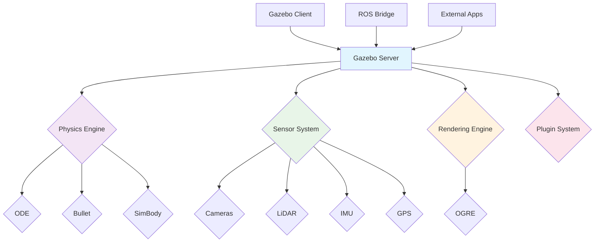

# Gazebo Overview: Physics Engine, Worlds, and Plugins

## Introduction to Gazebo

Gazebo is a 3D simulation environment that enables accurate and efficient simulation of robots in complex indoor and outdoor environments. For humanoid robotics, Gazebo provides:

- **Realistic Physics Simulation**: Accurate modeling of rigid body dynamics, contacts, and collisions
- **Sensor Simulation**: High-fidelity simulation of cameras, LiDAR, IMUs, and other sensors
- **Extensible Architecture**: Plugin system for custom sensors, controllers, and world elements
- **ROS Integration**: Seamless integration with ROS/ROS 2 through gazebo_ros_pkgs
- **Large 3D Model Database**: Access to thousands of objects and environments for simulation

## Gazebo Architecture

Gazebo follows a client-server architecture:



### Core Components

1. **Server (gzserver)**: Runs the simulation with physics, sensors, and rendering
2. **Client (gzclient)**: Provides visualization and user interface
3. **Transport System**: Message passing system for communication between components
4. **Plugin System**: Extensible architecture for custom functionality

## Physics Engine

Gazebo supports multiple physics engines, each with different strengths:

### ODE (Open Dynamics Engine)
- **Default engine** for most Gazebo installations
- **Strengths**: Stable, mature, good for ground vehicles and basic robotics
- **Weaknesses**: Can struggle with complex contacts and soft-body simulation
- **Best for**: Basic humanoid locomotion, manipulation tasks

### Bullet Physics
- **Alternative engine** with different numerical methods
- **Strengths**: Better contact stability, good for complex interactions
- **Weaknesses**: Can be slower than ODE for simple scenarios
- **Best for**: Complex contact scenarios, detailed manipulation

### SimBody
- **Stanford University's physics engine**
- **Strengths**: Highly accurate, good for biomechanical simulation
- **Weaknesses**: Less mature than ODE/Bullet
- **Best for**: Biologically-inspired robotics, detailed humanoid dynamics

### Configuring Physics in Gazebo

Physics parameters are configured in world files or through the `<physics>` tag in models:

```xml
<physics type="ode">
  <max_step_size>0.001</max_step_size>
  <real_time_factor>1</real_time_factor>
  <real_time_update_rate>1000</real_time_update_rate>
  <gravity>0 0 -9.8</gravity>
  <ode>
    <solver>
      <type>quick</type>
      <iters>10</iters>
      <sor>1.3</sor>
    </solver>
    <constraints>
      <cfm>0</cfm>
      <erp>0.2</erp>
      <contact_max_correcting_vel>100</contact_max_correcting_vel>
      <contact_surface_layer>0.001</contact_surface_layer>
    </constraints>
  </ode>
</physics>
```

## Worlds in Gazebo

Gazebo worlds define the environment where your robot operates. A world file is an XML file that includes:

1. **Environment settings** (gravity, physics engine)
2. **Models** (static and dynamic objects)
3. **Lights** (directional, point, spot)
4. **Plugins** (world-specific functionality)

### Basic World Structure

```xml
<?xml version="1.0" ?>
<sdf version="1.7">
  <world name="humanoid_world">
    <!-- Physics configuration -->
    <physics type="ode">
      <max_step_size>0.001</max_step_size>
      <real_time_factor>1</real_time_factor>
      <real_time_update_rate>1000</real_time_update_rate>
    </physics>

    <!-- Gravity -->
    <gravity>0 0 -9.8</gravity>

    <!-- Include models from Fuel database -->
    <include>
      <uri>model://ground_plane</uri>
    </include>

    <include>
      <uri>model://sun</uri>
    </include>

    <!-- Define a simple floor -->
    <model name="floor">
      <static>true</static>
      <link name="floor_link">
        <collision name="floor_collision">
          <geometry>
            <plane>
              <normal>0 0 1</normal>
              <size>10 10</size>
            </plane>
          </geometry>
        </collision>
        <visual name="floor_visual">
          <geometry>
            <plane>
              <normal>0 0 1</normal>
              <size>10 10</size>
            </plane>
          </geometry>
          <material>
            <ambient>0.7 0.7 0.7 1</ambient>
            <diffuse>0.7 0.7 0.7 1</diffuse>
            <specular>0.7 0.7 0.7 1</specular>
          </material>
        </visual>
      </link>
    </model>

    <!-- Your robot would be placed here -->
    <include>
      <uri>model://humanoid_robot</uri>
      <pose>0 0 1 0 0 0</pose>
    </include>
  </world>
</sdf>
```

### World Elements for Humanoid Robots

When creating worlds for humanoid robots, consider these elements:

#### 1. Terrain Complexity
```xml
<!-- Simple flat terrain for basic locomotion -->
<include>
  <uri>model://ground_plane</uri>
</include>

<!-- Complex terrain for advanced locomotion -->
<model name="rough_terrain">
  <link name="terrain_link">
    <collision>
      <geometry>
        <mesh>
          <uri>model://rough_terrain/meshes/terrain.dae</uri>
        </mesh>
      </geometry>
    </collision>
    <visual>
      <geometry>
        <mesh>
          <uri>model://rough_terrain/meshes/terrain.dae</uri>
        </mesh>
      </geometry>
    </visual>
  </link>
</model>
```

#### 2. Obstacles and Navigation Challenges
```xml
<!-- Furniture for household scenarios -->
<include>
  <uri>model://table</uri>
  <pose>2 0 0 0 0 0</pose>
</include>

<include>
  <uri>model://chair</uri>
  <pose>2.5 0.5 0 0 0 1.57</pose>
</include>

<!-- Doorways for navigation challenges -->
<model name="doorway">
  <pose>0 5 0 0 0 0</pose>
  <link name="left_doorpost">
    <collision><geometry><box><size>0.1 2 2</size></box></geometry></collision>
    <visual><geometry><box><size>0.1 2 2</size></box></geometry></visual>
  </link>
  <link name="right_doorpost">
    <pose>1.5 0 0 0 0 0</pose>
    <collision><geometry><box><size>0.1 2 2</size></box></geometry></collision>
    <visual><geometry><box><size>0.1 2 2</size></box></geometry></visual>
  </link>
</model>
```

## Gazebo Plugins System

Plugins are the key to extending Gazebo's functionality. For humanoid robots, you'll commonly use:

### 1. Sensor Plugins
```xml
<sensor name="camera" type="camera">
  <camera name="head_camera">
    <horizontal_fov>1.047</horizontal_fov>
    <image>
      <width>640</width>
      <height>480</height>
      <format>R8G8B8</format>
    </image>
    <clip>
      <near>0.1</near>
      <far>10</far>
    </clip>
  </camera>
  <plugin name="camera_controller" filename="libgazebo_ros_camera.so">
    <camera_name>head_camera</camera_name>
    <image_topic_name>image_raw</image_topic_name>
    <camera_info_topic_name>camera_info</camera_info_topic_name>
    <frame_name>camera_optical_frame</frame_name>
  </plugin>
</sensor>
```

### 2. Joint Control Plugins
```xml
<plugin name="joint_state_publisher" filename="libgazebo_ros_joint_state_publisher.so">
  <robot_namespace>/humanoid</robot_namespace>
  <joint_name>left_hip_joint</joint_name>
  <update_rate>30</update_rate>
</plugin>

<plugin name="joint_position_controller" filename="libgazebo_ros_joint_position.so">
  <robot_namespace>/humanoid</robot_namespace>
  <joint_name>left_knee_joint</joint_name>
  <topic>left_knee_position_controller/command</topic>
</plugin>
```

### 3. Model Control Plugins
```xml
<plugin name="model_state_publisher" filename="libgazebo_ros_model_state_publisher.so">
  <robot_namespace>/humanoid</robot_namespace>
  <update_rate>30</update_rate>
</plugin>
```

## Gazebo Simulation Concepts for Humanoid Robots

### 1. Real-Time Factor (RTF)
Real-time factor determines how fast the simulation runs compared to real-time:
- **RTF = 1**: Simulation runs at real-time speed
- **RTF > 1**: Simulation runs faster than real-time (useful for training)
- **RTF < 1**: Simulation runs slower than real-time (useful for debugging)

For humanoid robots, typical RTF values are:
- **Training/Testing**: 2-10 (for faster data collection)
- **Validation**: 1 (to match real-world timing)
- **Debugging**: 0.1-0.5 (to slow down for observation)

### 2. Time Step Size
The simulation time step affects both accuracy and performance:
- **Smaller steps**: More accurate but slower
- **Larger steps**: Faster but potentially unstable

For humanoid robots with many joints and contacts:
- **Recommended**: 0.001s (1ms) for stable simulation
- **Minimum**: 0.0001s (0.1ms) for high-precision control
- **Maximum**: 0.01s (10ms) for performance-critical applications

### 3. Contact Simulation
Humanoid robots have many contact points (feet, hands, etc.), so contact simulation is critical:

```xml
<collision name="left_foot_collision">
  <surface>
    <friction>
      <ode>
        <mu>0.8</mu>  <!-- Static friction coefficient -->
        <mu2>0.8</mu2>  <!-- Secondary friction coefficient -->
        <fdir1>0 0 1</fdir1>  <!-- Friction direction -->
      </ode>
    </friction>
    <bounce>
      <restitution_coefficient>0.1</restitution_coefficient>
      <threshold>100000</threshold>
    </bounce>
    <contact>
      <ode>
        <soft_cfm>0.0001</soft_cfm>
        <soft_erp>0.2</soft_erp>
        <kp>1e+13</kp>  <!-- Penetration stiffness -->
        <kd>1</kd>      <!-- Damping coefficient -->
        <max_vel>100.0</max_vel>
        <min_depth>0.001</min_depth>
      </ode>
    </contact>
  </surface>
</collision>
```

## Gazebo with ROS 2 Integration

The `gazebo_ros_pkgs` package provides seamless integration between Gazebo and ROS 2:

### 1. Robot State Publisher
Publishes joint states and transforms to ROS 2:
```xml
<plugin filename="libgazebo_ros_joint_state_publisher.so" name="joint_state_publisher">
  <ros>
    <namespace>/humanoid</namespace>
    <remapping>~/out:=joint_states</remapping>
  </ros>
  <update_rate>30</update_rate>
  <joint_name>left_hip_joint</joint_name>
</plugin>
```

### 2. Diff Drive Controller
For wheeled robots (can be adapted for humanoid base):
```xml
<plugin filename="libgazebo_ros_diff_drive.so" name="diff_drive">
  <ros>
    <namespace>/humanoid/base</namespace>
  </ros>
  <left_joint>left_wheel_joint</left_joint>
  <right_joint>right_wheel_joint</right_joint>
  <wheel_separation>0.3</wheel_separation>
  <wheel_diameter>0.15</wheel_diameter>
  <odom_publish_frequency>30</odom_publish_frequency>
  <topic_name>cmd_vel</topic_name>
  <frame_name>odom</frame_name>
</plugin>
```

### 3. Joint Position/Velocity/Effort Controllers
For precise joint control:
```xml
<plugin filename="libgazebo_ros_joint_position.so" name="left_hip_controller">
  <ros>
    <namespace>/humanoid</namespace>
  </ros>
  <joint_name>left_hip_joint</joint_name>
  <topic>left_hip_position/command</topic>
  <update_rate>100</update_rate>
</plugin>
```

## Best Practices for Humanoid Robot Simulation

### 1. Model Simplification
For stable simulation of humanoid robots:
- Use simplified collision geometries (boxes, cylinders, spheres)
- Keep mesh complexity reasonable for rendering
- Ensure proper scaling of inertial properties

### 2. Physics Tuning
- Start with conservative parameters and tune gradually
- Use higher update rates for joints with fast dynamics
- Balance stability with performance requirements

### 3. Sensor Configuration
- Match sensor specifications to real hardware when possible
- Consider computational costs of high-resolution sensors
- Use appropriate noise models for realistic data

### 4. World Design
- Create varied environments for robust training
- Include realistic obstacles and navigation challenges
- Consider lighting conditions for vision-based systems

## Running Gazebo with Your Humanoid Robot

### 1. Launch Gazebo with World
```bash
# Launch Gazebo with a specific world file
gz sim -r -v 4 my_humanoid_world.sdf

# Or using ROS 2 launch
ros2 launch my_robot_gazebo.launch.py
```

### 2. Spawn Your Robot
```xml
<!-- In launch file -->
<node pkg="gazebo_ros" exec="spawn_entity.py" output="screen"
      args="-entity humanoid_robot -topic robot_description -x 0 -y 0 -z 1">
</node>
```

### 3. Monitor Simulation
```bash
# Check topics
ros2 topic list | grep gazebo

# Monitor joint states
ros2 topic echo /joint_states

# Send commands to robot
ros2 topic pub /cmd_vel geometry_msgs/Twist '{linear: {x: 0.5}, angular: {z: 0.2}}'
```

## Troubleshooting Common Issues

### 1. Robot Falling Through Floor
- Check collision geometry in URDF
- Verify mass and inertial properties
- Adjust contact parameters

### 2. Unstable Joint Behavior
- Increase solver iterations
- Decrease time step size
- Check joint limits and friction parameters

### 3. Performance Issues
- Reduce model complexity
- Lower update rates for non-critical components
- Use simpler physics engine if possible

### 4. Sensor Noise
- Verify sensor plugin configuration
- Check for proper frame transformations
- Ensure adequate update rates

## Advanced Gazebo Features for Humanoid Robots

### 1. Multi-Robot Simulation
Gazebo can simulate multiple humanoid robots simultaneously:
```xml
<include>
  <uri>model://humanoid_robot_1</uri>
  <pose>0 0 1 0 0 0</pose>
</include>
<include>
  <uri>model://humanoid_robot_2</uri>
  <pose>2 0 1 0 0 0</pose>
</include>
```

### 2. Custom Controllers
Create custom plugins for specialized humanoid behaviors:
```cpp
#include <gazebo/gazebo.hh>
#include <gazebo/physics/physics.hh>
#include <gazebo/common/common.hh>

namespace gazebo
{
  class HumanoidBalancer : public ModelPlugin
  {
    public: void Load(physics::ModelPtr _model, sdf::ElementPtr _sdf)
    {
      this->model = _model;
      this->world = this->model->GetWorld();

      // Initialize balance controller
      this->updateConnection = event::Events::ConnectWorldUpdateBegin(
          std::bind(&HumanoidBalancer::OnUpdate, this));
    }

    public: void OnUpdate()
    {
      // Implement balance control logic
      // Access joint positions, IMU data, etc.
    }

    private: physics::ModelPtr model;
    private: physics::WorldPtr world;
    private: event::ConnectionPtr updateConnection;
  };

  GZ_REGISTER_MODEL_PLUGIN(HumanoidBalancer)
}
```

## Summary

Gazebo provides a powerful simulation environment for humanoid robots with realistic physics, sensor simulation, and extensible architecture. Understanding Gazebo's core concepts - physics engine, worlds, and plugins - is essential for creating effective digital twins of humanoid robots.

The key takeaways for humanoid robot simulation in Gazebo are:
- Proper physics configuration is critical for stable locomotion
- Sensor simulation must match real hardware specifications
- Plugin architecture enables custom control and sensing
- Real-time factor and time step tuning affect both accuracy and performance

## Exercises

1. Create a simple Gazebo world with a humanoid robot model and run the simulation.
2. Configure physics parameters for stable bipedal locomotion.
3. Add a camera sensor to your humanoid robot and visualize the output in RViz.
4. Create a plugin that publishes custom robot state information to ROS 2 topics.

## Next Steps

In the next chapter, we'll explore how to import your URDF models into Gazebo and set up the ROS 2 bridge for seamless integration between your robot description and the simulation environment.

Continue to Chapter 3: [Importing Humanoid URDF into Gazebo with ROS 2 Bridge](./import-urdf.md) to connect your robot model to simulation.