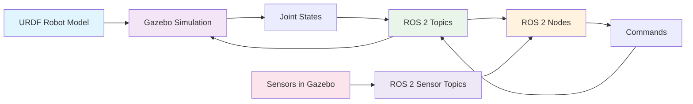

# Importing Humanoid URDF into Gazebo with ROS 2 Bridge

## Introduction

In Module 1, we learned how to create URDF (Unified Robot Description Format) models for humanoid robots. Now we'll explore how to import these models into Gazebo for physics simulation and connect them to ROS 2 for seamless integration between your robot description and the simulation environment.

This process creates the bridge between your abstract robot model and its physical simulation, enabling you to test control algorithms, validate kinematics, and simulate sensors in a realistic environment.

## Understanding the URDF-Gazebo Connection

The connection between URDF and Gazebo involves several key components:

1. **URDF Model**: Your robot description with links, joints, and visual/collision properties
2. **Gazebo Plugins**: Extensions that provide ROS 2 interfaces to the simulation
3. **ROS 2 Bridge**: Mechanisms that translate between simulation and ROS 2 messages
4. **Joint State Publisher**: Synchronization of joint states between simulation and ROS 2



## Preparing Your URDF for Gazebo

Before importing your humanoid URDF into Gazebo, you need to ensure it's properly configured with Gazebo-specific elements. These elements define how the robot behaves in the physics simulation.

### 1. Adding Gazebo-Specific Tags to URDF

```xml
<?xml version="1.0"?>
<robot name="humanoid_robot" xmlns:xacro="http://www.ros.org/wiki/xacro">

  <!-- Include Gazebo-specific elements -->
  <gazebo>
    <plugin filename="libgazebo_ros_init.so" name="gazebo_ros_init">
      <ros>
        <namespace>/humanoid</namespace>
      </ros>
    </plugin>
  </gazebo>

  <!-- Base link -->
  <link name="base_link">
    <visual>
      <geometry>
        <box size="0.2 0.2 0.1"/>
      </geometry>
      <material name="white">
        <color rgba="1 1 1 1"/>
      </material>
    </visual>
    <collision>
      <geometry>
        <box size="0.2 0.2 0.1"/>
      </geometry>
    </collision>
    <inertial>
      <mass value="10.0"/>
      <inertia ixx="1.0" ixy="0.0" ixz="0.0" iyy="1.0" iyz="0.0" izz="1.0"/>
    </inertial>
  </link>

  <!-- Hip joint -->
  <joint name="left_hip_joint" type="revolute">
    <parent link="base_link"/>
    <child link="left_thigh"/>
    <origin xyz="0 -0.1 -0.05" rpy="0 0 0"/>
    <axis xyz="0 0 1"/>
    <limit lower="-1.57" upper="1.57" effort="100" velocity="1"/>
    <dynamics damping="0.1" friction="0.01"/>
  </joint>

  <link name="left_thigh">
    <visual>
      <geometry>
        <cylinder length="0.3" radius="0.05"/>
      </geometry>
      <material name="blue">
        <color rgba="0 0 1 1"/>
      </material>
    </visual>
    <collision>
      <geometry>
        <cylinder length="0.3" radius="0.05"/>
      </geometry>
    </collision>
    <inertial>
      <mass value="2.0"/>
      <inertia ixx="0.05" ixy="0.0" ixz="0.0" iyy="0.05" iyz="0.0" izz="0.01"/>
    </inertial>
  </link>

  <!-- Gazebo-specific collision properties -->
  <gazebo reference="left_thigh">
    <material>Gazebo/Blue</material>
    <mu1>0.8</mu1>
    <mu2>0.8</mu2>
    <kp>1000000.0</kp>
    <kd>100.0</kd>
  </gazebo>

  <!-- Knee joint -->
  <joint name="left_knee_joint" type="revolute">
    <parent link="left_thigh"/>
    <child link="left_shin"/>
    <origin xyz="0 0 -0.3" rpy="0 0 0"/>
    <axis xyz="0 0 1"/>
    <limit lower="0" upper="2.35" effort="100" velocity="1"/>
    <dynamics damping="0.1" friction="0.01"/>
  </joint>

  <link name="left_shin">
    <visual>
      <geometry>
        <cylinder length="0.3" radius="0.04"/>
      </geometry>
      <material name="blue">
        <color rgba="0 0 1 1"/>
      </material>
    </visual>
    <collision>
      <geometry>
        <cylinder length="0.3" radius="0.04"/>
      </geometry>
    </collision>
    <inertial>
      <mass value="1.5"/>
      <inertia ixx="0.03" ixy="0.0" ixz="0.0" iyy="0.03" iyz="0.0" izz="0.01"/>
    </inertial>
  </link>

  <!-- Gazebo-specific properties for shin -->
  <gazebo reference="left_shin">
    <material>Gazebo/Blue</material>
    <mu1>0.8</mu1>
    <mu2>0.8</mu2>
  </gazebo>

  <!-- Transmissions for ROS 2 control -->
  <transmission name="left_hip_trans">
    <type>transmission_interface/SimpleTransmission</type>
    <joint name="left_hip_joint">
      <hardwareInterface>hardware_interface/EffortJointInterface</hardwareInterface>
    </joint>
    <actuator name="left_hip_actuator">
      <mechanicalReduction>1</mechanicalReduction>
    </actuator>
  </transmission>

  <transmission name="left_knee_trans">
    <type>transmission_interface/SimpleTransmission</type>
    <joint name="left_knee_joint">
      <hardwareInterface>hardware_interface/EffortJointInterface</hardwareInterface>
    </joint>
    <actuator name="left_knee_actuator">
      <mechanicalReduction>1</mechanicalReduction>
    </actuator>
  </transmission>

</robot>
```

### 2. Key Gazebo-Specific Elements

#### a) Material Properties
```xml
<gazebo reference="link_name">
  <material>Gazebo/ColorName</material>
</gazebo>
```

#### b) Friction and Contact Properties
```xml
<gazebo reference="link_name">
  <mu1>0.8</mu1>  <!-- Primary friction coefficient -->
  <mu2>0.8</mu2>  <!-- Secondary friction coefficient -->
  <kp>1000000.0</kp>  <!-- Spring stiffness -->
  <kd>100.0</kd>      <!-- Damping coefficient -->
</gazebo>
```

#### c) Sensor Integration
```xml
<gazebo reference="link_name">
  <sensor name="camera_sensor" type="camera">
    <pose>0.1 0 0 0 0 0</pose>
    <camera name="head_camera">
      <horizontal_fov>1.047</horizontal_fov>
      <image>
        <width>640</width>
        <height>480</height>
        <format>R8G8B8</format>
      </image>
      <clip>
        <near>0.1</near>
        <far>10</far>
      </clip>
    </camera>
    <plugin name="camera_controller" filename="libgazebo_ros_camera.so">
      <frame_name>head_camera_optical_frame</frame_name>
      <topic_name>image_raw</topic_name>
    </plugin>
  </sensor>
</gazebo>
```

## The ROS 2 Bridge Setup

### 1. Robot State Publisher Plugin

The robot state publisher plugin synchronizes joint states between Gazebo and ROS 2:

```xml
<gazebo>
  <plugin filename="libgazebo_ros_joint_state_publisher.so" name="joint_state_publisher">
    <ros>
      <namespace>/humanoid</namespace>
      <remapping>~/out:=joint_states</remapping>
    </ros>
    <update_rate>30</update_rate>
    <joint_name>left_hip_joint</joint_name>
    <joint_name>left_knee_joint</joint_name>
    <joint_name>right_hip_joint</joint_name>
    <joint_name>right_knee_joint</joint_name>
  </plugin>
</gazebo>
```

### 2. Joint Controller Plugins

For controlling joints from ROS 2, you need controller plugins:

```xml
<!-- Joint position controller -->
<gazebo>
  <plugin filename="libgazebo_ros_joint_position.so" name="left_hip_position_controller">
    <ros>
      <namespace>/humanoid</namespace>
    </ros>
    <joint_name>left_hip_joint</joint_name>
    <topic>/humanoid/left_hip_position/command</topic>
    <update_rate>100</update_rate>
  </plugin>
</gazebo>

<!-- Joint effort controller -->
<gazebo>
  <plugin filename="libgazebo_ros_joint_trajectory.so" name="joint_trajectory_controller">
    <ros>
      <namespace>/humanoid</namespace>
    </ros>
    <command_topic>joint_trajectory</command_topic>
    <state_topic>joint_trajectory/state</state_topic>
    <action_topic>joint_trajectory</action_topic>
    <action_topic_status>joint_trajectory/status</action_topic_status>
    <joint_name>left_hip_joint</joint_name>
    <joint_name>left_knee_joint</joint_name>
  </plugin>
</gazebo>
```

## Creating a Complete Humanoid URDF for Gazebo

Let's create a more complete example with a full humanoid model:

```xml
<?xml version="1.0"?>
<robot name="complete_humanoid" xmlns:xacro="http://www.ros.org/wiki/xacro">

  <!-- Include gazebo plugins -->
  <gazebo>
    <plugin filename="libgazebo_ros_factory.so" name="gazebo_ros_factory">
      <ros>
        <namespace>/humanoid</namespace>
      </ros>
    </plugin>
  </gazebo>

  <!-- Pelvis (base link) -->
  <link name="pelvis">
    <visual>
      <geometry>
        <box size="0.2 0.25 0.1"/>
      </geometry>
      <material name="white">
        <color rgba="1 1 1 1"/>
      </material>
    </visual>
    <collision>
      <geometry>
        <box size="0.2 0.25 0.1"/>
      </geometry>
    </collision>
    <inertial>
      <mass value="5.0"/>
      <inertia ixx="0.1" ixy="0.0" ixz="0.0" iyy="0.1" iyz="0.0" izz="0.1"/>
    </inertial>
  </link>

  <!-- Spine -->
  <joint name="torso_joint" type="revolute">
    <parent link="pelvis"/>
    <child link="torso"/>
    <origin xyz="0 0 0.05" rpy="0 0 0"/>
    <axis xyz="0 0 1"/>
    <limit lower="-0.5" upper="0.5" effort="100" velocity="1"/>
    <dynamics damping="0.1" friction="0.01"/>
  </joint>

  <link name="torso">
    <visual>
      <geometry>
        <box size="0.15 0.2 0.4"/>
      </geometry>
      <material name="orange">
        <color rgba="1.0 0.423529411765 0.0392156862745 1.0"/>
      </material>
    </visual>
    <collision>
      <geometry>
        <box size="0.15 0.2 0.4"/>
      </geometry>
    </collision>
    <inertial>
      <mass value="8.0"/>
      <inertia ixx="0.2" ixy="0.0" ixz="0.0" iyy="0.2" iyz="0.0" izz="0.2"/>
    </inertial>
  </link>

  <!-- Head -->
  <joint name="neck_joint" type="revolute">
    <parent link="torso"/>
    <child link="head"/>
    <origin xyz="0 0 0.4" rpy="0 0 0"/>
    <axis xyz="0 1 0"/>
    <limit lower="-0.5" upper="0.5" effort="10" velocity="1"/>
  </joint>

  <link name="head">
    <visual>
      <geometry>
        <sphere radius="0.08"/>
      </geometry>
      <material name="skin">
        <color rgba="0.870588235294 0.811764705882 0.764705882353 1.0"/>
      </material>
    </visual>
    <collision>
      <geometry>
        <sphere radius="0.08"/>
      </geometry>
    </collision>
    <inertial>
      <mass value="2.0"/>
      <inertia ixx="0.01" ixy="0.0" ixz="0.0" iyy="0.01" iyz="0.0" izz="0.01"/>
    </inertial>
  </link>

  <!-- Left Leg -->
  <joint name="left_hip_joint" type="revolute">
    <parent link="pelvis"/>
    <child link="left_thigh"/>
    <origin xyz="0 -0.125 -0.05" rpy="0 0 0"/>
    <axis xyz="0 0 1"/>
    <limit lower="-1.57" upper="1.57" effort="150" velocity="1"/>
  </joint>

  <link name="left_thigh">
    <visual>
      <geometry>
        <capsule radius="0.05" length="0.2"/>
      </geometry>
      <material name="blue">
        <color rgba="0 0 1 1"/>
      </material>
    </visual>
    <collision>
      <geometry>
        <capsule radius="0.05" length="0.2"/>
      </geometry>
    </collision>
    <inertial>
      <mass value="3.0"/>
      <inertia ixx="0.05" ixy="0.0" ixz="0.0" iyy="0.05" iyz="0.0" izz="0.01"/>
    </inertial>
  </link>

  <joint name="left_knee_joint" type="revolute">
    <parent link="left_thigh"/>
    <child link="left_shin"/>
    <origin xyz="0 0 -0.3" rpy="0 0 0"/>
    <axis xyz="0 0 1"/>
    <limit lower="0" upper="2.35" effort="150" velocity="1"/>
  </joint>

  <link name="left_shin">
    <visual>
      <geometry>
        <capsule radius="0.04" length="0.2"/>
      </geometry>
      <material name="blue">
        <color rgba="0 0 1 1"/>
      </material>
    </visual>
    <collision>
      <geometry>
        <capsule radius="0.04" length="0.2"/>
      </geometry>
    </collision>
    <inertial>
      <mass value="2.0"/>
      <inertia ixx="0.03" ixy="0.0" ixz="0.0" iyy="0.03" iyz="0.0" izz="0.01"/>
    </inertial>
  </link>

  <joint name="left_ankle_joint" type="revolute">
    <parent link="left_shin"/>
    <child link="left_foot"/>
    <origin xyz="0 0 -0.3" rpy="0 0 0"/>
    <axis xyz="0 1 0"/>
    <limit lower="-0.5" upper="0.5" effort="50" velocity="1"/>
  </joint>

  <link name="left_foot">
    <visual>
      <geometry>
        <box size="0.15 0.08 0.05"/>
      </geometry>
      <material name="grey">
        <color rgba="0.5 0.5 0.5 1.0"/>
      </material>
    </visual>
    <collision>
      <geometry>
        <box size="0.15 0.08 0.05"/>
      </geometry>
    </collision>
    <inertial>
      <mass value="1.0"/>
      <inertia ixx="0.001" ixy="0.0" ixz="0.0" iyy="0.002" iyz="0.0" izz="0.002"/>
    </inertial>
  </link>

  <!-- Right Leg (similar to left leg) -->
  <joint name="right_hip_joint" type="revolute">
    <parent link="pelvis"/>
    <child link="right_thigh"/>
    <origin xyz="0 0.125 -0.05" rpy="0 0 0"/>
    <axis xyz="0 0 1"/>
    <limit lower="-1.57" upper="1.57" effort="150" velocity="1"/>
  </joint>

  <link name="right_thigh">
    <visual>
      <geometry>
        <capsule radius="0.05" length="0.2"/>
      </geometry>
      <material name="blue">
        <color rgba="0 0 1 1"/>
      </material>
    </visual>
    <collision>
      <geometry>
        <capsule radius="0.05" length="0.2"/>
      </geometry>
    </collision>
    <inertial>
      <mass value="3.0"/>
      <inertia ixx="0.05" ixy="0.0" ixz="0.0" iyy="0.05" iyz="0.0" izz="0.01"/>
    </inertial>
  </link>

  <joint name="right_knee_joint" type="revolute">
    <parent link="right_thigh"/>
    <child link="right_shin"/>
    <origin xyz="0 0 -0.3" rpy="0 0 0"/>
    <axis xyz="0 0 1"/>
    <limit lower="0" upper="2.35" effort="150" velocity="1"/>
  </joint>

  <link name="right_shin">
    <visual>
      <geometry>
        <capsule radius="0.04" length="0.2"/>
      </geometry>
      <material name="blue">
        <color rgba="0 0 1 1"/>
      </material>
    </visual>
    <collision>
      <geometry>
        <capsule radius="0.04" length="0.2"/>
      </geometry>
    </collision>
    <inertial>
      <mass value="2.0"/>
      <inertia ixx="0.03" ixy="0.0" ixz="0.0" iyy="0.03" iyz="0.0" izz="0.01"/>
    </inertial>
  </link>

  <joint name="right_ankle_joint" type="revolute">
    <parent link="right_shin"/>
    <child link="right_foot"/>
    <origin xyz="0 0 -0.3" rpy="0 0 0"/>
    <axis xyz="0 1 0"/>
    <limit lower="-0.5" upper="0.5" effort="50" velocity="1"/>
  </joint>

  <link name="right_foot">
    <visual>
      <geometry>
        <box size="0.15 0.08 0.05"/>
      </geometry>
      <material name="grey">
        <color rgba="0.5 0.5 0.5 1.0"/>
      </material>
    </visual>
    <collision>
      <geometry>
        <box size="0.15 0.08 0.05"/>
      </geometry>
    </collision>
    <inertial>
      <mass value="1.0"/>
      <inertia ixx="0.001" ixy="0.0" ixz="0.0" iyy="0.002" iyz="0.0" izz="0.002"/>
    </inertial>
  </link>

  <!-- Left Arm -->
  <joint name="left_shoulder_joint" type="revolute">
    <parent link="torso"/>
    <child link="left_upper_arm"/>
    <origin xyz="0 -0.12 0.2" rpy="0 0 0"/>
    <axis xyz="0 1 0"/>
    <limit lower="-1.57" upper="1.57" effort="100" velocity="1"/>
  </joint>

  <link name="left_upper_arm">
    <visual>
      <geometry>
        <capsule radius="0.04" length="0.15"/>
      </geometry>
      <material name="green">
        <color rgba="0 1 0 1"/>
      </material>
    </visual>
    <collision>
      <geometry>
        <capsule radius="0.04" length="0.15"/>
      </geometry>
    </collision>
    <inertial>
      <mass value="1.5"/>
      <inertia ixx="0.01" ixy="0.0" ixz="0.0" iyy="0.01" iyz="0.0" izz="0.005"/>
    </inertial>
  </link>

  <joint name="left_elbow_joint" type="revolute">
    <parent link="left_upper_arm"/>
    <child link="left_forearm"/>
    <origin xyz="0 0 -0.2" rpy="0 0 0"/>
    <axis xyz="0 0 1"/>
    <limit lower="-2.0" upper="0.5" effort="80" velocity="1"/>
  </joint>

  <link name="left_forearm">
    <visual>
      <geometry>
        <capsule radius="0.03" length="0.1"/>
      </geometry>
      <material name="green">
        <color rgba="0 1 0 1"/>
      </material>
    </visual>
    <collision>
      <geometry>
        <capsule radius="0.03" length="0.1"/>
      </geometry>
    </collision>
    <inertial>
      <mass value="1.0"/>
      <inertia ixx="0.005" ixy="0.0" ixz="0.0" iyy="0.005" iyz="0.0" izz="0.002"/>
    </inertial>
  </link>

  <!-- Right Arm (similar to left arm) -->
  <joint name="right_shoulder_joint" type="revolute">
    <parent link="torso"/>
    <child link="right_upper_arm"/>
    <origin xyz="0 0.12 0.2" rpy="0 0 0"/>
    <axis xyz="0 1 0"/>
    <limit lower="-1.57" upper="1.57" effort="100" velocity="1"/>
  </joint>

  <link name="right_upper_arm">
    <visual>
      <geometry>
        <capsule radius="0.04" length="0.15"/>
      </geometry>
      <material name="green">
        <color rgba="0 1 0 1"/>
      </material>
    </visual>
    <collision>
      <geometry>
        <capsule radius="0.04" length="0.15"/>
      </geometry>
    </collision>
    <inertial>
      <mass value="1.5"/>
      <inertia ixx="0.01" ixy="0.0" ixz="0.0" iyy="0.01" iyz="0.0" izz="0.005"/>
    </inertial>
  </link>

  <joint name="right_elbow_joint" type="revolute">
    <parent link="right_upper_arm"/>
    <child link="right_forearm"/>
    <origin xyz="0 0 -0.2" rpy="0 0 0"/>
    <axis xyz="0 0 1"/>
    <limit lower="-2.0" upper="0.5" effort="80" velocity="1"/>
  </joint>

  <link name="right_forearm">
    <visual>
      <geometry>
        <capsule radius="0.03" length="0.1"/>
      </geometry>
      <material name="green">
        <color rgba="0 1 0 1"/>
      </material>
    </visual>
    <collision>
      <geometry>
        <capsule radius="0.03" length="0.1"/>
      </geometry>
    </collision>
    <inertial>
      <mass value="1.0"/>
      <inertia ixx="0.005" ixy="0.0" ixz="0.0" iyy="0.005" iyz="0.0" izz="0.002"/>
    </inertial>
  </link>

  <!-- Gazebo-specific properties for all links -->
  <gazebo reference="pelvis">
    <material>Gazebo/White</material>
    <mu1>0.8</mu1>
    <mu2>0.8</mu2>
  </gazebo>

  <gazebo reference="torso">
    <material>Gazebo/Orange</material>
    <mu1>0.8</mu1>
    <mu2>0.8</mu2>
  </gazebo>

  <gazebo reference="head">
    <material>Gazebo/Yellow</material>
    <mu1>0.8</mu1>
    <mu2>0.8</mu2>
  </gazebo>

  <gazebo reference="left_thigh">
    <material>Gazebo/Blue</material>
    <mu1>0.8</mu1>
    <mu2>0.8</mu2>
  </gazebo>

  <gazebo reference="left_shin">
    <material>Gazebo/Blue</material>
    <mu1>0.8</mu1>
    <mu2>0.8</mu2>
  </gazebo>

  <gazebo reference="left_foot">
    <material>Gazebo/Grey</material>
    <mu1>0.9</mu1>
    <mu2>0.9</mu2>
    <kp>1000000.0</kp>
    <kd>100.0</kd>
  </gazebo>

  <gazebo reference="right_thigh">
    <material>Gazebo/Blue</material>
    <mu1>0.8</mu1>
    <mu2>0.8</mu2>
  </gazebo>

  <gazebo reference="right_shin">
    <material>Gazebo/Blue</material>
    <mu1>0.8</mu1>
    <mu2>0.8</mu2>
  </gazebo>

  <gazebo reference="right_foot">
    <material>Gazebo/Grey</material>
    <mu1>0.9</mu1>
    <mu2>0.9</mu2>
    <kp>1000000.0</kp>
    <kd>100.0</kd>
  </gazebo>

  <gazebo reference="left_upper_arm">
    <material>Gazebo/Green</material>
    <mu1>0.8</mu1>
    <mu2>0.8</mu2>
  </gazebo>

  <gazebo reference="left_forearm">
    <material>Gazebo/Green</material>
    <mu1>0.8</mu1>
    <mu2>0.8</mu2>
  </gazebo>

  <gazebo reference="right_upper_arm">
    <material>Gazebo/Green</material>
    <mu1>0.8</mu1>
    <mu2>0.8</mu2>
  </gazebo>

  <gazebo reference="right_forearm">
    <material>Gazebo/Green</material>
    <mu1>0.8</mu1>
    <mu2>0.8</mu2>
  </gazebo>

  <!-- Transmissions for control -->
  <transmission name="left_hip_trans">
    <type>transmission_interface/SimpleTransmission</type>
    <joint name="left_hip_joint">
      <hardwareInterface>hardware_interface/EffortJointInterface</hardwareInterface>
    </joint>
    <actuator name="left_hip_motor">
      <mechanicalReduction>1</mechanicalReduction>
    </actuator>
  </transmission>

  <transmission name="left_knee_trans">
    <type>transmission_interface/SimpleTransmission</type>
    <joint name="left_knee_joint">
      <hardwareInterface>hardware_interface/EffortJointInterface</hardwareInterface>
    </joint>
    <actuator name="left_knee_motor">
      <mechanicalReduction>1</mechanicalReduction>
    </actuator>
  </transmission>

  <transmission name="left_ankle_trans">
    <type>transmission_interface/SimpleTransmission</type>
    <joint name="left_ankle_joint">
      <hardwareInterface>hardware_interface/EffortJointInterface</hardwareInterface>
    </joint>
    <actuator name="left_ankle_motor">
      <mechanicalReduction>1</mechanicalReduction>
    </actuator>
  </transmission>

  <transmission name="right_hip_trans">
    <type>transmission_interface/SimpleTransmission</type>
    <joint name="right_hip_joint">
      <hardwareInterface>hardware_interface/EffortJointInterface</hardwareInterface>
    </joint>
    <actuator name="right_hip_motor">
      <mechanicalReduction>1</mechanicalReduction>
    </actuator>
  </transmission>

  <transmission name="right_knee_trans">
    <type>transmission_interface/SimpleTransmission</type>
    <joint name="right_knee_joint">
      <hardwareInterface>hardware_interface/EffortJointInterface</hardwareInterface>
    </joint>
    <actuator name="right_knee_motor">
      <mechanicalReduction>1</mechanicalReduction>
    </actuator>
  </transmission>

  <transmission name="right_ankle_trans">
    <type>transmission_interface/SimpleTransmission</type>
    <joint name="right_ankle_joint">
      <hardwareInterface>hardware_interface/EffortJointInterface</hardwareInterface>
    </joint>
    <actuator name="right_ankle_motor">
      <mechanicalReduction>1</mechanicalReduction>
    </actuator>
  </transmission>

  <!-- Arm transmissions -->
  <transmission name="left_shoulder_trans">
    <type>transmission_interface/SimpleTransmission</type>
    <joint name="left_shoulder_joint">
      <hardwareInterface>hardware_interface/EffortJointInterface</hardwareInterface>
    </joint>
    <actuator name="left_shoulder_motor">
      <mechanicalReduction>1</mechanicalReduction>
    </actuator>
  </transmission>

  <transmission name="left_elbow_trans">
    <type>transmission_interface/SimpleTransmission</type>
    <joint name="left_elbow_joint">
      <hardwareInterface>hardware_interface/EffortJointInterface</hardwareInterface>
    </joint>
    <actuator name="left_elbow_motor">
      <mechanicalReduction>1</mechanicalReduction>
    </actuator>
  </transmission>

  <transmission name="right_shoulder_trans">
    <type>transmission_interface/SimpleTransmission</type>
    <joint name="right_shoulder_joint">
      <hardwareInterface>hardware_interface/EffortJointInterface</hardwareInterface>
    </joint>
    <actuator name="right_shoulder_motor">
      <mechanicalReduction>1</mechanicalReduction>
    </actuator>
  </transmission>

  <transmission name="right_elbow_trans">
    <type>transmission_interface/SimpleTransmission</type>
    <joint name="right_elbow_joint">
      <hardwareInterface>hardware_interface/EffortJointInterface</hardwareInterface>
    </joint>
    <actuator name="right_elbow_motor">
      <mechanicalReduction>1</mechanicalReduction>
    </actuator>
  </transmission>

  <!-- Robot state publisher plugin -->
  <gazebo>
    <plugin filename="libgazebo_ros_joint_state_publisher.so" name="joint_state_publisher">
      <ros>
        <namespace>/humanoid</namespace>
        <remapping>~/out:=joint_states</remapping>
      </ros>
      <update_rate>30</update_rate>
    </plugin>
  </gazebo>

  <!-- Gazebo ROS control plugin -->
  <gazebo>
    <plugin filename="libgazebo_ros_control.so" name="gazebo_ros_control">
      <robotNamespace>/humanoid</robotNamespace>
      <robotSimType>gazebo_ros_control/DefaultRobotHWSim</robotSimType>
    </plugin>
  </gazebo>

</robot>
```

## Launching Your URDF in Gazebo

### 1. Creating a Launch File

```python
# launch/humanoid_gazebo.launch.py
from launch import LaunchDescription
from launch.actions import DeclareLaunchArgument, IncludeLaunchDescription, TimerAction
from launch.launch_description_sources import PythonLaunchDescriptionSource
from launch.substitutions import LaunchConfiguration, PathJoinSubstitution
from launch_ros.actions import Node
from launch_ros.substitutions import FindPackageShare
from launch.substitutions import Command

def generate_launch_description():
    # Declare launch arguments
    declare_model_path = DeclareLaunchArgument(
        'model',
        default_value=PathJoinSubstitution([
            FindPackageShare('humanoid_description'),
            'urdf',
            'humanoid.urdf.xacro'
        ]),
        description='Path to robot urdf file'
    )

    declare_world_path = DeclareLaunchArgument(
        'world',
        default_value=PathJoinSubstitution([
            FindPackageShare('humanoid_gazebo'),
            'worlds',
            'simple_room.world'
        ]),
        description='Path to world file'
    )

    declare_use_sim_time = DeclareLaunchArgument(
        'use_sim_time',
        default_value='true',
        description='Use simulation time'
    )

    # Start Gazebo with world
    start_gazebo_server = IncludeLaunchDescription(
        PythonLaunchDescriptionSource([
            PathJoinSubstitution([
                FindPackageShare('gazebo_ros'),
                'launch',
                'gzserver.launch.py'
            ])
        ]),
        launch_arguments={
            'world': LaunchConfiguration('world'),
            'verbose': 'true',
        }.items()
    )

    start_gazebo_client = IncludeLaunchDescription(
        PythonLaunchDescriptionSource([
            PathJoinSubstitution([
                FindPackageShare('gazebo_ros'),
                'launch',
                'gzclient.launch.py'
            ])
        ])
    )

    # Robot State Publisher
    robot_state_publisher = Node(
        package='robot_state_publisher',
        executable='robot_state_publisher',
        name='robot_state_publisher',
        parameters=[
            {'use_sim_time': LaunchConfiguration('use_sim_time')},
            {'robot_description': Command([
                'xacro ',
                LaunchConfiguration('model')
            ])}
        ],
        output='screen'
    )

    # Spawn the robot in Gazebo after a delay to ensure Gazebo is ready
    spawn_entity = Node(
        package='gazebo_ros',
        executable='spawn_entity.py',
        arguments=[
            '-topic', 'robot_description',
            '-entity', 'humanoid_robot',
            '-x', '0', '-y', '0', '-z', '1.0'
        ],
        output='screen'
    )

    # Delay spawning the robot after Gazebo starts
    delayed_spawn_entity = TimerAction(
        period=5.0,
        actions=[spawn_entity]
    )

    return LaunchDescription([
        declare_model_path,
        declare_world_path,
        declare_use_sim_time,
        start_gazebo_server,
        start_gazebo_client,
        robot_state_publisher,
        delayed_spawn_entity
    ])
```

### 2. World File for Humanoid Robot

```xml
<!-- worlds/simple_room.world -->
<?xml version="1.0" ?>
<sdf version="1.7">
  <world name="simple_room">
    <!-- Physics -->
    <physics type="ode">
      <max_step_size>0.001</max_step_size>
      <real_time_factor>1</real_time_factor>
      <real_time_update_rate>1000</real_time_update_rate>
      <gravity>0 0 -9.8</gravity>
    </physics>

    <!-- Ground plane -->
    <include>
      <uri>model://ground_plane</uri>
    </include>

    <!-- Sun -->
    <include>
      <uri>model://sun</uri>
    </include>

    <!-- Simple room environment -->
    <model name="room_walls">
      <static>true</static>
      <link name="wall_1">
        <pose>5 0 2.5 0 0 0</pose>
        <collision name="collision">
          <geometry>
            <box>
              <size>0.1 10 5</size>
            </box>
          </geometry>
        </collision>
        <visual name="visual">
          <geometry>
            <box>
              <size>0.1 10 5</size>
            </box>
          </geometry>
          <material>
            <ambient>0.8 0.8 0.8 1</ambient>
            <diffuse>0.8 0.8 0.8 1</diffuse>
          </material>
        </visual>
      </link>
      <link name="wall_2">
        <pose>-5 0 2.5 0 0 0</pose>
        <collision name="collision">
          <geometry>
            <box>
              <size>0.1 10 5</size>
            </box>
          </geometry>
        </collision>
        <visual name="visual">
          <geometry>
            <box>
              <size>0.1 10 5</size>
            </box>
          </geometry>
          <material>
            <ambient>0.8 0.8 0.8 1</ambient>
            <diffuse>0.8 0.8 0.8 1</diffuse>
          </material>
        </visual>
      </link>
      <link name="wall_3">
        <pose>0 5 2.5 0 0 1.5707</pose>
        <collision name="collision">
          <geometry>
            <box>
              <size>0.1 10 5</size>
            </box>
          </geometry>
        </collision>
        <visual name="visual">
          <geometry>
            <box>
              <size>0.1 10 5</size>
            </box>
          </geometry>
          <material>
            <ambient>0.8 0.8 0.8 1</ambient>
            <diffuse>0.8 0.8 0.8 1</diffuse>
          </material>
        </visual>
      </link>
      <link name="wall_4">
        <pose>0 -5 2.5 0 0 1.5707</pose>
        <collision name="collision">
          <geometry>
            <box>
              <size>0.1 10 5</size>
            </box>
          </geometry>
        </collision>
        <visual name="visual">
          <geometry>
            <box>
              <size>0.1 10 5</size>
            </box>
          </geometry>
          <material>
            <ambient>0.8 0.8 0.8 1</ambient>
            <diffuse>0.8 0.8 0.8 1</diffuse>
          </material>
        </visual>
      </link>
    </model>

    <!-- Furniture -->
    <model name="table">
      <pose>2 0 0.4 0 0 0</pose>
      <link name="table_top">
        <collision name="collision">
          <geometry>
            <box>
              <size>1.2 0.8 0.05</size>
            </box>
          </geometry>
        </collision>
        <visual name="visual">
          <geometry>
            <box>
              <size>1.2 0.8 0.05</size>
            </box>
          </geometry>
          <material>
            <ambient>0.5 0.3 0.1 1</ambient>
            <diffuse>0.5 0.3 0.1 1</diffuse>
          </material>
        </visual>
        <inertial>
          <mass>10</mass>
          <inertia ixx="1" ixy="0" ixz="0" iyy="1" iyz="0" izz="1"/>
        </inertial>
      </link>
      <link name="leg_1">
        <pose>0.5 0.3 -0.4 0 0 0</pose>
        <collision name="collision">
          <geometry>
            <box>
              <size>0.05 0.05 0.8</size>
            </box>
          </geometry>
        </collision>
        <visual name="visual">
          <geometry>
            <box>
              <size>0.05 0.05 0.8</size>
            </box>
          </geometry>
          <material>
            <ambient>0.5 0.3 0.1 1</ambient>
            <diffuse>0.5 0.3 0.1 1</diffuse>
          </material>
        </visual>
        <inertial>
          <mass>2</mass>
          <inertia ixx="1" ixy="0" ixz="0" iyy="1" iyz="0" izz="1"/>
        </inertial>
      </link>
      <link name="leg_2">
        <pose>-0.5 0.3 -0.4 0 0 0</pose>
        <collision name="collision">
          <geometry>
            <box>
              <size>0.05 0.05 0.8</size>
            </box>
          </geometry>
        </collision>
        <visual name="visual">
          <geometry>
            <box>
              <size>0.05 0.05 0.8</size>
            </box>
          </geometry>
          <material>
            <ambient>0.5 0.3 0.1 1</ambient>
            <diffuse>0.5 0.3 0.1 1</diffuse>
          </material>
        </visual>
        <inertial>
          <mass>2</mass>
          <inertia ixx="1" ixy="0" ixz="0" iyy="1" iyz="0" izz="1"/>
        </inertial>
      </link>
      <link name="leg_3">
        <pose>0.5 -0.3 -0.4 0 0 0</pose>
        <collision name="collision">
          <geometry>
            <box>
              <size>0.05 0.05 0.8</size>
            </box>
          </geometry>
        </collision>
        <visual name="visual">
          <geometry>
            <box>
              <size>0.05 0.05 0.8</size>
            </box>
          </geometry>
          <material>
            <ambient>0.5 0.3 0.1 1</ambient>
            <diffuse>0.5 0.3 0.1 1</diffuse>
          </material>
        </visual>
        <inertial>
          <mass>2</mass>
          <inertia ixx="1" ixy="0" ixz="0" iyy="1" iyz="0" izz="1"/>
        </inertial>
      </link>
      <link name="leg_4">
        <pose>-0.5 -0.3 -0.4 0 0 0</pose>
        <collision name="collision">
          <geometry>
            <box>
              <size>0.05 0.05 0.8</size>
            </box>
          </geometry>
        </collision>
        <visual name="visual">
          <geometry>
            <box>
              <size>0.05 0.05 0.8</size>
            </box>
          </geometry>
          <material>
            <ambient>0.5 0.3 0.1 1</ambient>
            <diffuse>0.5 0.3 0.1 1</diffuse>
          </material>
        </visual>
        <inertial>
          <mass>2</mass>
          <inertia ixx="1" ixy="0" ixz="0" iyy="1" iyz="0" izz="1"/>
        </inertial>
      </link>
      <joint name="top_to_leg1" type="fixed">
        <parent>table_top</parent>
        <child>leg_1</child>
      </joint>
      <joint name="top_to_leg2" type="fixed">
        <parent>table_top</parent>
        <child>leg_2</child>
      </joint>
      <joint name="top_to_leg3" type="fixed">
        <parent>table_top</parent>
        <child>leg_3</child>
      </joint>
      <joint name="top_to_leg4" type="fixed">
        <parent>table_top</parent>
        <child>leg_4</child>
      </joint>
    </model>
  </world>
</sdf>
```

## Testing Your URDF in Gazebo

### 1. Basic Testing Commands

```bash
# Test URDF syntax
check_urdf /path/to/your/humanoid.urdf

# Convert URDF to graph for visualization
urdf_to_graphiz /path/to/your/humanoid.urdf

# Launch Gazebo with your robot
ros2 launch your_package humanoid_gazebo.launch.py

# Check joint states
ros2 topic echo /joint_states

# Check TF tree
ros2 run tf2_tools view_frames
```

### 2. Troubleshooting Common Issues

#### Robot Falls Through Floor
1. Check inertial properties in URDF
2. Verify mass values are positive and reasonable
3. Check collision geometries match visual geometries

#### Joints Behaving Unexpectedly
1. Verify joint limits are appropriate
2. Check joint axes orientations
3. Ensure proper parent-child relationships

#### Poor Simulation Performance
1. Simplify collision geometries
2. Reduce update rates for non-critical components
3. Check physics parameters in world file

## Advanced Gazebo Features for Humanoid Robots

### 1. Custom Controllers for Humanoid Locomotion

```cpp
// Custom controller for humanoid balance
#include <gazebo/gazebo.hh>
#include <gazebo/physics/physics.hh>
#include <gazebo/common/common.hh>
#include <ignition/math/Pose3.hh>

namespace gazebo
{
  class HumanoidBalancer : public ModelPlugin
  {
    public: void Load(physics::ModelPtr _model, sdf::ElementPtr _sdf)
    {
      this->model = _model;
      this->world = this->model->GetWorld();

      // Get joints
      this->leftHipJoint = this->model->GetJoint("left_hip_joint");
      this->rightHipJoint = this->model->GetJoint("right_hip_joint");
      this->leftKneeJoint = this->model->GetJoint("left_knee_joint");
      this->rightKneeJoint = this->model->GetJoint("right_knee_joint");

      // Listen to the update event. This event is broadcast every
      // simulation iteration.
      this->updateConnection = event::Events::ConnectWorldUpdateBegin(
          std::bind(&HumanoidBalancer::OnUpdate, this));
    }

    public: void OnUpdate()
    {
      // Simple balance controller
      double currentTime = this->world->SimTime().Double();

      // Oscillating gait pattern
      double leftHipPos = 0.2 * sin(currentTime);
      double rightHipPos = 0.2 * sin(currentTime + M_PI);
      double leftKneePos = 0.1 * sin(currentTime);
      double rightKneePos = 0.1 * sin(currentTime + M_PI);

      if (this->leftHipJoint) this->leftHipJoint->SetPosition(0, leftHipPos);
      if (this->rightHipJoint) this->rightHipJoint->SetPosition(0, rightHipPos);
      if (this->leftKneeJoint) this->leftKneeJoint->SetPosition(0, leftKneePos);
      if (this->rightKneeJoint) this->rightKneeJoint->SetPosition(0, rightKneePos);
    }

    private: physics::ModelPtr model;
    private: physics::WorldPtr world;
    private: physics::JointPtr leftHipJoint;
    private: physics::JointPtr rightHipJoint;
    private: physics::JointPtr leftKneeJoint;
    private: physics::JointPtr rightKneeJoint;
    private: event::ConnectionPtr updateConnection;
  };

  GZ_REGISTER_MODEL_PLUGIN(HumanoidBalancer)
}
```

### 2. Sensor Integration

For humanoid robots, you'll often want to add sensors:

```xml
<!-- Add to head link -->
<gazebo reference="head">
  <sensor name="head_camera" type="camera">
    <pose>0.05 0 0 0 0 0</pose>
    <camera name="head_camera">
      <horizontal_fov>1.047</horizontal_fov>
      <image>
        <width>640</width>
        <height>480</height>
        <format>R8G8B8</format>
      </image>
      <clip>
        <near>0.1</near>
        <far>10</far>
      </clip>
    </camera>
    <plugin name="camera_controller" filename="libgazebo_ros_camera.so">
      <frame_name>head_camera_optical_frame</frame_name>
      <topic_name>head_camera/image_raw</topic_name>
      <camera_info_topic_name>head_camera/camera_info</camera_info_topic_name>
    </plugin>
  </sensor>

  <sensor name="head_imu" type="imu">
    <always_on>true</always_on>
    <update_rate>100</update_rate>
    <pose>0 0 0.05 0 0 0</pose>
    <plugin name="imu_plugin" filename="libgazebo_ros_imu.so">
      <ros>
        <namespace>/humanoid</namespace>
        <remapping>~/out:=imu/data</remapping>
      </ros>
      <frame_name>head_imu_frame</frame_name>
    </plugin>
  </sensor>
</gazebo>
```

## Best Practices for URDF-Gazebo Integration

### 1. Collision Geometry Optimization
- Use simple shapes (boxes, cylinders, spheres) for collision
- Create compound collision geometries for complex shapes
- Balance accuracy with performance

### 2. Inertial Properties
- Use realistic mass and inertia values
- Calculate inertias properly for each link
- Verify center of mass is correctly positioned

### 3. Joint Configuration
- Set appropriate limits based on mechanical constraints
- Use proper damping and friction values
- Consider joint safety limits for simulation

### 4. Material Properties
- Use appropriate friction coefficients for different surfaces
- Set stiffness and damping values for realistic contact
- Consider environmental factors (indoor vs outdoor)

## Validation and Testing

### 1. URDF Validation
```bash
# Check URDF syntax
check_urdf humanoid.urdf

# Visualize kinematic tree
urdf_to_graphiz humanoid.urdf
evince humanoid.pdf  # or open the generated PDF
```

### 2. Gazebo Simulation Testing
```bash
# Test in Gazebo
gz sim -r -v 4 your_world.sdf

# Monitor ROS 2 topics
ros2 topic list | grep -E "(joint|tf|sensor)"
ros2 topic echo /joint_states
```

### 3. Robot State Validation
```python
# Test that joint states are being published correctly
import rclpy
from sensor_msgs.msg import JointState

def validate_joint_states():
    rclpy.init()
    node = rclpy.create_node('joint_validator')

    def callback(msg):
        print(f"Received {len(msg.name)} joints: {msg.name}")
        print(f"Positions: {msg.position}")

    sub = node.create_subscription(JointState, '/joint_states', callback, 10)

    rclpy.spin_once(node, timeout_sec=1.0)
    node.destroy_node()
    rclpy.shutdown()
```

## Summary

Importing your URDF model into Gazebo with proper ROS 2 bridge setup is a critical step in creating a digital twin for your humanoid robot. This process connects your abstract robot description with a physics-enabled simulation environment, allowing you to:

1. Test control algorithms in a safe virtual environment
2. Validate kinematic and dynamic properties
3. Simulate sensors and perception systems
4. Develop and debug complex robotic behaviors

The key components for successful URDF-Gazebo integration are:
- Proper Gazebo-specific tags in your URDF
- Appropriate physics parameters for realistic simulation
- Correct ROS 2 bridge plugins for communication
- Well-structured launch files for system orchestration

With your robot successfully imported into Gazebo, you're now ready to enhance it with physics simulation and sensor integration, which we'll explore in the next chapters.

## Exercises

1. Create a URDF model of a simple humanoid robot with at least 12 joints and import it into Gazebo.

2. Add realistic inertial properties to your robot model and test its stability in simulation.

3. Implement a custom Gazebo plugin that controls a simple walking gait for your humanoid robot.

4. Add multiple sensors (camera, IMU, LiDAR) to your robot and verify they publish data to ROS 2 topics.

5. Create a launch file that starts Gazebo with your humanoid robot and opens RViz for visualization.

## Next Steps

In the next chapter, we'll explore how to configure physics properties in Gazebo to make your humanoid robot simulation more realistic, including gravity, friction, collisions, and mass properties that affect how your robot behaves in the virtual environment.

Continue to Chapter 4: [Physics Simulation: Gravity, Friction, Collisions, and Inertia](./physics-simulation.md) to learn about realistic physics configuration for humanoid robots.