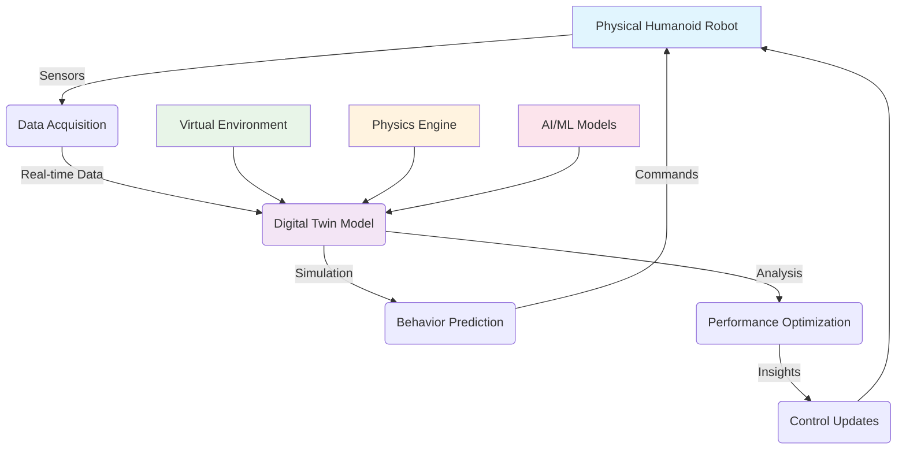

# Introduction to Digital Twins for Humanoid Robots

## What is a Digital Twin?

A **digital twin** is a virtual replica of a physical system that spans its lifecycle, is updated from real-time data, and uses simulation, machine learning, and reasoning to help make decisions. In the context of humanoid robotics, a digital twin serves as a complete virtual representation of a physical humanoid robot, enabling:

- **Simulation**: Testing robot behaviors in a safe, virtual environment
- **Validation**: Verifying control algorithms before deployment on real hardware
- **Optimization**: Improving robot performance through virtual experimentation
- **Training**: Generating synthetic data for AI model development
- **Monitoring**: Tracking and predicting robot behavior and maintenance needs

## The Digital Twin in Robotics

For humanoid robots, digital twins are especially valuable because:

1. **Complexity**: Humanoid robots have many degrees of freedom and complex kinematic chains
2. **Safety**: Testing in simulation prevents damage to expensive hardware
3. **Cost**: Simulation is significantly cheaper than real-world testing
4. **Repeatability**: Experiments can be repeated exactly under identical conditions
5. **Acceleration**: Time can be accelerated in simulation to test long-term behaviors

### Digital Twin Architecture for Humanoid Robots

## Why Digital Twins Matter for Humanoid Robots

Humanoid robots present unique challenges that make digital twins particularly valuable:

### 1. **Complex Kinematics**
Humanoid robots typically have 20+ joints with complex interdependencies. A digital twin allows you to:
- Visualize complex movement patterns
- Test inverse kinematics solutions
- Validate joint limit constraints
- Optimize movement trajectories

### 2. **Dynamic Balance**
Maintaining balance in bipedal locomotion is challenging. Digital twins enable:
- Center of mass analysis
- Stability margin calculations
- Gait pattern optimization
- Fall prevention algorithm testing

### 3. **Multi-Sensor Fusion**
Humanoid robots integrate multiple sensor types:
- Vision systems (cameras, LiDAR)
- Inertial measurement units (IMUs)
- Force/torque sensors
- Proprioceptive sensors (joint encoders)

A digital twin allows you to simulate all these sensors simultaneously and test fusion algorithms.

### 4. **Human-Robot Interaction**
Digital twins enable safe testing of human-robot interaction scenarios:
- Proximity detection
- Gesture recognition
- Collision avoidance
- Social behavior validation

## Digital Twin Technologies for Robotics

There are several technologies used for creating digital twins in robotics:

### Gazebo
- **Strengths**: Physics-accurate simulation, ROS integration, sensor simulation
- **Best for**: Dynamics validation, sensor simulation, control algorithm testing
- **Use case**: Simulating robot-environment interactions with realistic physics

### NVIDIA Isaac Sim
- **Strengths**: Photorealistic rendering, synthetic data generation, AI training
- **Best for**: Computer vision training, perception pipeline validation
- **Use case**: Generating training data for vision-based AI systems

### Unity
- **Strengths**: High-quality graphics, user interaction, cross-platform deployment
- **Best for**: Visualization, human-robot interaction, training environments
- **Use case**: Creating engaging interfaces for robot monitoring and control

## The Digital Twin Pipeline

For humanoid robotics, a typical digital twin pipeline includes:

1. **Model Creation**: Creating accurate 3D models of the physical robot
2. **Physics Configuration**: Setting up realistic physical properties
3. **Sensor Simulation**: Implementing virtual sensors that match physical counterparts
4. **Environment Design**: Creating virtual environments that mirror real-world scenarios
5. **Integration**: Connecting the digital twin to ROS 2 for real-time updates
6. **Calibration**: Ensuring the virtual model accurately reflects the physical robot
7. **Validation**: Testing that the digital twin behaves similarly to the physical robot

## Learning Objectives

By the end of this module, you will:

1. Understand the principles of digital twin technology in robotics
2. Create realistic humanoid robot models for simulation
3. Configure physics properties for accurate simulation
4. Simulate various sensor types (LiDAR, cameras, IMUs)
5. Connect simulation environments to ROS 2
6. Build high-fidelity visualization environments in Unity
7. Implement ROS-Unity communication
8. Create a complete digital twin of a humanoid robot

## Prerequisites

Before starting this module, you should have:

- Completed Module 1 (ROS 2 fundamentals)
- Basic understanding of 3D modeling concepts
- Familiarity with physics simulation concepts
- Experience with URDF from Module 1

## Module Structure

This module is organized as follows:

1. **Introduction** (this chapter) - Overview of digital twin concepts
2. **Gazebo Overview** - Physics engine, worlds, and plugins
3. **URDF Import to Gazebo** - Bringing your robot models into simulation
4. **Physics Simulation** - Configuring realistic physics properties
5. **Environment Building** - Creating virtual worlds for your robot
6. **Sensor Simulation** - Implementing virtual sensors
7. **ROS Integration** - Connecting simulation to ROS 2
8. **Unity Introduction** - High-fidelity visualization
9. **Unity Scene Creation** - Building interactive environments
10. **ROS-Unity Bridge** - Connecting systems together
11. **Digital Twin Project** - Complete integration project
12. **Summary** - Review and next steps

## Real-World Applications

Digital twins for humanoid robots are used in various applications:

- **Manufacturing**: Testing collaborative robots that work alongside humans
- **Healthcare**: Developing assistive robots for elderly care
- **Research**: Validating new control algorithms and AI systems
- **Entertainment**: Creating interactive humanoid characters
- **Disaster Response**: Testing robots for hazardous environments
- **Space Exploration**: Validating robots for extraterrestrial missions

## Challenges and Considerations

Creating effective digital twins for humanoid robots comes with challenges:

1. **Model Fidelity**: Balancing accuracy with computational efficiency
2. **Reality Gap**: Differences between simulation and reality
3. **Computational Requirements**: High-performance computing needs
4. **Calibration**: Keeping virtual and physical systems synchronized
5. **Validation**: Ensuring the digital twin accurately represents the physical robot

## Getting Started

In the next chapter, we'll explore Gazebo in detail - the physics simulation engine that will serve as the foundation for our digital twin. We'll learn how to:

- Install and configure Gazebo for humanoid robotics
- Understand the physics engine and its capabilities
- Work with Gazebo worlds, models, and plugins
- Connect Gazebo to ROS 2 for seamless integration

Let's begin by diving into the Gazebo simulation environment and understanding how it can serve as the physics backbone of our humanoid robot digital twin.

Continue to Chapter 2: [Gazebo Overview: Physics Engine, Worlds, and Plugins](./gazebo-overview.md) to start building your digital twin foundation.