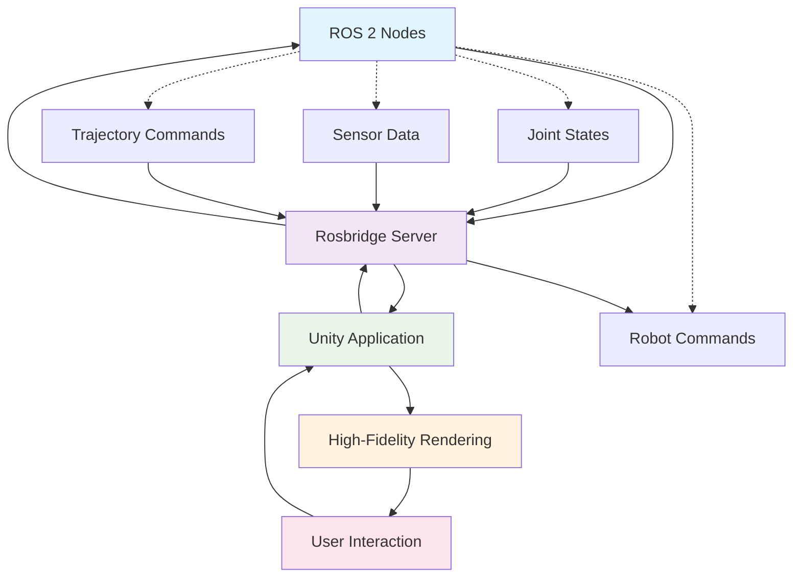

# ROS-Unity Bridge Communication

## Introduction

The ROS-Unity bridge is a critical component for creating comprehensive digital twins of humanoid robots. While Gazebo provides accurate physics simulation, Unity offers high-fidelity visualization and immersive interaction capabilities. The ROS-Unity bridge enables bidirectional communication between these systems, allowing real-time synchronization of robot states between simulation and visualization environments.

This chapter covers:
- **Understanding the ROS-Unity bridge architecture**
- **Setting up rosbridge for Unity communication**
- **Synchronizing robot states between ROS and Unity**
- **Implementing bidirectional control**
- **Optimizing data transfer for real-time performance**
- **Troubleshooting common integration issues**

For humanoid robots with complex kinematic chains and many degrees of freedom, the ROS-Unity bridge enables:
- **Real-time visualization** of complex movements and interactions
- **Immersive teleoperation** interfaces using VR/AR
- **Enhanced debugging** with 3D visualization of internal states
- **Human-robot interaction** studies in realistic environments
- **Presentation and demonstration** of robot capabilities

## ROS-Unity Bridge Architecture

### 1. Communication Layer Overview



### 2. Bridge Components

The ROS-Unity bridge consists of several key components:

1. **Rosbridge Server**: WebSocket-based communication server that translates between ROS and JSON
2. **Unity Rosbridge Client**: Library that handles JSON messages and converts them to Unity operations
3. **Message Handlers**: Custom handlers for different ROS message types
4. **Synchronization System**: Maintains consistency between ROS and Unity states

## Setting Up Rosbridge

### 1. Installing Rosbridge Suite

```bash
# Install rosbridge for ROS 2 Humble
sudo apt update
sudo apt install ros-humble-rosbridge-suite

# Or install specific components
sudo apt install ros-humble-rosbridge-library ros-humble-rosbridge-server ros-humble-web-video-server
```

### 2. Launching Rosbridge Server

```xml
<!-- launch/rosbridge_server.launch.xml -->
<launch>
  <!-- Rosbridge WebSocket server -->
  <node pkg="rosbridge_server" exec="rosbridge_websocket" name="rosbridge_websocket" output="screen">
    <param name="port" value="9090"/>
    <param name="address" value="0.0.0.0"/>
    <param name="authenticate" value="False"/>
    <param name="ssl" value="False"/>
    <param name="certfile" value=""/>
    <param name="keyfile" value=""/>
    <param name="client_id" value="None"/>
    <param name="retry_startup_delay" value="5.0"/>
    <param name="fragment_timeout" value="600"/>
    <param name="delay_between_messages" value="0"/>
    <param name="max_message_size" value="None"/>
    <param name="unregister_timeout" value="10"/>
    <param name="topics_glob" value="[*]"/>
    <param name="services_glob" value="[*]"/>
    <param name="params_glob" value="[*]"/>
    <param name="bson_only_mode" value="False"/>
  </node>

  <!-- Rosbridge TCP server (alternative to WebSocket) -->
  <node pkg="rosbridge_server" exec="rosbridge_tcp" name="rosbridge_tcp" output="screen">
    <param name="port" value="9091"/>
  </node>
</launch>
```

### 3. Testing Rosbridge Connection

```bash
# Test WebSocket connection
wscat -c ws://localhost:9090

# Test basic ROS communication
ros2 topic list
ros2 service list
```

## Unity Rosbridge Integration

### 1. Installing Unity Rosbridge Package

First, add the Unity Rosbridge client to your Unity project:

```json
// In Packages/manifest.json
{
  "dependencies": {
    "com.unity.robotics.ros-bridge": "https://github.com/Unity-Technologies/ROS-TCP-Connector.git?path=/com.unity.robotics.ros-bridge#main",
    "com.unity.robotics.urdf-importer": "https://github.com/Unity-Technologies/URDF-Importer.git?path=/com.unity.robotics.urdf-importer#main",
    ...
  },
  "scopedRegistries": [
    {
      "name": "Unity NuGet",
      "url": "https://unitynuget-registry.azurewebsites.net",
      "scopes": [
        "org.nuget"
      ]
    }
  ]
}
```

### 2. Basic Rosbridge Connection in Unity

```csharp
using System.Collections;
using UnityEngine;
using Unity.Robotics.ROSTCPConnector;
using Unity.Robotics.ROSTCPConnector.MessageGeneration;
using RosMessageTypes.Std;

public class RosbridgeConnection : MonoBehaviour
{
    [Header("ROS Connection Settings")]
    public string rosIpAddress = "127.0.0.1";
    public int rosPort = 9090;
    public bool autoConnect = true;

    [Header("Robot Configuration")]
    public string robotNamespace = "/humanoid";
    public string robotName = "humanoid_robot";

    private ROSConnection ros;
    private bool isConnected = false;

    void Start()
    {
        if (autoConnect)
        {
            ConnectToRos();
        }
    }

    public void ConnectToRos()
    {
        // Get or create ROS connection
        ros = ROSConnection.GetOrCreateInstance();
        ros.Initialize(rosIpAddress, rosPort);

        // Register topics and services
        RegisterTopics();

        StartCoroutine(ConnectionMonitor());
    }

    void RegisterTopics()
    {
        // Subscribe to joint states
        ros.Subscribe<sensor_msgs.JointStateMsg>(
            $"{robotNamespace}/joint_states",
            OnJointStateReceived
        );

        // Subscribe to robot state
        ros.Subscribe<nav_msgs.OdometryMsg>(
            $"{robotNamespace}/odom",
            OnOdometryReceived
        );

        // Subscribe to IMU data
        ros.Subscribe<sensor_msgs.ImuMsg>(
            $"{robotNamespace}/imu/data",
            OnImuReceived
        );

        // Subscribe to camera info
        ros.Subscribe<sensor_msgs.CameraInfoMsg>(
            $"{robotNamespace}/camera/rgb/camera_info",
            OnCameraInfoReceived
        );
    }

    void OnJointStateReceived(sensor_msgs.JointStateMsg jointState)
    {
        // Process joint state message
        if (jointState.name.Count == jointState.position.Count)
        {
            for (int i = 0; i < jointState.name.Count; i++)
            {
                string jointName = jointState.name[i];
                double position = jointState.position[i];

                // Update Unity robot model with joint position
                UpdateRobotJoint(jointName, (float)position);
            }
        }
    }

    void OnOdometryReceived(nav_msgs.OdometryMsg odometry)
    {
        // Process odometry message for robot position
        float x = (float)odometry.pose.pose.position.x;
        float y = (float)odometry.pose.pose.position.y;
        float z = (float)odometry.pose.pose.position.z;

        // Update robot position in Unity
        UpdateRobotPosition(new Vector3(x, y, z));
    }

    void OnImuReceived(sensor_msgs.ImuMsg imu)
    {
        // Process IMU data for robot orientation
        float qx = (float)imu.orientation.x;
        float qy = (float)imu.orientation.y;
        float qz = (float)imu.orientation.z;
        float qw = (float)imu.orientation.w;

        // Update robot orientation in Unity
        UpdateRobotOrientation(new Quaternion(qx, qy, qz, qw));
    }

    void OnCameraInfoReceived(sensor_msgs.CameraInfoMsg cameraInfo)
    {
        // Process camera info for visualization
        Debug.Log($"Camera resolution: {cameraInfo.width}x{cameraInfo.height}");
    }

    IEnumerator ConnectionMonitor()
    {
        while (true)
        {
            isConnected = ros != null && ros.IsConnected;

            if (!isConnected)
            {
                Debug.LogWarning("ROS connection lost, attempting to reconnect...");
                ros?.Disconnect();
                ros?.Initialize(rosIpAddress, rosPort);
            }

            yield return new WaitForSeconds(5.0f); // Check connection every 5 seconds
        }
    }

    void UpdateRobotJoint(string jointName, float position)
    {
        // Find and update the joint in the Unity robot model
        Transform jointTransform = FindJointByName(jointName);
        if (jointTransform != null)
        {
            // Assuming revolute joints for humanoid robot
            jointTransform.localRotation = Quaternion.Euler(0, 0, position * Mathf.Rad2Deg);
        }
    }

    void UpdateRobotPosition(Vector3 position)
    {
        // Update the entire robot's position
        this.transform.position = position;
    }

    void UpdateRobotOrientation(Quaternion rotation)
    {
        // Update the entire robot's orientation
        this.transform.rotation = rotation;
    }

    Transform FindJointByName(string jointName)
    {
        // Search for joint in the robot hierarchy
        Transform[] allChildren = GetComponentsInChildren<Transform>();
        foreach (Transform child in allChildren)
        {
            if (child.name == jointName)
                return child;
        }
        return null;
    }

    public void SendJointCommands(string[] jointNames, float[] positions)
    {
        // Send joint position commands to ROS
        if (ros != null && ros.IsConnected)
        {
            var jointCmd = new sensor_msgs.JointStateMsg();
            jointCmd.header = new std_msgs.HeaderMsg();
            jointCmd.header.stamp = new builtin_interfaces.TimeMsg();
            jointCmd.header.frame_id = "base_link";

            jointCmd.name = new string[jointNames.Length];
            jointCmd.position = new double[positions.Length];

            for (int i = 0; i < jointNames.Length; i++)
            {
                jointCmd.name[i] = jointNames[i];
                jointCmd.position[i] = positions[i];
            }

            ros.Publish($"{robotNamespace}/joint_commands", jointCmd);
        }
    }

    public void SendVelocityCommand(float linearX, float angularZ)
    {
        // Send velocity command to robot
        if (ros != null && ros.IsConnected)
        {
            var twistCmd = new geometry_msgs.TwistMsg();
            twistCmd.linear = new geometry_msgs.Vector3Msg(linearX, 0, 0);
            twistCmd.angular = new geometry_msgs.Vector3Msg(0, 0, angularZ);

            ros.Publish($"{robotNamespace}/cmd_vel", twistCmd);
        }
    }

    void OnApplicationQuit()
    {
        ros?.Disconnect();
    }
}
```

## Advanced Synchronization Techniques

### 1. Real-time Robot State Synchronization

For humanoid robots with many joints, efficient synchronization is crucial:

```csharp
using System.Collections.Generic;
using UnityEngine;
using Unity.Robotics.ROSTCPConnector;
using Unity.Robotics.ROSTCPConnector.MessageGeneration;

public class RobotStateSynchronizer : MonoBehaviour
{
    [Header("Synchronization Settings")]
    public float syncFrequency = 30f;  // Hz
    public bool enableInterpolation = true;
    public float interpolationTime = 0.1f;  // Seconds

    [Header("Performance Settings")]
    public bool usePooling = true;
    public int maxMessagePoolSize = 100;

    private ROSConnection ros;
    private float lastSyncTime = 0f;
    private Dictionary<string, float> targetJointPositions = new Dictionary<string, float>();
    private Dictionary<string, float> currentJointPositions = new Dictionary<string, float>();
    private Dictionary<string, float> previousJointPositions = new Dictionary<string, float>();
    private float syncInterval;

    // Message pooling for performance
    private Queue<sensor_msgs.JointStateMsg> messagePool = new Queue<sensor_msgs.JointStateMsg>();

    void Start()
    {
        ros = ROSConnection.GetOrCreateInstance();
        syncInterval = 1f / syncFrequency;

        // Subscribe to joint states
        ros.Subscribe<sensor_msgs.JointStateMsg>(
            "/humanoid/joint_states",
            OnJointStateReceived
        );
    }

    void Update()
    {
        if (Time.time - lastSyncTime >= syncInterval)
        {
            SynchronizeRobotState();
            lastSyncTime = Time.time;
        }

        if (enableInterpolation)
        {
            InterpolateRobotState();
        }
    }

    void OnJointStateReceived(sensor_msgs.JointStateMsg jointState)
    {
        // Update target positions from ROS
        for (int i = 0; i < jointState.name.Count && i < jointState.position.Count; i++)
        {
            string jointName = jointState.name[i];
            float position = (float)jointState.position[i];

            // Store previous position for interpolation
            if (currentJointPositions.ContainsKey(jointName))
            {
                previousJointPositions[jointName] = currentJointPositions[jointName];
            }
            else
            {
                previousJointPositions[jointName] = position;
                currentJointPositions[jointName] = position;
            }

            targetJointPositions[jointName] = position;
        }
    }

    void SynchronizeRobotState()
    {
        // Update all joints to their target positions
        foreach (var kvp in targetJointPositions)
        {
            string jointName = kvp.Key;
            float targetPosition = kvp.Value;

            if (enableInterpolation)
            {
                // Store current as previous for interpolation
                if (currentJointPositions.ContainsKey(jointName))
                {
                    previousJointPositions[jointName] = currentJointPositions[jointName];
                }
                else
                {
                    previousJointPositions[jointName] = targetPosition;
                    currentJointPositions[jointName] = targetPosition;
                }
            }
            else
            {
                // Direct update without interpolation
                currentJointPositions[jointName] = targetPosition;
                UpdateJointInHierarchy(jointName, targetPosition);
            }
        }
    }

    void InterpolateRobotState()
    {
        float deltaTime = Time.deltaTime;
        float interpolationRatio = deltaTime / interpolationTime;

        foreach (var kvp in targetJointPositions)
        {
            string jointName = kvp.Key;
            float targetPos = kvp.Value;

            if (previousJointPositions.ContainsKey(jointName))
            {
                float startPos = previousJointPositions[jointName];

                // Smooth interpolation
                float interpolatedPos = Mathf.Lerp(startPos, targetPos, interpolationRatio);
                currentJointPositions[jointName] = interpolatedPos;

                UpdateJointInHierarchy(jointName, interpolatedPos);
            }
        }
    }

    void UpdateJointInHierarchy(string jointName, float position)
    {
        // Find and update the joint in the Unity hierarchy
        Transform jointTransform = FindJointInHierarchy(jointName);
        if (jointTransform != null)
        {
            // Apply position based on joint type
            ApplyJointPosition(jointTransform, position);
        }
    }

    Transform FindJointInHierarchy(string jointName)
    {
        // Find joint using cached transforms or search
        if (jointTransformCache.ContainsKey(jointName))
        {
            return jointTransformCache[jointName];
        }

        // Search for joint in hierarchy
        Transform[] allTransforms = GetComponentsInChildren<Transform>(true);
        foreach (Transform t in allTransforms)
        {
            if (t.name == jointName)
            {
                jointTransformCache[jointName] = t;
                return t;
            }
        }

        return null;
    }

    void ApplyJointPosition(Transform jointTransform, float position)
    {
        // Determine joint type and apply position accordingly
        // For humanoid robots, most joints are revolute (rotational)
        jointTransform.localRotation = Quaternion.Euler(0, 0, position * Mathf.Rad2Deg);
    }

    Dictionary<string, Transform> jointTransformCache = new Dictionary<string, Transform>();

    public void SetJointPosition(string jointName, float position)
    {
        // Method to set a joint position from Unity side to send to ROS
        if (ros != null && ros.IsConnected)
        {
            var jointCmd = new sensor_msgs.JointStateMsg();
            jointCmd.header = new std_msgs.HeaderMsg();
            jointCmd.header.stamp = new builtin_interfaces.TimeMsg();
            jointCmd.header.frame_id = "base_link";

            jointCmd.name = new string[] { jointName };
            jointCmd.position = new double[] { position };

            ros.Publish("/humanoid/joint_commands", jointCmd);
        }
    }

    public float GetJointPosition(string jointName)
    {
        // Get current joint position
        if (currentJointPositions.ContainsKey(jointName))
        {
            return currentJointPositions[jointName];
        }
        return 0f;
    }

    public Dictionary<string, float> GetAllJointPositions()
    {
        // Get all current joint positions
        return new Dictionary<string, float>(currentJointPositions);
    }
}
```

### 2. Sensor Data Visualization

Implement visualization of sensor data from ROS:

```csharp
using System.Collections.Generic;
using UnityEngine;
using Unity.Robotics.ROSTCPConnector;
using Unity.Robotics.ROSTCPConnector.MessageGeneration;

public class SensorDataVisualizer : MonoBehaviour
{
    [Header("Lidar Visualization")]
    public GameObject lidarPointPrefab;
    public Material lidarMaterial;
    public float lidarPointSize = 0.02f;
    public int maxLidarPoints = 1000;

    [Header("Camera Visualization")]
    public Renderer cameraDisplay;
    public Material cameraMaterial;

    [Header("IMU Visualization")]
    public GameObject balanceIndicator;
    public float balanceThreshold = 0.2f;

    private ROSConnection ros;
    private List<GameObject> lidarPoints = new List<GameObject>();
    private Texture2D cameraTexture;
    private Vector3 imuOrientation;

    void Start()
    {
        ros = ROSConnection.GetOrCreateInstance();

        // Subscribe to sensor data
        ros.Subscribe<sensor_msgs.LaserScanMsg>(
            "/humanoid/scan",
            OnLaserScanReceived
        );

        ros.Subscribe<sensor_msgs.ImuMsg>(
            "/humanoid/imu/data",
            OnImuReceived
        );

        // For camera data, we need to handle compressed images or raw images
        // This example shows raw image handling
        ros.Subscribe<sensor_msgs.ImageMsg>(
            "/humanoid/camera/rgb/image_raw",
            OnCameraImageReceived
        );

        InitializeLidarPoints();
    }

    void InitializeLidarPoints()
    {
        // Create point objects for lidar visualization
        for (int i = 0; i < maxLidarPoints; i++)
        {
            GameObject point = Instantiate(lidarPointPrefab, Vector3.zero, Quaternion.identity);
            point.SetActive(false);
            point.transform.localScale = Vector3.one * lidarPointSize;

            if (lidarMaterial != null)
            {
                point.GetComponent<Renderer>().material = lidarMaterial;
            }

            lidarPoints.Add(point);
        }
    }

    void OnLaserScanReceived(sensor_msgs.LaserScanMsg scan)
    {
        // Process laser scan data for visualization
        float angle = scan.angle_min;
        float angle_increment = scan.angle_increment;

        for (int i = 0; i < scan.ranges.Count && i < lidarPoints.Count; i++)
        {
            float range = (float)scan.ranges[i];

            if (range >= scan.range_min && range <= scan.range_max)
            {
                // Calculate position in robot coordinate system
                float x = range * Mathf.Cos(angle);
                float y = range * Mathf.Sin(angle);

                Vector3 pointPos = new Vector3(x, 0, y);  // Assuming 2D scan

                // Position and enable the point
                lidarPoints[i].transform.position = this.transform.TransformPoint(pointPos);
                lidarPoints[i].SetActive(true);
            }
            else
            {
                // Disable points that are out of range
                lidarPoints[i].SetActive(false);
            }

            angle += angle_increment;
        }

        // Disable any remaining points
        for (int i = scan.ranges.Count; i < lidarPoints.Count; i++)
        {
            lidarPoints[i].SetActive(false);
        }
    }

    void OnImuReceived(sensor_msgs.ImuMsg imu)
    {
        // Process IMU data for orientation visualization
        Quaternion imuQuat = new Quaternion(
            (float)imu.orientation.x,
            (float)imu.orientation.y,
            (float)imu.orientation.z,
            (float)imu.orientation.w
        );

        imuOrientation = imuQuat.eulerAngles;

        // Update balance indicator
        if (balanceIndicator != null)
        {
            float roll = imuOrientation.x;
            float pitch = imuOrientation.y;

            // Visualize balance status
            if (Mathf.Abs(roll) > balanceThreshold || Mathf.Abs(pitch) > balanceThreshold)
            {
                // Robot is off-balance - show red indicator
                balanceIndicator.GetComponent<Renderer>().material.color = Color.red;
            }
            else
            {
                // Robot is balanced - show green indicator
                balanceIndicator.GetComponent<Renderer>().material.color = Color.green;
            }

            // Update position based on orientation
            balanceIndicator.transform.localRotation = imuQuat;
        }
    }

    void OnCameraImageReceived(sensor_msgs.ImageMsg image)
    {
        // Process camera image for display
        if (cameraDisplay != null)
        {
            // Convert ROS image to Unity texture
            if (cameraTexture == null ||
                cameraTexture.width != image.width ||
                cameraTexture.height != image.height)
            {
                cameraTexture = new Texture2D((int)image.width, (int)image.height, TextureFormat.RGB24, false);
            }

            // Convert image data to texture
            byte[] imageData = image.data;
            Color32[] colors = new Color32[imageData.Length / 3];  // Assuming RGB format

            for (int i = 0; i < colors.Length; i++)
            {
                colors[i] = new Color32(
                    imageData[i * 3],      // R
                    imageData[i * 3 + 1],  // G
                    imageData[i * 3 + 2],  // B
                    255                    // A
                );
            }

            cameraTexture.SetPixels32(colors);
            cameraTexture.Apply();

            // Apply to material
            if (cameraMaterial != null)
            {
                cameraMaterial.mainTexture = cameraTexture;
            }
        }
    }

    public void ToggleLidarVisualization(bool enabled)
    {
        foreach (GameObject point in lidarPoints)
        {
            point.SetActive(enabled);
        }
    }

    public Vector3 GetImuOrientation()
    {
        return imuOrientation;
    }

    public bool IsRobotBalanced()
    {
        return Mathf.Abs(imuOrientation.x) <= balanceThreshold &&
               Mathf.Abs(imuOrientation.y) <= balanceThreshold;
    }
}
```

## Bidirectional Control Implementation

### 1. Unity-to-ROS Command Interface

```csharp
using UnityEngine;
using Unity.Robotics.ROSTCPConnector;
using Unity.Robotics.ROSTCPConnector.MessageGeneration;

public class UnityRobotController : MonoBehaviour
{
    [Header("Movement Control")]
    public float moveSpeed = 1.0f;
    public float turnSpeed = 1.0f;
    public float jointSpeed = 0.5f;

    [Header("Input Configuration")]
    public KeyCode forwardKey = KeyCode.W;
    public KeyCode backwardKey = KeyCode.S;
    public KeyCode leftKey = KeyCode.A;
    public KeyCode rightKey = KeyCode.D;
    public KeyCode upKey = KeyCode.E;
    public KeyCode downKey = KeyCode.Q;

    [Header("Joint Control")]
    public string[] controllableJoints;
    public float jointIncrement = 0.1f;

    private ROSConnection ros;
    private bool enableManualControl = true;
    private Vector3 targetVelocity = Vector3.zero;

    void Start()
    {
        ros = ROSConnection.GetOrCreateInstance();
    }

    void Update()
    {
        if (enableManualControl)
        {
            HandleManualControl();
        }
    }

    void HandleManualControl()
    {
        // Handle movement commands
        float moveX = 0f, moveZ = 0f;

        if (Input.GetKey(forwardKey)) moveZ += 1f;
        if (Input.GetKey(backwardKey)) moveZ -= 1f;
        if (Input.GetKey(leftKey)) moveX -= 1f;
        if (Input.GetKey(rightKey)) moveX += 1f;

        // Normalize diagonal movement
        if (moveX != 0 && moveZ != 0)
        {
            moveX *= 0.707f;
            moveZ *= 0.707f;
        }

        // Send velocity commands to ROS
        float linearX = moveZ * moveSpeed;
        float angularZ = -moveX * turnSpeed;  // Negative for correct rotation direction

        if (Mathf.Abs(linearX) > 0.01f || Mathf.Abs(angularZ) > 0.01f)
        {
            SendVelocityCommand(linearX, angularZ);
        }

        // Handle joint control
        if (Input.GetKeyDown(KeyCode.Space))
        {
            SendRandomJointPositions();
        }

        // Handle individual joint control
        for (int i = 0; i < controllableJoints.Length; i++)
        {
            if (Input.GetKeyDown(KeyCode.Alpha1 + i))  // 1, 2, 3, etc.
            {
                AdjustJointPosition(controllableJoints[i], jointIncrement);
            }
            else if (Input.GetKeyDown(KeyCode.Keypad1 + i))  // Keypad 1, 2, 3, etc.
            {
                AdjustJointPosition(controllableJoints[i], -jointIncrement);
            }
        }
    }

    public void SendVelocityCommand(float linearX, float angularZ)
    {
        if (ros != null && ros.IsConnected)
        {
            var twistCmd = new geometry_msgs.TwistMsg();
            twistCmd.linear = new geometry_msgs.Vector3Msg(linearX, 0, 0);
            twistCmd.angular = new geometry_msgs.Vector3Msg(0, 0, angularZ);

            ros.Publish("/humanoid/cmd_vel", twistCmd);
        }
    }

    public void SendJointPositionCommand(string jointName, float position)
    {
        if (ros != null && ros.IsConnected)
        {
            var jointCmd = new sensor_msgs.JointStateMsg();
            jointCmd.header = new std_msgs.HeaderMsg();
            jointCmd.header.stamp = new builtin_interfaces.TimeMsg();
            jointCmd.header.frame_id = "base_link";

            jointCmd.name = new string[] { jointName };
            jointCmd.position = new double[] { position };

            ros.Publish("/humanoid/joint_commands", jointCmd);
        }
    }

    public void SendJointTrajectoryCommand(List<string> jointNames, List<float> positions, float duration = 2.0f)
    {
        if (ros != null && ros.IsConnected)
        {
            var trajCmd = new trajectory_msgs.JointTrajectoryMsg();
            trajCmd.joint_names = jointNames.ToArray();

            var point = new trajectory_msgs.JointTrajectoryPointMsg();
            point.positions = new double[positions.Count];

            for (int i = 0; i < positions.Count; i++)
            {
                point.positions[i] = positions[i];
            }

            // Set duration
            var durationMsg = new builtin_interfaces.DurationMsg();
            durationMsg.sec = (int)duration;
            durationMsg.nanosec = (uint)((duration - (int)duration) * 1e9);
            point.time_from_start = durationMsg;

            trajCmd.points = new trajectory_msgs.JointTrajectoryPointMsg[] { point };

            ros.Publish("/humanoid/joint_trajectory", trajCmd);
        }
    }

    void AdjustJointPosition(string jointName, float delta)
    {
        // Get current position and adjust
        var synchronizer = GetComponent<RobotStateSynchronizer>();
        if (synchronizer != null)
        {
            float currentPos = synchronizer.GetJointPosition(jointName);
            float newPos = currentPos + delta;
            SendJointPositionCommand(jointName, newPos);
        }
    }

    void SendRandomJointPositions()
    {
        if (controllableJoints.Length > 0)
        {
            List<float> randomPositions = new List<float>();

            foreach (string joint in controllableJoints)
            {
                // Generate random position within reasonable range
                float randomPos = Random.Range(-1.5f, 1.5f);
                randomPositions.Add(randomPos);
            }

            SendJointTrajectoryCommand(new List<string>(controllableJoints), randomPositions);
        }
    }

    public void EnableManualControl(bool enable)
    {
        enableManualControl = enable;
    }

    public void ExecutePredefinedPose(string poseName)
    {
        Dictionary<string, float> posePositions = GetPredefinedPose(poseName);

        if (posePositions.Count > 0)
        {
            List<string> jointNames = new List<string>(posePositions.Keys);
            List<float> positions = new List<float>(posePositions.Values);

            SendJointTrajectoryCommand(jointNames, positions);
        }
    }

    Dictionary<string, float> GetPredefinedPose(string poseName)
    {
        Dictionary<string, float> positions = new Dictionary<string, float>();

        switch (poseName)
        {
            case "home":
                // Home position - all joints at neutral
                foreach (string joint in controllableJoints)
                {
                    positions[joint] = 0.0f;
                }
                break;

            case "ready":
                // Ready position - arms slightly raised
                foreach (string joint in controllableJoints)
                {
                    if (joint.Contains("shoulder"))
                        positions[joint] = 0.3f;
                    else if (joint.Contains("elbow"))
                        positions[joint] = 0.5f;
                    else
                        positions[joint] = 0.0f;
                }
                break;

            case "wave":
                // Wave gesture
                foreach (string joint in controllableJoints)
                {
                    if (joint.Contains("left_shoulder"))
                        positions[joint] = 0.8f;
                    else if (joint.Contains("left_elbow"))
                        positions[joint] = -0.5f;
                    else if (joint.Contains("right_shoulder"))
                        positions[joint] = 0.2f;
                    else
                        positions[joint] = 0.0f;
                }
                break;

            default:
                Debug.LogWarning($"Unknown pose: {poseName}");
                break;
        }

        return positions;
    }
}
```

### 2. ROS-to-Unity State Feedback

```csharp
using System.Collections.Generic;
using UnityEngine;
using Unity.Robotics.ROSTCPConnector;
using Unity.Robotics.ROSTCPConnector.MessageGeneration;

public class RobotStateFeedback : MonoBehaviour
{
    [Header("State Visualization")]
    public GameObject robotModel;
    public Material operationalMaterial;
    public Material errorMaterial;
    public Material lowPowerMaterial;

    [Header("State Indicators")]
    public GameObject statusLight;
    public GameObject batteryIndicator;
    public TextMeshProUGUI statusText;

    [Header("Performance Metrics")]
    public float updateInterval = 0.5f;  // seconds
    public int maxLatencyHistory = 10;

    private ROSConnection ros;
    private float lastUpdate = 0f;
    private bool robotOperational = true;
    private float batteryLevel = 1.0f;
    private List<float> latencyHistory = new List<float>();
    private float avgLatency = 0f;

    // Robot state data
    private Dictionary<string, float> jointTemperatures = new Dictionary<string, float>();
    private Dictionary<string, bool> jointFaults = new Dictionary<string, bool>();
    private Vector3 robotPosition;
    private Quaternion robotOrientation;
    private float lastMessageTime;

    void Start()
    {
        ros = ROSConnection.GetOrCreateInstance();

        // Subscribe to robot state topics
        ros.Subscribe<humanoid_msgs.RobotStatusMsg>(
            "/humanoid/robot_status",
            OnRobotStatusReceived
        );

        ros.Subscribe<humanoid_msgs.HumanoidStateMsg>(
            "/humanoid/humanoid_state",
            OnHumanoidStateReceived
        );

        // Subscribe to diagnostics
        ros.Subscribe<diagnostic_msgs.DiagnosticArrayMsg>(
            "/diagnostics",
            OnDiagnosticsReceived
        );
    }

    void Update()
    {
        if (Time.time - lastUpdate >= updateInterval)
        {
            UpdateStateVisualization();
            lastUpdate = Time.time;
        }

        UpdatePerformanceMetrics();
    }

    void OnRobotStatusReceived(humanoid_msgs.RobotStatusMsg status)
    {
        // Update robot operational status
        robotOperational = status.operational;
        batteryLevel = (float)status.battery_level;

        // Update joint temperatures
        for (int i = 0; i < status.joint_names.Count && i < status.joint_temperatures.Count; i++)
        {
            string jointName = status.joint_names[i];
            float temp = (float)status.joint_temperatures[i];
            jointTemperatures[jointName] = temp;
        }

        // Update joint faults
        for (int i = 0; i < status.joint_names.Count && i < status.joint_faults.Count; i++)
        {
            string jointName = status.joint_names[i];
            bool fault = status.joint_faults[i];
            jointFaults[jointName] = fault;
        }

        // Update timestamp
        lastMessageTime = Time.time;
    }

    void OnHumanoidStateReceived(humanoid_msgs.HumanoidStateMsg state)
    {
        // Update robot position and orientation from state message
        robotPosition = new Vector3(
            (float)state.base_pose.position.x,
            (float)state.base_pose.position.y,
            (float)state.base_pose.position.z
        );

        robotOrientation = new Quaternion(
            (float)state.base_pose.orientation.x,
            (float)state.base_pose.orientation.y,
            (float)state.base_pose.orientation.z,
            (float)state.base_pose.orientation.w
        );
    }

    void OnDiagnosticsReceived(diagnostic_msgs.DiagnosticArrayMsg diagArray)
    {
        // Process diagnostic information
        foreach (var status in diagArray.status)
        {
            ProcessDiagnosticStatus(status);
        }
    }

    void ProcessDiagnosticStatus(diagnostic_msgs.DiagnosticStatusMsg diagStatus)
    {
        // Process different diagnostic statuses
        switch (diagStatus.name)
        {
            case "robot_controller":
                if (diagStatus.level > diagnostic_msgs.DiagnosticStatusMsg.WARN)
                {
                    robotOperational = false;
                }
                break;

            case "battery_monitor":
                // Extract battery level from values
                foreach (var value in diagStatus.values)
                {
                    if (value.key == "charge_percentage")
                    {
                        float.TryParse(value.value, out batteryLevel);
                        batteryLevel /= 100f; // Convert from percentage to 0-1 range
                        break;
                    }
                }
                break;

            default:
                // Process other diagnostic statuses as needed
                break;
        }
    }

    void UpdateStateVisualization()
    {
        // Update robot material based on operational status
        if (robotModel != null)
        {
            Renderer robotRenderer = robotModel.GetComponent<Renderer>();
            if (robotRenderer != null)
            {
                if (!robotOperational)
                {
                    robotRenderer.material = errorMaterial;
                }
                else if (batteryLevel < 0.2f)
                {
                    robotRenderer.material = lowPowerMaterial;
                }
                else
                {
                    robotRenderer.material = operationalMaterial;
                }
            }
        }

        // Update status light color
        if (statusLight != null)
        {
            if (!robotOperational)
                statusLight.GetComponent<Renderer>().material.color = Color.red;
            else if (batteryLevel < 0.2f)
                statusLight.GetComponent<Renderer>().material.color = Color.yellow;
            else
                statusLight.GetComponent<Renderer>().material.color = Color.green;
        }

        // Update battery indicator
        if (batteryIndicator != null)
        {
            batteryIndicator.transform.localScale = new Vector3(batteryLevel, 1, 1);
        }

        // Update status text
        if (statusText != null)
        {
            string statusStr = robotOperational ? "OPERATIONAL" : "ERROR";
            statusText.text = $"Status: {statusStr}\nBattery: {(int)(batteryLevel * 100)}%";
        }
    }

    void UpdatePerformanceMetrics()
    {
        // Calculate latency to ROS
        float currentLatency = Time.time - lastMessageTime;

        // Maintain latency history
        latencyHistory.Add(currentLatency);
        if (latencyHistory.Count > maxLatencyHistory)
        {
            latencyHistory.RemoveAt(0);
        }

        // Calculate average latency
        if (latencyHistory.Count > 0)
        {
            float sum = 0f;
            foreach (float latency in latencyHistory)
            {
                sum += latency;
            }
            avgLatency = sum / latencyHistory.Count;
        }

        // Log performance if latency is too high
        if (avgLatency > 1.0f)  // More than 1 second latency
        {
            Debug.LogWarning($"High ROS communication latency: {avgLatency:F2}s");
        }
    }

    public bool IsRobotOperational()
    {
        return robotOperational;
    }

    public float GetBatteryLevel()
    {
        return batteryLevel;
    }

    public float GetAverageLatency()
    {
        return avgLatency;
    }

    public Dictionary<string, float> GetJointTemperatures()
    {
        return new Dictionary<string, float>(jointTemperatures);
    }

    public Dictionary<string, bool> GetJointFaults()
    {
        return new Dictionary<string, bool>(jointFaults);
    }

    public Vector3 GetRobotPosition()
    {
        return robotPosition;
    }

    public Quaternion GetRobotOrientation()
    {
        return robotOrientation;
    }

    public void RequestRobotState()
    {
        // In a real implementation, this might send a service request
        // For now, we rely on the continuous state updates
        Debug.Log("Requesting robot state...");
    }

    public void ExecuteEmergencyStop()
    {
        if (ros != null && ros.IsConnected)
        {
            // Send zero velocity command
            var stopCmd = new geometry_msgs.TwistMsg();
            stopCmd.linear = new geometry_msgs.Vector3Msg(0, 0, 0);
            stopCmd.angular = new geometry_msgs.Vector3Msg(0, 0, 0);

            ros.Publish("/humanoid/cmd_vel", stopCmd);

            // Also send zero joint commands
            var jointStop = new sensor_msgs.JointStateMsg();
            jointStop.header = new std_msgs.HeaderMsg();
            jointStop.header.stamp = new builtin_interfaces.TimeMsg();
            jointStop.header.frame_id = "base_link";

            // For all controllable joints, send current position to hold position
            var synchronizer = GetComponent<RobotStateSynchronizer>();
            if (synchronizer != null)
            {
                var allPositions = synchronizer.GetAllJointPositions();
                jointStop.name = new string[allPositions.Count];
                jointStop.position = new double[allPositions.Count];

                int i = 0;
                foreach (var kvp in allPositions)
                {
                    jointStop.name[i] = kvp.Key;
                    jointStop.position[i] = kvp.Value;
                    i++;
                }
            }

            ros.Publish("/humanoid/joint_commands", jointStop);
        }
    }
}
```

## Performance Optimization for Real-time Communication

### 1. Efficient Data Serialization

```csharp
using System.Collections.Generic;
using Unity.Robotics.ROSTCPConnector;
using Unity.Robotics.ROSTCPConnector.MessageGeneration;

public class EfficientRobotCommunicator : MonoBehaviour
{
    [Header("Communication Settings")]
    public float updateFrequency = 60f;  // Hz
    public float throttleThreshold = 0.01f;  // Minimum change to send
    public bool compressData = true;
    public int maxBufferSize = 10;

    private ROSConnection ros;
    private float lastUpdate = 0f;
    private float updateInterval;

    // Joint state caching to avoid sending unchanged values
    private Dictionary<string, float> lastSentJointPositions = new Dictionary<string, float>();
    private Dictionary<string, float> lastActualJointPositions = new Dictionary<string, float>();

    // Buffer for batching messages
    private List<sensor_msgs.JointStateMsg> messageBuffer = new List<sensor_msgs.JointStateMsg>();

    void Start()
    {
        ros = ROSConnection.GetOrCreateInstance();
        updateInterval = 1f / updateFrequency;

        // Initialize with default values
        InitializeJointCaches();
    }

    void Update()
    {
        if (Time.time - lastUpdate >= updateInterval)
        {
            SendEfficientUpdates();
            lastUpdate = Time.time;
        }
    }

    void InitializeJointCaches()
    {
        // Initialize caches with default values
        var synchronizer = GetComponent<RobotStateSynchronizer>();
        if (synchronizer != null)
        {
            var allPositions = synchronizer.GetAllJointPositions();
            foreach (var kvp in allPositions)
            {
                lastSentJointPositions[kvp.Key] = kvp.Value;
                lastActualJointPositions[kvp.Key] = kvp.Value;
            }
        }
    }

    void SendEfficientUpdates()
    {
        var synchronizer = GetComponent<RobotStateSynchronizer>();
        if (synchronizer == null) return;

        var currentPositions = synchronizer.GetAllJointPositions();
        var jointsToSend = new List<string>();
        var positionsToSend = new List<double>();

        // Only send joints that have changed beyond threshold
        foreach (var kvp in currentPositions)
        {
            string jointName = kvp.Key;
            float currentPosition = kvp.Value;

            // Update actual position cache
            lastActualJointPositions[jointName] = currentPosition;

            // Check if position has changed significantly
            if (!lastSentJointPositions.ContainsKey(jointName) ||
                Mathf.Abs(lastSentJointPositions[jointName] - currentPosition) > throttleThreshold)
            {
                jointsToSend.Add(jointName);
                positionsToSend.Add(currentPosition);
                lastSentJointPositions[jointName] = currentPosition;
            }
        }

        // Send only if there are changes to transmit
        if (jointsToSend.Count > 0 && ros != null && ros.IsConnected)
        {
            var jointCmd = new sensor_msgs.JointStateMsg();
            jointCmd.header = new std_msgs.HeaderMsg();
            jointCmd.header.stamp = new builtin_interfaces.TimeMsg();
            jointCmd.header.frame_id = "base_link";

            jointCmd.name = jointsToSend.ToArray();
            jointCmd.position = positionsToSend.ToArray();

            ros.Publish("/humanoid/joint_commands", jointCmd);
        }
    }

    public void SendCriticalJointUpdate(string jointName, float position)
    {
        // Send critical updates immediately regardless of threshold
        if (ros != null && ros.IsConnected)
        {
            var jointCmd = new sensor_msgs.JointStateMsg();
            jointCmd.header = new std_msgs.HeaderMsg();
            jointCmd.header.stamp = new builtin_interfaces.TimeMsg();
            jointCmd.header.frame_id = "base_link";

            jointCmd.name = new string[] { jointName };
            jointCmd.position = new double[] { position };

            ros.Publish("/humanoid/joint_commands", jointCmd);

            // Update cache immediately
            lastSentJointPositions[jointName] = position;
            lastActualJointPositions[jointName] = position;
        }
    }

    public void SendBatchedCommands(List<KeyValuePair<string, float>> commands)
    {
        // Send multiple commands in a single message
        if (commands.Count == 0 || ros == null || !ros.IsConnected) return;

        var jointCmd = new sensor_msgs.JointStateMsg();
        jointCmd.header = new std_msgs.HeaderMsg();
        jointCmd.header.stamp = new builtin_interfaces.TimeMsg();
        jointCmd.header.frame_id = "base_link";

        jointCmd.name = new string[commands.Count];
        jointCmd.position = new double[commands.Count];

        for (int i = 0; i < commands.Count; i++)
        {
            jointCmd.name[i] = commands[i].Key;
            jointCmd.position[i] = commands[i].Value;

            // Update caches
            lastSentJointPositions[commands[i].Key] = commands[i].Value;
            lastActualJointPositions[commands[i].Key] = commands[i].Value;
        }

        ros.Publish("/humanoid/joint_commands", jointCmd);
    }

    public void SetUpdateFrequency(float frequency)
    {
        updateFrequency = Mathf.Clamp(frequency, 1f, 1000f);  // 1Hz to 1kHz
        updateInterval = 1f / updateFrequency;
    }

    public void SetThrottleThreshold(float threshold)
    {
        throttleThreshold = Mathf.Max(0.001f, threshold);  // Minimum threshold
    }

    public Dictionary<string, float> GetLastSentPositions()
    {
        return new Dictionary<string, float>(lastSentJointPositions);
    }

    public Dictionary<string, float> GetLastActualPositions()
    {
        return new Dictionary<string, float>(lastActualJointPositions);
    }

    public float GetPositionDifference(string jointName)
    {
        if (lastSentJointPositions.ContainsKey(jointName) &&
            lastActualJointPositions.ContainsKey(jointName))
        {
            return Mathf.Abs(lastSentJointPositions[jointName] - lastActualJointPositions[jointName]);
        }
        return 0f;
    }
}
```

## Troubleshooting Common Issues

### 1. Connection Problems

```csharp
using UnityEngine;

public class RosbridgeTroubleshooter : MonoBehaviour
{
    [Header("Troubleshooting Settings")]
    public string rosIpAddress = "127.0.0.1";
    public int rosPort = 9090;
    public float pingInterval = 5f;
    public int maxConnectionAttempts = 5;

    private float lastPingTime = 0f;
    private int connectionAttempts = 0;
    private bool isTestingConnection = false;

    public void TestConnection()
    {
        if (isTestingConnection) return;

        StartCoroutine(TestConnectionCoroutine());
    }

    System.Collections.IEnumerator TestConnectionCoroutine()
    {
        isTestingConnection = true;
        Debug.Log($"Testing connection to {rosIpAddress}:{rosPort}");

        // Try to establish connection
        var ros = Unity.Robotics.ROSTCPConnector.ROSConnection.GetOrCreateInstance();
        ros.Initialize(rosIpAddress, rosPort);

        yield return new WaitForSeconds(2.0f);  // Wait for connection attempt

        if (ros.IsConnected)
        {
            Debug.Log("✓ ROS connection established successfully!");
            connectionAttempts = 0;  // Reset attempts on success
        }
        else
        {
            connectionAttempts++;
            Debug.LogError($"✗ Failed to connect to ROS bridge (attempt {connectionAttempts}/{maxConnectionAttempts})");

            if (connectionAttempts >= maxConnectionAttempts)
            {
                Debug.LogError("Maximum connection attempts reached. Please check:");
                Debug.LogError("  1. Rosbridge server is running on the specified IP and port");
                Debug.LogError("  2. Firewall is not blocking the connection");
                Debug.LogError("  3. ROS network configuration is correct");
                Debug.LogError("  4. Unity and ROS are on the same network if using different machines");
            }
            else
            {
                Debug.Log("Retrying connection in 5 seconds...");
                yield return new WaitForSeconds(5.0f);
                StartCoroutine(TestConnectionCoroutine());  // Retry
            }
        }

        isTestingConnection = false;
    }

    public void CheckRosTopics()
    {
        // In a real implementation, this would call ROS services to list topics
        Debug.Log("Checking ROS topics...");
        Debug.Log("Expected topics for humanoid robot:");
        Debug.Log("  - /humanoid/joint_states");
        Debug.Log("  - /humanoid/odom");
        Debug.Log("  - /humanoid/imu/data");
        Debug.Log("  - /humanoid/joint_commands");
        Debug.Log("  - /humanoid/cmd_vel");
        Debug.Log("  - /humanoid/camera/rgb/image_raw");
    }

    public void ValidateJointNames(string[] expectedJoints)
    {
        Debug.Log("Validating joint names...");

        var synchronizer = GetComponent<RobotStateSynchronizer>();
        if (synchronizer != null)
        {
            var currentJoints = synchronizer.GetAllJointPositions();

            foreach (string expectedJoint in expectedJoints)
            {
                if (!currentJoints.ContainsKey(expectedJoint))
                {
                    Debug.LogWarning($"Missing expected joint: {expectedJoint}");
                }
            }

            foreach (var actualJoint in currentJoints)
            {
                bool found = false;
                foreach (string expectedJoint in expectedJoints)
                {
                    if (expectedJoint == actualJoint.Key)
                    {
                        found = true;
                        break;
                    }
                }

                if (!found)
                {
                    Debug.LogWarning($"Unexpected joint in model: {actualJoint.Key}");
                }
            }

            Debug.Log($"Validated {currentJoints.Count} joints against {expectedJoints.Length} expected joints");
        }
    }

    public void ResetConnection()
    {
        var ros = Unity.Robotics.ROSTCPConnector.ROSConnection.instance;
        if (ros != null)
        {
            ros.Disconnect();
            Debug.Log("ROS connection reset");
        }
    }

    void Update()
    {
        if (Time.time - lastPingTime >= pingInterval)
        {
            PingRosConnection();
            lastPingTime = Time.time;
        }
    }

    void PingRosConnection()
    {
        var ros = Unity.Robotics.ROSTCPConnector.ROSConnection.instance;
        if (ros != null)
        {
            if (ros.IsConnected)
            {
                Debug.Log("✓ ROS connection active");
            }
            else
            {
                Debug.LogWarning("✗ ROS connection inactive");
                // Optionally trigger reconnection
                TestConnection();
            }
        }
    }
}
```

### 2. Performance Monitoring

```csharp
using UnityEngine;
using System.Collections.Generic;

public class PerformanceMonitor : MonoBehaviour
{
    [Header("Performance Settings")]
    public float reportingInterval = 10f;
    public float warningFrameTime = 33.33f;  // ~30 FPS
    public float criticalFrameTime = 50f;     // ~20 FPS

    [Header("Memory Settings")]
    public long warningMemoryUsage = 1000000000;  // 1 GB
    public long criticalMemoryUsage = 2000000000; // 2 GB

    private float lastReportTime = 0f;
    private List<float> frameTimes = new List<float>();
    private const int frameHistorySize = 100;

    void Update()
    {
        // Track frame time
        float frameTime = Time.unscaledDeltaTime * 1000f;  // Convert to milliseconds
        frameTimes.Add(frameTime);

        if (frameTimes.Count > frameHistorySize)
        {
            frameTimes.RemoveAt(0);
        }

        // Check for performance issues
        if (frameTime > criticalFrameTime)
        {
            Debug.LogError($"Critical performance issue: Frame took {frameTime:F2}ms (> {criticalFrameTime}ms)");
        }
        else if (frameTime > warningFrameTime)
        {
            Debug.LogWarning($"Performance warning: Frame took {frameTime:F2}ms (> {warningFrameTime}ms)");
        }

        // Periodic reporting
        if (Time.time - lastReportTime >= reportingInterval)
        {
            ReportPerformance();
            lastReportTime = Time.time;
        }
    }

    void ReportPerformance()
    {
        if (frameTimes.Count == 0) return;

        float avgFrameTime = 0f;
        float maxFrameTime = 0f;
        float minFrameTime = float.MaxValue;

        foreach (float frameTime in frameTimes)
        {
            avgFrameTime += frameTime;
            maxFrameTime = Mathf.Max(maxFrameTime, frameTime);
            minFrameTime = Mathf.Min(minFrameTime, frameTime);
        }

        avgFrameTime /= frameTimes.Count;
        float avgFps = 1000f / avgFrameTime;

        long memoryUsage = System.GC.GetTotalMemory(false);

        Debug.Log("--- Performance Report ---");
        Debug.Log($"Average FPS: {avgFps:F2} ({avgFrameTime:F2}ms per frame)");
        Debug.Log($"Frame range: {minFrameTime:F2}ms - {maxFrameTime:F2}ms");
        Debug.Log($"Memory usage: {(memoryUsage / 1024f / 1024f):F2} MB");
        Debug.Log($"Active objects: {FindObjectsOfType<Renderer>().Length} renderers");
        Debug.Log("--------------------------");

        if (avgFrameTime > criticalFrameTime)
        {
            Debug.LogError("Performance is critically low - consider optimizing rendering or reducing update frequency");
        }
        else if (avgFrameTime > warningFrameTime)
        {
            Debug.LogWarning("Performance is approaching warning threshold");
        }

        if (memoryUsage > criticalMemoryUsage)
        {
            Debug.LogError("Memory usage is critically high - investigate memory leaks");
        }
        else if (memoryUsage > warningMemoryUsage)
        {
            Debug.LogWarning("Memory usage is approaching warning threshold");
        }
    }

    public float GetCurrentFPS()
    {
        if (frameTimes.Count == 0) return 0f;
        float avgFrameTime = 0f;
        foreach (float frameTime in frameTimes)
        {
            avgFrameTime += frameTime;
        }
        avgFrameTime /= frameTimes.Count;
        return 1000f / avgFrameTime;
    }

    public float GetAverageFrameTime()
    {
        if (frameTimes.Count == 0) return 0f;
        float avgFrameTime = 0f;
        foreach (float frameTime in frameTimes)
        {
            avgFrameTime += frameTime;
        }
        return avgFrameTime / frameTimes.Count;
    }

    public long GetMemoryUsage()
    {
        return System.GC.GetTotalMemory(false);
    }
}
```

## Best Practices for ROS-Unity Integration

### 1. Message Throttling

```csharp
using System.Collections.Generic;
using UnityEngine;

[System.Serializable]
public class MessageThrottler
{
    public float throttleInterval = 0.1f;  // 10 Hz default
    private Dictionary<string, float> lastSentTime = new Dictionary<string, float>();

    public bool ShouldSend(string messageKey)
    {
        float currentTime = Time.time;

        if (!lastSentTime.ContainsKey(messageKey))
        {
            lastSentTime[messageKey] = currentTime;
            return true;
        }

        float timeSinceLastSend = currentTime - lastSentTime[messageKey];
        if (timeSinceLastSend >= throttleInterval)
        {
            lastSentTime[messageKey] = currentTime;
            return true;
        }

        return false;
    }

    public void SetThrottleInterval(float interval)
    {
        throttleInterval = Mathf.Max(0.001f, interval);  // Minimum 1ms interval
    }

    public float GetTimeUntilNextSend(string messageKey)
    {
        if (!lastSentTime.ContainsKey(messageKey))
            return 0f;

        float timeSinceLastSend = Time.time - lastSentTime[messageKey];
        return Mathf.Max(0f, throttleInterval - timeSinceLastSend);
    }
}
```

### 2. Error Handling and Recovery

```csharp
using UnityEngine;

public class RobustRosCommunication : MonoBehaviour
{
    [Header("Recovery Settings")]
    public float reconnectDelay = 5f;
    public int maxReconnectAttempts = 10;
    public bool autoRecover = true;

    private int reconnectAttempts = 0;
    private bool isReconnecting = false;

    void OnApplicationFocus(bool hasFocus)
    {
        if (hasFocus && isReconnecting)
        {
            // Attempt to reconnect when application regains focus
            StartCoroutine(AttemptReconnection());
        }
    }

    public void HandleRosError(string errorMessage)
    {
        Debug.LogError($"ROS Communication Error: {errorMessage}");

        if (autoRecover && reconnectAttempts < maxReconnectAttempts)
        {
            StartCoroutine(AttemptRecovery());
        }
        else
        {
            Debug.LogError("Max reconnection attempts reached. Manual intervention required.");
        }
    }

    System.Collections.IEnumerator AttemptRecovery()
    {
        if (isReconnecting) yield break;

        isReconnecting = true;
        reconnectAttempts++;

        Debug.LogWarning($"Attempting recovery ({reconnectAttempts}/{maxReconnectAttempts})...");

        // Disconnect existing connection
        var ros = Unity.Robotics.ROSTCPConnector.ROSConnection.instance;
        if (ros != null)
        {
            ros.Disconnect();
        }

        yield return new WaitForSeconds(reconnectDelay);

        // Try to reconnect
        if (ros != null)
        {
            ros.Initialize(GetComponent<RosbridgeConnection>().rosIpAddress,
                          GetComponent<RosbridgeConnection>().rosPort);
        }

        yield return new WaitForSeconds(2f);  // Wait for reconnection attempt

        if (ros != null && ros.IsConnected)
        {
            Debug.Log("✓ Recovery successful!");
            reconnectAttempts = 0;  // Reset on success
        }
        else
        {
            Debug.LogWarning("Recovery failed, will retry...");
            StartCoroutine(AttemptRecovery());  // Recursive retry
        }

        isReconnecting = false;
    }

    public void ResetErrorState()
    {
        reconnectAttempts = 0;
        isReconnecting = false;
        Debug.Log("ROS communication error state reset");
    }
}
```

## Summary

The ROS-Unity bridge enables powerful capabilities for humanoid robot development:

1. **Real-time Visualization**: High-fidelity rendering of robot models and environments
2. **Bidirectional Communication**: Control robots from Unity or visualize ROS data in Unity
3. **Enhanced Debugging**: 3D visualization of internal robot states and sensor data
4. **Human-Robot Interaction**: Immersive interfaces for teleoperation and interaction
5. **Performance Optimization**: Efficient data transfer and synchronization techniques

For humanoid robots specifically, the bridge allows:
- Complex kinematic chain visualization with proper joint movements
- Real-time sensor data visualization (LiDAR, cameras, IMU)
- Interactive control interfaces for demonstration and teleoperation
- VR/AR integration for immersive robot control experiences

The key to successful integration is balancing real-time performance with data accuracy, using appropriate throttling and interpolation techniques to maintain smooth visualization while accurately representing robot states.

## Exercises

1. Implement a custom message handler for a new ROS message type specific to your humanoid robot.

2. Create a Unity interface that allows real-time adjustment of robot control parameters with immediate feedback from ROS.

3. Develop a performance monitoring system that tracks communication latency and suggests optimizations.

4. Build a VR interface for teleoperating the humanoid robot using the ROS-Unity bridge.

5. Implement a data compression system that reduces bandwidth usage for high-frequency sensor data.

## Next Steps

In the next chapter, we'll explore creating the complete digital twin project that integrates all the concepts learned in Module 2: importing URDF models, configuring physics properties, simulating sensors, and connecting everything through the ROS-Unity bridge.

Continue to Chapter 12: [Mini Project: Full Humanoid Digital Twin (Gazebo + Unity)](./digital-twin-project.md) to implement a complete digital twin system.