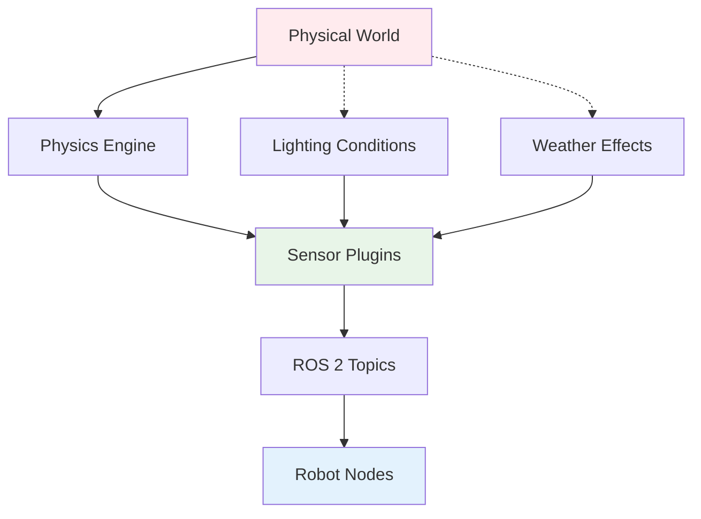

# Simulating Sensors: LiDAR, Depth Cameras, IMU, RGB Cameras

## Introduction

Sensor simulation is a critical aspect of creating realistic digital twins for humanoid robots. In the real world, humanoid robots rely on multiple sensors to perceive their environment, maintain balance, navigate spaces, and interact with objects. In simulation, we need to replicate these sensor modalities accurately to ensure that algorithms developed in simulation will work effectively on real robots.

This chapter covers:
- **LiDAR simulation** for environment mapping and obstacle detection
- **Depth camera simulation** for 3D perception and navigation
- **IMU simulation** for balance and orientation sensing
- **RGB camera simulation** for visual perception and recognition
- **Sensor integration** with ROS 2 message types
- **Performance optimization** for sensor-rich environments

For humanoid robots specifically, these sensors are essential for:
- **Locomotion**: Balance and foot placement using IMU and cameras
- **Navigation**: Obstacle detection and path planning using LiDAR
- **Perception**: Object detection and recognition using RGB cameras
- **Manipulation**: Precision control using depth cameras

## Understanding Sensor Simulation in Gazebo

### The Sensor Pipeline



In Gazebo, sensors work through a plugin system that:
1. Interacts with the physics engine to generate realistic sensor data
2. Applies sensor-specific noise models and characteristics
3. Publishes data to ROS 2 topics in standard message formats
4. Integrates with the TF (transform) system for spatial relationships

### Key Sensor Types for Humanoid Robots

1. **LiDAR**: Environment mapping, obstacle detection, navigation
2. **Depth Cameras**: 3D perception, object recognition, manipulation
3. **IMU**: Balance control, orientation estimation, motion detection
4. **RGB Cameras**: Visual perception, recognition, scene understanding
5. **Force/Torque Sensors**: Manipulation control, contact detection
6. **Encoders**: Joint position and velocity feedback

## LiDAR Simulation

LiDAR sensors provide accurate 2D or 3D range measurements and are crucial for humanoid navigation and obstacle avoidance.

### 1. Basic LiDAR Configuration

```xml
<!-- Adding a LiDAR sensor to a robot model -->
<gazebo reference="head_link">
  <sensor name="head_lidar" type="ray">
    <always_on>true</always_on>
    <update_rate>10</update_rate>
    <pose>0.1 0 0.05 0 0 0</pose>  <!-- Position in head link -->
    <ray>
      <scan>
        <horizontal>
          <samples>720</samples>    <!-- Number of horizontal rays -->
          <resolution>1</resolution>  <!-- Resolution per sample -->
          <min_angle>-3.14159</min_angle>  <!-- -π radians -->
          <max_angle>3.14159</max_angle>   <!-- π radians -->
        </horizontal>
      </scan>
      <range>
        <min>0.1</min>     <!-- Minimum detection range -->
        <max>30.0</max>    <!-- Maximum detection range -->
        <resolution>0.01</resolution>  <!-- Range resolution -->
      </range>
    </ray>
    <plugin name="lidar_controller" filename="libgazebo_ros_ray_sensor.so">
      <ros>
        <namespace>/humanoid</namespace>
        <remapping>~/out:=scan</remapping>
      </ros>
      <output_type>sensor_msgs/LaserScan</output_type>
      <frame_name>head_lidar_frame</frame_name>
    </plugin>
  </sensor>
</gazebo>
```

### 2. 3D LiDAR (HDL-32E-like configuration)

```xml
<gazebo reference="base_link">
  <sensor name="velodyne_hdl32" type="ray">
    <always_on>true</always_on>
    <update_rate>10</update_rate>
    <pose>0.2 0 0.3 0 0 0</pose>
    <ray>
      <scan>
        <horizontal>
          <samples>1024</samples>
          <resolution>1</resolution>
          <min_angle>-3.14159</min_angle>
          <max_angle>3.14159</max_angle>
        </horizontal>
        <vertical>
          <samples>32</samples>
          <resolution>1</resolution>
          <min_angle>-0.5236</min_angle>  <!-- -30 degrees -->
          <max_angle>0.2618</max_angle>   <!-- +15 degrees -->
        </vertical>
      </scan>
      <range>
        <min>0.3</min>
        <max>100.0</max>
        <resolution>0.01</resolution>
      </range>
    </ray>
    <plugin name="velodyne_controller" filename="libgazebo_ros_velodyne_gpu_lidar.so">
      <ros>
        <namespace>/humanoid</namespace>
        <remapping>~/out:=points</remapping>
      </ros>
      <frame_name>velodyne_frame</frame_name>
      <min_range>0.3</min_range>
      <max_range>100.0</max_range>
      <gaussian_noise>0.01</gaussian_noise>
    </plugin>
  </sensor>
</gazebo>
```

### 3. LiDAR Data Processing in ROS 2

```python
# lidar_processor.py
import rclpy
from rclpy.node import Node
from sensor_msgs.msg import LaserScan, PointCloud2
from std_msgs.msg import Float32
from geometry_msgs.msg import PointStamped
import numpy as np
from scipy.spatial import KDTree

class LidarProcessor(Node):
    def __init__(self):
        super().__init__('lidar_processor')

        # Subscribers
        self.lidar_sub = self.create_subscription(
            LaserScan,
            '/humanoid/scan',
            self.lidar_callback,
            10
        )

        self.pointcloud_sub = self.create_subscription(
            PointCloud2,
            '/humanoid/points',
            self.pointcloud_callback,
            10
        )

        # Publishers
        self.obstacle_dist_pub = self.create_publisher(
            Float32,
            '/humanoid/min_obstacle_distance',
            10
        )

        # Parameters
        self.declare_parameter('lidar_range_threshold', 1.0)  # meters
        self.range_threshold = self.get_parameter('lidar_range_threshold').value

        self.get_logger().info('Lidar Processor initialized')

    def lidar_callback(self, msg):
        """Process 2D LiDAR data"""
        # Convert ranges to numpy array for processing
        ranges = np.array(msg.ranges)

        # Remove invalid measurements (inf, nan)
        valid_mask = np.isfinite(ranges) & (ranges > msg.range_min) & (ranges < msg.range_max)
        valid_ranges = ranges[valid_mask]

        # Find minimum distance to obstacle
        if len(valid_ranges) > 0:
            min_distance = np.min(valid_ranges)

            # Publish minimum distance for navigation system
            dist_msg = Float32()
            dist_msg.data = float(min_distance)
            self.obstacle_dist_pub.publish(dist_msg)

            # Log if obstacle is within threshold
            if min_distance < self.range_threshold:
                self.get_logger().warn(f'Obstacle detected at {min_distance:.2f}m')
        else:
            self.get_logger().debug('No valid ranges in LiDAR scan')

    def pointcloud_callback(self, msg):
        """Process 3D point cloud data from 3D LiDAR"""
        # This is a simplified example - real implementation would convert PointCloud2 to numpy array
        self.get_logger().debug(f'Received point cloud with {msg.height * msg.width} points')

def main(args=None):
    rclpy.init(args=args)
    processor = LidarProcessor()

    try:
        rclpy.spin(processor)
    except KeyboardInterrupt:
        processor.get_logger().info('Shutting down lidar processor...')
    finally:
        processor.destroy_node()
        rclpy.shutdown()

if __name__ == '__main__':
    main()
```

## Depth Camera Simulation

Depth cameras provide both visual and depth information, essential for 3D object detection and manipulation tasks in humanoid robots.

### 1. Basic Depth Camera Configuration

```xml
<gazebo reference="head_camera_link">
  <sensor name="head_depth_camera" type="depth">
    <always_on>true</always_on>
    <update_rate>30</update_rate>
    <camera name="head_camera">
      <horizontal_fov>1.047</horizontal_fov>  <!-- 60 degrees -->
      <image>
        <width>640</width>
        <height>480</height>
        <format>R8G8B8</format>
      </image>
      <clip>
        <near>0.1</near>
        <far>10</far>
      </clip>
      <noise>
        <type>gaussian</type>
        <mean>0.0</mean>
        <stddev>0.01</stddev>
      </noise>
    </camera>
    <plugin name="camera_controller" filename="libgazebo_ros_openni_kinect.so">
      <ros>
        <namespace>/humanoid</namespace>
        <remapping>rgb/image_raw:=camera/color/image_raw</remapping>
        <remapping>depth/image_raw:=camera/depth/image_raw</remapping>
        <remapping>depth/camera_info:=camera/depth/camera_info</remapping>
        <remapping>rgb/camera_info:=camera/color/camera_info</remapping>
      </ros>
      <frame_name>head_camera_depth_optical_frame</frame_name>
      <baseline>0.2</baseline>
      <state_topic>camera_state</state_topic>
      <point_cloud_cutoff>0.1</point_cloud_cutoff>
      <point_cloud_cutoff_max>10.0</point_cloud_cutoff_max>
      <distortion_k1>0.0</distortion_k1>
      <distortion_k2>0.0</distortion_k2>
      <distortion_k3>0.0</distortion_k3>
      <distortion_t1>0.0</distortion_t1>
      <distortion_t2>0.0</distortion_t2>
    </plugin>
  </sensor>
</gazebo>
```

### 2. Depth Camera Data Processing

```python
# depth_camera_processor.py
import rclpy
from rclpy.node import Node
from sensor_msgs.msg import Image, CameraInfo
from cv_bridge import CvBridge
import cv2
import numpy as np
from geometry_msgs.msg import PointStamped
from std_msgs.msg import Header

class DepthCameraProcessor(Node):
    def __init__(self):
        super().__init__('depth_camera_processor')

        self.bridge = CvBridge()

        # Subscribers
        self.rgb_sub = self.create_subscription(
            Image,
            '/humanoid/camera/color/image_raw',
            self.rgb_callback,
            10
        )

        self.depth_sub = self.create_subscription(
            Image,
            '/humanoid/camera/depth/image_raw',
            self.depth_callback,
            10
        )

        self.camera_info_sub = self.create_subscription(
            CameraInfo,
            '/humanoid/camera/depth/camera_info',
            self.camera_info_callback,
            10
        )

        # Publishers
        self.object_point_pub = self.create_publisher(
            PointStamped,
            '/humanoid/object_in_camera_frame',
            10
        )

        # Camera parameters
        self.camera_matrix = None
        self.distortion_coeffs = None
        self.camera_info_received = False

        self.get_logger().info('Depth Camera Processor initialized')

    def camera_info_callback(self, msg):
        """Store camera intrinsic parameters"""
        if not self.camera_info_received:
            self.camera_matrix = np.array(msg.k).reshape((3, 3))
            self.distortion_coeffs = np.array(msg.d)
            self.camera_info_received = True
            self.get_logger().info('Camera info received')

    def rgb_callback(self, msg):
        """Process RGB image for object detection"""
        try:
            cv_image = self.bridge.imgmsg_to_cv2(msg, desired_encoding='bgr8')

            # Simple example: detect red objects using HSV color space
            hsv = cv2.cvtColor(cv_image, cv2.COLOR_BGR2HSV)

            # Define range for red color in HSV
            lower_red = np.array([0, 100, 100])
            upper_red = np.array([10, 255, 255])
            mask1 = cv2.inRange(hsv, lower_red, upper_red)

            lower_red = np.array([170, 100, 100])
            upper_red = np.array([180, 255, 255])
            mask2 = cv2.inRange(hsv, lower_red, upper_red)

            mask = mask1 + mask2

            # Find contours
            contours, _ = cv2.findContours(mask, cv2.RETR_EXTERNAL, cv2.CHAIN_APPROX_SIMPLE)

            if contours:
                # Find largest contour
                largest_contour = max(contours, key=cv2.contourArea)

                # Calculate centroid
                M = cv2.moments(largest_contour)
                if M['m00'] != 0:
                    cx = int(M['m10'] / M['m00'])
                    cy = int(M['m01'] / M['m00'])

                    # Draw circle at centroid
                    cv2.circle(cv_image, (cx, cy), 10, (0, 255, 0), -1)

                    # Publish centroid as point in camera frame
                    self.publish_3d_point(cx, cy)

        except Exception as e:
            self.get_logger().error(f'Error processing RGB image: {e}')

    def depth_callback(self, msg):
        """Process depth image to get 3D coordinates"""
        try:
            depth_image = self.bridge.imgmsg_to_cv2(msg, desired_encoding='passthrough')

            # Get depth value at center of image (example)
            height, width = depth_image.shape
            center_x, center_y = width // 2, height // 2

            depth_value = depth_image[center_y, center_x]

            if depth_value > 0 and depth_value < 10.0:  # Valid depth range
                self.get_logger().info(f'Center depth: {depth_value:.2f}m')

        except Exception as e:
            self.get_logger().error(f'Error processing depth image: {e}')

    def publish_3d_point(self, u, v):
        """Convert pixel coordinates to 3D world coordinates"""
        if not self.camera_info_received:
            return

        # This is a simplified approach - in reality you'd need to triangulate using depth
        # For this example, we'll publish the pixel coordinates with a placeholder depth
        point_msg = PointStamped()
        point_msg.header.stamp = self.get_clock().now().to_msg()
        point_msg.header.frame_id = 'head_camera_depth_optical_frame'
        point_msg.point.x = float(u)
        point_msg.point.y = float(v)
        point_msg.point.z = 1.0  # Placeholder depth

        self.object_point_pub.publish(point_msg)

def main(args=None):
    rclpy.init(args=args)
    processor = DepthCameraProcessor()

    try:
        rclpy.spin(processor)
    except KeyboardInterrupt:
        processor.get_logger().info('Shutting down depth camera processor...')
    finally:
        processor.destroy_node()
        rclpy.shutdown()

if __name__ == '__main__':
    main()
```

## IMU Simulation

IMUs (Inertial Measurement Units) are critical for humanoid robot balance and orientation estimation.

### 1. IMU Configuration

```xml
<gazebo reference="imu_link">
  <sensor name="imu_sensor" type="imu">
    <always_on>true</always_on>
    <update_rate>100</update_rate>  <!-- Higher rate for balance control -->
    <pose>0 0 0 0 0 0</pose>
    <imu>
      <angular_velocity>
        <x>
          <noise type="gaussian">
            <mean>0.0</mean>
            <stddev>2e-4</stddev>
            <bias_mean>0.002</bias_mean>
            <bias_stddev>0.0003</bias_stddev>
          </noise>
        </x>
        <y>
          <noise type="gaussian">
            <mean>0.0</mean>
            <stddev>2e-4</stddev>
            <bias_mean>0.002</bias_mean>
            <bias_stddev>0.0003</bias_stddev>
          </noise>
        </y>
        <z>
          <noise type="gaussian">
            <mean>0.0</mean>
            <stddev>2e-4</stddev>
            <bias_mean>0.002</bias_mean>
            <bias_stddev>0.0003</bias_stddev>
          </noise>
        </z>
      </angular_velocity>
      <linear_acceleration>
        <x>
          <noise type="gaussian">
            <mean>0.0</mean>
            <stddev>1.7e-2</stddev>
            <bias_mean>0.1</bias_mean>
            <bias_stddev>0.001</bias_stddev>
          </noise>
        </x>
        <y>
          <noise type="gaussian">
            <mean>0.0</mean>
            <stddev>1.7e-2</stddev>
            <bias_mean>0.1</bias_mean>
            <bias_stddev>0.001</bias_stddev>
          </noise>
        </y>
        <z>
          <noise type="gaussian">
            <mean>0.0</mean>
            <stddev>1.7e-2</stddev>
            <bias_mean>0.1</bias_mean>
            <bias_stddev>0.001</bias_stddev>
          </noise>
        </z>
      </linear_acceleration>
    </imu>
    <plugin name="imu_plugin" filename="libgazebo_ros_imu.so">
      <ros>
        <namespace>/humanoid</namespace>
        <remapping>~/out:=imu/data</remapping>
      </ros>
      <frame_name>imu_link</frame_name>
      <body_name>imu_link</body_name>
      <update_rate>100</update_rate>
      <gaussian_noise>1.7e-3</gaussian_noise>
    </plugin>
  </sensor>
</gazebo>
```

### 2. IMU Data Processing for Balance Control

```python
# imu_balance_controller.py
import rclpy
from rclpy.node import Node
from sensor_msgs.msg import Imu
from geometry_msgs.msg import Vector3Stamped, Twist
from std_msgs.msg import Float64MultiArray
import numpy as np
import math
from tf_transformations import euler_from_quaternion

class ImuBalanceController(Node):
    def __init__(self):
        super().__init__('imu_balance_controller')

        # Subscribers
        self.imu_sub = self.create_subscription(
            Imu,
            '/humanoid/imu/data',
            self.imu_callback,
            10
        )

        # Publishers
        self.joint_corr_pub = self.create_publisher(
            Float64MultiArray,
            '/humanoid/joint_corrections',
            10
        )

        self.balance_status_pub = self.create_publisher(
            Twist,
            '/humanoid/balance_status',
            10
        )

        # Balance control parameters
        self.roll = 0.0
        self.pitch = 0.0
        self.yaw = 0.0

        # Balance correction gains
        self.roll_gain = 10.0
        self.pitch_gain = 10.0

        # Balance thresholds
        self.balance_threshold = 0.2  # radians
        self.fall_threshold = 0.5     # radians

        self.get_logger().info('IMU Balance Controller initialized')

    def imu_callback(self, msg):
        """Process IMU data for balance control"""
        # Extract orientation from quaternion
        orientation = msg.orientation
        quaternion = [
            orientation.x,
            orientation.y,
            orientation.z,
            orientation.w
        ]

        # Convert to Euler angles (roll, pitch, yaw)
        self.roll, self.pitch, self.yaw = euler_from_quaternion(quaternion)

        # Log orientation
        self.get_logger().debug(f'Orientation - Roll: {self.roll:.3f}, Pitch: {self.pitch:.3f}, Yaw: {self.yaw:.3f}')

        # Calculate balance errors
        roll_error = self.roll  # Error from upright position
        pitch_error = self.pitch  # Error from upright position

        # Check if robot is falling
        is_falling = abs(self.roll) > self.fall_threshold or abs(self.pitch) > self.fall_threshold

        # Publish balance status
        status_msg = Twist()
        status_msg.linear.x = float(abs(roll_error) < self.balance_threshold)  # Balanced in roll
        status_msg.linear.y = float(abs(pitch_error) < self.balance_threshold)  # Balanced in pitch
        status_msg.linear.z = float(is_falling)  # Falling status
        status_msg.angular.x = self.roll
        status_msg.angular.y = self.pitch
        status_msg.angular.z = self.yaw

        self.balance_status_pub.publish(status_msg)

        # Calculate corrections only if not falling
        if not is_falling:
            self.calculate_balance_corrections(roll_error, pitch_error)

        # Log if out of balance
        if abs(roll_error) > self.balance_threshold or abs(pitch_error) > self.balance_threshold:
            self.get_logger().warn(f'Robot out of balance - Roll error: {roll_error:.3f}, Pitch error: {pitch_error:.3f}')

    def calculate_balance_corrections(self, roll_error, pitch_error):
        """Calculate joint corrections to maintain balance"""
        # Simple PD controller for balance
        roll_correction = -self.roll_gain * roll_error
        pitch_correction = -self.pitch_gain * pitch_error

        # Create corrections message
        corr_msg = Float64MultiArray()
        corr_msg.data = [roll_correction, pitch_correction]

        # In a real implementation, you would map these corrections to specific joints
        # For example: adjust hip joints for roll correction, ankle joints for pitch correction
        self.joint_corr_pub.publish(corr_msg)

def main(args=None):
    rclpy.init(args=args)
    controller = ImuBalanceController()

    try:
        rclpy.spin(controller)
    except KeyboardInterrupt:
        controller.get_logger().info('Shutting down IMU balance controller...')
    finally:
        controller.destroy_node()
        rclpy.shutdown()

if __name__ == '__main__':
    main()
```

## RGB Camera Simulation

RGB cameras provide visual perception capabilities for humanoid robots.

### 1. RGB Camera Configuration

```xml
<gazebo reference="head_camera_rgb">
  <sensor name="rgb_camera" type="camera">
    <always_on>true</always_on>
    <update_rate>30</update_rate>
    <camera name="head_camera_rgb">
      <horizontal_fov>1.047</horizontal_fov>  <!-- 60 degrees -->
      <image>
        <width>1280</width>
        <height>720</height>
        <format>R8G8B8</format>
      </image>
      <clip>
        <near>0.1</near>
        <far>30</far>
      </clip>
      <noise>
        <type>gaussian</type>
        <mean>0.0</mean>
        <stddev>0.007</stddev>
      </noise>
    </camera>
    <plugin name="camera_controller" filename="libgazebo_ros_camera.so">
      <ros>
        <namespace>/humanoid</namespace>
        <remapping>~/image_raw:=camera/rgb/image_raw</remapping>
        <remapping>~/camera_info:=camera/rgb/camera_info</remapping>
      </ros>
      <frame_name>head_camera_rgb_optical_frame</frame_name>
      <min_distance>0.1</min_distance>
      <max_distance>30</max_distance>
      <hack_baseline>0.07</hack_baseline>
      <distortion_k1>0.0</distortion_k1>
      <distortion_k2>0.0</distortion_k2>
      <distortion_k3>0.0</distortion_k3>
      <distortion_t1>0.0</distortion_t1>
      <distortion_t2>0.0</distortion_t2>
    </plugin>
  </sensor>
</gazebo>
```

### 2. RGB Camera Processing for Object Recognition

```python
# rgb_camera_processor.py
import rclpy
from rclpy.node import Node
from sensor_msgs.msg import Image, CameraInfo
from cv_bridge import CvBridge
import cv2
import numpy as np
from std_msgs.msg import String
from geometry_msgs.msg import PointStamped

class RgbCameraProcessor(Node):
    def __init__(self):
        super().__init__('rgb_camera_processor')

        self.bridge = CvBridge()

        # Subscribers
        self.image_sub = self.create_subscription(
            Image,
            '/humanoid/camera/rgb/image_raw',
            self.image_callback,
            10
        )

        # Publishers
        self.detected_obj_pub = self.create_publisher(
            String,
            '/humanoid/detected_objects',
            10
        )

        self.object_loc_pub = self.create_publisher(
            PointStamped,
            '/humanoid/object_location',
            10
        )

        # Detection parameters
        self.object_cascade = None  # For custom objects
        self.enable_face_detection = True
        self.enable_color_detection = True

        self.get_logger().info('RGB Camera Processor initialized')

    def image_callback(self, msg):
        """Process RGB camera image for object detection"""
        try:
            cv_image = self.bridge.imgmsg_to_cv2(msg, desired_encoding='bgr8')

            # Run multiple detection algorithms
            detections = []

            if self.enable_face_detection:
                faces = self.detect_faces(cv_image)
                detections.extend([('face', rect) for rect in faces])

            if self.enable_color_detection:
                colored_objects = self.detect_colored_objects(cv_image)
                detections.extend(colored_objects)

            # Process detections
            if detections:
                # Find largest detection for priority
                largest_area = 0
                largest_detection = None

                for obj_type, bbox in detections:
                    x, y, w, h = bbox
                    area = w * h

                    if area > largest_area:
                        largest_area = area
                        largest_detection = (obj_type, bbox)

                # Publish largest detection
                if largest_detection:
                    obj_type, bbox = largest_detection
                    x, y, w, h = bbox

                    # Create detection string
                    detection_msg = String()
                    detection_msg.data = f'{obj_type}:{x},{y},{w},{h}'
                    self.detected_obj_pub.publish(detection_msg)

                    # Publish location in camera frame
                    loc_msg = PointStamped()
                    loc_msg.header.stamp = self.get_clock().now().to_msg()
                    loc_msg.header.frame_id = 'head_camera_rgb_optical_frame'
                    loc_msg.point.x = float(x + w/2)  # Center of bounding box
                    loc_msg.point.y = float(y + h/2)
                    loc_msg.point.z = 1.0  # Placeholder depth
                    self.object_loc_pub.publish(loc_msg)

                    # Draw bounding box on image
                    cv2.rectangle(cv_image, (x, y), (x+w, y+h), (0, 255, 0), 2)
                    cv2.putText(cv_image, obj_type, (x, y-10), cv2.FONT_HERSHEY_SIMPLEX, 0.9, (0, 255, 0), 2)

            # Optionally publish processed image
            # This is commented out to save bandwidth but useful for debugging
            # processed_img_msg = self.bridge.cv2_to_imgmsg(cv_image, encoding='bgr8')
            # processed_img_msg.header = msg.header
            # self.processed_img_pub.publish(processed_img_msg)

        except Exception as e:
            self.get_logger().error(f'Error processing RGB image: {e}')

    def detect_faces(self, image):
        """Detect faces using Haar cascades"""
        gray = cv2.cvtColor(image, cv2.COLOR_BGR2GRAY)

        # Load face cascade (you may need to install opencv-contrib-python for more cascades)
        face_cascade = cv2.CascadeClassifier(cv2.data.haarcascades + 'haarcascade_frontalface_default.xml')

        faces = face_cascade.detectMultiScale(gray, 1.1, 4)

        # Convert to list of tuples (x, y, w, h)
        face_list = [(int(x), int(y), int(w), int(h)) for x, y, w, h in faces]

        return face_list

    def detect_colored_objects(self, image):
        """Detect objects based on color"""
        # Convert to HSV for color detection
        hsv = cv2.cvtColor(image, cv2.COLOR_BGR2HSV)

        # Define color ranges (HSV values)
        colors = {
            'red': ((0, 100, 100), (10, 255, 255)),      # Red range 1
            'red2': ((170, 100, 100), (180, 255, 255)),  # Red range 2
            'blue': ((100, 100, 100), (130, 255, 255)),
            'green': ((40, 100, 100), (80, 255, 255)),
            'yellow': ((20, 100, 100), (40, 255, 255))
        }

        detections = []

        for color_name, (lower, upper) in colors.items():
            # Create mask for this color
            lower = np.array(lower)
            upper = np.array(upper)

            if color_name == 'red2':
                # For red, combine the two ranges
                continue

            mask = cv2.inRange(hsv, lower, upper)

            # For red, we need to combine both ranges
            if color_name == 'red':
                mask2 = cv2.inRange(hsv, np.array([170, 100, 100]), np.array([180, 255, 255]))
                mask = mask + mask2

            # Find contours
            contours, _ = cv2.findContours(mask, cv2.RETR_EXTERNAL, cv2.CHAIN_APPROX_SIMPLE)

            # Filter contours by size (avoid tiny detections)
            for contour in contours:
                area = cv2.contourArea(contour)
                if area > 500:  # Minimum area threshold
                    # Get bounding rectangle
                    x, y, w, h = cv2.boundingRect(contour)
                    detections.append((color_name.replace('2', ''), (x, y, w, h)))

        return detections

def main(args=None):
    rclpy.init(args=args)
    processor = RgbCameraProcessor()

    try:
        rclpy.spin(processor)
    except KeyboardInterrupt:
        processor.get_logger().info('Shutting down RGB camera processor...')
    finally:
        processor.destroy_node()
        rclpy.shutdown()

if __name__ == '__main__':
    main()
```

## Sensor Fusion and Integration

For humanoid robots, it's crucial to fuse data from multiple sensors to create a comprehensive understanding of the environment and the robot's state.

### 1. Multi-Sensor Fusion Node

```python
# sensor_fusion.py
import rclpy
from rclpy.node import Node
from sensor_msgs.msg import Imu, LaserScan, Image
from geometry_msgs.msg import PoseStamped, Twist
from std_msgs.msg import Float32, Bool
import numpy as np
from collections import deque
from scipy.spatial.transform import Rotation as R

class SensorFusionNode(Node):
    def __init__(self):
        super().__init__('sensor_fusion')

        # Subscribers for all sensors
        self.imu_sub = self.create_subscription(
            Imu, '/humanoid/imu/data', self.imu_callback, 10)
        self.lidar_sub = self.create_subscription(
            LaserScan, '/humanoid/scan', self.lidar_callback, 10)
        self.camera_sub = self.create_subscription(
            Image, '/humanoid/camera/rgb/image_raw', self.camera_callback, 10)

        # Publishers for fused data
        self.pose_pub = self.create_publisher(PoseStamped, '/humanoid/fused_pose', 10)
        self.velocity_pub = self.create_publisher(Twist, '/humanoid/fused_velocity', 10)
        self.obstacle_avoid_pub = self.create_publisher(Bool, '/humanoid/obstacle_detected', 10)

        # Buffers for sensor data fusion
        self.imu_buffer = deque(maxlen=10)
        self.lidar_buffer = deque(maxlen=5)
        self.pose_estimate = np.array([0.0, 0.0, 0.0])  # x, y, theta
        self.velocity_estimate = np.array([0.0, 0.0, 0.0])  # vx, vy, omega

        self.get_logger().info('Sensor Fusion Node initialized')

    def imu_callback(self, msg):
        """Process IMU data for orientation and acceleration"""
        # Extract orientation
        quat = [msg.orientation.x, msg.orientation.y, msg.orientation.z, msg.orientation.w]
        r = R.from_quat(quat)
        euler = r.as_euler('xyz')

        # Extract angular velocity and linear acceleration
        ang_vel = np.array([msg.angular_velocity.x, msg.angular_velocity.y, msg.angular_velocity.z])
        lin_acc = np.array([msg.linear_acceleration.x, msg.linear_acceleration.y, msg.linear_acceleration.z])

        # Store in buffer for fusion
        imu_data = {
            'timestamp': msg.header.stamp.sec + msg.header.stamp.nanosec * 1e-9,
            'orientation': euler,
            'angular_velocity': ang_vel,
            'linear_acceleration': lin_acc
        }

        self.imu_buffer.append(imu_data)

    def lidar_callback(self, msg):
        """Process LiDAR data for obstacle detection"""
        # Find minimum distance to obstacle
        valid_ranges = [r for r in msg.ranges if msg.range_min < r < msg.range_max and np.isfinite(r)]

        if valid_ranges:
            min_distance = min(valid_ranges)

            # Publish obstacle detection
            obstacle_msg = Bool()
            obstacle_msg.data = min_distance < 1.0  # Threshold for obstacle detection
            self.obstacle_avoid_pub.publish(obstacle_msg)

        # Store in buffer
        lidar_data = {
            'timestamp': msg.header.stamp.sec + msg.header.stamp.nanosec * 1e-9,
            'ranges': valid_ranges,
            'min_distance': min_distance if valid_ranges else float('inf')
        }

        self.lidar_buffer.append(lidar_data)

    def camera_callback(self, msg):
        """Process camera data for visual odometry and object detection"""
        # In a real implementation, this would process visual features
        # for visual odometry and object detection
        pass

    def perform_sensor_fusion(self):
        """Fuse sensor data to estimate pose and velocity"""
        # This is a simplified example - real fusion would use Kalman filters
        # or particle filters for more accurate estimation

        if len(self.imu_buffer) > 0:
            # Use IMU for orientation estimation
            latest_imu = self.imu_buffer[-1]
            self.pose_estimate[2] = latest_imu['orientation'][2]  # yaw

            # Integrate angular velocity for orientation change
            if len(self.imu_buffer) > 1:
                prev_imu = self.imu_buffer[-2]
                dt = latest_imu['timestamp'] - prev_imu['timestamp']
                if dt > 0:
                    # Update velocity based on IMU data
                    self.velocity_estimate[2] = latest_imu['angular_velocity'][2]

def main(args=None):
    rclpy.init(args=args)
    fusion_node = SensorFusionNode()

    try:
        rclpy.spin(fusion_node)
    except KeyboardInterrupt:
        fusion_node.get_logger().info('Shutting down sensor fusion node...')
    finally:
        fusion_node.destroy_node()
        rclpy.shutdown()

if __name__ == '__main__':
    main()
```

## Performance Optimization for Sensor Simulation

### 1. Sensor Performance Considerations

For humanoid robots with multiple sensors, performance optimization is crucial:

```xml
<!-- Optimize update rates based on sensor requirements -->
<!-- LiDAR: 10-20 Hz is usually sufficient for navigation -->
<gazebo reference="lidar_link">
  <sensor name="lidar" type="ray">
    <update_rate>10</update_rate>  <!-- Lower update rate for performance -->
    <!-- ... other configuration ... -->
  </sensor>
</gazebo>

<!-- IMU: Higher update rate needed for balance control -->
<gazebo reference="imu_link">
  <sensor name="imu" type="imu">
    <update_rate>100</update_rate>  <!-- Higher update rate for balance -->
    <!-- ... other configuration ... -->
  </sensor>
</gazebo>

<!-- Cameras: Balance between quality and performance -->
<gazebo reference="camera_link">
  <sensor name="camera" type="camera">
    <update_rate>30</update_rate>  <!-- Standard video rate -->
    <camera name="camera">
      <image>
        <width>640</width>  <!-- Lower resolution for performance -->
        <height>480</height>
        <!-- ... other configuration ... -->
      </image>
    </camera>
  </sensor>
</gazebo>
```

### 2. Sensor Activation Management

Activate sensors only when needed:

```python
# sensor_manager.py
import rclpy
from rclpy.node import Node
from std_msgs.msg import Bool
from sensor_msgs.msg import LaserScan, Image, Imu

class SensorManager(Node):
    def __init__(self):
        super().__init__('sensor_manager')

        # Publishers to enable/disable sensors
        self.lidar_enable_pub = self.create_publisher(Bool, '/humanoid/lidar/enable', 10)
        self.camera_enable_pub = self.create_publisher(Bool, '/humanoid/camera/enable', 10)

        # Subscribers for sensor activation requests
        self.nav_request_sub = self.create_subscription(
            Bool, '/humanoid/navigation_required', self.nav_request_callback, 10)
        self.vision_request_sub = self.create_subscription(
            Bool, '/humanoid/vision_required', self.vision_request_callback, 10)

        # Current sensor states
        self.lidar_active = False
        self.camera_active = False

        self.get_logger().info('Sensor Manager initialized')

    def nav_request_callback(self, msg):
        """Activate/deactivate navigation sensors based on requirement"""
        if msg.data and not self.lidar_active:
            # Enable LiDAR for navigation
            enable_msg = Bool()
            enable_msg.data = True
            self.lidar_enable_pub.publish(enable_msg)
            self.lidar_active = True
            self.get_logger().info('LiDAR activated for navigation')
        elif not msg.data and self.lidar_active:
            # Disable LiDAR to save resources
            enable_msg = Bool()
            enable_msg.data = False
            self.lidar_enable_pub.publish(enable_msg)
            self.lidar_active = False
            self.get_logger().info('LiDAR deactivated')

    def vision_request_callback(self, msg):
        """Activate/deactivate vision sensors based on requirement"""
        if msg.data and not self.camera_active:
            # Enable camera for vision tasks
            enable_msg = Bool()
            enable_msg.data = True
            self.camera_enable_pub.publish(enable_msg)
            self.camera_active = True
            self.get_logger().info('Camera activated for vision')
        elif not msg.data and self.camera_active:
            # Disable camera to save resources
            enable_msg = Bool()
            enable_msg.data = False
            self.camera_enable_pub.publish(enable_msg)
            self.camera_active = False
            self.get_logger().info('Camera deactivated')

def main(args=None):
    rclpy.init(args=args)
    manager = SensorManager()

    try:
        rclpy.spin(manager)
    except KeyboardInterrupt:
        manager.get_logger().info('Shutting down sensor manager...')
    finally:
        manager.destroy_node()
        rclpy.shutdown()

if __name__ == '__main__':
    main()
```

## Troubleshooting Common Sensor Issues

### 1. Sensor Data Quality Problems

```bash
# Check sensor topics
ros2 topic list | grep -i sensor

# Monitor sensor data rates
ros2 topic hz /humanoid/scan
ros2 topic hz /humanoid/camera/rgb/image_raw
ros2 topic hz /humanoid/imu/data

# Echo sensor data
ros2 topic echo /humanoid/imu/data
ros2 topic echo /humanoid/scan --field ranges
```

### 2. TF Issues with Sensors

```bash
# Check TF tree
ros2 run tf2_tools view_frames

# Echo transforms between sensor and robot base
ros2 run tf2_ros tf2_echo base_link head_camera_rgb_optical_frame
```

### 3. Sensor Configuration Validation

```bash
# Check sensor parameters
ros2 param list | grep sensor

# Validate URDF sensor definitions
check_urdf /path/to/robot.urdf
```

## Best Practices for Sensor Simulation

### 1. Realistic Noise Models

Always include appropriate noise models that match real sensors:

```xml
<sensor name="realistic_camera" type="camera">
  <camera>
    <noise>
      <type>gaussian</type>
      <mean>0.0</mean>
      <stddev>0.01</stddev>  <!-- Match real camera noise characteristics -->
    </noise>
  </camera>
</sensor>
```

### 2. Appropriate Update Rates

Match sensor update rates to real-world capabilities:

- LiDAR: 10-20 Hz for navigation
- IMU: 100-1000 Hz for balance control
- Cameras: 15-30 Hz for vision processing
- Force/Torque: 1000+ Hz for control

### 3. Resource Management

For humanoid robots with many sensors, manage resources effectively:

- Use sensor activation/deactivation when appropriate
- Adjust update rates based on current task requirements
- Optimize rendering quality for performance
- Use appropriate compression for high-bandwidth sensors

## Integration with Humanoid Robot Control

Sensors must be tightly integrated with the humanoid robot's control system:

```python
# humanoid_sensor_integrator.py
import rclpy
from rclpy.node import Node
from sensor_msgs.msg import JointState, Imu, LaserScan
from geometry_msgs.msg import Twist
from std_msgs.msg import Float32MultiArray
import numpy as np

class HumanoidSensorIntegrator(Node):
    def __init__(self):
        super().__init__('humanoid_sensor_integrator')

        # Sensor subscribers
        self.joint_state_sub = self.create_subscription(
            JointState, '/humanoid/joint_states', self.joint_state_callback, 10)
        self.imu_sub = self.create_subscription(
            Imu, '/humanoid/imu/data', self.imu_callback, 10)
        self.lidar_sub = self.create_subscription(
            LaserScan, '/humanoid/scan', self.lidar_callback, 10)

        # Control publishers
        self.cmd_vel_pub = self.create_publisher(Twist, '/humanoid/cmd_vel', 10)
        self.joint_cmd_pub = self.create_publisher(Float64MultiArray, '/humanoid/joint_commands', 10)

        # Robot state
        self.joint_positions = {}
        self.joint_velocities = {}
        self.balance_ok = True

        self.get_logger().info('Humanoid Sensor Integrator initialized')

    def joint_state_callback(self, msg):
        """Update joint state information"""
        for i, name in enumerate(msg.name):
            if i < len(msg.position):
                self.joint_positions[name] = msg.position[i]
            if i < len(msg.velocity):
                self.joint_velocities[name] = msg.velocity[i]

    def imu_callback(self, msg):
        """Process IMU data for balance control"""
        # Extract orientation from quaternion
        orientation = msg.orientation
        quaternion = [orientation.x, orientation.y, orientation.z, orientation.w]
        # Convert to Euler angles to check balance
        from tf_transformations import euler_from_quaternion
        roll, pitch, yaw = euler_from_quaternion(quaternion)

        # Check if robot is in balance
        self.balance_ok = abs(roll) < 0.3 and abs(pitch) < 0.3

        if not self.balance_ok:
            self.get_logger().warn(f'Robot out of balance - Roll: {roll:.3f}, Pitch: {pitch:.3f}')
            self.activate_balance_recovery()

    def lidar_callback(self, msg):
        """Process LiDAR data for navigation"""
        # Check for obstacles in front of robot
        front_ranges = msg.ranges[:len(msg.ranges)//8] + msg.ranges[-len(msg.ranges)//8:]
        valid_front_ranges = [r for r in front_ranges if msg.range_min < r < msg.range_max and np.isfinite(r)]

        if valid_front_ranges and min(valid_front_ranges) < 0.5:
            # Obstacle detected, reduce forward velocity
            cmd_vel = Twist()
            cmd_vel.linear.x = 0.0  # Stop forward motion
            cmd_vel.angular.z = 0.2  # Slight turn to avoid obstacle
            self.cmd_vel_pub.publish(cmd_vel)

    def activate_balance_recovery(self):
        """Activate balance recovery behaviors"""
        # Send commands to adjust joint positions for balance
        cmd_msg = Float64MultiArray()

        # Simplified balance recovery - in reality this would be more sophisticated
        adjustments = []
        for joint_name in self.joint_positions:
            if 'hip' in joint_name or 'ankle' in joint_name:
                # Adjust hip and ankle joints to recover balance
                current_pos = self.joint_positions[joint_name]
                adjustment = -0.1 if 'left' in joint_name else 0.1  # Opposite directions for left/right
                adjustments.append(current_pos + adjustment)
            else:
                # Keep other joints at current position
                adjustments.append(self.joint_positions[joint_name])

        cmd_msg.data = adjustments
        self.joint_cmd_pub.publish(cmd_msg)

def main(args=None):
    rclpy.init(args=args)
    integrator = HumanoidSensorIntegrator()

    try:
        rclpy.spin(integrator)
    except KeyboardInterrupt:
        integrator.get_logger().info('Shutting down humanoid sensor integrator...')
    finally:
        integrator.destroy_node()
        rclpy.shutdown()

if __name__ == '__main__':
    main()
```

## Summary

Sensor simulation is a critical component of digital twin creation for humanoid robots. This chapter covered:

1. **LiDAR Simulation**: Environment mapping and obstacle detection
2. **Depth Camera Simulation**: 3D perception and manipulation
3. **IMU Simulation**: Balance and orientation sensing
4. **RGB Camera Simulation**: Visual perception and recognition
5. **Sensor Fusion**: Combining multiple sensor inputs for better understanding
6. **Performance Optimization**: Managing resources in sensor-rich environments
7. **Integration**: Connecting sensors to robot control systems

For humanoid robots specifically, sensor simulation enables:
- Safe testing of perception algorithms
- Validation of control systems in complex environments
- Training of AI systems with synthetic data
- Development of robust navigation and manipulation capabilities

The key to successful sensor simulation is balancing realism with performance while ensuring that the simulated sensors behave similarly to their real-world counterparts.

## Exercises

1. Create a complete sensor suite for a humanoid robot with LiDAR, IMU, RGB, and depth cameras, all properly configured in URDF and Gazebo.

2. Implement a sensor fusion node that combines data from multiple sensors to estimate robot pose more accurately than any single sensor.

3. Design a sensor activation system that turns sensors on/off based on robot behavior to conserve computational resources.

4. Create a sensor validation framework that compares simulated sensor data with expected real-world values.

5. Implement obstacle avoidance using combined LiDAR and camera data for a humanoid robot navigating through a complex environment.

## Next Steps

In the next chapter, we'll explore how to create high-fidelity environments in Unity for humanoid robot simulation, learning how to build interactive 3D scenes that complement the physics simulation we've learned about in Gazebo.

Continue to Chapter 7: [Introduction to Unity for Robotics](./unity-intro.md) to learn about creating immersive 3D environments for your humanoid robot digital twin.