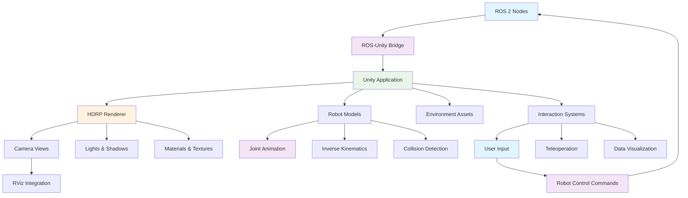

# Introduction to Unity for Robotics

## Overview

Unity has emerged as a powerful platform for creating high-fidelity visualizations and simulations for robotics applications. While Gazebo excels at physics simulation, Unity provides exceptional visual quality and user interaction capabilities that are ideal for creating immersive human-robot interaction experiences and high-fidelity visualizations for humanoid robots.

This chapter introduces Unity concepts specifically relevant to robotics applications, focusing on:
- **HDRP (High Definition Render Pipeline)** for photorealistic rendering
- **Robot visualization** with realistic lighting and materials
- **Human-robot interaction** scenarios
- **ROS-Unity integration** for bidirectional communication
- **Simulation environments** with complex lighting and materials

## Why Unity for Robotics?

### 1. Visual Quality
Unity's HDRP provides cinematic-quality rendering that's ideal for:
- **Photorealistic robot visualization**
- **Complex lighting scenarios**
- **Material rendering with accurate physics**
- **Environmental reflections and shadows**

### 2. Interactive Capabilities
- **Real-time user interaction** with robot models
- **VR/AR support** for immersive teleoperation
- **Custom UI systems** for robot control interfaces
- **Animation systems** for complex robot behaviors

### 3. Performance
- **GPU-accelerated rendering** for complex scenes
- **LOD (Level of Detail)** systems for optimization
- **Occlusion culling** for large environments
- **Multi-threaded rendering** for performance

### 4. Cross-Platform Deployment
- **Desktop applications** for development and testing
- **Mobile platforms** for remote monitoring
- **VR/AR headsets** for immersive interaction
- **Web deployment** for remote access

## Unity for Robotics Architecture



## Setting Up Unity for Robotics

### 1. Unity Hub Installation

For robotics applications, we recommend:
- **Unity 2021.3 LTS** or newer for stability
- **HDRP template** for high-fidelity rendering
- **Linux Build Support** for deployment flexibility
- **XR packages** if planning VR/AR applications

### 2. HDRP Project Setup

When creating a new Unity project for robotics:

1. Select "HDRP (High Definition Render Pipeline)" template
2. Choose "3D (URP/HDRP)" project type
3. Set up appropriate project settings for robotics visualization

### 3. Essential Packages for Robotics

```csharp
// In Package Manager, install:
// - High Definition RP (HDRP)
// - Universal Render Pipeline (URP) - for comparison
// - XR Interaction Toolkit (if needed)
// - ProBuilder (for quick prototyping)
// - Cinemachine (for camera systems)
// - Timeline (for animation sequences)
```

## HDRP Configuration for Robotics

### 1. HDRP Asset Settings

Create and configure the HDRP asset with robotics-specific settings:

```csharp
// HDRP Asset Configuration (ScriptableObject)
using UnityEngine;
using UnityEngine.Rendering.HighDefinition;

[CreateAssetMenu(fileName = "RoboticsHDRPSettings", menuName = "Robotics/HDRP Settings")]
public class RoboticsHDRPSettings : ScriptableObject
{
    [Header("Robotics Visualization Settings")]
    public float robotVisualizationDistance = 100f;  // Maximum distance for robot visualization
    public float shadowDistance = 50f;               // Shadow rendering distance
    public float reflectionDistance = 30f;           // Reflection rendering distance

    [Header("Performance Settings")]
    public int maxLODLevel = 3;                      // Maximum LOD levels
    public float lodBias = 1.0f;                     // LOD bias for detail
    public bool enableDynamicBatching = true;        // Enable dynamic batching
    public bool enableSRPBatching = true;            // Enable SRP batching

    [Header("Lighting Settings")]
    public float defaultLightIntensity = 3.14f;      // Default light intensity (PI for realistic lighting)
    public Color defaultLightColor = Color.white;    // Default light color
    public float exposure = 0f;                      // Camera exposure

    [Header("Post-Processing Settings")]
    public bool enableBloom = true;                  // Enable bloom for realistic lighting
    public bool enableMotionBlur = false;            // Disable for robotics (sharp visuals preferred)
    public bool enableDepthOfField = false;          // Disable for robotics (full focus preferred)
}
```

### 2. Camera Configuration for Robotics

Set up cameras optimized for robot visualization:

```csharp
using UnityEngine;
using UnityEngine.Rendering.HighDefinition;

public class RoboticsCameraController : MonoBehaviour
{
    [Header("Camera Settings")]
    public float defaultFOV = 60f;                   // Default field of view
    public float minFOV = 10f;                       // Minimum FOV for zoom
    public float maxFOV = 120f;                      // Maximum FOV for wide view
    public float panSpeed = 5f;                      // Pan speed
    public float rotateSpeed = 100f;                 // Rotation speed
    public float zoomSpeed = 20f;                    // Zoom speed

    [Header("Robot Tracking")]
    public Transform robotTarget;                    // Robot to track
    public Vector3 offset = new Vector3(0, 2, -5);  // Camera offset from robot
    public float smoothFactor = 0.1f;                // Smoothing factor for tracking

    private Camera cam;
    private HDAdditionalCameraData hdCameraData;

    void Start()
    {
        cam = GetComponent<Camera>();
        hdCameraData = GetComponent<HDAdditionalCameraData>();

        if (cam != null)
        {
            cam.fieldOfView = defaultFOV;
        }
    }

    void LateUpdate()
    {
        if (robotTarget != null)
        {
            // Smooth tracking of robot
            Vector3 targetPosition = robotTarget.position + offset;
            transform.position = Vector3.Lerp(transform.position, targetPosition, smoothFactor);

            // Look at robot
            transform.LookAt(robotTarget);
        }
    }

    public void SetFOV(float fov)
    {
        if (cam != null)
        {
            cam.fieldOfView = Mathf.Clamp(fov, minFOV, maxFOV);
        }
    }

    public void Zoom(float zoomAmount)
    {
        SetFOV(cam.fieldOfView - zoomAmount * zoomSpeed * Time.deltaTime);
    }
}
```

## Creating Robot Models in Unity

### 1. Importing URDF-Generated Models

While Unity doesn't directly import URDF files, we can work with the mesh files generated from URDF:

```csharp
using UnityEngine;
using System.Collections.Generic;

public class RobotModelImporter : MonoBehaviour
{
    [Header("Robot Configuration")]
    public string robotName = "HumanoidRobot";
    public Transform robotRoot;
    public List<RobotJoint> robotJoints = new List<RobotJoint>();

    [Header("Visual Settings")]
    public Material defaultRobotMaterial;
    public Color robotColor = Color.gray;

    [System.Serializable]
    public class RobotJoint
    {
        public string jointName;
        public Transform jointTransform;
        public JointType jointType;
        public float minAngle = -90f;
        public float maxAngle = 90f;
        public float currentAngle = 0f;
    }

    public enum JointType
    {
        Revolute,
        Prismatic,
        Fixed,
        Continuous
    }

    void Start()
    {
        SetupRobotModel();
    }

    public void SetupRobotModel()
    {
        if (robotRoot == null)
        {
            robotRoot = this.transform;
        }

        // Find all joint transforms in the robot hierarchy
        FindRobotJoints(robotRoot);
    }

    void FindRobotJoints(Transform parent)
    {
        foreach (Transform child in parent)
        {
            // Look for joint components or naming conventions
            if (child.name.Contains("joint") || child.GetComponent<ArticulationBody>() != null)
            {
                RobotJoint robotJoint = new RobotJoint();
                robotJoint.jointName = child.name;
                robotJoint.jointTransform = child;

                // Determine joint type based on available components
                if (child.GetComponent<HingeJoint>() != null)
                {
                    robotJoint.jointType = JointType.Revolute;
                }
                else if (child.GetComponent<SliderJoint>() != null)
                {
                    robotJoint.jointType = JointType.Prismatic;
                }
                else
                {
                    robotJoint.jointType = JointType.Fixed;
                }

                robotJoints.Add(robotJoint);
            }

            // Recursively check children
            FindRobotJoints(child);
        }
    }

    public void SetJointPosition(string jointName, float angle)
    {
        RobotJoint joint = robotJoints.Find(j => j.jointName == jointName);
        if (joint != null)
        {
            switch (joint.jointType)
            {
                case JointType.Revolute:
                case JointType.Continuous:
                    // Rotate around local Z axis for revolute joints
                    joint.jointTransform.localRotation = Quaternion.Euler(0, 0, Mathf.Clamp(angle, joint.minAngle, joint.maxAngle));
                    break;
                case JointType.Prismatic:
                    // Move along local Z axis for prismatic joints
                    joint.jointTransform.localPosition = new Vector3(0, 0, Mathf.Clamp(angle, joint.minAngle, joint.maxAngle));
                    break;
            }
            joint.currentAngle = angle;
        }
    }

    public float GetJointPosition(string jointName)
    {
        RobotJoint joint = robotJoints.Find(j => j.jointName == jointName);
        return joint != null ? joint.currentAngle : 0f;
    }
}
```

### 2. Material Configuration for Robot Parts

Create materials that look realistic for different robot components:

```csharp
using UnityEngine;
using UnityEngine.Rendering.HighDefinition;

public class RoboticsMaterialManager : MonoBehaviour
{
    [Header("Robot Materials")]
    public Material torsoMaterial;
    public Material limbMaterial;
    public Material headMaterial;
    public Material sensorMaterial;

    [Header("Material Properties")]
    public Color torsoColor = new Color(0.8f, 0.8f, 0.8f, 1f);
    public Color limbColor = new Color(0.6f, 0.6f, 0.6f, 1f);
    public Color headColor = new Color(0.9f, 0.9f, 0.9f, 1f);
    public Color sensorColor = new Color(0.1f, 0.1f, 0.8f, 1f);  // Blue for sensors

    [Header("Surface Properties")]
    public float metallicValue = 0.2f;
    public float smoothnessValue = 0.5f;
    public Texture2D normalMap;

    void Start()
    {
        CreateRobotMaterials();
    }

    public void CreateRobotMaterials()
    {
        // Create torso material
        if (torsoMaterial == null)
        {
            torsoMaterial = new Material(Shader.Find("HDRP/Lit"));
            torsoMaterial.name = "Torso_Material";
        }
        ConfigureMaterial(torsoMaterial, torsoColor);

        // Create limb material
        if (limbMaterial == null)
        {
            limbMaterial = new Material(Shader.Find("HDRP/Lit"));
            limbMaterial.name = "Limb_Material";
        }
        ConfigureMaterial(limbMaterial, limbColor);

        // Create head material
        if (headMaterial == null)
        {
            headMaterial = new Material(Shader.Find("HDRP/Lit"));
            headMaterial.name = "Head_Material";
        }
        ConfigureMaterial(headMaterial, headColor);

        // Create sensor material (more reflective for visibility)
        if (sensorMaterial == null)
        {
            sensorMaterial = new Material(Shader.Find("HDRP/Lit"));
            sensorMaterial.name = "Sensor_Material";
        }
        ConfigureMaterial(sensorMaterial, sensorColor, 0.8f, 0.7f);  // More metallic and smooth for sensors
    }

    void ConfigureMaterial(Material mat, Color color, float metallic = -1, float smoothness = -1)
    {
        mat.SetColor("_BaseColor", color);
        mat.SetFloat("_Metallic", metallic >= 0 ? metallic : metallicValue);
        mat.SetFloat("_Smoothness", smoothness >= 0 ? smoothness : smoothnessValue);

        if (normalMap != null)
        {
            mat.SetTexture("_NormalMap", normalMap);
        }

        // Set HDRP-specific properties
        mat.SetFloat("_WorkflowMode", 1);  // Metallic workflow
        mat.SetFloat("_SpecularOcclusionMode", 1);
        mat.SetFloat("_SmoothnessRemapMin", 0);
        mat.SetFloat("_SmoothnessRemapMax", 1);
    }

    public Material GetMaterialForPart(string partName)
    {
        if (partName.Contains("torso") || partName.Contains("body"))
            return torsoMaterial;
        else if (partName.Contains("head"))
            return headMaterial;
        else if (partName.Contains("sensor") || partName.Contains("camera") || partName.Contains("lidar"))
            return sensorMaterial;
        else
            return limbMaterial;
    }
}
```

## Lighting and Environment Setup

### 1. HDRP Lighting Configuration

For robotics applications, proper lighting is crucial for realistic visualization:

```csharp
using UnityEngine;
using UnityEngine.Rendering.HighDefinition;

public class RoboticsLightingSetup : MonoBehaviour
{
    [Header("Lighting Configuration")]
    public Light mainLight;           // Main directional light (sun/simulation light)
    public Light fillLight;           // Fill light for shadows
    public Light rimLight;            // Rim light for robot edges
    public ReflectionProbe envProbe;  // Environment reflections

    [Header("Light Properties")]
    [Range(0, 10)] public float mainLightIntensity = 3.14f;
    [Range(0, 10)] public float fillLightIntensity = 1.0f;
    [Range(0, 10)] public float rimLightIntensity = 2.0f;
    public Color mainLightColor = Color.white;
    public Color fillLightColor = Color.gray;
    public Color rimLightColor = Color.blue;

    [Header("Environment Settings")]
    public Texture hdrSkybox;
    public float exposure = 0f;
    public float fogDensity = 0.01f;

    void Start()
    {
        SetupLighting();
        SetupEnvironment();
    }

    public void SetupLighting()
    {
        // Configure main light (usually directional)
        if (mainLight != null)
        {
            mainLight.type = LightType.Directional;
            mainLight.color = mainLightColor;
            mainLight.intensity = mainLightIntensity;

            // Set realistic sun-like rotation
            mainLight.transform.rotation = Quaternion.Euler(50, -30, 0);
        }

        // Configure fill light
        if (fillLight != null)
        {
            fillLight.type = LightType.Directional;
            fillLight.color = fillLightColor;
            fillLight.intensity = fillLightIntensity;
            fillLight.transform.rotation = Quaternion.Euler(-50, 150, 0);
        }

        // Configure rim light
        if (rimLight != null)
        {
            rimLight.type = LightType.Directional;
            rimLight.color = rimLightColor;
            rimLight.intensity = rimLightIntensity;
            rimLight.transform.rotation = Quaternion.Euler(20, 90, 0);
        }
    }

    public void SetupEnvironment()
    {
        // Set skybox if available
        if (hdrSkybox != null)
        {
            RenderSettings.skybox = hdrSkybox;
        }

        // Configure fog for depth perception
        RenderSettings.fog = true;
        RenderSettings.fogMode = FogMode.ExponentialSquared;
        RenderSettings.fogDensity = fogDensity;
        RenderSettings.fogColor = Color.gray;

        // Configure reflection probe
        if (envProbe != null)
        {
            envProbe.mode = ReflectionProbeMode.Realtime;
            envProbe.refreshMode = ReflectionProbeRefreshMode.OnAwake;
            envProbe.timeSlicingMode = ReflectionProbeTimeSlicingMode.AllFacesAtOnce;
        }
    }

    public void AdjustLightingForTask(RobotTask task)
    {
        switch (task)
        {
            case RobotTask.Navigation:
                SetLightingForNavigation();
                break;
            case RobotTask.Manipulation:
                SetLightingForManipulation();
                break;
            case RobotTask.Interaction:
                SetLightingForInteraction();
                break;
            default:
                SetupLighting();  // Reset to default
                break;
        }
    }

    void SetLightingForNavigation()
    {
        // Bright, even lighting for navigation
        if (mainLight != null)
            mainLight.intensity = mainLightIntensity * 1.2f;
        if (fillLight != null)
            fillLight.intensity = fillLightIntensity * 1.1f;
    }

    void SetLightingForManipulation()
    {
        // Focused lighting on manipulation area
        if (mainLight != null)
            mainLight.intensity = mainLightIntensity * 0.8f;
        if (fillLight != null)
            fillLight.intensity = fillLightIntensity * 1.3f;
        if (rimLight != null)
            rimLight.intensity = rimLightIntensity * 1.5f;
    }

    void SetLightingForInteraction()
    {
        // Warm, inviting lighting for human-robot interaction
        if (mainLight != null)
        {
            mainLight.color = new Color(1f, 0.95f, 0.9f, 1f);  // Warm white
            mainLight.intensity = mainLightIntensity * 0.9f;
        }
    }

    public enum RobotTask
    {
        Navigation,
        Manipulation,
        Interaction,
        Other
    }
}
```

### 2. Environment Creation for Robotics

Create environments that support various robotic tasks:

```csharp
using UnityEngine;
using System.Collections.Generic;

public class RoboticsEnvironmentCreator : MonoBehaviour
{
    [Header("Environment Prefabs")]
    public GameObject floorPrefab;
    public GameObject wallPrefab;
    public GameObject obstaclePrefab;
    public GameObject targetPrefab;
    public GameObject sensorMarkerPrefab;

    [Header("Environment Configuration")]
    public Vector2 environmentSize = new Vector2(10, 10);
    public float ceilingHeight = 3f;
    public List<EnvironmentObject> environmentObjects = new List<EnvironmentObject>();

    [System.Serializable]
    public class EnvironmentObject
    {
        public string objectName;
        public GameObject prefab;
        public Vector3 position;
        public Quaternion rotation;
        public Vector3 scale = Vector3.one;
        public ObjectType objectType;
    }

    public enum ObjectType
    {
        Wall,
        Obstacle,
        Target,
        Sensor,
        Furniture,
        Other
    }

    void Start()
    {
        CreateBasicEnvironment();
        PlaceEnvironmentObjects();
    }

    public void CreateBasicEnvironment()
    {
        // Create floor
        if (floorPrefab != null)
        {
            GameObject floor = Instantiate(floorPrefab, Vector3.zero, Quaternion.identity);
            floor.transform.localScale = new Vector3(environmentSize.x, 1, environmentSize.y);
            floor.name = "Floor";
        }

        // Create walls
        CreateWalls();

        // Create ceiling
        if (floorPrefab != null)
        {
            GameObject ceiling = Instantiate(floorPrefab, new Vector3(0, ceilingHeight, 0), Quaternion.Euler(180, 0, 0));
            ceiling.transform.localScale = new Vector3(environmentSize.x, 1, environmentSize.y);
            ceiling.name = "Ceiling";
        }
    }

    void CreateWalls()
    {
        float halfWidth = environmentSize.x / 2f;
        float halfHeight = environmentSize.y / 2f;

        // North wall
        if (wallPrefab != null)
        {
            GameObject northWall = Instantiate(wallPrefab, new Vector3(0, ceilingHeight/2, halfHeight), Quaternion.Euler(0, 90, 0));
            northWall.transform.localScale = new Vector3(1, ceilingHeight, environmentSize.x);
            northWall.name = "North_Wall";
        }

        // South wall
        if (wallPrefab != null)
        {
            GameObject southWall = Instantiate(wallPrefab, new Vector3(0, ceilingHeight/2, -halfHeight), Quaternion.Euler(0, -90, 0));
            southWall.transform.localScale = new Vector3(1, ceilingHeight, environmentSize.x);
            southWall.name = "South_Wall";
        }

        // East wall
        if (wallPrefab != null)
        {
            GameObject eastWall = Instantiate(wallPrefab, new Vector3(halfWidth, ceilingHeight/2, 0), Quaternion.identity);
            eastWall.transform.localScale = new Vector3(1, ceilingHeight, environmentSize.y);
            eastWall.name = "East_Wall";
        }

        // West wall
        if (wallPrefab != null)
        {
            GameObject westWall = Instantiate(wallPrefab, new Vector3(-halfWidth, ceilingHeight/2, 0), Quaternion.Euler(0, 180, 0));
            westWall.transform.localScale = new Vector3(1, ceilingHeight, environmentSize.y);
            westWall.name = "West_Wall";
        }
    }

    public void PlaceEnvironmentObjects()
    {
        foreach (EnvironmentObject envObj in environmentObjects)
        {
            if (envObj.prefab != null)
            {
                GameObject instance = Instantiate(envObj.prefab, envObj.position, envObj.rotation);
                instance.transform.localScale = envObj.scale;
                instance.name = envObj.objectName;

                // Tag objects for identification
                switch (envObj.objectType)
                {
                    case ObjectType.Wall:
                        instance.tag = "Wall";
                        break;
                    case ObjectType.Obstacle:
                        instance.tag = "Obstacle";
                        break;
                    case ObjectType.Target:
                        instance.tag = "Target";
                        break;
                    case ObjectType.Sensor:
                        instance.tag = "Sensor";
                        break;
                    case ObjectType.Furniture:
                        instance.tag = "Furniture";
                        break;
                }
            }
        }
    }

    public void AddEnvironmentObject(string name, GameObject prefab, Vector3 position, ObjectType type)
    {
        EnvironmentObject newEnvObj = new EnvironmentObject();
        newEnvObj.objectName = name;
        newEnvObj.prefab = prefab;
        newEnvObj.position = position;
        newEnvObj.rotation = Quaternion.identity;
        newEnvObj.objectType = type;

        environmentObjects.Add(newEnvObj);
        PlaceEnvironmentObjects();
    }

    public void CreateNavigationCourse()
    {
        // Create a simple navigation course with obstacles and targets
        // This would typically be called after basic environment is created

        // Add some obstacles
        for (int i = 0; i < 5; i++)
        {
            Vector3 randomPos = new Vector3(
                Random.Range(-environmentSize.x/3, environmentSize.x/3),
                0.5f,
                Random.Range(-environmentSize.y/3, environmentSize.y/3)
            );

            AddEnvironmentObject($"Obstacle_{i}", obstaclePrefab, randomPos, ObjectType.Obstacle);
        }

        // Add a target
        Vector3 targetPos = new Vector3(
            environmentSize.x/3,
            0.5f,
            environmentSize.y/3
        );

        AddEnvironmentObject("Navigation_Target", targetPrefab, targetPos, ObjectType.Target);
    }
}
```

## Human-Robot Interaction Systems

### 1. Interaction Interface Design

Create interfaces for human-robot interaction:

```csharp
using UnityEngine;
using UnityEngine.UI;
using TMPro;
using System.Collections.Generic;

public class HumanRobotInterface : MonoBehaviour
{
    [Header("UI Elements")]
    public Canvas uiCanvas;
    public TMP_Text robotStatusText;
    public Slider speedControl;
    public Button startButton;
    public Button stopButton;
    public Toggle followModeToggle;
    public Image robotHealthBar;

    [Header("Interaction Settings")]
    public float defaultSpeed = 1.0f;
    public float maxSpeed = 2.0f;
    public float minSpeed = 0.1f;

    [Header("Robot Connection")]
    public string robotIP = "127.0.0.1";
    public int robotPort = 11311;
    public bool isConnected = false;

    private Dictionary<string, RobotState> robotStates = new Dictionary<string, RobotState>();

    [System.Serializable]
    public class RobotState
    {
        public string robotName;
        public Vector3 position;
        public Quaternion rotation;
        public float batteryLevel;
        public bool isOperational;
        public List<string> activeTasks;
    }

    void Start()
    {
        SetupUI();
        SetupEventHandlers();
    }

    void SetupUI()
    {
        if (speedControl != null)
        {
            speedControl.minValue = minSpeed;
            speedControl.maxValue = maxSpeed;
            speedControl.value = defaultSpeed;
        }

        UpdateRobotStatus();
    }

    void SetupEventHandlers()
    {
        if (startButton != null)
            startButton.onClick.AddListener(OnStartClicked);

        if (stopButton != null)
            stopButton.onClick.AddListener(OnStopClicked);

        if (followModeToggle != null)
            followModeToggle.onValueChanged.AddListener(OnFollowModeChanged);

        if (speedControl != null)
            speedControl.onValueChanged.AddListener(OnSpeedChanged);
    }

    public void OnStartClicked()
    {
        // Send start command to robot via ROS
        Debug.Log("Start command sent to robot");
        // In real implementation: send ROS message to start robot
    }

    public void OnStopClicked()
    {
        // Send stop command to robot via ROS
        Debug.Log("Stop command sent to robot");
        // In real implementation: send ROS message to stop robot
    }

    public void OnFollowModeChanged(bool isOn)
    {
        // Enable/disable follow mode
        Debug.Log($"Follow mode {(isOn ? "enabled" : "disabled")}");
        // In real implementation: send ROS message to enable/disable follow mode
    }

    public void OnSpeedChanged(float newSpeed)
    {
        // Update robot speed
        Debug.Log($"Speed changed to: {newSpeed}");
        // In real implementation: send ROS message to set robot speed
    }

    public void UpdateRobotStatus()
    {
        if (robotStatusText != null)
        {
            string status = isConnected ? "Connected" : "Disconnected";
            robotStatusText.text = $"Robot Status: {status}\n" +
                                  $"Speed: {speedControl.value:F2}x\n" +
                                  $"IP: {robotIP}:{robotPort}";
        }

        if (robotHealthBar != null)
        {
            // Update battery level visualization
            float batteryPercent = GetRobotBatteryLevel();
            robotHealthBar.fillAmount = batteryPercent;

            // Change color based on battery level
            if (batteryPercent < 0.2f)
                robotHealthBar.color = Color.red;
            else if (batteryPercent < 0.5f)
                robotHealthBar.color = Color.yellow;
            else
                robotHealthBar.color = Color.green;
        }
    }

    float GetRobotBatteryLevel()
    {
        // In real implementation: get from ROS topic
        // This is a placeholder returning random value
        return Random.Range(0.3f, 1.0f);
    }

    public void AddRobot(string robotName)
    {
        if (!robotStates.ContainsKey(robotName))
        {
            RobotState newState = new RobotState();
            newState.robotName = robotName;
            newState.position = Vector3.zero;
            newState.rotation = Quaternion.identity;
            newState.batteryLevel = 1.0f;
            newState.isOperational = true;
            newState.activeTasks = new List<string>();

            robotStates.Add(robotName, newState);
        }
    }

    public void UpdateRobotState(string robotName, Vector3 position, Quaternion rotation, float battery, bool operational)
    {
        if (robotStates.ContainsKey(robotName))
        {
            RobotState state = robotStates[robotName];
            state.position = position;
            state.rotation = rotation;
            state.batteryLevel = battery;
            state.isOperational = operational;
        }
    }

    public RobotState GetRobotState(string robotName)
    {
        if (robotStates.ContainsKey(robotName))
            return robotStates[robotName];
        else
            return null;
    }
}
```

### 2. VR/AR Integration for Immersive Interaction

```csharp
#if UNITY_XR_ENABLED
using UnityEngine.XR;
using UnityEngine.InputSystem;
#endif

using UnityEngine;

public class ImmersiveRobotInteraction : MonoBehaviour
{
    [Header("VR/AR Settings")]
    public bool enableVRControls = true;
    public bool enableHandTracking = true;
    public float teleportDistance = 10f;

    [Header("Interaction Objects")]
    public GameObject robotModel;
    public GameObject leftController;
    public GameObject rightController;
    public LayerMask interactionLayer;

    private Camera vrCamera;

    void Start()
    {
        SetupVR();
    }

    void SetupVR()
    {
        if (enableVRControls)
        {
            // Initialize VR camera
            vrCamera = Camera.main;

            // Setup controller references
            SetupControllers();
        }
    }

    void SetupControllers()
    {
        #if UNITY_XR_ENABLED
        var devices = new List<InputDevice>();
        InputDevices.GetDevicesWithRole(InputDeviceRole.LeftHanded, devices);
        if (devices.Count > 0 && leftController != null)
        {
            // Attach to left controller
            leftController.SetActive(true);
        }

        devices.Clear();
        InputDevices.GetDevicesWithRole(InputDeviceRole.RightHanded, devices);
        if (devices.Count > 0 && rightController != null)
        {
            // Attach to right controller
            rightController.SetActive(true);
        }
        #endif
    }

    void Update()
    {
        if (enableVRControls)
        {
            HandleVRInput();
        }
    }

    void HandleVRInput()
    {
        #if UNITY_XR_ENABLED
        // Handle teleportation
        if (IsButtonPressed(InputDeviceCharacteristics.Left, CommonUsages.primaryButton))
        {
            TeleportRobotToGazePoint();
        }

        // Handle manipulation
        if (IsButtonPressed(InputDeviceCharacteristics.Right, CommonUsages.triggerButton))
        {
            ManipulateRobot();
        }
        #endif
    }

    void TeleportRobotToGazePoint()
    {
        RaycastHit hit;
        if (Physics.Raycast(vrCamera.transform.position, vrCamera.transform.forward, out hit, teleportDistance, interactionLayer))
        {
            if (robotModel != null)
            {
                robotModel.transform.position = hit.point + Vector3.up * 0.5f;  // Offset slightly above surface
            }
        }
    }

    void ManipulateRobot()
    {
        if (enableHandTracking)
        {
            // Use hand tracking for direct manipulation
            // This would involve more complex hand tracking implementation
            Debug.Log("Attempting to manipulate robot with hand tracking");
        }
        else
        {
            // Use controller for manipulation
            if (Physics.Raycast(rightController.transform.position, rightController.transform.forward, out RaycastHit hit, 5f, interactionLayer))
            {
                if (hit.collider.CompareTag("RobotPart"))
                {
                    // Manipulate the robot part
                    ManipulateRobotPart(hit.collider.gameObject, rightController.transform.position);
                }
            }
        }
    }

    void ManipulateRobotPart(GameObject robotPart, Vector3 controllerPosition)
    {
        // Apply force or movement to robot part
        Rigidbody rb = robotPart.GetComponent<Rigidbody>();
        if (rb != null)
        {
            Vector3 forceDirection = (controllerPosition - robotPart.transform.position).normalized;
            rb.AddForceAtPosition(forceDirection * 10f, controllerPosition, ForceMode.Impulse);
        }
    }

    #if UNITY_XR_ENABLED
    bool IsButtonPressed(InputDeviceCharacteristics deviceChar, InputFeatureUsage<bool> usage)
    {
        var devices = new List<InputDevice>();
        InputDevices.GetDevicesWithCharacteristics(deviceChar, devices);

        foreach (var device in devices)
        {
            if (device.TryGetFeatureValue(usage, out bool value) && value)
            {
                return true;
            }
        }
        return false;
    }
    #endif
}
```

## Unity-Rosbridge Integration

### 1. Rosbridge Connection Manager

```csharp
using UnityEngine;
using Unity.Ros;
using Newtonsoft.Json.Linq;
using System.Collections;
using System.Collections.Generic;

public class UnityRosBridgeManager : MonoBehaviour
{
    [Header("Rosbridge Connection")]
    public string rosbridgeUrl = "ws://127.0.0.1:9090";
    public bool autoConnect = true;

    [Header("Robot Configuration")]
    public string robotNamespace = "/humanoid";
    public string robotName = "humanoid_robot";

    private RosConnector rosConnector;
    private Dictionary<string, string> subscriptions = new Dictionary<string, string>();
    private Dictionary<string, string> publishers = new Dictionary<string, string>();

    void Start()
    {
        if (autoConnect)
        {
            ConnectToRosbridge();
        }
    }

    public void ConnectToRosbridge()
    {
        rosConnector = new RosConnector(rosbridgeUrl);

        rosConnector.OnConnected += () =>
        {
            Debug.Log("Connected to ROS bridge");
            SetupRobotCommunication();
        };

        rosConnector.OnError += (error) =>
        {
            Debug.LogError($"ROS bridge connection error: {error}");
        };

        rosConnector.Connect();
    }

    void SetupRobotCommunication()
    {
        // Subscribe to robot state topics
        SubscribeToTopic($"{robotNamespace}/joint_states", "sensor_msgs/JointState", OnJointStateReceived);
        SubscribeToTopic($"{robotNamespace}/tf", "tf2_msgs/TFMessage", OnTfReceived);
        SubscribeToTopic($"{robotNamespace}/imu/data", "sensor_msgs/Imu", OnImuReceived);

        // Create publishers for robot control
        CreatePublisher($"{robotNamespace}/cmd_vel", "geometry_msgs/Twist");
        CreatePublisher($"{robotNamespace}/joint_commands", "std_msgs/Float64MultiArray");
    }

    public void SubscribeToTopic(string topicName, string messageType, System.Action<string> callback)
    {
        rosConnector.Subscribe(topicName, messageType, callback);
        subscriptions[topicName] = messageType;
        Debug.Log($"Subscribed to {topicName} ({messageType})");
    }

    public void CreatePublisher(string topicName, string messageType)
    {
        rosConnector.Advertise(topicName, messageType);
        publishers[topicName] = messageType;
        Debug.Log($"Created publisher for {topicName} ({messageType})");
    }

    void OnJointStateReceived(string data)
    {
        // Parse joint state message and update robot model
        JObject jsonData = JObject.Parse(data);
        JArray positions = (JArray)jsonData["msg"]["position"];
        JArray names = (JArray)jsonData["msg"]["name"];

        for (int i = 0; i < names.Count && i < positions.Count; i++)
        {
            string jointName = names[i].ToString();
            float position = (float)positions[i];

            // Update robot model joint positions
            UpdateRobotJoint(jointName, position);
        }
    }

    void OnTfReceived(string data)
    {
        // Parse TF message and update transforms
        JObject jsonData = JObject.Parse(data);
        JArray transforms = (JArray)jsonData["msg"]["transforms"];

        foreach (JToken transform in transforms)
        {
            string frameId = transform["header"]["frame_id"].ToString();
            string childFrameId = transform["child_frame_id"].ToString();

            // Extract translation and rotation
            JToken translation = transform["transform"]["translation"];
            JToken rotation = transform["transform"]["rotation"];

            Vector3 pos = new Vector3(
                (float)translation["x"],
                (float)translation["y"],
                (float)translation["z"]
            );

            Quaternion rot = new Quaternion(
                (float)rotation["x"],
                (float)rotation["y"],
                (float)rotation["z"],
                (float)rotation["w"]
            );

            // Update transform in Unity
            UpdateTransform(childFrameId, pos, rot);
        }
    }

    void OnImuReceived(string data)
    {
        // Parse IMU data and update robot orientation
        JObject jsonData = JObject.Parse(data);
        JToken orientation = jsonData["msg"]["orientation"];

        Quaternion imuRot = new Quaternion(
            (float)orientation["x"],
            (float)orientation["y"],
            (float)orientation["z"],
            (float)orientation["w"]
        );

        // Apply IMU orientation to robot
        UpdateRobotOrientation(imuRot);
    }

    void UpdateRobotJoint(string jointName, float position)
    {
        // In a real implementation, this would update the Unity robot model
        // based on the joint position received from ROS
        Debug.Log($"Updating joint {jointName} to position {position}");
    }

    void UpdateTransform(string frameName, Vector3 position, Quaternion rotation)
    {
        // Update the transform of an object with the given frame name
        GameObject obj = GameObject.Find(frameName.Replace("/", "_"));  // Convert ROS frame name to Unity object name
        if (obj != null)
        {
            obj.transform.position = position;
            obj.transform.rotation = rotation;
        }
    }

    void UpdateRobotOrientation(Quaternion orientation)
    {
        // Update the robot's orientation based on IMU data
        if (robotModel != null)
        {
            robotModel.transform.rotation = orientation;
        }
    }

    public void SendVelocityCommand(float linearX, float angularZ)
    {
        // Send velocity command to robot
        if (rosConnector != null)
        {
            var cmdMsg = new JObject();
            cmdMsg["linear"] = new JObject();
            cmdMsg["linear"]["x"] = linearX;
            cmdMsg["linear"]["y"] = 0.0;
            cmdMsg["linear"]["z"] = 0.0;
            cmdMsg["angular"] = new JObject();
            cmdMsg["angular"]["x"] = 0.0;
            cmdMsg["angular"]["y"] = 0.0;
            cmdMsg["angular"]["z"] = angularZ;

            rosConnector.Publish($"{robotNamespace}/cmd_vel", cmdMsg.ToString());
        }
    }

    public void SendJointCommands(List<float> jointPositions)
    {
        // Send joint position commands to robot
        if (rosConnector != null)
        {
            var cmdMsg = new JObject();
            cmdMsg["data"] = new JArray(jointPositions.ToArray());

            rosConnector.Publish($"{robotNamespace}/joint_commands", cmdMsg.ToString());
        }
    }

    void OnDestroy()
    {
        if (rosConnector != null)
        {
            rosConnector.Disconnect();
        }
    }
}
```

## Performance Optimization for Robotics Visualization

### 1. LOD System for Robot Models

```csharp
using UnityEngine;
using System.Collections.Generic;

[RequireComponent(typeof(RobotModelImporter))]
public class RoboticsLODManager : MonoBehaviour
{
    [Header("LOD Configuration")]
    public float lodTransitionDistance = 10f;
    public int lodCount = 3;
    public float lodFadeTransition = 0.5f;

    [Header("Performance Settings")]
    public bool enableOcclusionCulling = true;
    public bool enableFrustumCulling = true;
    public int maxVisibleRobots = 10;

    private List<GameObject> lodLevels = new List<GameObject>();
    private RobotModelImporter robotModelImporter;
    private Dictionary<Renderer, float> rendererDistances = new Dictionary<Renderer, float>();

    void Start()
    {
        robotModelImporter = GetComponent<RobotModelImporter>();
        SetupLODSystem();
    }

    void SetupLODSystem()
    {
        // Create LOD group
        LODGroup lodGroup = gameObject.AddComponent<LODGroup>();

        // Create different LOD levels for the robot
        for (int i = 0; i < lodCount; i++)
        {
            LOD lod = new LOD();
            lod.screenRelativeTransitionHeight = CalculateTransitionHeight(i);
            lod.fadeTransitionWidth = lodFadeTransition;

            // Get renderers for this LOD level
            List<Renderer> lodRenderers = GetRenderersForLODLevel(i);
            lod.renderers = lodRenderers.ToArray();

            lodLevels.Add(CreateLODGameObject(i, lodRenderers));
        }

        lodGroup.SetLODs(lodLevels.ToArray());
        lodGroup.RecalculateBounds();
    }

    float CalculateTransitionHeight(int lodIndex)
    {
        // Calculate screen relative transition height based on distance
        float totalDistance = lodTransitionDistance * lodCount;
        float distancePerLOD = totalDistance / lodCount;

        return (lodTransitionDistance - (lodIndex * distancePerLOD)) / Screen.height;
    }

    List<Renderer> GetRenderersForLODLevel(int lodIndex)
    {
        List<Renderer> allRenderers = new List<Renderer>();

        // Get all renderers in the robot hierarchy
        Renderer[] renderers = GetComponentsInChildren<Renderer>(true);

        foreach (Renderer renderer in renderers)
        {
            // Determine which LOD level this renderer belongs to
            if (ShouldIncludeInLOD(renderer, lodIndex))
            {
                allRenderers.Add(renderer);
            }
        }

        return allRenderers;
    }

    GameObject CreateLODGameObject(int lodIndex, List<Renderer> lodRenderers)
    {
        GameObject lodObj = new GameObject($"LOD_Level_{lodIndex}");
        lodObj.transform.SetParent(transform);

        // Set up renderers for this LOD level
        foreach (Renderer renderer in lodRenderers)
        {
            Renderer newRenderer = Instantiate(renderer, lodObj.transform);
            newRenderer.enabled = lodIndex == 0; // Only enable highest LOD initially
        }

        return lodObj;
    }

    bool ShouldIncludeInLOD(Renderer renderer, int lodIndex)
    {
        // Simple rule: include in LOD 0, progressively remove details for higher LODs
        string rendererName = renderer.name.ToLower();

        switch (lodIndex)
        {
            case 0: // Highest detail
                return true;
            case 1: // Medium detail
                return !rendererName.Contains("detail") && !rendererName.Contains("fine");
            case 2: // Lowest detail
                return rendererName.Contains("body") || rendererName.Contains("main");
            default:
                return false;
        }
    }

    void Update()
    {
        if (enableFrustumCulling)
        {
            CullBasedOnVisibility();
        }
    }

    void CullBasedOnVisibility()
    {
        // Implement frustum culling for robot components
        Camera mainCam = Camera.main;
        if (mainCam != null)
        {
            foreach (Renderer renderer in rendererDistances.Keys)
            {
                float distance = Vector3.Distance(mainCam.transform.position, renderer.bounds.center);
                rendererDistances[renderer] = distance;

                // Enable/disable based on distance
                renderer.enabled = distance < lodTransitionDistance;
            }
        }
    }

    public void SetMaxVisibleRobots(int maxRobots)
    {
        maxVisibleRobots = maxRobots;
        // Implement logic to limit number of visible robots
        Debug.Log($"Max visible robots set to {maxVisibleRobots}");
    }
}
```

### 2. Shader Optimization for Robotics Materials

```csharp
// RoboticsOptimized.shader
Shader "Robotics/RobotOptimized"
{
    Properties
    {
        _BaseColor ("Base Color", Color) = (0.8, 0.8, 0.8, 1)
        _Metallic ("Metallic", Range(0, 1)) = 0.2
        _Smoothness ("Smoothness", Range(0, 1)) = 0.5
        _NormalMap ("Normal Map", 2D) = "bump" {}
        _OcclusionMap ("Occlusion", 2D) = "white" {}
        _EmissionColor ("Emission Color", Color) = (0, 0, 0, 1)
        [Toggle] _UseFastShading ("Fast Shading", Float) = 0
    }

    SubShader
    {
        Tags { "RenderType"="Opaque" "RenderPipeline"="HDRenderPipeline" }

        Pass
        {
            Name "Forward"
            Tags { "LightMode" = "ForwardOnly" }

            HLSLPROGRAM
            #pragma vertex Vertex
            #pragma fragment Fragment

            #pragma shader_feature_local _USE_FAST_SHADING_ON
            #pragma multi_compile _ _MAIN_LIGHT_SHADOWS
            #pragma multi_compile _ _MAIN_LIGHT_SHADOWS_CASCADE
            #pragma multi_compile _ _SHADOWS_SOFT

            #include "Packages/com.unity.render-pipelines.high-definition/Runtime/RenderPipeline/ShaderPass/ShaderPassForwardOnly.hlsl"

            struct Attributes
            {
                float4 positionOS : POSITION;
                float3 normalOS : NORMAL;
                float4 tangentOS : TANGENT;
                float2 uv : TEXCOORD0;
            };

            struct Varyings
            {
                float4 positionCS : SV_POSITION;
                float3 positionWS : TEXCOORD0;
                float3 normalWS : TEXCOORD1;
                float4 tangentWS : TEXCOORD2;
                float2 uv : TEXCOORD3;
            };

            TEXTURE2D(_NormalMap);
            SAMPLER(sampler_NormalMap);
            float4 _NormalMap_ST;

            TEXTURE2D(_OcclusionMap);
            SAMPLER(sampler_OcclusionMap);

            float4 _BaseColor;
            float _Metallic;
            float _Smoothness;
            float3 _EmissionColor;

            Varyings Vertex(Attributes input)
            {
                Varyings output;
                ZERO_INITIALIZE(Varyings, output);

                VertexInput inputToVertexInput = (VertexInput)0;
                inputToVertexInput.positionOS = input.positionOS;
                inputToVertexInput.normalOS = input.normalOS;
                inputToVertexInput.tangentOS = input.tangentOS;
                inputToVertexInput.uv0 = input.uv;

                VertexForForwardOutput vertexOutput;
                VertexForForward(inputToVertexInput, vertexOutput);

                output.positionCS = vertexOutput.positionCS;
                output.positionWS = vertexOutput.positionWS.xyz;
                output.normalWS = vertexOutput.normalWS;
                output.tangentWS = float4(vertexOutput.tangentWS, vertexOutput.bitangentSign);
                output.uv = TRANSFORM_TEX(input.uv, _NormalMap);

                return output;
            }

            float4 Fragment(Varyings input) : SV_Target
            {
                SurfaceData surfaceData;
                InitializeStandardLitSurfaceData(surfaceData);

                // Base color
                surfaceData.albedo = _BaseColor.rgb;

                // Normal map
                float3 normalTS = UnpackNormal(SAMPLE_TEXTURE2D(_NormalMap, sampler_NormalMap, input.uv));
                surfaceData.normalWS = TransformTangentToWorld(normalTS,
                    half3x3(input.tangentWS.xyz, input.normalWS, input.tangentWS.w * cross(input.normalWS, input.tangentWS.xyz)));

                // Material properties
                surfaceData.metallic = _Metallic;
                surfaceData.smoothness = _Smoothness;
                surfaceData.occlusion = SAMPLE_TEXTURE2D(_OcclusionMap, sampler_OcclusionMap, input.uv).r;
                surfaceData.emissive = _EmissionColor;

                // Fast shading option
            #ifdef _USE_FAST_SHADING_ON
                // Simplified lighting calculation for performance
                float3 viewDir = normalize(GetWorldSpaceNormalizeViewDir(input.positionWS));
                float3 lightDir = _MainLightPosition.xyz;
                float ndotl = saturate(dot(surfaceData.normalWS, lightDir));

                float3 color = surfaceData.albedo * ndotl * _MainLightColor.rgb;
                return float4(color, _BaseColor.a);
            #else
                // Full HDRP lighting calculation
                return LitForwardOnly(input.positionWS, surfaceData, BuiltinData());
            #endif
            }
            ENDHLSL
        }
    }

    Fallback "HDRP/Lit"
}
```

## Testing and Validation

### 1. Robotics Visualization Testing Framework

```csharp
#if UNITY_EDITOR
using NUnit.Framework;
using UnityEngine.TestTools;
using UnityEditor.SceneManagement;
using UnityEngine.SceneManagement;
#endif

using UnityEngine;

public class RoboticsVisualizationTests : MonoBehaviour
{
    [Header("Test Configuration")]
    public GameObject robotModel;
    public float testDuration = 10f;
    public bool runAutomatedTests = false;

    [Header("Performance Metrics")]
    public int targetFrameRate = 60;
    public float maxFrameTime = 16.67f;  // 1000ms / 60fps
    public int maxTriangles = 100000;
    public int maxVertices = 50000;

    private float testStartTime;
    private int frameCount = 0;
    private float totalTime = 0f;
    private bool testsRunning = false;

    void Start()
    {
        if (runAutomatedTests)
        {
            StartTests();
        }
    }

    void StartTests()
    {
        testsRunning = true;
        testStartTime = Time.time;
        frameCount = 0;
        totalTime = 0f;

        Debug.Log("Starting robotics visualization tests...");
    }

    void Update()
    {
        if (testsRunning)
        {
            frameCount++;
            totalTime += Time.unscaledDeltaTime;

            // Check frame rate
            float currentFrameRate = frameCount / totalTime;
            if (currentFrameRate < targetFrameRate * 0.8f)  // 80% of target
            {
                Debug.LogWarning($"Frame rate dropping: {currentFrameRate:F2} FPS");
            }

            // Check test duration
            if (Time.time - testStartTime > testDuration)
            {
                CompleteTests();
            }
        }
    }

    void CompleteTests()
    {
        testsRunning = false;

        float averageFrameRate = frameCount / totalTime;
        Debug.Log($"Test Results:");
        Debug.Log($"  Duration: {testDuration:F2}s");
        Debug.Log($"  Frames: {frameCount}");
        Debug.Log($"  Average FPS: {averageFrameRate:F2}");
        Debug.Log($"  Target FPS: {targetFrameRate}");

        // Check performance metrics
        if (averageFrameRate >= targetFrameRate * 0.9f)
        {
            Debug.Log("✓ Frame rate performance: PASSED");
        }
        else
        {
            Debug.LogError("✗ Frame rate performance: FAILED");
        }

        // Check mesh complexity
        int totalTris = 0;
        int totalVerts = 0;
        Renderer[] renderers = robotModel.GetComponentsInChildren<Renderer>();

        foreach (Renderer renderer in renderers)
        {
            if (renderer is MeshRenderer || renderer is SkinnedMeshRenderer)
            {
                MeshFilter mf = renderer.GetComponent<MeshFilter>();
                SkinnedMeshRenderer smr = renderer as SkinnedMeshRenderer;

                if (mf && mf.sharedMesh)
                {
                    totalTris += mf.sharedMesh.triangles.Length / 3;
                    totalVerts += mf.sharedMesh.vertexCount;
                }
                else if (smr && smr.sharedMesh)
                {
                    totalTris += smr.sharedMesh.triangles.Length / 3;
                    totalVerts += smr.sharedMesh.vertexCount;
                }
            }
        }

        Debug.Log($"  Triangles: {totalTris:N0} (Max: {maxTriangles:N0})");
        Debug.Log($"  Vertices: {totalVerts:N0} (Max: {maxVertices:N0})");

        if (totalTris <= maxTriangles)
            Debug.Log("✓ Triangle count: PASSED");
        else
            Debug.LogError("✗ Triangle count: FAILED");

        if (totalVerts <= maxVertices)
            Debug.Log("✓ Vertex count: PASSED");
        else
            Debug.LogError("✗ Vertex count: FAILED");
    }

    public void TestRobotJointAnimation()
    {
        // Test that robot joints animate properly
        RobotModelImporter robotImporter = robotModel.GetComponent<RobotModelImporter>();
        if (robotImporter != null && robotImporter.robotJoints.Count > 0)
        {
            // Move a joint to test animation
            RobotModelImporter.RobotJoint testJoint = robotImporter.robotJoints[0];
            float originalAngle = robotImporter.GetJointPosition(testJoint.jointName);

            robotImporter.SetJointPosition(testJoint.jointName, 45f);

            // Verify the joint moved
            float newAngle = robotImporter.GetJointPosition(testJoint.jointName);
            if (Mathf.Approximately(newAngle, 45f))
            {
                Debug.Log("✓ Joint animation test: PASSED");
            }
            else
            {
                Debug.LogError("✗ Joint animation test: FAILED");
            }

            // Reset joint position
            robotImporter.SetJointPosition(testJoint.jointName, originalAngle);
        }
    }

    public void TestMaterialApplication()
    {
        // Test that materials are applied correctly
        Renderer[] renderers = robotModel.GetComponentsInChildren<Renderer>();

        bool materialsApplied = false;
        foreach (Renderer renderer in renderers)
        {
            if (renderer.sharedMaterials.Length > 0)
            {
                materialsApplied = true;
                break;
            }
        }

        if (materialsApplied)
        {
            Debug.Log("✓ Material application test: PASSED");
        }
        else
        {
            Debug.LogError("✗ Material application test: FAILED - No materials applied");
        }
    }

    public void RunAllTests()
    {
        Debug.Log("Running all robotics visualization tests...");

        TestRobotJointAnimation();
        TestMaterialApplication();

        StartTests();
    }
}
```

## Best Practices for Robotics in Unity

### 1. Coordinate System Alignment

Ensure Unity coordinates match ROS conventions (X-forward, Y-left, Z-up):

```csharp
public static class RoboticsCoordinateConverter
{
    // ROS: X-forward, Y-left, Z-up
    // Unity: X-right, Y-up, Z-forward
    public static Vector3 RosToUnity(Vector3 rosVector)
    {
        return new Vector3(rosVector.y, rosVector.z, rosVector.x);
    }

    public static Vector3 UnityToRos(Vector3 unityVector)
    {
        return new Vector3(unityVector.z, unityVector.x, unityVector.y);
    }

    public static Quaternion RosToUnity(Quaternion rosQuaternion)
    {
        // ROS quaternion (x,y,z,w) to Unity quaternion (x,y,z,w)
        // Need to account for coordinate system differences
        return new Quaternion(rosQuaternion.y, rosQuaternion.z, rosQuaternion.x, rosQuaternion.w);
    }

    public static Matrix4x4 RosToUnity(Matrix4x4 rosTransform)
    {
        // Convert a full transformation matrix from ROS to Unity coordinates
        Matrix4x4 unityTransform = Matrix4x4.identity;

        // Apply coordinate transformation to position
        Vector3 pos = RosToUnity(rosTransform.GetColumn(3));
        unityTransform.SetColumn(3, new Vector4(pos.x, pos.y, pos.z, 1));

        // Apply coordinate transformation to rotation
        Quaternion rot = RosToUnity(Quaternion.LookRotation(rosTransform.GetColumn(2), rosTransform.GetColumn(1)));
        unityTransform = Matrix4x4.TRS(pos, rot, Vector3.one);

        return unityTransform;
    }
}
```

### 2. Efficient Data Transfer

Optimize data transfer between ROS and Unity:

```csharp
using System.Collections.Generic;
using UnityEngine;

public class RoboticsDataOptimizer : MonoBehaviour
{
    [Header("Data Optimization")]
    public float dataUpdateInterval = 0.1f;  // 10 Hz update
    public bool compressJointData = true;
    public bool interpolateTransforms = true;

    private float lastUpdateTime = 0f;
    private Dictionary<string, float> previousJointPositions = new Dictionary<string, float>();
    private Dictionary<string, TransformData> interpolatedTransforms = new Dictionary<string, TransformData>();

    [System.Serializable]
    public class TransformData
    {
        public Vector3 startPosition;
        public Vector3 endPosition;
        public Quaternion startRotation;
        public Quaternion endRotation;
        public float interpolationTime;
        public float currentTime;
    }

    void Update()
    {
        if (Time.time - lastUpdateTime >= dataUpdateInterval)
        {
            ProcessRobotData();
            lastUpdateTime = Time.time;
        }

        if (interpolateTransforms)
        {
            UpdateInterpolatedTransforms();
        }
    }

    void ProcessRobotData()
    {
        // Process incoming robot data at controlled rate
        // This reduces network traffic and processing overhead
    }

    void UpdateInterpolatedTransforms()
    {
        List<string> completedInterpolations = new List<string>();

        foreach (var kvp in interpolatedTransforms)
        {
            TransformData transformData = kvp.Value;
            transformData.currentTime += Time.deltaTime;

            float t = Mathf.Clamp01(transformData.currentTime / transformData.interpolationTime);

            // Interpolate position and rotation
            Vector3 newPosition = Vector3.Lerp(transformData.startPosition, transformData.endPosition, t);
            Quaternion newRotation = Quaternion.Slerp(transformData.startRotation, transformData.endRotation, t);

            // Find and update the transform
            Transform targetTransform = FindTransformByName(kvp.Key);
            if (targetTransform != null)
            {
                targetTransform.position = newPosition;
                targetTransform.rotation = newRotation;
            }

            if (t >= 1.0f)
            {
                completedInterpolations.Add(kvp.Key);
            }
        }

        // Remove completed interpolations
        foreach (string name in completedInterpolations)
        {
            interpolatedTransforms.Remove(name);
        }
    }

    Transform FindTransformByName(string name)
    {
        // Find transform by name in the robot hierarchy
        Transform[] allTransforms = GetComponentsInChildren<Transform>();
        foreach (Transform t in allTransforms)
        {
            if (t.name == name)
                return t;
        }
        return null;
    }

    public void UpdateRobotJointPositions(Dictionary<string, float> jointPositions)
    {
        RobotModelImporter importer = GetComponent<RobotModelImporter>();
        if (importer != null)
        {
            foreach (var kvp in jointPositions)
            {
                // Apply optimizations based on settings
                if (compressJointData)
                {
                    // Only update if change is significant
                    if (!previousJointPositions.ContainsKey(kvp.Key) ||
                        Mathf.Abs(previousJointPositions[kvp.Key] - kvp.Value) > 0.01f)
                    {
                        importer.SetJointPosition(kvp.Key, kvp.Value);
                        previousJointPositions[kvp.Key] = kvp.Value;
                    }
                }
                else
                {
                    importer.SetJointPosition(kvp.Key, kvp.Value);
                    previousJointPositions[kvp.Key] = kvp.Value;
                }
            }
        }
    }

    public void UpdateTransformWithInterpolation(string name, Vector3 position, Quaternion rotation, float duration = 0.1f)
    {
        Transform targetTransform = FindTransformByName(name);
        if (targetTransform != null)
        {
            TransformData transformData = new TransformData();
            transformData.startPosition = targetTransform.position;
            transformData.endPosition = position;
            transformData.startRotation = targetTransform.rotation;
            transformData.endRotation = rotation;
            transformData.interpolationTime = duration;
            transformData.currentTime = 0f;

            interpolatedTransforms[name] = transformData;
        }
    }
}
```

## Summary

Unity provides powerful capabilities for creating high-fidelity visualization environments for humanoid robots. The key aspects covered in this chapter include:

1. **HDRP Setup**: Configuring Unity's High Definition Render Pipeline for photorealistic robotics visualization
2. **Robot Modeling**: Importing and configuring robot models with proper materials and joints
3. **Environment Creation**: Building realistic environments for robot simulation and interaction
4. **Human-Robot Interaction**: Creating interfaces for user interaction with robots
5. **ROS Integration**: Connecting Unity with ROS systems for bidirectional communication
6. **Performance Optimization**: Ensuring smooth visualization with complex robot models
7. **Testing and Validation**: Verifying that visualization systems work correctly

For humanoid robots specifically, Unity complements the physics simulation of Gazebo by providing:
- High-quality visual rendering for realistic appearance
- Interactive interfaces for human-robot interaction
- VR/AR capabilities for immersive teleoperation
- Complex lighting and material effects for realistic perception

The integration between Unity and ROS enables the creation of compelling digital twins that can be used for:
- Training and simulation
- Human-robot interaction studies
- Perception system validation
- Remote monitoring and teleoperation

## Exercises

1. Create a Unity scene with a humanoid robot model and implement basic joint control using sliders in the UI.

2. Implement a ROS-Unity bridge connection that updates the Unity robot model based on joint states from ROS.

3. Design an interactive environment with obstacles that the robot can navigate around using Unity's physics system.

4. Create a VR interface for teleoperating the humanoid robot using Unity's XR capabilities.

5. Implement a visualization system that shows sensor data (LiDAR, camera feeds) overlaid on the Unity environment.

## Next Steps

In the next chapter, we'll explore how to create the complete ROS-Unity bridge system that connects your Unity visualization with ROS 2 nodes, enabling real-time synchronization between simulation and visualization systems.

Continue to Chapter 9: [ROS-Unity Bridge Communication](./ros-unity-bridge.md) to learn about connecting your Unity visualization with ROS 2 systems.