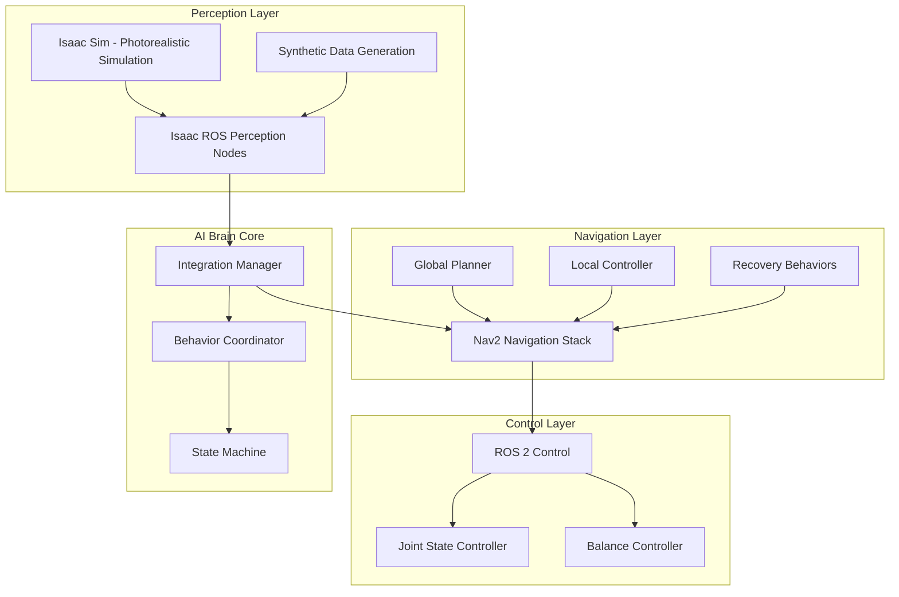

# Integrating Isaac ROS with Nav2 for End-to-End Navigation

## The Complete AI-Robot Brain Pipeline

The integration of Isaac ROS perception capabilities with Nav2 navigation forms the core of the AI-robot brain system. This integration enables humanoid robots to perceive their environment, plan navigation paths, and execute autonomous movement in complex human environments. The complete pipeline consists of:

1. **Isaac Sim**: Provides photorealistic simulation and synthetic data generation
2. **Isaac ROS**: Offers GPU-accelerated perception and processing
3. **Nav2**: Delivers autonomous navigation capabilities
4. **ROS 2 Control**: Manages robot control and actuation
5. **Integration Layer**: Orchestrates the complete system

## System Architecture Overview

### High-Level Integration Architecture



### Data Flow Integration

The integration involves multiple data streams flowing between components:

```python
# integration_data_flow.py
class IntegrationDataFlow:
    def __init__(self):
        # Simulation data
        self.simulation_data = {
            'robot_state': None,
            'environment_data': None,
            'sensor_data': {}
        }

        # Perception data
        self.perception_data = {
            'obstacles': [],
            'free_space': [],
            'semantic_labels': {},
            'depth_map': None
        }

        # Navigation data
        self.navigation_data = {
            'global_path': None,
            'local_plan': None,
            'velocity_commands': None,
            'status': 'idle'
        }

        # Control data
        self.control_data = {
            'joint_commands': {},
            'balance_state': 'stable',
            'foot_positions': {}
        }

    def process_data_flow(self):
        """
        Process the complete data flow from perception to control
        """
        # 1. Get sensor data from simulation
        sensor_data = self.get_sensor_data()

        # 2. Process with Isaac ROS perception
        perception_output = self.process_perception(sensor_data)

        # 3. Update navigation with perception data
        navigation_plan = self.update_navigation(perception_output)

        # 4. Execute control commands
        control_commands = self.execute_control(navigation_plan)

        return control_commands

    def get_sensor_data(self):
        """
        Get sensor data from Isaac Sim
        """
        # This would interface with Isaac Sim sensors
        # and ROS 2 bridge to get camera, LIDAR, IMU data
        pass

    def process_perception(self, sensor_data):
        """
        Process sensor data with Isaac ROS nodes
        """
        # Run Isaac ROS perception nodes
        # - Visual SLAM for localization
        # - Stereo processing for depth
        # - Object detection for obstacles
        # - Semantic segmentation for environment understanding
        pass

    def update_navigation(self, perception_output):
        """
        Update navigation with perception data
        """
        # Update costmaps with obstacle information
        # Plan global path considering dynamic obstacles
        # Execute local planning with updated environment
        pass

    def execute_control(self, navigation_plan):
        """
        Execute control commands for humanoid
        """
        # Convert navigation commands to joint commands
        # Apply balance control for bipedal locomotion
        # Execute footstep planning for stable walking
        pass
```

## Isaac ROS and Nav2 Interface

### Sensor Data Integration

```python
# sensor_integration.py
import rclpy
from rclpy.node import Node
from sensor_msgs.msg import Image, LaserScan, PointCloud2, Imu
from geometry_msgs.msg import Twist
from nav_msgs.msg import OccupancyGrid
from tf2_ros import TransformListener, Buffer
import numpy as np

class IsaacRosNav2Interface(Node):
    def __init__(self):
        super().__init__('isaac_ros_nav2_interface')

        # Isaac ROS sensor subscriptions
        self.rgb_sub = self.create_subscription(
            Image,
            '/camera/rgb/image_rect_color',
            self.rgb_callback,
            10
        )
        self.depth_sub = self.create_subscription(
            Image,
            '/camera/depth/image_rect',
            self.depth_callback,
            10
        )
        self.lidar_sub = self.create_subscription(
            LaserScan,
            '/scan',
            self.lidar_callback,
            10
        )
        self.imu_sub = self.create_subscription(
            Imu,
            '/imu/data',
            self.imu_callback,
            10
        )

        # Nav2 publishers and services
        self.cmd_vel_pub = self.create_publisher(
            Twist,
            '/cmd_vel',
            10
        )

        # TF listener for coordinate transformations
        self.tf_buffer = Buffer()
        self.tf_listener = TransformListener(self.tf_buffer, self)

        # Isaac ROS perception results
        self.obstacle_map = None
        self.semantic_map = None
        self.depth_data = None

        # Navigation status
        self.navigation_active = False

    def rgb_callback(self, msg):
        """
        Process RGB camera data from Isaac Sim
        """
        # Forward to Isaac ROS perception nodes
        # Process for object detection, semantic segmentation, etc.
        pass

    def depth_callback(self, msg):
        """
        Process depth camera data from Isaac Sim
        """
        # Use Isaac ROS stereo processing
        # Generate 3D obstacle information
        self.depth_data = self.process_depth_data(msg)
        self.update_costmaps_with_depth()

    def lidar_callback(self, msg):
        """
        Process LIDAR data (if available)
        """
        # Update Nav2 costmaps with LIDAR data
        self.update_costmap_with_lidar(msg)

    def imu_callback(self, msg):
        """
        Process IMU data for balance and orientation
        """
        # Use for humanoid balance control
        # Update orientation in navigation
        self.update_orientation_for_navigation(msg)

    def process_depth_data(self, depth_msg):
        """
        Process depth data using Isaac ROS capabilities
        """
        # Convert ROS image to numpy array
        depth_array = self.ros_image_to_numpy(depth_msg)

        # Use Isaac ROS depth processing for obstacle detection
        obstacles = self.detect_obstacles_from_depth(depth_array)

        # Create 3D obstacle representation
        obstacle_map_3d = self.create_3d_obstacle_map(obstacles, depth_array)

        return obstacle_map_3d

    def update_costmaps_with_depth(self):
        """
        Update Nav2 costmaps with depth-based obstacle information
        """
        if self.depth_data is not None:
            # Convert 3D obstacle information to 2D costmap format
            costmap_update = self.convert_3d_to_2d_costmap(self.depth_data)

            # Publish to Nav2 costmap topics
            # This would typically be done through service calls
            # or direct costmap manipulation
            pass

    def update_costmap_with_lidar(self, lidar_msg):
        """
        Update costmap with LIDAR data
        """
        # This integrates traditional LIDAR with Isaac ROS depth processing
        pass

    def update_orientation_for_navigation(self, imu_msg):
        """
        Update navigation with IMU orientation data
        """
        # Use IMU data to improve navigation accuracy
        # Especially important for humanoid robots with complex dynamics
        pass

    def ros_image_to_numpy(self, ros_image):
        """
        Convert ROS image message to numpy array
        """
        # Implementation depends on image encoding
        pass

    def detect_obstacles_from_depth(self, depth_array):
        """
        Detect obstacles from depth data using Isaac ROS methods
        """
        # Use Isaac ROS perception capabilities for 3D obstacle detection
        pass

    def create_3d_obstacle_map(self, obstacles, depth_array):
        """
        Create 3D obstacle representation from depth data
        """
        # Combine depth information with obstacle detection
        # to create comprehensive 3D obstacle map
        pass

    def convert_3d_to_2d_costmap(self, obstacle_3d_map):
        """
        Convert 3D obstacle information to 2D costmap format
        """
        # Project 3D obstacles to 2D navigation plane
        # considering humanoid height and step constraints
        pass
```

### Isaac ROS Perception Integration

```python
# perception_integration.py
class IsaacRosPerceptionIntegration:
    def __init__(self):
        # Isaac ROS node interfaces
        self.vslam_node = None
        self.stereo_node = None
        self.apriltag_node = None
        self.bi3d_node = None

        # Perception results cache
        self.perception_cache = {
            'poses': {},
            'objects': [],
            'obstacles': [],
            'free_space': [],
            'landmarks': []
        }

        # Integration parameters
        self.integration_params = {
            'confidence_threshold': 0.7,
            'temporal_filtering': True,
            'spatial_filtering': True
        }

    def integrate_perception_pipeline(self):
        """
        Integrate all Isaac ROS perception nodes
        """
        # Start all perception nodes
        self.start_vslam()
        self.start_stereo()
        self.start_apriltag()
        self.start_bi3d()

        # Synchronize perception outputs
        self.synchronize_perception_outputs()

    def start_vslam(self):
        """
        Initialize and start Isaac ROS VSLAM
        """
        # Configure VSLAM for humanoid application
        # Set up camera calibration
        # Initialize GPU resources
        pass

    def start_stereo(self):
        """
        Initialize and start Isaac ROS stereo processing
        """
        # Configure stereo cameras
        # Set up GPU-accelerated stereo matching
        # Initialize depth processing
        pass

    def start_apriltag(self):
        """
        Initialize and start Isaac ROS AprilTag detection
        """
        # Configure AprilTag parameters
        # Set up detection pipeline
        # Initialize landmark database
        pass

    def start_bi3d(self):
        """
        Initialize and start Isaac ROS Bi3D
        """
        # Configure 3D segmentation model
        # Set up RGB-D processing pipeline
        # Initialize semantic mapping
        pass

    def synchronize_perception_outputs(self):
        """
        Synchronize outputs from different perception nodes
        """
        # Use Isaac ROS NITROS for proper synchronization
        # Ensure temporal consistency across perception modalities
        # Apply temporal filtering for stable outputs
        pass

    def fuse_perception_data(self):
        """
        Fuse data from multiple perception sources
        """
        # Combine VSLAM pose estimates with stereo depth
        # Integrate AprilTag landmarks with visual SLAM
        # Merge Bi3D segmentation with obstacle detection
        # Create unified environmental representation

        fused_data = {
            'global_pose': self.get_fused_pose(),
            'obstacles': self.get_fused_obstacles(),
            'objects': self.get_fused_objects(),
            'landmarks': self.get_fused_landmarks()
        }

        return fused_data

    def get_fused_pose(self):
        """
        Get fused pose estimate from multiple sources
        """
        # Combine VSLAM, IMU, and kinematic pose estimates
        # Use sensor fusion techniques for optimal estimate
        pass

    def get_fused_obstacles(self):
        """
        Get fused obstacle information from multiple sources
        """
        # Combine stereo, LIDAR, and semantic obstacle detection
        # Create comprehensive obstacle representation
        pass

    def get_fused_objects(self):
        """
        Get fused object information
        """
        # Combine Bi3D segmentation with object detection
        # Create object instance representations
        pass

    def get_fused_landmarks(self):
        """
        Get fused landmark information
        """
        # Combine AprilTag detections with visual SLAM landmarks
        # Create persistent landmark database
        pass
```

## Nav2 Customization for Isaac ROS Integration

### Custom Costmap Layer

```python
# isaac_ros_costmap_layer.py
import numpy as np
from nav2_costmap_2d.python_layers.python_layer import PythonLayer
from sensor_msgs.msg import PointCloud2
import ros2_numpy

class IsaacRosObstacleLayer(PythonLayer):
    def __init__(self):
        super().__init__()
        self.name = "isaac_ros_obstacle_layer"
        self.enabled = True

    def onFootprintChanged(self):
        # Handle footprint changes
        pass

    def updateBounds(self, robot_x, robot_y, robot_yaw, min_x, min_y, max_x, max_y):
        # Update bounds based on Isaac ROS perception data
        # Incorporate 3D obstacle information from Isaac ROS
        perception_obstacles = self.get_perception_obstacles()
        self.update_bounds_with_perception(min_x, min_y, max_x, max_y, perception_obstacles)

    def updateCosts(self, master_grid, min_i, min_j, max_i, max_j):
        # Update costs based on Isaac ROS perception
        # Apply 3D obstacle information to 2D costmap
        perception_data = self.get_perception_data()
        self.apply_perception_to_costmap(master_grid, perception_data)

    def get_perception_obstacles(self):
        """
        Get obstacle information from Isaac ROS perception
        """
        # Subscribe to Isaac ROS perception topics
        # Get 3D obstacle information
        # Convert to costmap-compatible format
        pass

    def update_bounds_with_perception(self, min_x, min_y, max_x, max_y, obstacles):
        """
        Update costmap bounds considering perception data
        """
        # Expand bounds to include areas detected by perception
        pass

    def apply_perception_to_costmap(self, master_grid, perception_data):
        """
        Apply perception data to costmap
        """
        # Convert 3D perception data to 2D costmap representation
        # Consider height constraints for humanoid navigation
        # Apply appropriate cost values based on obstacle confidence
        pass
```

### Custom Global Planner with Perception

```python
# perception_aware_planner.py
from nav2_core.global_planner import GlobalPlanner
from nav_msgs.msg import Path
from geometry_msgs.msg import PoseStamped
from builtin_interfaces.msg import Duration
import numpy as np

class PerceptionAwareGlobalPlanner(GlobalPlanner):
    def __init__(self):
        super().__init__()
        self.initialized = False
        self.perception_data = None
        self.name = "PerceptionAwarePlanner"

    def configure(self, tf_costmap, node, plugin_name):
        """
        Configure the planner with perception integration
        """
        self.logger = node.get_logger()
        self.planner_name = plugin_name
        self.tf_costmap = tf_costmap
        self.node = node

        # Subscribe to Isaac ROS perception data
        self.perception_sub = node.create_subscription(
            # Perception message type
            'perception_topic',
            self.perception_callback,
            10
        )

        self.initialized = True
        self.logger.info(f'{self.planner_name} has been configured')

    def activate(self):
        """
        Activate the planner
        """
        self.logger.info(f'{self.planner_name} has been activated')
        self.perception_sub

    def deactivate(self):
        """
        Deactivate the planner
        """
        self.logger.info(f'{self.planner_name} has been deactivated')
        self.perception_sub.destroy()

    def cleanup(self):
        """
        Cleanup the planner
        """
        self.logger.info(f'{self.planner_name} has been cleaned up')

    def create_plan(self, start, goal):
        """
        Create a plan considering perception data
        """
        if not self.initialized:
            self.logger.error(f'{self.planner_name} has not been initialized')
            return Path()

        # Get current perception data
        current_perception = self.get_current_perception()

        # Plan path considering dynamic obstacles from perception
        path = self.plan_with_perception_awareness(start, goal, current_perception)

        return path

    def perception_callback(self, msg):
        """
        Handle perception data updates
        """
        self.perception_data = msg

    def get_current_perception(self):
        """
        Get the most recent perception data
        """
        return self.perception_data

    def plan_with_perception_awareness(self, start, goal, perception_data):
        """
        Plan path considering perception data
        """
        # Use base costmap for static obstacles
        costmap = self.tf_costmap.getCostmap()

        # Modify planning considering dynamic obstacles from perception
        # Apply temporal reasoning for moving obstacles
        # Consider object velocities and predicted trajectories

        # Create path considering both static and dynamic obstacles
        path = self.compute_path_with_dynamic_obstacles(start, goal, perception_data)

        return path

    def compute_path_with_dynamic_obstacles(self, start, goal, perception_data):
        """
        Compute path considering dynamic obstacles
        """
        # Implement path planning that considers moving obstacles
        # Use prediction models for dynamic obstacle trajectories
        # Plan safe paths that avoid predicted obstacle locations
        pass
```

## Integration Launch Files

### Complete System Launch

```xml
<!-- complete_integration_launch.py -->
from launch import LaunchDescription
from launch.actions import DeclareLaunchArgument, IncludeLaunchDescription, GroupAction
from launch.conditions import IfCondition
from launch.launch_description_sources import PythonLaunchDescriptionSource
from launch.substitutions import LaunchConfiguration, PathJoinSubstitution
from launch_ros.actions import Node, PushRosNamespace
from launch_ros.substitutions import FindPackageShare

def generate_launch_description():
    # Launch arguments
    use_sim_time = LaunchConfiguration('use_sim_time', default='false')
    params_file = LaunchConfiguration('params_file')
    namespace = LaunchConfiguration('namespace', default='')

    # Package locations
    pkg_isaac_ros_examples = FindPackageShare('isaac_ros_examples')
    pkg_nav2_bringup = FindPackageShare('nav2_bringup')
    pkg_humanoid_nav2_config = FindPackageShare('humanoid_nav2_config')

    # Isaac Sim bridge launch
    isaac_sim_bridge_launch = IncludeLaunchDescription(
        PythonLaunchDescriptionSource(
            PathJoinSubstitution([pkg_isaac_ros_examples, 'launch', 'isaac_ros_bridge.launch.py'])
        ),
        launch_arguments={
            'use_sim_time': use_sim_time
        }.items()
    )

    # Isaac ROS perception launch
    perception_launch = IncludeLaunchDescription(
        PythonLaunchDescriptionSource(
            PathJoinSubstitution([pkg_isaac_ros_examples, 'launch', 'perception_pipeline.launch.py'])
        ),
        launch_arguments={
            'use_sim_time': use_sim_time
        }.items()
    )

    # Nav2 navigation launch
    navigation_launch = IncludeLaunchDescription(
        PythonLaunchDescriptionSource(
            PathJoinSubstitution([pkg_nav2_bringup, 'launch', 'navigation_launch.py'])
        ),
        launch_arguments={
            'use_sim_time': use_sim_time,
            'params_file': PathJoinSubstitution([pkg_humanoid_nav2_config, 'config', 'nav2_params.yaml']),
            'autostart': 'true'
        }.items()
    )

    # Nav2 lifecycle manager
    lifecycle_manager = Node(
        package='nav2_lifecycle_manager',
        executable='lifecycle_manager',
        name='lifecycle_manager_perception',
        parameters=[{'use_sim_time': use_sim_time},
                   {'node_names': ['map_server',
                                  'planner_server',
                                  'controller_server',
                                  'recoveries_server',
                                  'bt_navigator',
                                  'localizer_node',  # Isaac ROS localization
                                  'stereo_node',     # Isaac ROS stereo
                                  'apriltag_node',   # Isaac ROS AprilTag
                                  'bi3d_node']}],    # Isaac ROS Bi3D
        remappings=[('/localizer_node/transition_event', '/transition_event'),
                   ('/stereo_node/transition_event', '/transition_event'),
                   ('/apriltag_node/transition_event', '/transition_event'),
                   ('/bi3d_node/transition_event', '/transition_event')],
        output='screen'
    )

    # Integration manager node
    integration_manager = Node(
        package='humanoid_integration',
        executable='integration_manager',
        name='integration_manager',
        parameters=[{'use_sim_time': use_sim_time}],
        output='screen'
    )

    return LaunchDescription([
        DeclareLaunchArgument(
            'use_sim_time',
            default_value='false',
            description='Use simulation time if true'),
        DeclareLaunchArgument(
            'params_file',
            default_value=PathJoinSubstitution(
                [pkg_humanoid_nav2_config, 'config', 'nav2_params.yaml']),
            description='Full path to the ROS2 parameters file to use for all launched nodes'),
        DeclareLaunchArgument(
            'namespace',
            default_value='',
            description='Top-level namespace'),

        # Launch all components in the correct order
        GroupAction(
            actions=[
                PushRosNamespace(namespace),
                isaac_sim_bridge_launch,
                perception_launch,
                navigation_launch,
                lifecycle_manager,
                integration_manager,
            ]
        ),
    ])
```

### Integration Configuration

```yaml
# integration_config.yaml
integration_manager:
  ros__parameters:
    use_sim_time: False
    # Integration timing
    perception_frequency: 10.0  # Hz
    navigation_frequency: 5.0   # Hz
    control_frequency: 100.0    # Hz

    # Component health monitoring
    component_monitoring:
      enabled: true
      timeout_threshold: 5.0    # seconds
      restart_on_failure: true

    # Data synchronization
    synchronization:
      temporal_tolerance: 0.1   # seconds
      spatial_tolerance: 0.05   # meters

    # Integration parameters
    fusion_params:
      confidence_threshold: 0.7
      temporal_filtering: true
      spatial_filtering: true

    # Component interfaces
    interfaces:
      perception:
        topics: [
          "/perception/obstacles",
          "/perception/objects",
          "/perception/landmarks",
          "/localization/pose"
        ]
      navigation:
        topics: [
          "/global_costmap/costmap",
          "/local_costmap/costmap",
          "/plan",
          "/cmd_vel"
        ]
      control:
        topics: [
          "/joint_commands",
          "/balance_state",
          "/foot_positions"
        ]

# Integration-specific Nav2 parameters
nav2_with_integration:
  planner_server:
    ros__parameters:
      # Use perception-enhanced planner
      planner_plugins: ["PerceptionAwarePlanner", "GridBased"]
      PerceptionAwarePlanner:
        plugin: "humanoid_planners::PerceptionAwareGlobalPlanner"
        tolerance: 0.5
        use_astar: false
        allow_unknown: true

  controller_server:
    ros__parameters:
      # Perception-aware controller
      controller_plugins: ["PerceptionAwareController"]
      PerceptionAwareController:
        plugin: "humanoid_controllers::PerceptionAwareController"
        time_steps: 25
        model_dt: 0.05
        max_linear_vel: 0.4
        max_angular_vel: 0.6
        obstacle_cost_mult: 5.0  # Higher for perception integration
        prediction_horizon: 2.0  # Longer with perception data
```

## Integration Manager Node

### Core Integration Logic

```python
# integration_manager.py
import rclpy
from rclpy.node import Node
from std_msgs.msg import Bool
from geometry_msgs.msg import Twist
from sensor_msgs.msg import Image, Imu, LaserScan
from nav_msgs.msg import Odometry, Path
from builtin_interfaces.msg import Time
import threading
import time
from collections import deque

class IntegrationManager(Node):
    def __init__(self):
        super().__init__('integration_manager')

        # State management
        self.system_state = 'initialized'  # initialized, running, paused, error
        self.last_update_time = self.get_clock().now()

        # Data buffers
        self.perception_buffer = deque(maxlen=10)
        self.navigation_buffer = deque(maxlen=10)
        self.control_buffer = deque(maxlen=10)

        # Publishers and subscribers
        self.status_pub = self.create_publisher(Bool, 'integration_status', 10)
        self.cmd_vel_pub = self.create_publisher(Twist, 'cmd_vel', 10)

        # Timer for integration loop
        self.integration_timer = self.create_timer(
            0.05,  # 20 Hz integration loop
            self.integration_callback
        )

        # Component health monitoring
        self.component_health = {
            'perception': {'healthy': True, 'last_update': Time()},
            'navigation': {'healthy': True, 'last_update': Time()},
            'control': {'healthy': True, 'last_update': Time()}
        }

        # Integration parameters
        self.integration_params = self.get_integration_parameters()

        self.get_logger().info('Integration manager initialized')

    def get_integration_parameters(self):
        """
        Get integration parameters from configuration
        """
        params = {
            'perception_timeout': self.declare_parameter(
                'perception_timeout', 1.0).value,
            'navigation_timeout': self.declare_parameter(
                'navigation_timeout', 2.0).value,
            'control_timeout': self.declare_parameter(
                'control_timeout', 0.1).value,
            'fusion_confidence_threshold': self.declare_parameter(
                'fusion_confidence_threshold', 0.7).value
        }
        return params

    def integration_callback(self):
        """
        Main integration callback - runs at 20 Hz
        """
        current_time = self.get_clock().now()

        # Monitor component health
        self.monitor_component_health()

        # Check if all components are healthy
        if not self.all_components_healthy():
            self.handle_component_failure()
            return

        # Perform data fusion
        fused_data = self.perform_data_fusion()

        if fused_data is not None:
            # Update navigation with fused perception data
            self.update_navigation_with_perception(fused_data)

            # Execute navigation plan
            self.execute_navigation_plan()

            # Update control system
            self.update_control_system()

        # Publish integration status
        status_msg = Bool()
        status_msg.data = True  # System is running
        self.status_pub.publish(status_msg)

        self.last_update_time = current_time

    def monitor_component_health(self):
        """
        Monitor health of integrated components
        """
        current_time = self.get_clock().now().nanoseconds / 1e9

        # Check perception health
        if hasattr(self, 'last_perception_time'):
            time_since_perception = current_time - self.last_perception_time.nanoseconds / 1e9
            if time_since_perception > self.integration_params['perception_timeout']:
                self.component_health['perception']['healthy'] = False
            else:
                self.component_health['perception']['healthy'] = True
                self.component_health['perception']['last_update'] = self.last_perception_time

        # Similar checks for navigation and control
        # ... (implementation for navigation and control monitoring)

    def all_components_healthy(self):
        """
        Check if all components are healthy
        """
        return all(comp['healthy'] for comp in self.component_health.values())

    def handle_component_failure(self):
        """
        Handle failure of one or more components
        """
        self.get_logger().warn('Component failure detected, initiating recovery')

        # Stop robot movement
        stop_cmd = Twist()
        self.cmd_vel_pub.publish(stop_cmd)

        # Attempt to restart failed components
        self.attempt_component_recovery()

        # Update system state
        self.system_state = 'error'

    def attempt_component_recovery(self):
        """
        Attempt to recover from component failures
        """
        # Implementation would include:
        # - Restarting failed nodes via lifecycle management
        # - Reinitializing failed components
        # - Falling back to safe modes
        pass

    def perform_data_fusion(self):
        """
        Perform data fusion from perception, navigation, and control
        """
        # Get latest data from all components
        perception_data = self.get_latest_perception_data()
        navigation_data = self.get_latest_navigation_data()
        control_data = self.get_latest_control_data()

        if not all([perception_data, navigation_data, control_data]):
            return None

        # Fuse the data considering temporal and spatial relationships
        fused_data = self.fuse_perception_navigation_control(
            perception_data, navigation_data, control_data
        )

        return fused_data

    def get_latest_perception_data(self):
        """
        Get the latest perception data from Isaac ROS
        """
        # This would interface with Isaac ROS perception topics
        # and retrieve the most recent perception results
        if self.perception_buffer:
            return self.perception_buffer[-1]
        return None

    def get_latest_navigation_data(self):
        """
        Get the latest navigation data
        """
        if self.navigation_buffer:
            return self.navigation_buffer[-1]
        return None

    def get_latest_control_data(self):
        """
        Get the latest control data
        """
        if self.control_buffer:
            return self.control_buffer[-1]
        return None

    def fuse_perception_navigation_control(self, perception, navigation, control):
        """
        Fuse data from perception, navigation, and control systems
        """
        # Implement sophisticated data fusion algorithm
        # Consider temporal alignment, spatial relationships, and confidence values
        fused_result = {
            'environment_model': self.create_environment_model(perception),
            'navigation_plan': navigation,
            'control_state': control,
            'confidence': self.calculate_fusion_confidence(perception, navigation, control)
        }

        # Only return if confidence is above threshold
        if fused_result['confidence'] >= self.integration_params['fusion_confidence_threshold']:
            return fused_result
        else:
            self.get_logger().warn(f'Fusion confidence too low: {fused_result["confidence"]}')
            return None

    def create_environment_model(self, perception_data):
        """
        Create comprehensive environment model from perception data
        """
        # Combine obstacle maps, semantic information, and landmark data
        # from Isaac ROS perception nodes
        environment_model = {
            'static_map': perception_data.get('static_map', {}),
            'dynamic_obstacles': perception_data.get('dynamic_obstacles', []),
            'semantic_labels': perception_data.get('semantic_labels', {}),
            'landmarks': perception_data.get('landmarks', {}),
            'traversable_areas': perception_data.get('traversable', [])
        }
        return environment_model

    def calculate_fusion_confidence(self, perception, navigation, control):
        """
        Calculate confidence in fused data
        """
        # Implement confidence calculation based on:
        # - Individual component reliabilities
        # - Temporal consistency
        # - Spatial consistency
        # - Sensor fusion quality metrics
        return 0.9  # Placeholder - implement actual calculation

    def update_navigation_with_perception(self, fused_data):
        """
        Update navigation system with perception data
        """
        # Update costmaps with 3D obstacle information
        self.update_costmaps_with_3d_obstacles(
            fused_data['environment_model']['dynamic_obstacles']
        )

        # Update global planner with semantic information
        self.update_global_planner_with_semantics(
            fused_data['environment_model']['semantic_labels']
        )

        # Update local planner with real-time obstacle information
        self.update_local_planner_with_obstacles(
            fused_data['environment_model']['dynamic_obstacles']
        )

    def update_costmaps_with_3d_obstacles(self, obstacles_3d):
        """
        Update Nav2 costmaps with 3D obstacle information
        """
        # Convert 3D obstacles to 2D costmap representation
        # considering humanoid-specific constraints
        pass

    def execute_navigation_plan(self):
        """
        Execute the current navigation plan
        """
        # This would interface with Nav2 action servers
        # to execute navigation goals
        pass

    def update_control_system(self):
        """
        Update control system with navigation commands
        """
        # Convert navigation velocity commands to joint commands
        # for humanoid robot control
        pass

    def perception_callback(self, msg):
        """
        Callback for perception data from Isaac ROS
        """
        self.last_perception_time = self.get_clock().now()
        self.perception_buffer.append(msg)

    def navigation_callback(self, msg):
        """
        Callback for navigation data
        """
        self.navigation_buffer.append(msg)

    def control_callback(self, msg):
        """
        Callback for control data
        """
        self.control_buffer.append(msg)
```

## Performance Optimization and Monitoring

### Integration Performance Metrics

```python
# performance_monitoring.py
class IntegrationPerformanceMonitor:
    def __init__(self, node):
        self.node = node
        self.metrics = {
            'perception_latency': [],
            'navigation_latency': [],
            'integration_frequency': [],
            'data_fusion_success_rate': [],
            'system_utilization': []
        }

        # Performance monitoring timer
        self.monitor_timer = node.create_timer(1.0, self.log_performance_metrics)

    def record_perception_latency(self, latency):
        """
        Record perception processing latency
        """
        self.metrics['perception_latency'].append(latency)
        self.check_latency_thresholds('perception', latency)

    def record_navigation_latency(self, latency):
        """
        Record navigation processing latency
        """
        self.metrics['navigation_latency'].append(latency)
        self.check_latency_thresholds('navigation', latency)

    def record_integration_frequency(self, frequency):
        """
        Record actual integration frequency
        """
        self.metrics['integration_frequency'].append(frequency)

    def record_fusion_success(self, success):
        """
        Record data fusion success/failure
        """
        self.metrics['data_fusion_success_rate'].append(1 if success else 0)

    def check_latency_thresholds(self, component, latency):
        """
        Check if latency exceeds acceptable thresholds
        """
        thresholds = {
            'perception': 0.1,    # 100ms
            'navigation': 0.2     # 200ms
        }

        if latency > thresholds.get(component, 0.5):
            self.node.get_logger().warn(
                f'{component} latency {latency:.3f}s exceeds threshold'
            )

    def log_performance_metrics(self):
        """
        Log performance metrics periodically
        """
        if self.metrics['perception_latency']:
            avg_perception_latency = sum(self.metrics['perception_latency']) / len(self.metrics['perception_latency'])
            self.node.get_logger().info(f'Avg perception latency: {avg_perception_latency:.3f}s')

        if self.metrics['navigation_latency']:
            avg_navigation_latency = sum(self.metrics['navigation_latency']) / len(self.metrics['navigation_latency'])
            self.node.get_logger().info(f'Avg navigation latency: {avg_navigation_latency:.3f}s')

        if self.metrics['data_fusion_success_rate']:
            success_rate = sum(self.metrics['data_fusion_success_rate']) / len(self.metrics['data_fusion_success_rate'])
            self.node.get_logger().info(f'Data fusion success rate: {success_rate:.2%}')
```

## Troubleshooting Integration Issues

### Common Integration Problems and Solutions

```bash
# Issue: Perception and navigation timing mismatch
# Solutions:
# 1. Use Isaac ROS NITROS for proper synchronization
# 2. Implement temporal buffering in integration manager
# 3. Adjust processing frequencies to match
# 4. Use message_filters for time-based synchronization

# Issue: Memory overflow in integration manager
# Solutions:
# 1. Implement proper data buffering with size limits
# 2. Use efficient data structures for temporary storage
# 3. Implement data aging and cleanup mechanisms
# 4. Monitor memory usage and implement limits

# Issue: Component startup order problems
# Solutions:
# 1. Use lifecycle manager for proper startup sequence
# 2. Implement dependency checking in launch files
# 3. Add startup delays where necessary
# 4. Use action-based initialization

# Issue: Coordinate frame mismatches
# Solutions:
# 1. Verify all TF frames are properly published
# 2. Check coordinate frame conventions (ROS vs Isaac Sim)
# 3. Implement proper frame transformation
# 4. Use TF2 for robust coordinate transformations

# Issue: Data type compatibility issues
# Solutions:
# 1. Use standard ROS message types where possible
# 2. Implement proper message conversion functions
# 3. Verify Isaac ROS message formats
# 4. Use message adapters for compatibility
```

## Best Practices for Integration

### Design Principles

1. **Modular Architecture**: Keep integration components modular and replaceable
2. **Error Handling**: Implement robust error handling and recovery mechanisms
3. **Performance Monitoring**: Continuously monitor integration performance
4. **Temporal Consistency**: Ensure proper synchronization of data streams
5. **Resource Management**: Efficiently manage computational and memory resources
6. **Scalability**: Design integration to scale with additional components

### Implementation Guidelines

1. **Asynchronous Processing**: Use asynchronous processing where appropriate
2. **Data Validation**: Validate all data before integration
3. **Graceful Degradation**: System should degrade gracefully when components fail
4. **Configuration Management**: Use parameter servers for runtime configuration
5. **Logging and Debugging**: Implement comprehensive logging for debugging
6. **Testing**: Implement unit and integration tests for all components

## Summary

The integration of Isaac ROS perception capabilities with Nav2 navigation creates a powerful AI-robot brain system for humanoid robots. The key integration components include:

1. **Data Flow Management**: Proper routing of sensor data from Isaac Sim through Isaac ROS to Nav2
2. **Synchronization**: Ensuring temporal and spatial consistency across components
3. **Data Fusion**: Combining multiple perception modalities into coherent environmental understanding
4. **Component Coordination**: Managing the lifecycle and interaction of all system components
5. **Performance Optimization**: Ensuring real-time performance across the integrated system
6. **Error Handling**: Robust mechanisms for handling component failures and recovery

The successful integration enables humanoid robots to operate autonomously in complex environments by combining photorealistic simulation, GPU-accelerated perception, and sophisticated navigation planning. This creates an AI brain that can perceive, reason, and act in human environments with high reliability and performance.

In the next chapter, we'll implement a comprehensive mini-project that demonstrates all these integrated capabilities working together in a humanoid robot navigation task.